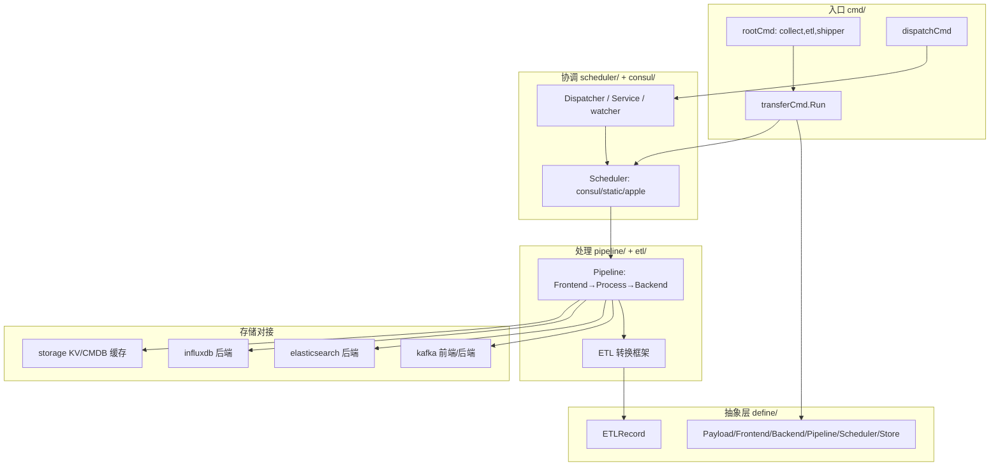

# 概览与架构

> transfer 是 BlueKing Monitor data-link 体系中的**数据采集、ETL 转换与分发枢纽**：从 Kafka（MQ）消费原始上报数据，经可插拔 ETL 管道转换为标准 `ETLRecord`，再按结果表（ResultTable）配置的 shipper 分发写入 Elasticsearch / InfluxDB / Kafka 等存储后端。

<cite>
**本文引用的文件**
- [main.go](file://bkmonitor-datalink/pkg/transfer/main.go)
- [cmd/root.go](file://bkmonitor-datalink/pkg/transfer/cmd/root.go)
- [cmd/transfer.go](file://bkmonitor-datalink/pkg/transfer/cmd/transfer.go)
- [cmd/dispatch.go](file://bkmonitor-datalink/pkg/transfer/cmd/dispatch.go)
</cite>

## 目录

1. [简介](#简介)
2. [启动调用链](#启动调用链)
3. [组件地图](#组件地图)
4. [主数据流总览](#主数据流总览)
5. [目录结构](#目录结构)
6. [结论](#结论)

## 简介

transfer 的模块定位在根命令的 `Short` 字段中直接声明为 `collect, etl and shipper`，即"采集、ETL、分发"三件事。它是 data-link 链路中承上启下的枢纽：上游对接各采集端（bkmonitorbeat / collector 等）经 Kafka 上报的数据，下游对接 Elasticsearch / InfluxDB / Kafka 等存储，中间通过 ETL 管道完成字段级标准化转换。

**章节来源**
- [cmd/root.go](file://bkmonitor-datalink/pkg/transfer/cmd/root.go#L38-L51)

## 启动调用链

进程入口 `main()` 依次调用 `preRun()`、`cmd.Execute()`、`postRun()`（`main.go`）。`cmd.Execute()` 实际执行 `rootCmd.Execute()`，由 cobra 框架驱动各子命令。业务运行由 `transfer run`（即 `transferCmd`）承载：其 `Run` 方法的核心动作是创建并启动 `Scheduler`，并在退出时通过事件总线停止它。

关键调用链：

```
main.main()
  └─ cmd.Execute()                          // root.go:55
       └─ rootCmd.Execute()
            ├─ PersistentPreRun: resourceLimits / setupTraceLog / EvRunnerPreRun   // root.go:42-50
            └─ transferCmd.Run (transfer.go:93)
                 ├─ config.IntoContext(ctx, conf)
                 ├─ define.NewScheduler(ctx, "scheduler.type")   // 默认 consul scheduler
                 ├─ SubscribeAsync(EvSysExit -> scheduler.Stop())
                 ├─ scheduler.Start()                  // 启动 pipeline 管理 + consul watcher + cc cache
                 └─ scheduler.Wait()
```

此外，`dispatch` 子命令（`dispatch.go`）用于手动触发 shadow 分发：`NewClusterHelper` 获取服务与 KV 信息，`dispatcher.Recover()` 修复、再 `dispatcher.Dispatch(pairs, services)` 把 data_id 重新分发给各 transfer 实例。

**章节来源**
- [main.go](file://bkmonitor-datalink/pkg/transfer/main.go#L94-L102)
- [cmd/root.go](file://bkmonitor-datalink/pkg/transfer/cmd/root.go#L38-L51)
- [cmd/transfer.go](file://bkmonitor-datalink/pkg/transfer/cmd/transfer.go#L72-L138)
- [cmd/dispatch.go](file://bkmonitor-datalink/pkg/transfer/cmd/dispatch.go#L24-L48)

## 组件地图

transfer 以 `define` 包定义的抽象契约为中心，向上由 `cmd` 驱动启动，向下由 `pipeline`/`etl` 完成数据处理，并依赖 `kafka`/`storage`/`elasticsearch`/`influxdb` 对接外部存储，由 `consul`/`scheduler` 完成协调与调度。



**图表来源**
- [cmd/root.go](file://bkmonitor-datalink/pkg/transfer/cmd/root.go#L38-L51)
- [cmd/transfer.go](file://bkmonitor-datalink/pkg/transfer/cmd/transfer.go#L119-L125)
- [define/interface.go](file://bkmonitor-datalink/pkg/transfer/define/interface.go#L38-L131)

**章节来源**
- [cmd/root.go](file://bkmonitor-datalink/pkg/transfer/cmd/root.go#L38-L51)
- [cmd/transfer.go](file://bkmonitor-datalink/pkg/transfer/cmd/transfer.go#L72-L138)
- [define/interface.go](file://bkmonitor-datalink/pkg/transfer/define/interface.go#L38-L131)

## 主数据流总览

典型链路为「Kafka 消费 → Pipeline 处理 → ETL 转换 → 存储分发」：

1. **前端拉取（Frontend）**：`kafka` 前端的消费组从 MQ 拉取原始 `Payload`，写入管道输出 channel。
2. **处理器转换（DataProcessor）**：管道中的处理节点对 `Payload` 做解码、清洗、裂变，产出标准化的 `ETLRecord`（见 `etl` 包）。
3. **后端推送（Backend）**：管道末端后端节点按结果表配置，调用对应 `shipper` 把 `ETLRecord` 批量写入目标存储（`elasticsearch`/`influxdb`/`kafka` 后端）。
4. **协调调度（Scheduler + Consul）**：`Scheduler` 从 Consul 拉取 pipeline / 结果表 / data_id 配置，构建并驱动各 Pipeline 运行；`Dispatcher` 负责 data_id 到 transfer 实例的 shadow 分发与负载均衡。

**章节来源**
- [define/interface.go](file://bkmonitor-datalink/pkg/transfer/define/interface.go#L71-L131)
- [cmd/transfer.go](file://bkmonitor-datalink/pkg/transfer/cmd/transfer.go#L119-L125)

## 目录结构

transfer 顶层子包（节选核心）：

| 子包 | 职责 |
|---|---|
| `cmd/` | cobra 子命令（root / transfer run / dispatch / meta / shadow 等）与配置加载 |
| `define/` | 全局抽象接口、数据模型、字段常量 |
| `config/` | viper 配置加载与元数据（MetaClusterInfo / PipelineConfig 等） |
| `pipeline/` | 管道编排（Node / Connector / Builder） |
| `etl/` | ETL 转换框架（Record / Field / Schema / Transformer） |
| `kafka/` | Kafka 前端消费 / 后端生产 |
| `elasticsearch/` `influxdb/` | 存储后端批量写入 |
| `storage/` | KV / CMDB 缓存抽象与实现 |
| `consul/` `scheduler/` | 协调、服务发现、调度 |
| `eventbus/` | 进程内事件总线 |
| `bufferpool/` `monitor/` `http/` | 缓冲池、监控、HTTP 服务 |

**章节来源**
- [cmd/root.go](file://bkmonitor-datalink/pkg/transfer/cmd/root.go#L53-L76)
- [config/config.go](file://bkmonitor-datalink/pkg/transfer/config/config.go#L18-L36)

## 结论

transfer 以 `define` 抽象契约为核心，将"采集—ETL—分发"三段式数据处理组织为可插拔的 Pipeline，并通过 `consul`/`scheduler` 实现配置驱动的协调与调度。其启动由 `cmd` 驱动、`Scheduler` 真正拉起各数据管道，退出经 `eventbus` 优雅关停。后续分册将逐一展开 define 抽象、配置体系、管道与 ETL、存储后端、协调调度等子系统。

**章节来源**
- [cmd/transfer.go](file://bkmonitor-datalink/pkg/transfer/cmd/transfer.go#L93-L138)
- [cmd/root.go](file://bkmonitor-datalink/pkg/transfer/cmd/root.go#L78-L127)
