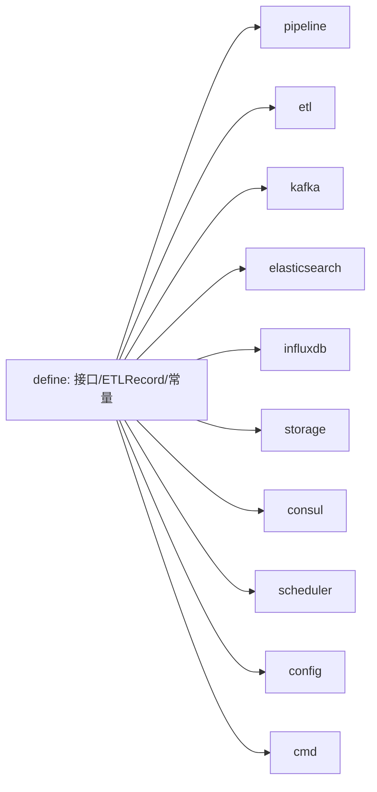

# 核心抽象与数据模型

> `define` 包是 transfer 全模块的**底层抽象核心**：它定义了贯穿采集、ETL、分发全链路的接口契约、标准数据模型（`ETLRecord`）、全局字段常量与进程标识。其它所有子包（pipeline / etl / kafka / storage / consul / scheduler 等）都依赖本包定义的接口，而非具体实现。

<cite>
**本文引用的文件**
- [define/interface.go](file://bkmonitor-datalink/pkg/transfer/define/interface.go)
- [define/base.go](file://bkmonitor-datalink/pkg/transfer/define/base.go)
- [define/etl.go](file://bkmonitor-datalink/pkg/transfer/define/etl.go)
</cite>

## 目录

1. [简介](#简介)
2. [核心处理接口](#核心处理接口)
3. [核心数据模型](#核心数据模型)
4. [全局标识与字段常量](#全局标识与字段常量)
5. [依赖关系](#依赖关系)
6. [结论](#结论)

## 简介

transfer 的代码组织遵循"面向接口编程"：所有业务组件（前端、处理器、后端、调度器、存储）都先在本包定义接口，再由各子包提供实现。这样 `pipeline` 可以在不感知具体 Kafka / ES 实现的前提下，把它们编排进同一条数据处理管道。本文梳理 `define` 包最关键的一组接口与数据模型。

**章节来源**
- [define/interface.go](file://bkmonitor-datalink/pkg/transfer/define/interface.go#L10-L18)

## 核心处理接口

`define/interface.go` 定义了一组贯穿数据处理生命周期的接口，是 Pipeline 编排的契约基础：

- **`Payload`**：处理器之间流转的数据载体，提供 `To`/`From`（与具体结构互转）、`SN`（序号）、`Type`（格式类型）、`Meta()`（附带的 `PayloadMeta`）、`SetETLRecord`/`GetETLRecord`，以及 `SetTime`/`GetTime`、`SetFlag`/`AddFlag`/`Flag`（处理标记）。
- **`PayloadMeta`**：键值元数据容器（`Load`/`Store`/`LoadOrStore`/`Delete`/`Range`）。
- **`Frontend`**：数据拉取端，内嵌 `SavePoint`（事务式提交/回滚/关闭），提供 `Pull(outputChan, killChan)` 与 `Flow()`。
- **`Backend`**：数据推送端，内嵌 `SavePoint`，提供 `Push(d, killChan)`。
- **`DataProcessor`**：管道中的处理节点，提供 `Process`/`Finish`（输出到 `outputChan`、异常写入 `killChan`）、`SetIndex`/`Index`。
- **`Pipeline`**：整条管道，提供 `Start()`（返回错误 channel）、`Stop(time.Duration)`、`Wait()`、`Flow()`。
- **`Task` / `Scheduler`**：`Scheduler` 内嵌 `Task`（`Start`/`Stop`/`Wait`），是 transfer 运行期的顶层驱动器。
- **`Store` / `MemStore`**：KV 存储抽象（`Exists`/`Set`/`Get`/`Delete`/`Commit`/`Scan`/`Close`/`PutCache`/`Batch`），`MemStore` 额外提供 `ScanMemData`。
- **`Service` / `ServiceWatcher` / `Session` / `ShadowCopier`**：协调层契约——`Service` 描述 consul 服务注册与事件总线；`ServiceWatcher` 提供 watch 事件流；`Session` 即带事务的 `Store`；`ShadowCopier` 负责 data_id↔transfer 实例的影子链接（`Link`/`Sync`/`SyncAll` 等）。

> 这些接口通过 `go:generate genny` 模板（`factory_ctx.tpl` / `factory.tpl`）生成对应类型的工厂函数（`factory_ctx_gen.go` / `factory_gen.go`），便于按类型名创建实例。

**章节来源**
- [define/interface.go](file://bkmonitor-datalink/pkg/transfer/define/interface.go#L29-L172)

## 核心数据模型

`define/etl.go` 定义了 ETL 转换的标准产物 `ETLRecord` 及其相关类型：

- **`ETLRecord`**：ETL 后的标准记录，含 `Time *int64`、`Dimensions map[string]interface{}`、`Metrics map[string]interface{}`、`Exemplar map[string]interface{}`。对事件数据是事件内容、时序是指标、日志则由 ES meta 控制写入。
- **`GroupETLRecord`**：内嵌 `*ETLRecord`，追加 `GroupInfo`（分组信息）与 `CMDBInfo`（`bk_cmdb_level` CMDB 层级），用于带分组/CMDB 维度的写入。
- **`ETLRecordHandler` / `ETLRecordChainingHandler`**：记录处理函数与链式处理器；`ETLRecordHandlerWrapper` 把链式处理器包装为普通处理器。
- **`NewETLRecord()`**：创建带空 `Dimensions`/`Metrics` 的记录；`SetTime`/`SetTimeStamp`/`GetTime` 处理时间字段（缺失时返回 `ErrOperationForbidden`）。

字段类型与标签在 `etl.go` 顶部以枚举常量定义：`MetaFieldType`（nested/object/int/string/...）与 `MetaFieldTagType`（metric/dimension/timestamp/group），供元数据驱动 ETL 使用。

**章节来源**
- [define/etl.go](file://bkmonitor-datalink/pkg/transfer/define/etl.go#L20-L113)

## 全局标识与字段常量

`define/base.go` 集中维护全局标识符与标准字段名常量，是各后端写入时字段对齐的依据：

- **进程/服务标识**：`ProcessID`（如 `transfer-<hash>`，由 MAC+PID 计算）、`ServiceID`、`AppName`、`Version`、`BuildHash`、`Mode`。
- **标准字段名**：`TimeFieldName`(`time`)、`TimeStampFieldName`(`timestamp`)、`MetricKeyFieldName`(`metric_name`)、`RecordBizIDFieldName`(`bk_biz_id`)、`RecordTargetIPFieldName`(`bk_target_ip`)、`RecordCMDBLevelFieldName`(`bk_cmdb_level`) 等一大批 `Record*` 常量，统一描述维度/指标在目标存储中的字段名。
- **v1 路径相关**：`ConfClusterID`、`ConfRootV1`（在 `cmd/root.go` 的 `parseV1Path` 中按集群维度赋值）。
- **`Atomic`**：提供 `View`/`ViewE`/`Update`/`UpdateE` 的读写锁封装，供需要并发保护的场景复用。

**章节来源**
- [define/base.go](file://bkmonitor-datalink/pkg/transfer/define/base.go#L23-L142)
- [define/base.go](file://bkmonitor-datalink/pkg/transfer/define/base.go#L160-L219)

## 依赖关系

`define` 是 transfer 的"地基"包，被几乎所有上层子包依赖：

`define` 自身仅依赖第三方库（`asaskevich/EventBus`、`pkg/errors`、`transfer/types`），不反向依赖任何业务子包，保证抽象层稳定。

**图表来源**
- [define/interface.go](file://bkmonitor-datalink/pkg/transfer/define/interface.go#L12-L17)
- [define/base.go](file://bkmonitor-datalink/pkg/transfer/define/base.go#L12-L21)

**章节来源**
- [define/interface.go](file://bkmonitor-datalink/pkg/transfer/define/interface.go#L10-L18)
- [define/base.go](file://bkmonitor-datalink/pkg/transfer/define/base.go#L10-L21)

## 结论

`define` 包以一组精简却覆盖全链路的接口（`Payload`/`Frontend`/`Backend`/`DataProcessor`/`Pipeline`/`Scheduler`/`Store`/`Service`/`ShadowCopier`）和统一的 `ETLRecord` 数据模型，为 transfer 建立起"面向接口、配置驱动"的架构底座。上层子包（pipeline / etl / kafka / storage / consul / scheduler）均围绕这些契约实现与编排，是理解后续各分册的前提。

**章节来源**
- [define/interface.go](file://bkmonitor-datalink/pkg/transfer/define/interface.go#L38-L131)
- [define/etl.go](file://bkmonitor-datalink/pkg/transfer/define/etl.go#L56-L66)
