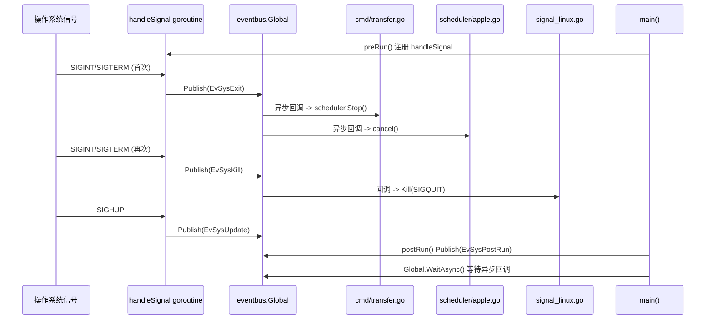

# 事件总线与生命周期

> `eventbus` 子包（`bkmonitor-datalink/pkg/transfer/eventbus`）封装了第三方库 `github.com/asaskevich/EventBus`，并提供一个全局事件总线实例 `Global`，作为进程内各功能模块之间的解耦中枢。各模块无需直接持有彼此引用，只需在关心的主题上订阅回调或向总线发布主题即可完成跨模块协作。

<cite>
**本文引用的文件**
- [eventbus.go](file://bkmonitor-datalink/pkg/transfer/eventbus/eventbus.go)
- [define.go](file://bkmonitor-datalink/pkg/transfer/eventbus/define.go)
- [main.go](file://bkmonitor-datalink/pkg/transfer/main.go)
- [transfer.go](file://bkmonitor-datalink/pkg/transfer/cmd/transfer.go)
- [signal_linux.go](file://bkmonitor-datalink/pkg/transfer/signal_linux.go)
- [apple.go](file://bkmonitor-datalink/pkg/transfer/scheduler/apple.go)
</cite>

## 目录

1. [简介](#简介)
2. [事件定义](#事件定义)
3. [发布订阅机制](#发布订阅机制)
4. [生命周期串联](#生命周期串联)
5. [结论](#结论)

## 简介

在 transfer 模块中，`eventbus` 子包封装了第三方库 `github.com/asaskevich/EventBus`，并提供一个全局事件总线实例 `Global`，作为进程内各功能模块之间的解耦中枢。各模块不需要直接持有彼此的引用，只需要在关心的主题（topic）上订阅回调，或向事件总线发布主题，即可完成跨模块协作。

这种发布订阅模型把"信号捕获、配置热更新、资源限制、日志级别调整、优雅退出"等系统行为，从主流程中剥离出来，由订阅方自行响应，从而避免了主入口 `main.go` 与各业务模块之间的紧耦合。

**章节来源**
- [eventbus.go](file://bkmonitor-datalink/pkg/transfer/eventbus/eventbus.go#L12-L29)
- [define.go](file://bkmonitor-datalink/pkg/transfer/eventbus/define.go#L10-L12)

## 事件定义

事件主题在 `define.go` 中以字符串常量集中定义，按用途可分为系统生命周期事件、Runner 事件、数据/配置事件以及信号类事件四类。其中与生命周期和退出流程最相关的常量如下：

| 常量 | 主题字符串 | 含义 |
|---|---|---|
| `EvSysPreRun` | `sys:pre-run` | 系统预运行阶段完成，各模块可在此后做初始化后处理 |
| `EvSysPostRun` | `sys:post-run` | 系统运行结束阶段，用于触发收尾逻辑 |
| `EvSysExit` | `sys:exit` | 优雅退出信号（首次收到 SIGINT/SIGTERM），触发各模块停止 |
| `EvSysKill` | `sys:kill` | 强制杀死信号（退出过程中再次收到 SIGINT/SIGTERM），立即终止进程 |
| `EvSysFatal` | `sys:fatal` | 致命错误，用于打印 goroutine 栈、清理 pid 文件等 |
| `EvSysUpdate` | `sys:update` | 配置热更新信号（收到 SIGHUP） |
| `EvSysConfigPreParse` / `EvSysConfigPostParse` | `sys:conf-pre-parse` / `sys:conf-post-parse` | 配置解析前后 |
| `EvSysLoggerReady` | `sys:logger-ready` | 日志组件就绪 |
| `EvSysLimitCPU` / `EvSysLimitFile` / `EvSysLimitMemory` | `sys:limit:cpu` / `sys:limit:fd` / `sys:limit:mem` | 资源限制（CPU/文件描述符/内存） |

此外还有 `EvRunnerPreRun` / `EvRunnerPostRun`（Runner 运行前后）、`EvDataIDConfig`（DataID 动态通知）、`EvConsul`（Consul 原始事件），以及一组 `EvSig*` 信号类事件（如 `EvSigUpdateCCCache`、`EvSigDumpStack`、`EvSigSetLogLevel` 等），用于运行时诊断与缓存刷新。

**章节来源**
- [define.go](file://bkmonitor-datalink/pkg/transfer/eventbus/define.go#L12-L43)

## 发布订阅机制

`eventbus.go` 在全局实例 `Global = New()` 之上提供了一组包级封装函数，语义与底层 `EventBus` 接口一致：

- `Publish(topic string, args ...interface{})`：向指定主题发布事件，并同步执行该主题下所有已注册的回调，额外参数会透传给回调。
- `Subscribe(topic string, fn interface{}) error`：以同步方式订阅主题，回调在 `Publish` 调用栈内顺序执行；`fn` 不是函数时返回错误。
- `SubscribeAsync(topic string, fn interface{}, transactional bool) error`：以异步方式订阅主题。`transactional` 为 `true` 时同一主题的后续回调串行执行，`false` 时并发执行；同样在 `fn` 非函数时返回错误。
- `SubscribeOnce` / `SubscribeOnceAsync`：一次性订阅，回调执行一次后自动移除。
- `Unsubscribe(topic string, fn interface{}) error`：移除指定主题的某个回调，无任何订阅时返回错误。

由于所有封装都委托给同一个 `Global` 实例，进程内任意模块只要 `import` 本包即可完成发布与订阅，无需传递总线对象。退出阶段还提供 `Global.WaitAsync()` 用于阻塞等待所有异步回调执行完毕，保证收尾逻辑完成。

**章节来源**
- [eventbus.go](file://bkmonitor-datalink/pkg/transfer/eventbus/eventbus.go#L16-L62)

## 生命周期串联

transfer 的进程生命周期由 `main.go` 驱动，并通过事件总线把"信号 → 事件发布 → 各模块响应"串联起来。整体脉络如下：

1. `main()` 依次调用 `preRun()`、`cmd.Execute()`、`postRun()`。`preRun()` 通过 `sync.Once` 保证只执行一次，在其中完成随机数种子设置、各类事件订阅以及 `handleSignal()` 注册，最后发布 `EvSysPreRun`。
2. `handleSignal()` 启动一个 goroutine 监听 `SIGINT`、`SIGTERM`、`SIGHUP`：
   - 首次收到 `SIGINT`/`SIGTERM`：发布 `EvSysExit`（优雅退出）。
   - 退出过程中再次收到 `SIGINT`/`SIGTERM`：发布 `EvSysKill`（强制杀死）。
   - 收到 `SIGHUP`：发布 `EvSysUpdate`（热更新）。
3. 各模块在初始化时已订阅这些系统事件，事件发布后各自响应：
   - `cmd/transfer.go` 在 `Run` 中异步订阅 `EvSysExit`，回调内执行 `scheduler.Stop()` 停止调度器；同时也订阅 `EvSysFatal` 用于清理 pid 文件。
   - `scheduler/apple.go` 在注册调度器时异步订阅 `EvSysExit`，回调为 `cancel`（取消上下文）。
   - `signal_linux.go` 在 `init()` 中订阅 `EvSysKill`，回调向自身进程发送 `SIGQUIT` 强制退出。
4. `main()` 在 `cmd.Execute()` 返回后调用 `postRun()`，发布 `EvSysPostRun` 并调用 `eventbus.Global.WaitAsync()` 等待所有异步回调（含 `scheduler.Stop` 等）执行完毕，确保优雅退出。

**图表来源**
- [main.go](file://bkmonitor-datalink/pkg/transfer/main.go#L31-L53)
- [main.go](file://bkmonitor-datalink/pkg/transfer/main.go#L57-L92)
- [transfer.go](file://bkmonitor-datalink/pkg/transfer/cmd/transfer.go#L84-L124)
- [apple.go](file://bkmonitor-datalink/pkg/transfer/scheduler/apple.go#L21-L28)
- [signal_linux.go](file://bkmonitor-datalink/pkg/transfer/signal_linux.go#L20-L24)

**章节来源**
- [main.go](file://bkmonitor-datalink/pkg/transfer/main.go#L31-L92)
- [transfer.go](file://bkmonitor-datalink/pkg/transfer/cmd/transfer.go#L84-L124)
- [signal_linux.go](file://bkmonitor-datalink/pkg/transfer/signal_linux.go#L20-L24)
- [apple.go](file://bkmonitor-datalink/pkg/transfer/scheduler/apple.go#L21-L28)

## 结论

transfer 通过 `eventbus` 包提供的全局事件总线，将信号捕获、配置热更新、资源限制、致命错误处理与优雅退出等系统行为解耦为"主题 + 回调"的发布订阅模型。主入口 `main.go` 不感知各业务模块的实现细节，仅在 `preRun`/`postRun` 中发布 `EvSysPreRun`/`EvSysPostRun` 并通过 `handleSignal` 把 OS 信号翻译为 `EvSysExit`/`EvSysKill`/`EvSysUpdate` 等事件；真正执行 `scheduler.Stop()`、上下文取消、pid 清理、强制退出等收尾动作的是各订阅方。配合 `Global.WaitAsync()`，transfer 能够在进程退出时保证所有异步回调执行完毕，实现可控的优雅关闭。

**章节来源**
- [eventbus.go](file://bkmonitor-datalink/pkg/transfer/eventbus/eventbus.go#L22-L29)
- [main.go](file://bkmonitor-datalink/pkg/transfer/main.go#L87-L92)
