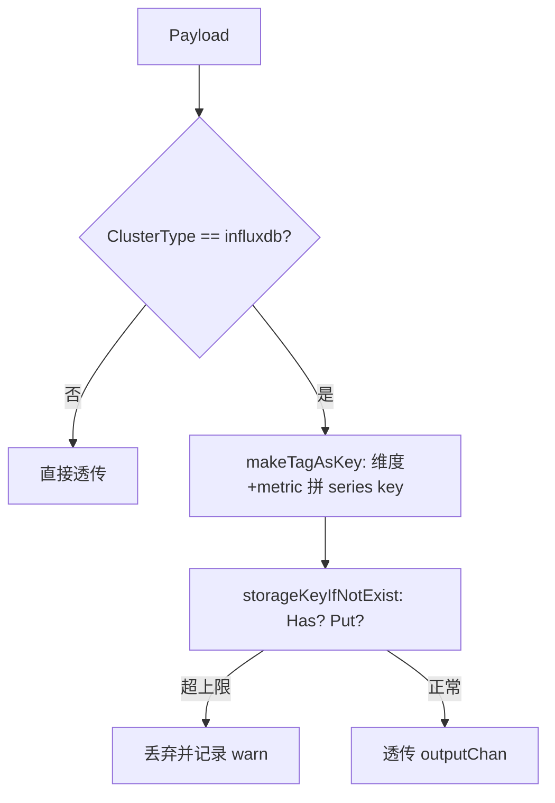

# 存储后端 - InfluxDB

> `influxdb` 包是 transfer 对接 InfluxDB 的存储后端：`BulkHandler` 把 `ETLRecord` 转成 InfluxDB `Point`（支持单指标单表拆分），批量 `Write` 写入；`tag_check_processor` 提供维度基数（series）保护，防止 tag 组合爆炸拖垮数据库。

<cite>
**本文引用的文件**
- [influxdb/backend.go](file://bkmonitor-datalink/pkg/transfer/influxdb/backend.go)
- [influxdb/tag_check_processor.go](file://bkmonitor-datalink/pkg/transfer/influxdb/tag_check_processor.go)
</cite>

## 目录

1. [简介](#简介)
2. [BulkHandler 结构与字段清洗](#bulkhander-结构与字段清洗)
3. [分表逻辑（isSplitMeasurement）](#分表逻辑issplitmeasurement)
4. [写入流程（Flush）](#写入流程flush)
5. [注册与配置](#注册与配置)
6. [维度基数保护（TagCheckProcessor）](#维度基数保护tagcheckprocessor)
7. [结论](#结论)

## 简介

`influxdb` 包以 `BackendName = "influxdb"` 为注册名，实现 `define.Backend`。与 ES 后端不同，InfluxDB 后端把数据映射为时序 `Point`（measurement + tags + fields + time）。它支持两种写入形态：普通多指标单表（全部 metrics 写入同一 measurement），以及单指标单表（每个 metric 拆成独立 measurement 的一个 point）。

`tag_check_processor` 则作为 `define.DataProcessor` 注册为 `"influxdb_tab_checker"`，在写入前对 series 数量进行上限保护。

**章节来源**
- [influxdb/backend.go](file://bkmonitor-datalink/pkg/transfer/influxdb/backend.go#L34-L38)
- [influxdb/tag_check_processor.go](file://bkmonitor-datalink/pkg/transfer/influxdb/tag_check_processor.go#L27-L32)

## BulkHandler 结构与字段清洗

`BulkHandler` 关键字段：`dbName`/`tableName`/`retentionPolicy`（目标库表与保留策略）、`cli client.Client`、`disabledMetrics`/`disabledDimensions`（禁写字段）、`mustIncludeDimensions`（必须包含的维度）、`isSplitMeasurement`（是否单指标单表）。

- **`isDisabledField`**：依据字段 `Option` 的 `MetaFieldOptInfluxDisabled` 或字段名命中 `RecordCMDBLevelFieldName` 等黑名单，判定该字段是否应被丢弃。
- **`cleanRecord`**：删除 `disabledDimensions`/`disabledMetrics`，随后调用 `record.Clean()`，若清洗后 metric 为空则返回 `true`（标记该记录应被丢弃）。

**章节来源**
- [influxdb/backend.go](file://bkmonitor-datalink/pkg/transfer/influxdb/backend.go#L40-L51)
- [influxdb/backend.go](file://bkmonitor-datalink/pkg/transfer/influxdb/backend.go#L70-L91)

## 分表逻辑（isSplitMeasurement）

`Handle` 先将 `Payload` 转成 influxdb `Record`，再执行过滤：

1. 若配置了 `mustIncludeDimensions`，要求 record 必须包含全部指定维度，否则丢弃。
2. 非单指标单表模式：调用 `addExemplar` 把采样数据（如 `bk_trace_timestamp`/`bk_trace_value`）并入 metrics，与指标写入同一 point。
3. 调用 `cleanRecord`，若 metric 为空则丢弃。

分表分支（依据 `isSplitMeasurement`）：

- **开启（单指标单表）**：遍历 `record.Metrics`，每个 metric 生成独立 `client.Point`（measurement = metricName，fields = `{"value": metricValue}`，并合入 exemplar），返回 `[]*client.Point`。
- **关闭（多指标单表）**：整条 `record.Metrics` 作为 fields、维度作为 tags，生成单一 `client.Point`，measurement = `tableName`。

**章节来源**
- [influxdb/backend.go](file://bkmonitor-datalink/pkg/transfer/influxdb/backend.go#L53-L67)
- [influxdb/backend.go](file://bkmonitor-datalink/pkg/transfer/influxdb/backend.go#L94-L159)

## 写入流程（Flush）

`Flush` 先构造 `client.BatchPoints`（指定 Database、精度 `ns`、RetentionPolicy），遍历 `results`：若元素是 `[]*client.Point`（分表产生的多点），逐一 `AddPoint`；否则按单个 point 处理，最后 `b.cli.Write(points)` 批量提交，返回写入条数。

**章节来源**
- [influxdb/backend.go](file://bkmonitor-datalink/pkg/transfer/influxdb/backend.go#L161-L194)

## 注册与配置

`NewBulkHandler(rt, shipper)` 从 `shipper.AsInfluxCluster()` 取库名/表名/地址，构造带认证的 HTTP client；遍历结果表字段收集 `disabledMetrics`/`disabledDimensions`；从 `rt.Option` 读 `ResultTableOptIsSplitMeasurement` 与 `ResultTableOptMustIncludeDimensions`。

`init()` 中 `define.RegisterBackend("influxdb", ...)` 校验 Context/Shipper/PipelineConfig/ResultTable 非空，读取 `maxQps` 后 `NewBackend`。特别地：当结果表 `SchemaType == ResultTableSchemaTypeFree` 且未关闭 `PipelineConfigOptDisableMetricCutter` 时，会用 `pipeline.NewBackendWithCutterAdapter` 包装以启用指标裁剪适配器，否则走默认适配器。

**章节来源**
- [influxdb/backend.go](file://bkmonitor-datalink/pkg/transfer/influxdb/backend.go#L201-L269)
- [influxdb/backend.go](file://bkmonitor-datalink/pkg/transfer/influxdb/backend.go#L277-L319)

## 维度基数保护（TagCheckProcessor）

InfluxDB 的 series 数 = measurement × 各 tag 基数乘积，tag 组合爆炸会拖垮数据库。为此 transfer 提供 `TagCheckProcessor` 在写入前做 series 上限保护。

`mermaid` 展示了 series 上限保护的判定路径：

**图表来源**
- [influxdb/tag_check_processor.go](file://bkmonitor-datalink/pkg/transfer/influxdb/tag_check_processor.go#L167-L229)
- [influxdb/tag_check_processor.go](file://bkmonitor-datalink/pkg/transfer/influxdb/tag_check_processor.go#L259-L265)

- **`TagStorage` 接口**：`Put(key) (bool, error)` / `Has(key) (bool, error)` / `Count() (int64, error)`。提供两种实现：`TagStorageMemory`（进程内 `map`，超限后 `Put` 返回 false）与 `TagStorageRedis`（基于 Redis `SAdd`/`SIsMember`/`SCard` 的集合，支持跨实例共享上限）。
- **`TagCheckerOption`**：含 `MaxSeries`、`StorageType`（`memory`/`redis`）、`StorageOption`，方法 `NewTagCheckStorage()` 据此构造对应存储。
- **`TagCheckProcessor`**：`Process` 先判断 `ClusterType != BackendName` 则直接透传；否则 `makeTagAsKey` 把"维度组合 + 每个 metric"拼成 series key，`storageKeyIfNotExist` 检查/写入；若存储已满（返回 false）则丢弃该 payload 并告警 `too much series`。
- **`NewTagCheckProcessor`**：从 `ResultTableConfigFromContext` 取首个 shipper 的 `ClusterType`，解析 `PipelineConfig.Option[TagCheckerOptionKey]` 的 JSON 得到 `TagCheckerOption` 并构造存储。

`init()` 中 `define.RegisterDataProcessor("influxdb_tab_checker", ...)` 注册该处理器。

**章节来源**
- [influxdb/tag_check_processor.go](file://bkmonitor-datalink/pkg/transfer/influxdb/tag_check_processor.go#L41-L157)
- [influxdb/tag_check_processor.go](file://bkmonitor-datalink/pkg/transfer/influxdb/tag_check_processor.go#L159-L257)
- [influxdb/tag_check_processor.go](file://bkmonitor-datalink/pkg/transfer/influxdb/tag_check_processor.go#L259-L265)

## 结论

`influxdb` 包把 ETL 产物映射为 InfluxDB `Point`，支持单指标单表拆分与字段禁写；并通过 `influxdb_tab_checker` 数据处理器对 series 基数做上限保护，避免 tag 组合爆炸。两包均以 `init()` 注册到全局工厂，由 `Builder` 按 shipper 配置实例化。

**章节来源**
- [influxdb/backend.go](file://bkmonitor-datalink/pkg/transfer/influxdb/backend.go#L34-L319)
- [influxdb/tag_check_processor.go](file://bkmonitor-datalink/pkg/transfer/influxdb/tag_check_processor.go#L27-L265)
