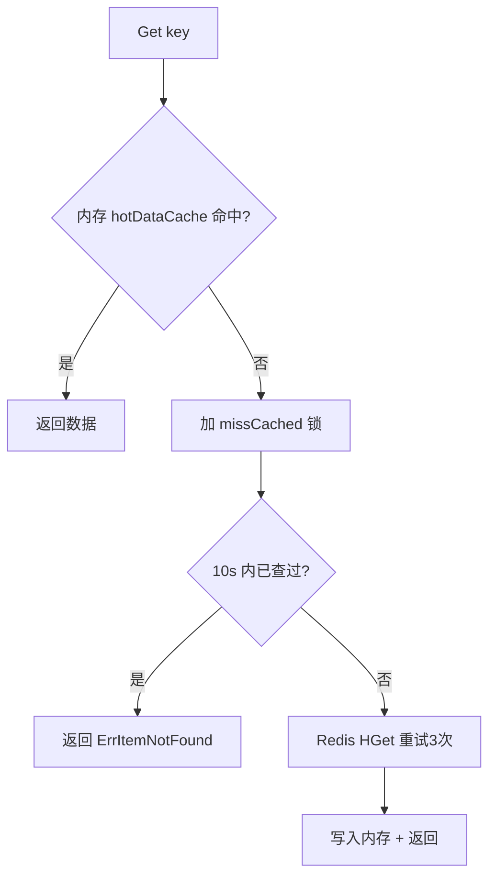

# 存储抽象与 KV 缓存

> `storage` 包是 transfer 的"存储抽象层 + CMDB 缓存"：`define.Store` 接口统一 KV 语义，由 `redis`（v2）、`bbolt`、`memory`、`hashmap`、`bstmap`、`skiplist` 等实现注册；`RedisStore` 作为默认实现提供内存热缓存 + Redis 持久 + 分布式锁 + 后台维护任务，并通过 `cmdbReader` 对外提供 CMDB 主机/实例数据的过滤读取。

<cite>
**本文引用的文件**
- [storage/base.go](file://bkmonitor-datalink/pkg/transfer/storage/base.go)
- [storage/redis_v2.go](file://bkmonitor-datalink/pkg/transfer/storage/redis_v2.go)
- [storage/store_reader.go](file://bkmonitor-datalink/pkg/transfer/storage/store_reader.go)
</cite>

## 目录

1. [简介](#简介)
2. [抽象与模式（StoreCache / StoreMode）](#抽象与模式storecache--storemode)
3. [RedisStore 结构与内存热缓存](#redisstore-结构与内存热缓存)
4. [读写路径（Get / Set / Delete / Scan / Batch）](#读写路径get--set--delete--scan--batch)
5. [分布式锁（Lock / UnLock）](#分布式锁lock--unlock)
6. [后台维护任务](#后台维护任务)
7. [CMDB 读取（cmdbReader）](#cmdb-读取cmdbreader)
8. [注册与配置](#注册与配置)
9. [结论](#结论)

## 简介

`storage` 包把"CMDB 缓存 / 元数据存储"等 KV 需求抽象为统一的 `define.Store` 接口，并通过 `StoreMode` 区分存储的更新策略：`OnlyLeader`（仅 leader 实例更新，如 redis）与 `AllService`（所有实例都更新，如 bbolt）。`RedisStore` 是生产默认实现，它在 Redis 之外维护一份进程内 `hotDataCache` 热缓存。

**章节来源**
- [storage/base.go](file://bkmonitor-datalink/pkg/transfer/storage/base.go#L16-L44)

## 抽象与模式（StoreCache / StoreMode）

`base.go` 定义基础结构：

- `CacheItem{key, data, expires}`：单条待写缓存项，经 `CacheChan` 异步投递。
- `StoreCache{data, expires}`：存储内缓存单元。
- `UpdateSignal chan struct{}`：触发刷新的信号。
- `StoreMode map[string]int`：名称→模式，`"bbolt" → AllService`、`"redis" → OnlyLeader`。

该模式是 `scheduler` 协调各 transfer 实例"谁负责刷新缓存"的依据（leader 才写 Redis，避免重复写）。

**章节来源**
- [storage/base.go](file://bkmonitor-datalink/pkg/transfer/storage/base.go#L16-L44)

## RedisStore 结构与内存热缓存

`RedisStore` 内嵌 `monitorRedis`（封装 `*redis.Client` + 各类命令的计数器/耗时观测）：

- `redis *Redis`：主/从客户端（`Slave` 用于读，降低主压力）。
- `cacheKey`：Redis 中 CMDB 缓存的 hash key。
- `hotDataCache sync.Map`：热数据 `{key: *define.StoreItem}`，读优先走内存。
- `writeCache`：批量写缓冲。
- `distributedLockEnabled/Key/Value/Expire`：分布式锁配置。

`monitorRedis` 为 `HGet/HSet/HDel/HScan/ZAdd/ZRangeByScore` 等命令分别配置了成功/失败计数与耗时 `TimeObserver`，全面接入 Prometheus。

**章节来源**
- [storage/redis_v2.go](file://bkmonitor-datalink/pkg/transfer/storage/redis_v2.go#L35-L161)

## 读写路径（Get / Set / Delete / Scan / Batch）

`mermaid` 展示 `Get` 的"内存优先、Redis 兜底、防穿透"三级路径：

**图表来源**
- [storage/redis_v2.go](file://bkmonitor-datalink/pkg/transfer/storage/redis_v2.go#L196-L265)

- **`Get`**：先 `getFromMem`（命中 `hotDataCache` 直接返回并计数 `MonitorHitMemTotal`）；未命中则加 `missCachedMut` 锁，若 10s 内已查过则直接返回 `ErrItemNotFound`（防穿透）；否则从 `redis.Slave.HGet` 取，重试 3 次，成功后反序列化为 `StoreItem` 并 `setIntoMem` 回填内存。
- **`Set`**：先 `setIntoMem` 保证单机内存最新（Redis 异常时仍可单机工作），再 `HSet` 写 Redis 并观测耗时/计数。
- **`Delete` / `Scan` / `Batch`**：分别提供单键删除、按前缀 `Scan` 遍历、批量刷写 `writeCache` 的能力。

**章节来源**
- [storage/redis_v2.go](file://bkmonitor-datalink/pkg/transfer/storage/redis_v2.go#L165-L265)
- [storage/redis_v2.go](file://bkmonitor-datalink/pkg/transfer/storage/redis_v2.go#L286-L515)

## 分布式锁（Lock / UnLock）

`RedisStore` 提供 `Lock()` / `UnLock()`，基于 Redis 实现可重入式分布式锁（锁信息 `distributedLockValue` 标识自己），配合 `distributedLockEnabled` 开关与 `distributedLockKey`/`distributedLockExpireDuration` 配置使用。仅 leader 实例在刷新 CMDB 缓存时加锁，避免多实例并发写同一 Redis key。

**章节来源**
- [storage/redis_v2.go](file://bkmonitor-datalink/pkg/transfer/storage/redis_v2.go#L771-L793)

## 后台维护任务

`NewRedisStoreFromContext` 在构造 `RedisStore` 后启动两个后台 goroutine：

- **`UpdateRedisDataTask(store, ctx, checkExpiredDataPeriod)`**：周期性清理 Redis 中已过期的数据，周期由 `ConfRedisStorageCleanDataPeriod`（默认 `1h`）控制，应大于更新周期。
- **`UpdateMemDataTask(store, checkPeriod, waitTime, checkRandomTime, ctx)`**：维护内存热数据集合，按 `ConfRedisStorageMemCheckPeriod`（默认 `15m`）检查、按 `ConfRedisStorageUpdateWaitTime` 随机等待以避免 thundering herd，把被访问的键纳入热数据集合。

**章节来源**
- [storage/redis_v2.go](file://bkmonitor-datalink/pkg/transfer/storage/redis_v2.go#L952-L1050)
- [storage/redis_v2.go](file://bkmonitor-datalink/pkg/transfer/storage/redis_v2.go#L1261-L1312)

## CMDB 读取（cmdbReader）

`cmdbReader` 包装一个 `CacheReader`（即 `define.Store`），提供面向 CMDB 语义的读取：

- **`Filter(ip, cloudID)`**：若 cloud 与 ip 都明确，按 `HostInfoStorePrefix-cloudID-ip` 直接 `Get`；否则以 `HostInfoStorePrefix` 为前缀 `Scan`，逐条反序列化 `hostInfo`/`instanceInfo`，按 ip/cloudID 过滤，分别归入 `hostCache`/`instCache`。
- **`All`**：等同于 `Filter("", -1)` 全量返回。
- **`MemCache(addr, storeType)`**：通过 HTTP 向同机其它 transfer 实例的 `/cache` 接口拉取其内存热缓存（`define.RespCacheData`）。
- **`NewReaderHelper(ctx, name)`**：优先取 `define.StoreFromContext`，否则按 name 经 `define.NewStore` 创建，返回 `*cmdbReader`。

**章节来源**
- [storage/store_reader.go](file://bkmonitor-datalink/pkg/transfer/storage/store_reader.go#L27-L189)

## 注册与配置

`redis_v2.go` 在 `init()` 中以 `define.RegisterStore("redis", ...)` 注册默认存储实现（同时 `bbolt.go`/`map.go`/`memory.go`/`skiplist.go` 注册各自名称）。配置键集中在 `ConfRedisStorage*` 常量：

- 连接：`storage.redis.host/port/password/database/type`（`standalone`/`sentinel`）。
- 缓存 key 与批处理：`storage.redis.cc_cache_key`（默认 `bkmonitorv3.transfer.cmdb.cache`）、`batch_size`（500）。
- 维护周期：`mem_check_period`（`15m`）、`clean_data_period`（`1h`）、`random_wait_time`（`10m`）。
- TLS：`storage.redis.tls.cert_file/key_file/ca_file/ca_path/insecure_skip_verify`。
- 分布式锁：`storage.redis.lock.enabled/key/expire_duration`（默认 `30s`）。

**章节来源**
- [storage/redis_v2.go](file://bkmonitor-datalink/pkg/transfer/storage/redis_v2.go#L1405-L1451)
- [storage/redis_v2.go](file://bkmonitor-datalink/pkg/transfer/storage/redis_v2.go#L1457-L1463)

## 结论

`storage` 包以统一的 `define.Store` 抽象屏蔽后端差异（redis/bbolt/memory/...），并以 `StoreMode` 区分 leader-only 与 all-service 更新策略。`RedisStore` 通过"内存热缓存 + Redis 持久 + 分布式锁 + 后台维护"四件套，在保证单机可用性的同时支持多实例协同刷新 CMDB 缓存；`cmdbReader` 则在其上提供面向主机/实例的过滤读取能力。

**章节来源**
- [storage/base.go](file://bkmonitor-datalink/pkg/transfer/storage/base.go#L16-L44)
- [storage/redis_v2.go](file://bkmonitor-datalink/pkg/transfer/storage/redis_v2.go#L35-L161)
- [storage/store_reader.go](file://bkmonitor-datalink/pkg/transfer/storage/store_reader.go#L27-L189)
