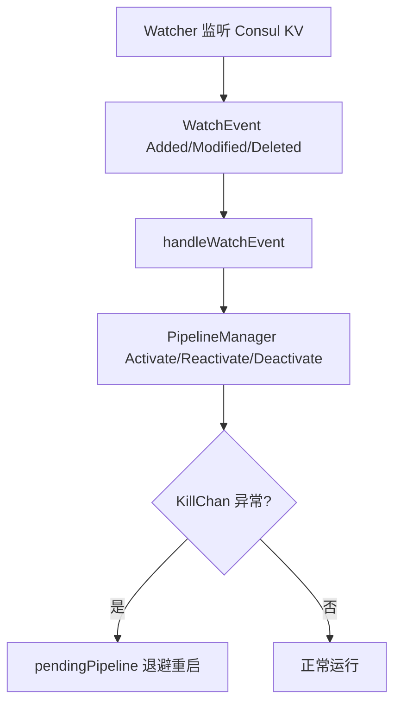

# Consul 协调与调度

> transfer 是多实例分布式部署，`consul` 包封装 Consul 的 KV / Session / Service / Health / Watch 能力，`scheduler` 包基于它实现"管道启停调度 + CMDB 缓存同步 + 配置分发"。本页聚焦两者的协调与调度职责。

<cite>
**本文引用的文件**
- [consul/interface.go](file://bkmonitor-datalink/pkg/transfer/consul/interface.go)
- [consul/session.go](file://bkmonitor-datalink/pkg/transfer/consul/session.go)
- [consul/plugin.go](file://bkmonitor-datalink/pkg/transfer/consul/plugin.go)
- [scheduler/scheduler.go](file://bkmonitor-datalink/pkg/transfer/scheduler/scheduler.go)
- [scheduler/manager.go](file://bkmonitor-datalink/pkg/transfer/scheduler/manager.go)
- [scheduler/base.go](file://bkmonitor-datalink/pkg/transfer/scheduler/base.go)
</cite>

## 目录

1. [简介](#简介)
2. [Consul 客户端抽象](#consul-客户端抽象)
3. [Session 与分布式锁](#session-与分布式锁)
4. [LeaderMixin 选举封装](#leadermixin-选举封装)
5. [Scheduler 主调度器](#scheduler-主调度器)
6. [PipelineManager 管道生命周期](#pipelinemanager-管道生命周期)
7. [结论](#结论)

## 简介

transfer 的每个实例都运行一个 `Scheduler`。`consul` 包把 Consul API 适配为一组精简接口（`ClientAPI`/`KvAPI`/`SessionAPI`/`AgentAPI`/`HealthAPI`/`WatchPlan`），并在其上提供 `Session`（带 TTL 的会话/锁）、`LeaderMixin`（leader 选举回调封装）。`scheduler` 包消费这些能力：监听 pipeline 配置变更、按事件启停管道、在 leader 上同步 CMDB 缓存。

**章节来源**
- [consul/interface.go](file://bkmonitor-datalink/pkg/transfer/consul/interface.go#L53-L103)
- [scheduler/scheduler.go](file://bkmonitor-datalink/pkg/transfer/scheduler/scheduler.go#L31-L47)

## Consul 客户端抽象

`ClientAPI` 是 Consul 能力的统一入口：`Raw()` 暴露原生 client，`KV()`/`Session()`/`Agent()`/`Health()` 分别返回对应子 API。`KvAPI` 覆盖 `Get/Acquire/Release/Put/Keys/List/Delete/DeleteTree`，`HealthAPI.Service` 用于按服务发现 transfer 实例列表，`WatchPlan` 提供 watch 计划的启停。

`NewConsulAPI(config)` 创建并包装底层 Consul client，整个 transfer 对 Consul 的访问都经由这层抽象，便于测试替换。

**章节来源**
- [consul/interface.go](file://bkmonitor-datalink/pkg/transfer/consul/interface.go#L53-L103)
- [consul/interface.go](file://bkmonitor-datalink/pkg/transfer/consul/interface.go#L200-L204)

## Session 与分布式锁

`Session` 对应 Consul 的会话（带 TTL、Behavior 为 Release/Delete）。`SessionConfig` 描述会话参数（Node/LockDelay/TTL/Checks/Flags）。它提供 `AbsPath`/`AttrPath` 来拼 KV 路径，并基于 `Client.KV()` 实现 `Acquire`/`Release` 语义——这是 transfer 实现分布式锁（如 CMDB 缓存刷新锁、Redis 分布式锁）的底层原语。

KV 键设有属性位（`KVPairMetaAttr`/`KVPairExpires`/`KVPairTransaction`），支持过期与事务标记。

**章节来源**
- [consul/session.go](file://bkmonitor-datalink/pkg/transfer/consul/session.go#L26-L99)

## LeaderMixin 选举封装

`LeaderMixin` 把"成为 leader / 退位"事件包装成回调。其 `Wrap(service)` 取得根 service 与事件总线，订阅 `EvPromoted`：被提升为 leader 时，用 `promotedFn(ctx)` 启动 leader 专属任务（如 Dispatcher 的 `run`、CMDB 同步）；订阅 `EvRetired`：退位时取消该 ctx，停止 leader 任务。

`Dispatcher` 正是通过 `NewLeaderMixin(conf.Context, d.run)` 在成为 leader 后才开始配置分发，避免多实例重复分发。

**章节来源**
- [consul/plugin.go](file://bkmonitor-datalink/pkg/transfer/consul/plugin.go#L354-L408)

## Scheduler 主调度器

`Scheduler` 聚合 `TaskManager`（后台任务）、`PipelineManager`（管道集合）、`watcher`（配置变更监听）、`store`（CMDB 缓存）与 `consulClient`：

- **`build`**：创建 store 并 `ExposeStore` 暴露到 Context；按配置 `buildPlugin` 决定是否挂载 HTTP Server 与 CC 缓存同步任务。
- **`addCCUpdateTask`**：依据 `storage.StoreMode` 判断缓存维护模式。若 `OnlyLeader`（如 redis），仅在订阅 `EvPromoted` 后启动 `NewCCHostUpdateTask`；否则每个实例都启动同步。
- **`Start`**：启动 `TaskManager`，建立 Consul client，等待缓存同步（`storage.WaitCache()`），之后 `s.watcher(ctx)` 拉取 pipeline 配置变更事件进入主循环。
- **`handleWatchEvent`**：把 `WatchEvent`（Added/Deleted/Modified）映射为 `PipelineManager.Activate/Deactivate/Reactivate`，并按 `dataID` 维护管道元信息（`pipeline.SetPipelineMeta`）。
- **`handleKillChannels`**：监听各管道 `KillChan`，出错或关闭时 `pendingPipeline` 退避重启该管道，保证自愈。

**章节来源**
- [scheduler/scheduler.go](file://bkmonitor-datalink/pkg/transfer/scheduler/scheduler.go#L49-L142)
- [scheduler/scheduler.go](file://bkmonitor-datalink/pkg/transfer/scheduler/scheduler.go#L144-L301)
- [scheduler/scheduler.go](file://bkmonitor-datalink/pkg/transfer/scheduler/scheduler.go#L303-L339)

## PipelineManager 管道生命周期

`PipelineManager` 用 `treemap.Map`（按 `dataID` 有序）保存 `PipelineItem`，借 `define.Atomic` 做无锁读写：

- `PipelineItem` 含 `Status`（ready/running/closing/closed/error）、`Pipeline`、`Config`、`KillChan`。
- `Activate`/`Deactivate`/`Reactivate` 驱动单条管道启停，并通过 `MonitorRunningPipeline`/`MonitorDeclaredPipeline`/`MonitorPipelinePanic` 暴露 Prometheus 指标。
- `IsAlive`/`GetPipeline`/`EachItem` 供 Scheduler 与分发逻辑查询。

**章节来源**
- [scheduler/manager.go](file://bkmonitor-datalink/pkg/transfer/scheduler/manager.go#L25-L118)
- [scheduler/base.go](file://bkmonitor-datalink/pkg/transfer/scheduler/base.go#L23-L59)

`mermaid` 展示了配置变更到管道启停的闭环：

**图表来源**
- [scheduler/scheduler.go](file://bkmonitor-datalink/pkg/transfer/scheduler/scheduler.go#L144-L205)
- [scheduler/manager.go](file://bkmonitor-datalink/pkg/transfer/scheduler/manager.go#L25-L118)
- [scheduler/base.go](file://bkmonitor-datalink/pkg/transfer/scheduler/base.go#L23-L59)

## 结论

`consul` + `scheduler` 共同构成 transfer 的分布式协调与调度中枢：Consul 提供 KV/会话/服务发现/选举原语，`Scheduler` 据此监听配置变更、按事件启停管道、在 leader 上独占式同步 CMDB 缓存，并对异常管道做退避自愈。

**章节来源**
- [consul/interface.go](file://bkmonitor-datalink/pkg/transfer/consul/interface.go#L53-L103)
- [scheduler/scheduler.go](file://bkmonitor-datalink/pkg/transfer/scheduler/scheduler.go#L31-L339)
