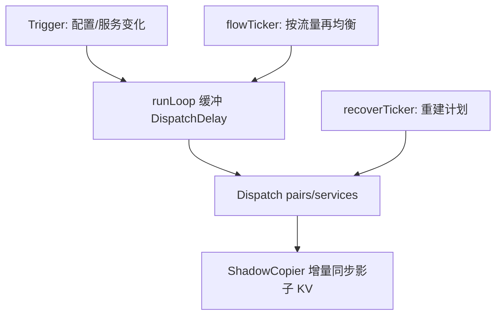

# 分发与 Shipper

> 本页分两部分：**配置分发（Dispatcher）**——leader 实例把 pipeline 配置按负载均衡算法分发给各 transfer 实例，并借助 Consul KV + `ShadowCopier` 落地；**Shipper 包**——提供 `echo`/`noop` 等调试用途的存储后端。

<cite>
**本文引用的文件**
- [consul/dispatcher.go](file://bkmonitor-datalink/pkg/transfer/consul/dispatcher.go)
- [consul/interface.go](file://bkmonitor-datalink/pkg/transfer/consul/interface.go)
- [scheduler/consul.go](file://bkmonitor-datalink/pkg/transfer/scheduler/consul.go)
- [shipper/hook.go](file://bkmonitor-datalink/pkg/transfer/shipper/hook.go)
- [shipper/echo/echo.go](file://bkmonitor-datalink/pkg/transfer/shipper/echo/echo.go)
- [shipper/noop/noop.go](file://bkmonitor-datalink/pkg/transfer/shipper/noop/noop.go)
</cite>

## 目录

1. [简介](#简介)
2. [Dispatcher 与分发计划](#dispatcher-与分发计划)
3. [ShadowCopier 影子拷贝](#shadowcopier-影子拷贝)
4. [负载均衡（Hash / Auto）](#负载均hash--auto)
5. [运行循环与 Leader 约束](#运行循环与-leader-约束)
6. [Shipper 包（echo / noop）](#shipper-包echo--noop)
7. [结论](#结论)

## 简介

transfer 多实例部署下，每条 pipeline 只需被一个实例消费。`Dispatcher` 在 leader 上运行，依据各实例上报的流量/负载，把 Consul KV 中的 pipeline 配置分发（shadow）到对应实例的 KV 路径下；`ShadowCopier` 负责源→目标的链接同步。此外，`shipper` 包实现的 `echo`/`noop` 后端用于开发调试（把数据打印到标准输出或丢弃）。

**章节来源**
- [consul/dispatcher.go](file://bkmonitor-datalink/pkg/transfer/consul/dispatcher.go#L31-L89)
- [shipper/echo/echo.go](file://bkmonitor-datalink/pkg/transfer/shipper/echo/echo.go#L25-L31)

## Dispatcher 与分发计划

`DispatcherConfig` 持有 `Client`（Consul）、`Converter`（`DispatchConverter`）、`TargetRoot`/`ManualRoot`、`TriggerCreator`（触发源）、`DispatchDelay`/`RecoverInterval`。`Dispatcher` 内嵌 `LeaderMixin`，并持有 `plans define.PlanWithFlows`（服务→ pair 的分发计划）与两个 `Balancer`（`hashBalancer`/`autoBalancer`）。

`Dispatch(pairs, services)` 是核心：先用 `GetPlan` 计算新计划，再对每个 service 比对新旧计划，通过 `addShadowsByPlan` / `updateShadowsByPlan` / `deleteShadowsByPlan` 增量更新影子 KV；对已被删除的旧计划执行清理。

**章节来源**
- [consul/dispatcher.go](file://bkmonitor-datalink/pkg/transfer/consul/dispatcher.go#L59-L100)
- [consul/dispatcher.go](file://bkmonitor-datalink/pkg/transfer/consul/dispatcher.go#L614-L647)

## ShadowCopier 影子拷贝

`ShadowCopier` 接口（`Link`/`IsLink`/`Unlink`/`Clear`/`Each`/`Sync`/`SyncAll`）把"源 pipeline 配置"影子拷贝到各实例的目标 KV 路径。`DispatchConverter` 负责把 Consul KV 的 `KVPair` 转换为分发元素（`ElementCreator`/`NodeCreator`/`ShadowCreator`/`ShadowDetector`），并在恢复（`Recover`）时根据 `TargetRoot` 下已有的 shadow 重建计划。

`scheduler/consul.go` 的 `DispatchConverter` 即实现：解析 pipeline 配置，提取 partition 等信息，构造分发节点与影子源/目标。

**章节来源**
- [consul/interface.go](file://bkmonitor-datalink/pkg/transfer/consul/interface.go#L186-L212)
- [scheduler/consul.go](file://bkmonitor-datalink/pkg/transfer/scheduler/consul.go#L39-L90)

## 负载均衡（Hash / Auto）

`NewDispatcher` 依据 `SchedulerHelper` 的平衡配置构造两个均衡器：

- `hashBalancer = utils.NewHashBalancer()`：基于一致性哈希，稳定地把同一 dataID 映射到固定实例。
- `autoBalancer = utils.NewAutoBalancer(...)`：基于各实例上报流量（`SchedulerHelper.Flow`）做自动再均衡，受 `Fluctuation`（波动阈值）与 `ForceRound`（强制轮询）约束，并写 `balanceLogPath` 日志。

**章节来源**
- [consul/dispatcher.go](file://bkmonitor-datalink/pkg/transfer/consul/dispatcher.go#L752-L770)
- [scheduler/consul.go](file://bkmonitor-datalink/pkg/transfer/scheduler/consul.go#L64-L90)

`mermaid` 展示分发主循环：

**图表来源**
- [consul/dispatcher.go](file://bkmonitor-datalink/pkg/transfer/consul/dispatcher.go#L649-L770)
- [consul/dispatcher.go](file://bkmonitor-datalink/pkg/transfer/consul/dispatcher.go#L751-L770)

## 运行循环与 Leader 约束

`run` 创建 `TaskManager`，用 `TriggerCreator` 生成触发任务并启动，先 `Recover()` 重建分发计划，再进入 `runLoop`：`runLoop` 用 `delayTk`（延迟聚合变更）、`flowTicker`（周期性按流量再均衡）、`recoverTk`（恢复）三个 ticker 驱动 `Dispatch`，并观测 `MonitorDispatchTotal`/`MonitorDispatchDuration`。

由于 `Dispatcher` 内嵌 `LeaderMixin`，`NewLeaderMixin(conf.Context, d.run)` 使得 `run` 仅在实例被提升为 leader 后才执行——保证了分发在集群内是单点、无竞争的。

**章节来源**
- [consul/dispatcher.go](file://bkmonitor-datalink/pkg/transfer/consul/dispatcher.go#L649-L770)
- [consul/plugin.go](file://bkmonitor-datalink/pkg/transfer/consul/plugin.go#L354-L408)

## Shipper 包（echo / noop）

`shipper` 包提供调试/占位用途的存储后端，由 `hook.go` 通过 `eventbus.EvSysConfigPreParse` 在配置解析前注入 `ShipperEchoEnable` 开关（默认关闭，仅开发用）：

- **`echo`（`EchoBackend`，注册名 `"echo"`）**：`Push` 把 Payload 原始字节 `fmt.Println` 到标准输出；`WritePoint` 打印 InfluxDB point 的时间/measurement/tags/fields。仅在 `ShipperEchoEnable` 为真时生效，便于本地观察数据。
- **`noop`（`NoopBackend`，注册名 `"argus"`）**：`Push` 为空实现，不做任何处理/写入，用于压测或旁路验证。

两者均遵循 `define.Backend` 工厂约定：校验 `config.FromContext`/`ShipperConfigFromContext`/`PipelineConfigFromContext` 非空后 `NewXxxBackend`，经 `pipeline.NewBulkBackendDefaultAdapter` 包装。

**章节来源**
- [shipper/hook.go](file://bkmonitor-datalink/pkg/transfer/shipper/hook.go#L10-L33)
- [shipper/echo/echo.go](file://bkmonitor-datalink/pkg/transfer/shipper/echo/echo.go#L33-L86)
- [shipper/noop/noop.go](file://bkmonitor-datalink/pkg/transfer/shipper/noop/noop.go#L28-L55)

## 结论

配置分发由 leader 上的 `Dispatcher` 完成：基于 Hash/Auto 双均衡器计算分发计划，借助 `ShadowCopier` 把 pipeline 配置影子拷贝到各实例 KV 路径，并保证单点无竞争。`shipper` 包则补充了 `echo`/`noop` 调试后端，便于本地观察与旁路验证。

**章节来源**
- [consul/dispatcher.go](file://bkmonitor-datalink/pkg/transfer/consul/dispatcher.go#L59-L770)
- [shipper/echo/echo.go](file://bkmonitor-datalink/pkg/transfer/shipper/echo/echo.go#L33-L86)
