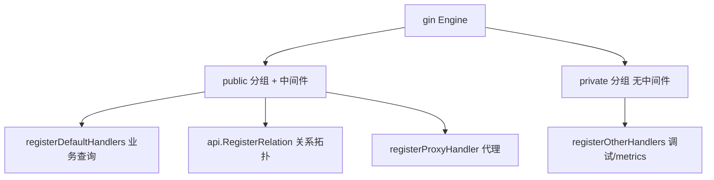

[待审核]

# API 接口说明

<cite>
- [service/http/service.go](file://bkmonitor-datalink/pkg/unify-query/service/http/service.go#L52-L92)
- [service/http/register_urls.go](file://bkmonitor-datalink/pkg/unify-query/service/http/register_urls.go#L25-L94)
- [service/http/api/register.go](file://bkmonitor-datalink/pkg/unify-query/service/http/api/register.go#L16-L19)
- [service/http/middleware/jwt.go](file://bkmonitor-datalink/pkg/unify-query/service/http/middleware/jwt.go#L119-L240)
- [service/http/middleware/metadata.go](file://bkmonitor-datalink/pkg/unify-query/service/http/middleware/metadata.go#L28-L91)
- [service/http/response.go](file://bkmonitor-datalink/pkg/unify-query/service/http/response.go#L29-L53)
</cite>

## 目录
- [概述](#概述)
- [路由注册机制](#路由注册机制)
- [业务查询类接口](#业务查询类接口)
- [关系/代理/调试类接口](#关系代理调试类接口)
- [请求与响应结构](#请求与响应结构)
- [中间件与鉴权](#中间件与鉴权)
- [接口文档索引](#接口文档索引)

## 概述

unify-query 以 gin 暴露 HTTP 服务，所有接口按"业务查询 / 关系拓扑 / 代理 / 内部调试"分组挂载。接口路径全部由 viper 配置驱动（默认值见 `service/http/hook.go`），可被外部 yaml 覆盖。业务查询与关系查询统一经过 `MetaData`+`JwtAuth` 中间件鉴权；内部调试类接口挂在无中间件分组。

章节来源
- [service/http/service.go](file://bkmonitor-datalink/pkg/unify-query/service/http/service.go#L52-L92)
- [service/http/register_urls.go](file://bkmonitor-datalink/pkg/unify-query/service/http/register_urls.go#L25-L94)

## 路由注册机制

`Service.Reload` 中创建 `gin.New()` 引擎并挂载路由（`service/http/service.go#L52-L92`）。所有路由通过 `endpoint.RegisterHandler` 封装（`service/http/endpoint/register.go#L1-L45`），`Register()` 先把 handler 记入 `metadata.AddHandler`，再注册到 gin 的 `RouterGroup`。

分组与中间件：
- `public` 分组（`s.g.Group("/")`，无额外前缀）挂载全局中间件：`gin.Recovery`、`otelgin.Middleware`（链路追踪）、`middleware.MetaData`、`middleware.JwtAuthMiddleware`。`registerDefaultHandlers`/`api.RegisterRelation`/`registerProxyHandler` 均挂在此组。
- `private` 分组（`s.g.Group("/")`，无中间件）仅注册 `registerOtherHandlers`（调试/metrics/pprof 等）。

图表来源
- [service/http/service.go](file://bkmonitor-datalink/pkg/unify-query/service/http/service.go#L52-L92)

章节来源
- [service/http/service.go](file://bkmonitor-datalink/pkg/unify-query/service/http/service.go#L74-L92)
- [service/http/endpoint/register.go#L1-L45](file://bkmonitor-datalink/pkg/unify-query/service/http/endpoint/register.go#L1-L45)

## 业务查询类接口

由 `registerDefaultHandlers`（`service/http/register_urls.go#L25-L94`）注册，均为 POST（除标签值），均经过 JWT 鉴权：

| 方法 | 路径 | Handler | 用途 |
|------|------|---------|------|
| POST | [/query/ts](接口文档/结构体查询.md) | `HandlerQueryTs` | 结构体查询（核心） |
| POST | [/check/query/ts](接口文档/结构体查询校验.md) | `HandlerCheckQueryTs` | 查询校验 |
| POST | [/query/ts/promql](接口文档/PromQL查询.md) | `HandlerQueryPromQL` | PromQL 查询 |
| POST | [/check/query/ts/promql](接口文档/PromQL查询校验.md) | `HandlerCheckQueryPromQL` | PromQL 校验 |
| POST | [/query/ts/reference](接口文档/引用查询.md) | `HandlerQueryReference` | 引用查询 |
| POST | [/query/ts/raw](接口文档/原始数据查询.md) | `HandlerQueryRaw` | 原始数据 |
| POST | [/query/ts/raw_with_scroll](接口文档/原始数据滚动查询.md) | `HandlerQueryRawWithScroll` | 滚动翻页原始数据 |
| POST | [/query/ts/exemplar](接口文档/示例数据查询.md) | `HandlerQueryExemplar` | 示例数据 |
| POST | [/query/ts/info/field_keys](接口文档/字段键查询.md) | `HandlerFieldKeys` | 字段键 |
| POST | [/query/ts/info/tag_keys](接口文档/标签键查询.md) | `HandlerTagKeys` | 标签键 |
| POST | [/query/ts/info/tag_values](接口文档/标签值查询.md) | `HandlerTagValues` | 标签值 |
| POST | [/query/ts/info/series](接口文档/序列查询.md) | `HandlerSeries` | 序列 |
| POST | [/query/ts/info/time_series](接口文档/时间序列查询.md) | `HandlerTimeSeries` | 时间序列 |
| GET | [/query/ts/label/:label_name/values](接口文档/标签值查询-GET.md) | `HandlerLabelValues` | 标签值 |
| POST | [/query/ts/info/field_map](接口文档/字段映射查询.md) | `HandlerFieldMap` | 字段映射 |
| POST | [/query/ts/cluster_metrics](接口文档/集群指标查询.md) | `HandlerQueryTsClusterMetrics` | 集群指标 |

`info` 子路径由默认前缀 `/query/ts/info`（`hook.go`）与各常量拼接（`service/http/infos.go#L20-L27`）。返回统一走 `prometheus.NewInstance` 执行（见 [查询执行.md](查询执行.md)）。

章节来源
- [service/http/register_urls.go](file://bkmonitor-datalink/pkg/unify-query/service/http/register_urls.go#L25-L94)
- [service/http/handler.go](file://bkmonitor-datalink/pkg/unify-query/service/http/handler.go#L417)
- [service/http/api.go](file://bkmonitor-datalink/pkg/unify-query/service/http/api.go#L46)

## 关系/代理/调试类接口

| 分组 | 方法 | 路径 | Handler | 说明 |
|------|------|------|---------|------|
| 关系 | POST | [/api/v1/relation/multi_resource](接口文档/关系多资源查询.md) | `HandlerAPIRelationMultiResource` | 多资源关系（瞬时） |
| 关系 | POST | [/api/v1/relation/multi_resource_range](接口文档/关系多资源区间查询.md) | `HandlerAPIRelationMultiResourceRange` | 多资源关系（区间） |
| 代理 | POST | [/proxy](接口文档/代理转发.md) | `proxy.HandleProxy` | 代理转发 |
| 调试 | GET | `/metrics` | promhttp | 指标（受开关控制） |
| 调试 | POST | [/query/ts/struct_to_promql](接口文档/结构体转PromQL.md) | `HandlerStructToPromQL` | 结构体→PromQL |
| 调试 | POST | [/query/ts/promql_to_struct](接口文档/PromQL转结构体.md) | `HandlerPromQLToStruct` | PromQL→结构体 |
| 调试 | GET | `/print`、`/ff`、`/influxdb_print`、`/space_print` 等 | 多个 | 内部状态打印 |
| 调试 | HEAD | `/` | `HandlerHealth` | 健康检查 |
| 调试 | 多 GET | `/debug/pprof/*` | pprof | 性能分析（默认关闭） |

关系接口详见 [关系查询.md](关系查询.md)。调试类接口无中间件鉴权，生产应通过配置/网络层隔离。

章节来源
- [service/http/api/register.go](file://bkmonitor-datalink/pkg/unify-query/service/http/api/register.go#L16-L19)
- [service/http/register_urls.go](file://bkmonitor-datalink/pkg/unify-query/service/http/register_urls.go#L96-L158)

## 请求与响应结构

**统一响应外层**：业务接口成功直接 `c.JSON(200, data)`（无 `code/data` 包裹），失败返回 `ErrResponse`（`{"error","trace_id"}`）（`service/http/response.go#L29-L53`、结构 `response.go#L96-L99`）。存在 `proxy.ContextConfigUnifyResponseProcess` 时改为通过 ctx 传递（见 [模块详解.md](模块详解.md)）。

**主查询请求体**：`/query/ts` 为 `structured.QueryTs`（`query/structured/query_ts.go#L42-L112`），关键字段 `space_uid`/`query_list`/`metric_merge`/`start_time`/`end_time`/`step` 等；`/query/ts/promql` 为 `structured.QueryPromQL`（`query/structured/query_promql.go#L27`）。`info` 类请求体为 `Params`（`service/http/infos.go#L30-L51`）。

**主查询响应体**：`PromData`（`service/http/prom_data.go#L22-L32`，含 `series`/`status`/`trace_id`/`is_partial`/`result_table_id`）；`check` 类为 `CheckQueryTsDataResponse`（`service/http/check_handler.go#L33`）。

**公共请求头**：`X-Bkapi-Jwt`（鉴权）、`X-Bk-Scope-Space-Uid`（空间）、`Bk-Query-Source`（来源）等（`service/http/middleware/metadata.go#L28-L91`）。

章节来源
- [service/http/response.go](file://bkmonitor-datalink/pkg/unify-query/service/http/response.go#L29-L53)
- [query/structured/query_ts.go](file://bkmonitor-datalink/pkg/unify-query/query/structured/query_ts.go#L42-L112)
- [service/http/infos.go](file://bkmonitor-datalink/pkg/unify-query/service/http/infos.go#L30-L51)
- [service/http/prom_data.go](file://bkmonitor-datalink/pkg/unify-query/service/http/prom_data.go#L22-L32)

## 中间件与鉴权

- **MetaData 中间件**（`middleware/metadata.go#L28-L91`）：解析并注入 `metadata.User`（Source/TenantID/SpaceUID/SkipSpace），统计请求数与慢查询（阈值 `http.slow_query_threshold`，默认 3s）。
- **JWT 鉴权中间件**（`middleware/jwt.go#L119-L240`）：读取 `X-Bkapi-Jwt`，用 RSA 公钥校验 app_code 是否有权访问该 `space_uid`；失败返回 401；`jwt.enabled=false` 时跳过。
- **限流**：当前中间件链仅有 Recovery + OTel + MetaData + JWT，未实现独立限流中间件。

章节来源
- [service/http/middleware/jwt.go](file://bkmonitor-datalink/pkg/unify-query/service/http/middleware/jwt.go#L119-L240)
- [service/http/middleware/metadata.go](file://bkmonitor-datalink/pkg/unify-query/service/http/middleware/metadata.go#L28-L91)

## 接口文档索引

上述每个接口已拆分为独立文档，存放于 `接口文档/` 子目录，便于单独查阅与维护：

| 接口文档 | 对应接口 |
|------|------|
| [接口文档/结构体查询.md](接口文档/结构体查询.md) | POST `/query/ts` |
| [接口文档/结构体查询校验.md](接口文档/结构体查询校验.md) | POST `/check/query/ts` |
| [接口文档/PromQL查询.md](接口文档/PromQL查询.md) | POST `/query/ts/promql` |
| [接口文档/PromQL查询校验.md](接口文档/PromQL查询校验.md) | POST `/check/query/ts/promql` |
| [接口文档/引用查询.md](接口文档/引用查询.md) | POST `/query/ts/reference` |
| [接口文档/原始数据查询.md](接口文档/原始数据查询.md) | POST `/query/ts/raw` |
| [接口文档/原始数据滚动查询.md](接口文档/原始数据滚动查询.md) | POST `/query/ts/raw_with_scroll` |
| [接口文档/示例数据查询.md](接口文档/示例数据查询.md) | POST `/query/ts/exemplar` |
| [接口文档/字段键查询.md](接口文档/字段键查询.md) | POST `/query/ts/info/field_keys` |
| [接口文档/标签键查询.md](接口文档/标签键查询.md) | POST `/query/ts/info/tag_keys` |
| [接口文档/标签值查询.md](接口文档/标签值查询.md) | POST `/query/ts/info/tag_values` |
| [接口文档/序列查询.md](接口文档/序列查询.md) | POST `/query/ts/info/series` |
| [接口文档/时间序列查询.md](接口文档/时间序列查询.md) | POST `/query/ts/info/time_series` |
| [接口文档/标签值查询-GET.md](接口文档/标签值查询-GET.md) | GET `/query/ts/label/:label_name/values` |
| [接口文档/字段映射查询.md](接口文档/字段映射查询.md) | POST `/query/ts/info/field_map` |
| [接口文档/集群指标查询.md](接口文档/集群指标查询.md) | POST `/query/ts/cluster_metrics` |
| [接口文档/关系多资源查询.md](接口文档/关系多资源查询.md) | POST `/api/v1/relation/multi_resource` |
| [接口文档/关系多资源区间查询.md](接口文档/关系多资源区间查询.md) | POST `/api/v1/relation/multi_resource_range` |
| [接口文档/代理转发.md](接口文档/代理转发.md) | POST `/proxy` |
| [接口文档/结构体转PromQL.md](接口文档/结构体转PromQL.md) | POST `/query/ts/struct_to_promql` |
| [接口文档/PromQL转结构体.md](接口文档/PromQL转结构体.md) | POST `/query/ts/promql_to_struct` |

章节来源
- [service/http/register_urls.go](file://bkmonitor-datalink/pkg/unify-query/service/http/register_urls.go#L25-L94)
- [service/http/api/register.go](file://bkmonitor-datalink/pkg/unify-query/service/http/api/register.go#L16-L19)
