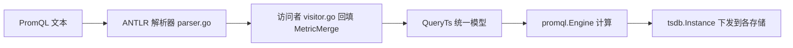

[待审核]

# PromQL 支持与扩展

<cite>
- [internal/promql_parser/antlr4/PromQLLexer.g4](file://bkmonitor-datalink/pkg/unify-query/internal/promql_parser/antlr4/PromQLLexer.g4)
- [internal/promql_parser/antlr4/PromQLParser.g4](file://bkmonitor-datalink/pkg/unify-query/internal/promql_parser/antlr4/PromQLParser.g4)
- [internal/promql_parser/parser.go](file://bkmonitor-datalink/pkg/unify-query/internal/promql_parser/parser.go#L23-L60)
- [internal/promql_parser/visitor.go](file://bkmonitor-datalink/pkg/unify-query/internal/promql_parser/visitor.go#L45-L100)
- [query/promql/engine.go](file://bkmonitor-datalink/pkg/unify-query/query/promql/engine.go#L32-L45)
- [tsdb/prometheus/instance.go](file://bkmonitor-datalink/pkg/unify-query/tsdb/prometheus/instance.go#L42-L46)
- [query/structured/query_ts.go](file://bkmonitor-datalink/pkg/unify-query/query/structured/query_ts.go#L312)
- [query/structured/query_promql.go](file://bkmonitor-datalink/pkg/unify-query/query/structured/query_promql.go#L287-L398)
- [query/structured/query_promql.go](file://bkmonitor-datalink/pkg/unify-query/query/structured/query_promql.go#L542-L572)
</cite>

## 目录
- [概述](#概述)
- [语法定义](#语法定义)
- [解析器与访问者](#解析器与访问者)
- [执行引擎](#执行引擎)
- [结构体到 PromQL 的翻译](#结构体到-promql-的翻译)
- [函数映射与扩展点](#函数映射与扩展点)
- [与标准 PromQL 的差异](#与标准-promql-的差异)

## 概述

unify-query 的 PromQL 能力由两部分组成：**自研 ANTLR 解析器**（`internal/promql_parser`，基于 `.g4` 语法生成）负责把 PromQL 文本解析为 AST 并回填到结构化查询模型；**Prometheus 官方 `promql.Engine`** 作为执行引擎负责实际计算。此外，结构体查询也能通过 `ToPromQL` 反向翻译为 PromQL 表达式，使两类入口在 `MetricMerge` 层统一。

章节来源
- [internal/promql_parser/parser.go](file://bkmonitor-datalink/pkg/unify-query/internal/promql_parser/parser.go#L23-L60)
- [query/promql/engine.go](file://bkmonitor-datalink/pkg/unify-query/query/promql/engine.go#L32-L45)

## 语法定义

PromQL 的词法与语法以 ANTLR4 文法形式保存，是解析器的唯一权威来源：

- 词法：`internal/promql_parser/antlr4/PromQLLexer.g4`
- 语法：`internal/promql_parser/antlr4/PromQLParser.g4`
- 生成代码：`internal/promql_parser/gen/`（由 `internal/promql_parser/generate.go` 通过 `antlr4` 工具生成，含 `.go`/`.interp`/`.tokens`）
- 解析入口：`internal/promql_parser/parser.go`，访问者：`internal/promql_parser/visitor.go`

解析器会在 `now()` 处替换为毫秒时间戳，支持标准 PromQL 的向量选择、矩阵选择、聚合、区间函数等语法。

图表来源
- [internal/promql_parser/antlr4/PromQLLexer.g4](file://bkmonitor-datalink/pkg/unify-query/internal/promql_parser/antlr4/PromQLLexer.g4)
- [internal/promql_parser/antlr4/PromQLParser.g4](file://bkmonitor-datalink/pkg/unify-query/internal/promql_parser/antlr4/PromQLParser.g4)

章节来源
- [internal/promql_parser/parser.go](file://bkmonitor-datalink/pkg/unify-query/internal/promql_parser/parser.go#L23-L60)
- [internal/promql_parser/visitor.go](file://bkmonitor-datalink/pkg/unify-query/internal/promql_parser/visitor.go#L45-L100)
- [internal/promql_parser/generate.go](file://bkmonitor-datalink/pkg/unify-query/internal/promql_parser/generate.go#L12-L12)

## 解析器与访问者

`QueryPromQL`（`query/structured/query_promql.go#L27-L54`）经 `parser.ParseExpr`（`query_promql.go#L217-L229`）产出 AST 后，由 `splitVecGroups`（`query_promql.go#L149-L215`）切成多个 `VectorSelector` 分组。访问者（`internal/promql_parser/visitor.go`）遍历 AST 时：

- `MatrixSelector/Call` 中的 matrix 类型函数（如 `count_over_time`）写入 `TimeAggregation`（`query_promql.go#L287-L371`）；
- 其余 vector 类型函数写入 `AggregateMethodList`；
- `AggregateExpr`（sum/avg/…）经 `convertMethod`（`query_promql.go#L542-L572`）映射为聚合方法名（`query_promql.go#L373-L399`）；
- 最终用各组 `ID`（a/b/c…）替换原 metric 位置拼出 `MetricMerge`（`query_promql.go#L405-L424`）。

章节来源
- [query/structured/query_promql.go](file://bkmonitor-datalink/pkg/unify-query/query/structured/query_promql.go#L149-L215)
- [query/structured/query_promql.go](file://bkmonitor-datalink/pkg/unify-query/query/structured/query_promql.go#L217-L229)
- [query/structured/query_promql.go](file://bkmonitor-datalink/pkg/unify-query/query/structured/query_promql.go#L287-L398)
- [query/structured/query_promql.go](file://bkmonitor-datalink/pkg/unify-query/query/structured/query_promql.go#L542-L572)

## 执行引擎

unify-query 直接复用 Prometheus 官方引擎作为计算内核：

- 全局引擎在 `query/promql/engine.go#L32-L45` 的 `NewEngine` 中创建（`GlobalEngine = prom.NewEngine(...)`）；
- 该引擎被注入到 `tsdb/prometheus` 后端的 `Instance`：`tsdb/prometheus/instance.go#L42-L46` 持有 `engine *promql.Engine`，`NewInstance` 接收该引擎与 `storage.Queryable`；
- 运行时编排层 `queryReferenceWithPromEngine`（`service/http/query.go#L641-L793`）构造 `prometheus.NewInstance` 后调用 `DirectQueryRange`，将 `MetricMerge` 表达式交给引擎计算。

图表来源
- [query/promql/engine.go](file://bkmonitor-datalink/pkg/unify-query/query/promql/engine.go#L32-L45)
- [tsdb/prometheus/instance.go](file://bkmonitor-datalink/pkg/unify-query/tsdb/prometheus/instance.go#L42-L46)

章节来源
- [query/promql/engine.go](file://bkmonitor-datalink/pkg/unify-query/query/promql/engine.go#L32-L45)
- [tsdb/prometheus/instance.go](file://bkmonitor-datalink/pkg/unify-query/tsdb/prometheus/instance.go#L42-L46)
- [service/http/query.go](file://bkmonitor-datalink/pkg/unify-query/service/http/query.go#L641-L793)

## 结构体到 PromQL 的翻译

除 PromQL→结构体，unify-query 也支持**反向**：结构体查询经 `QueryTs.ToPromQL`（`query/structured/query_ts.go#L312`）翻译为 PromQL 字符串，`service/http/query.go#L995` 的 `structToPromQL` 与 `service/http/handler.go#L91` 的 `HandlerStructToPromQL` 暴露该能力。这保证同一份结构化查询可在任意支持 PromQL 的存储后端上执行。

章节来源
- [query/structured/query_ts.go](file://bkmonitor-datalink/pkg/unify-query/query/structured/query_ts.go#L312)
- [service/http/query.go](file://bkmonitor-datalink/pkg/unify-query/service/http/query.go#L995)
- [service/http/handler.go](file://bkmonitor-datalink/pkg/unify-query/service/http/handler.go#L91)

## 函数映射与扩展点

标准 PromQL 聚合函数（sum/avg/min/max/count/…）与区间函数（rate/increase/avg_over_time/…）经由 `convertMethod` 映射为 unify-query 内部结构体的聚合方法名（`query/structured/query_promql.go#L542-L572`）。时间聚合函数清单由 `domSampledFunc`（`query/structured/settings.go#L29`）维护，并决定哪些组合可下推降采样（详见 [查询执行.md](查询执行.md)）。

扩展新函数需同时在：解析器语法（`PromQLParser.g4`）、`convertMethod` 映射、以及各存储后端的 translator 三处补充，才能端到端生效。

章节来源
- [query/structured/query_promql.go](file://bkmonitor-datalink/pkg/unify-query/query/structured/query_promql.go#L542-L572)
- [query/structured/settings.go](file://bkmonitor-datalink/pkg/unify-query/query/structured/settings.go#L29)

## 与标准 PromQL 的差异

unify-query 的 PromQL 在兼容官方语法的基础上做了面向监控场景的扩展：

- **路由标签语法糖**：`VectorSelector` 的 matchers 可分离为路由标签（特殊前缀 `__bk_query_label_selector_<维度>`）与过滤条件，经 `MetricsToRouter` 解析用于空间/存储路由；
- **与结构体模型互通**：PromQL 解析结果最终落回 `QueryTs`/`metadata.Query`，可复用结构体查询的全部路由、降采样、分段能力；
- **下推优化**：部分时间聚合+维度聚合组合会被下推到存储引擎（如 `sum+sum_over_time`），而非在引擎层全量计算。

章节来源
- [query/structured/query_promql.go](file://bkmonitor-datalink/pkg/unify-query/query/structured/query_promql.go#L287-L371)
- [query/structured/query_ts.go](file://bkmonitor-datalink/pkg/unify-query/query/structured/query_ts.go#L623-L687)
