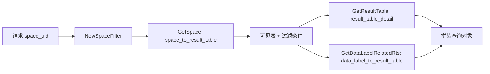

<!-- [待审核] AI 自动生成，请人工确认后移除此标记 -->
# unify-query 元数据与缓存

<cite>
**本文引用的文件**
- [pkg/utils/router/influxdb/influxdb.go](file://bkmonitor-datalink/pkg/utils/router/influxdb/influxdb.go#L29-L39)
- [pkg/utils/router/influxdb/struct.go](file://bkmonitor-datalink/pkg/utils/router/influxdb/struct.go#L56-L116)
- [influxdb/spacetsdb_router.go](file://bkmonitor-datalink/pkg/unify-query/influxdb/spacetsdb_router.go#L44-L56)
- [query/structured/space.go](file://bkmonitor-datalink/pkg/unify-query/query/structured/space.go#L38-L69)
- [kvstore/kv.go](file://bkmonitor-datalink/pkg/unify-query/kvstore/kv.go#L12-L20)
- [kvstore/bbolt/bbolt.go](file://bkmonitor-datalink/pkg/unify-query/kvstore/bbolt/bbolt.go#L49-L208)
- [memcache/cache.go](file://bkmonitor-datalink/pkg/unify-query/memcache/cache.go#L16-L22)
- [memcache/ristretto.go](file://bkmonitor-datalink/pkg/unify-query/memcache/ristretto.go#L38-L73)
- [consul/storage.go](file://bkmonitor-datalink/pkg/unify-query/consul/storage.go#L49-L52)
- [consul/router.go](file://bkmonitor-datalink/pkg/unify-query/consul/router.go#L232-L259)
</cite>

## 目录
1. [简介](#简介)
2. [space_uid 与租户隔离](#space_uid-与租户隔离)
3. [Redis 三个核心 Hash](#redis-三个核心-hash)
4. [本地 KV 镜像（kvstore / bbolt）](#本地-kv-镜像kvstore--bbolt)
5. [内存热缓存（memcache / Ristretto）](#内存热缓存memcache--ristretto)
6. [多级缓存协作与多租户 key 改写](#多级缓存协作与多租户-key-改写)
7. [配置与路由来源（consul）](#配置与路由来源consul)
8. [结论](#结论)

## 简介

unify-query 在查询前必须先解析"当前租户（space）能看到哪些表、表落在哪个存储/集群"。这些信息以**元数据**形式存放于 Redis，并经"Redis → 本地 KV（bbolt）→ 内存缓存（Ristretto）"三级结构被高效读取。本文说明 space_uid 到 result_table 的映射、Redis 三个核心 Hash 的用途与结构、本地镜像与热缓存的协作，以及 consul 提供的配置/路由来源。

章节来源
- [query/structured/space.go](file://bkmonitor-datalink/pkg/unify-query/query/structured/space.go#L38-L69)
- [pkg/utils/router/influxdb/influxdb.go](file://bkmonitor-datalink/pkg/utils/router/influxdb/influxdb.go#L29-L39)

## space_uid 与租户隔离

`space_uid` 是 unify-query 中"类租户"的概念（HTTP 头部 `X-Bk-Scope-Space-Uid` 传入），用于区分当前租户可见的 result_table 集合。查询在 `NewSpaceFilter` 中通过 `router.GetSpace(ctx, spaceUid)` 取出该 space 的 `Space` 映射（可见表 + 每表过滤条件）；若 space 不存在则标记 `SapceIsNotExists`。多租户模式下，路由 key 会追加租户后缀（`key + "|" + tenantID`）。

章节来源
- [query/structured/space.go](file://bkmonitor-datalink/pkg/unify-query/query/structured/space.go#L38-L69)
- [influxdb/spacetsdb_router.go](file://bkmonitor-datalink/pkg/unify-query/influxdb/spacetsdb_router.go#L44-L56)

## Redis 三个核心 Hash

三个 Hash 由外部（metadata 服务 / transfer）写入 Redis，unify-query 侧通过订阅 channel 增量拉取或 `HScan` 全量加载到本地。键名常量定义在 `pkg/utils/router/influxdb/influxdb.go#L29-L39`（运行时实际键由 `prefix:` 前缀拼接，如 `prefix:space_to_result_table`）。

| Hash Key | 常量 | 用途 |
|----------|------|------|
| `space_to_result_table` | `SpaceToResultTableKey` | space → 其可见的全部 result_table 映射（含表级过滤条件） |
| `result_table_detail` | `ResultTableDetailKey` | result_table 详情：存储集群、字段、measurement、data_label、标签等 |
| `data_label_to_result_table` | `DataLabelToResultTableKey` | data_label → 该标签映射到的 result_table 列表 |

- **数据结构**：`space_to_result_table` 的 value 为 `Space`（map[tableID]*SpaceResultTable，仅含 `TableId` + `Filters`）；`result_table_detail` 为 `*ResultTableDetail`（含 `StorageId/ClusterName/DB/Measurement/Fields/DataLabel/TagsKey/...`）；`data_label_to_result_table` 为 `ResultTableList`（`[]string`）。
- **读取入口**：`GetSpace`/`GetResultTableDetail`/`GetDataLabelToResultTableDetail` 底层均为单 field 的 `HGet`（`influxdb.go#L313-L338`）；全量加载经 `HScan` 遍历整个 hash（`influxdb.go#L340-L377`）。
- **业务暴露**：经 `SpaceTsDbRouter` 暴露 `GetSpace`/`GetResultTable`/`GetDataLabelRelatedRts` 给 `query/structured` 使用。

图表来源
- [pkg/utils/router/influxdb/influxdb.go](file://bkmonitor-datalink/pkg/utils/router/influxdb/influxdb.go#L29-L39)
- [pkg/utils/router/influxdb/struct.go](file://bkmonitor-datalink/pkg/utils/router/influxdb/struct.go#L56-L116)
- [query/structured/space.go](file://bkmonitor-datalink/pkg/unify-query/query/structured/space.go#L38-L69)

章节来源
- [pkg/utils/router/influxdb/influxdb.go](file://bkmonitor-datalink/pkg/utils/router/influxdb/influxdb.go#L29-L39)
- [pkg/utils/router/influxdb/struct.go](file://bkmonitor-datalink/pkg/utils/router/influxdb/struct.go#L56-L116)
- [influxdb/spacetsdb_router.go](file://bkmonitor-datalink/pkg/unify-query/influxdb/spacetsdb_router.go#L488-L515)

## 本地 KV 镜像（kvstore / bbolt）

`kvstore` 定义 `KVStore` 接口（`Open/Put/Get/Delete/BatchWrite/GetAll/Close`），唯一实现为嵌入式 BoltDB（bbolt）。它作为 Redis 三个 Hash 的**本地持久化镜像**，避免每次查询都打 Redis：`SpaceTsDbRouter` 在初始化时创建 bbolt 客户端，`Get` 优先读内存缓存、未命中再读 bbolt，`BatchAdd` 落盘、`Delete` 同时删 KV 与缓存。

章节来源
- [kvstore/kv.go](file://bkmonitor-datalink/pkg/unify-query/kvstore/kv.go#L12-L20)
- [kvstore/bbolt/bbolt.go](file://bkmonitor-datalink/pkg/unify-query/kvstore/bbolt/bbolt.go#L49-L208)

## 内存热缓存（memcache / Ristretto）

`memcache` 定义 `Cache` 接口（`Get/Set/SetWithTTL/Del/Clear`），实现为基于 dgraph-io/ristretto 的高性能并发缓存。它位于 bbolt 之上的**热数据内存缓存**：每次 `Get` 命中后按 `expiredTime + rand` 分钟回写；`BatchAdd`/`Delete` 时通过 `cache.Del` 失效。默认配置约 `1e7` 计数、`1<<30` 成本、过期 60min、抖动 20min。

章节来源
- [memcache/cache.go](file://bkmonitor-datalink/pkg/unify-query/memcache/cache.go#L16-L22)
- [memcache/ristretto.go](file://bkmonitor-datalink/pkg/unify-query/memcache/ristretto.go#L38-L73)

## 多级缓存协作与多租户 key 改写

三级缓存的读取顺序为：`Ristretto 内存缓存 → bbolt 本地 KV → Redis`。写路径上，`ReloadByChannel`（订阅增量 channel）或 `LoadRouter`（`HScan` 全量）把 Redis 数据加载到本地：`BatchAdd` 经 `BatchWrite` 落 bbolt 并清理 Ristretto 缓存；`Delete` 同时删 KV 与缓存。多租户场景下，`getRedisRouterKey` 把 key 改写为 `key + "|" + tenantID`，使不同租户的元数据相互隔离。

章节来源
- [influxdb/spacetsdb_router.go](file://bkmonitor-datalink/pkg/unify-query/influxdb/spacetsdb_router.go#L44-L56)
- [influxdb/spacetsdb_router.go](file://bkmonitor-datalink/pkg/unify-query/influxdb/spacetsdb_router.go#L162-L217)
- [kvstore/bbolt/bbolt.go](file://bkmonitor-datalink/pkg/unify-query/kvstore/bbolt/bbolt.go#L131-L208)
- [memcache/ristretto.go](file://bkmonitor-datalink/pkg/unify-query/memcache/ristretto.go#L38-L73)

## 配置与路由来源（consul）

存储与路由配置来自 consul KV：`consul/storage.go` 从 `bkmonitorv3/unify-query/data/storage/<id>` 读取存储配置；`consul/router.go` 的 `ReloadRouterInfo` 从 metadata 路径拉取 PipelineConfig，喂给 `influxdb.ReloadTableInfos` 重建 dataID→tableID 路由。新增存储后端也需在 consul 的 `typeList` 中登记（详见 `存储引擎集成.md`）。

章节来源
- [consul/storage.go](file://bkmonitor-datalink/pkg/unify-query/consul/storage.go#L49-L52)
- [consul/router.go](file://bkmonitor-datalink/pkg/unify-query/consul/router.go#L232-L259)

## 结论

unify-query 以"Redis 三 Hash 为真相源 + bbolt 本地镜像 + Ristretto 热缓存"的三级结构支撑元数据的低延迟读取，并用 `space_uid`（多租户下追加租户后缀）实现租户间表与过滤条件的隔离。该层是查询正确性的前提：`query/structured` 依赖 `GetSpace`/`GetResultTable`/`GetDataLabelRelatedRts` 拼装出指向正确存储/集群的查询对象。下一阶段（B2）将基于此展开查询执行链路（`查询执行.md`）与存储集成（`存储引擎集成.md`）。

章节来源
- 本节为结论性内容，综合前述各章来源
