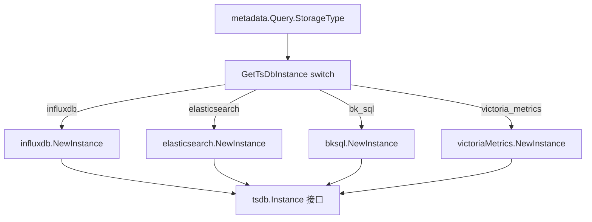

[待审核]

# 存储引擎集成

<cite>
- [tsdb/interfaces.go](file://bkmonitor-datalink/pkg/unify-query/tsdb/interfaces.go#L24-L42)
- [tsdb/interfaces.go](file://bkmonitor-datalink/pkg/unify-query/tsdb/interfaces.go#L46-L103)
- [metadata/tsdb.go](file://bkmonitor-datalink/pkg/unify-query/metadata/tsdb.go#L12-L21)
- [tsdb/prometheus/tsdb_instance.go](file://bkmonitor-datalink/pkg/unify-query/tsdb/prometheus/tsdb_instance.go#L32-L153)
- [tsdb/struct.go](file://bkmonitor-datalink/pkg/unify-query/tsdb/struct.go#L16-L38)
- [tsdb/storage.go](file://bkmonitor-datalink/pkg/unify-query/tsdb/storage.go#L26-L142)
- [service/tsdb/service.go](file://bkmonitor-datalink/pkg/unify-query/service/tsdb/service.go#L108-L147)
</cite>

## 目录
- [概述](#概述)
- [统一存储接口 tsdb.Instance](#统一存储接口-tsdbinstance)
- [driver 工厂 GetTsDbInstance](#driver-工厂-gettsdbinstance)
- [存储配置表与热加载](#存储配置表与热加载)
- [已接入的后端](#已接入的后端)
- [InfluxDB 集成](#influxdb-集成)
- [如何新增一种存储后端](#如何新增一种存储后端)

## 概述

unify-query 以"统一入口 + 引擎归一 + 可插拔存储"为设计主线，存储抽象由 `tsdb` 包承担。所有后端都实现统一的 `tsdb.Instance` 接口；查询编排层通过 `GetTsDbInstance` 工厂按 `StorageType` 分发，**对具体后端零耦合**。新增存储引擎只需实现接口并补充工厂分支，不影响上层查询逻辑（参见 [架构.md](架构.md) 与 [模块详解.md](模块详解.md)）。

章节来源
- [tsdb/interfaces.go](file://bkmonitor-datalink/pkg/unify-query/tsdb/interfaces.go#L24-L42)
- [tsdb/prometheus/tsdb_instance.go](file://bkmonitor-datalink/pkg/unify-query/tsdb/prometheus/tsdb_instance.go#L32-L153)

## 统一存储接口 tsdb.Instance

`tsdb.Instance`（`tsdb/interfaces.go#L24-L42`）是所有后端必须实现的核心接口，涵盖字段映射、原始数据、序列集、Label、示例、直接 PromQL 查询等能力：

```go
type Instance interface {
    QueryFieldMap(ctx, query, start, end) (FieldsMap, error)
    QueryRawData(ctx, query, start, end, dataCh) (int64, int64, *ResultTableOption, error)
    QuerySeriesSet(ctx, query, start, end) storage.SeriesSet
    QueryExemplar(ctx, fields, query, start, end, matchers...) (*decoder.Response, error)
    QueryLabelNames(ctx, query, start, end) ([]string, error)
    QueryLabelValues(ctx, query, name, start, end) ([]string, error)
    QuerySeries(ctx, query, start, end) ([]map[string]string, error)
    Check(ctx, promql, start, end, step) string
    DirectQueryRange(ctx, promql, start, end, step) (promql.Matrix, bool, error)
    DirectQuery(ctx, qs, end) (promql.Vector, error)
    DirectLabelNames(ctx, start, end, matchers...) ([]string, error)
    DirectLabelValues(ctx, name, start, end, limit, matchers...) ([]string, error)
    GetRequestBody(ctx) (any, error)
    InstanceType() string
}
```

`tsdb.DefaultInstance`（`tsdb/interfaces.go#L46-L103`）提供空实现，**新后端可内嵌它以最小化必须实现的方法**——VM、Prometheus、InfluxDB、BkSql、Redis 等均采用此模式（如 `tsdb/influxdb/struct.go#L26`、`tsdb/victoriaMetrics/instance.go#L69`、`tsdb/prometheus/instance.go#L32`）。

章节来源
- [tsdb/interfaces.go](file://bkmonitor-datalink/pkg/unify-query/tsdb/interfaces.go#L24-L42)
- [tsdb/interfaces.go](file://bkmonitor-datalink/pkg/unify-query/tsdb/interfaces.go#L46-L103)
- [tsdb/influxdb/struct.go](file://bkmonitor-datalink/pkg/unify-query/tsdb/influxdb/struct.go#L26)

## driver 工厂 GetTsDbInstance

unify-query **没有显式注册表**，而是用存储类型常量 + 工厂 `switch` 分发：

- 类型常量定义于 `metadata/tsdb.go#L12-L21`：`bk_sql` / `victoria_metrics` / `influxdb` / `prometheus` / `offline_data_archive` / `redis` / `elasticsearch` / `doris`。
- 工厂 `GetTsDbInstance(ctx, *metadata.Query) tsdb.Instance`（`tsdb/prometheus/tsdb_instance.go#L32-L153`）在 `tsdb_instance.go#L58` 按 `switch qry.StorageType` 构造对应 `Instance`：`influxdb.NewInstance`、`elasticsearch.NewInstance`、`bksql.NewInstance`、`victoriaMetrics.NewInstance`，`default` 返回错误。
- 调用点（共 7 处）：`tsdb/prometheus/querier.go#L93`、`tsdb/prometheus/instance.go#L193`、`cmdb/v1beta1/v1beta1.go#L549`、`service/http/query.go`、`service/http/check_handler.go`、`service/http/api.go` 等。



图表来源
- [tsdb/prometheus/tsdb_instance.go](file://bkmonitor-datalink/pkg/unify-query/tsdb/prometheus/tsdb_instance.go#L32-L153)

章节来源
- [metadata/tsdb.go](file://bkmonitor-datalink/pkg/unify-query/metadata/tsdb.go#L12-L21)
- [tsdb/prometheus/tsdb_instance.go](file://bkmonitor-datalink/pkg/unify-query/tsdb/prometheus/tsdb_instance.go#L32-L153)
- [tsdb/prometheus/tsdb_instance.go](file://bkmonitor-datalink/pkg/unify-query/tsdb/prometheus/tsdb_instance.go#L58)

## 存储配置表与热加载

运行期存储实例由内存中的 `tsdb.Storage` 表维护：

- `Storage` 结构体（`tsdb/struct.go#L16-L38`）含 Type/Address/Username/Password/超时/限流及后端专用选项，末尾持有 `Instance Instance` 字段。
- 全局 `storageMap map[string]*Storage` 与 `storageLock`（`tsdb/storage.go#L26-L30`）。
- `ReloadTsDBStorage`（`tsdb/storage.go#L40-L107`）遍历 consul 下发的 `map[string]*consul.Storage`，按 `Storage.Type` 补充 ES/InfluxDB 专用参数，按 StorageID 升序写入 `storageMap`，并用 hash 短路去重（`StorageMapHash` `storage.go#L33-L37`）。
- `GetStorage`/`SetStorage`（`tsdb/storage.go#L120-L142`）。
- 触发点：`service/tsdb/service.go#L108-L147` 的 `reloadStorage()` 监听变更后调用 `consul.GetTsDBStorageInfo()` → `inner.ReloadTsDBStorage(...)`。

章节来源
- [tsdb/struct.go](file://bkmonitor-datalink/pkg/unify-query/tsdb/struct.go#L16-L38)
- [tsdb/storage.go](file://bkmonitor-datalink/pkg/unify-query/tsdb/storage.go#L26-L142)
- [service/tsdb/service.go](file://bkmonitor-datalink/pkg/unify-query/service/tsdb/service.go#L108-L147)

## 已接入的后端

| 类型常量 | 目录 | 说明 |
|----------|------|------|
| `influxdb` | `tsdb/influxdb/` | InfluxDB v1/v2 集成 |
| `elasticsearch` | `tsdb/elasticsearch/` | ES 时序查询（含分段） |
| `bk_sql` | `tsdb/bksql/` | BkSql 查询 |
| `victoria_metrics` | `tsdb/victoriaMetrics/` | VM 集成 |
| `prometheus` | `tsdb/prometheus/` | Prometheus 原生引擎包装 |
| `redis` | `tsdb/redis/` | Redis 后端 |
| `doris` | `tsdb/doris/` | Doris 后端 |
| `offline_data_archive` | — | 离线数据归档 |

章节来源
- [metadata/tsdb.go](file://bkmonitor-datalink/pkg/unify-query/metadata/tsdb.go#L12-L21)
- [tsdb/prometheus/tsdb_instance.go](file://bkmonitor-datalink/pkg/unify-query/tsdb/prometheus/tsdb_instance.go#L32-L153)

## InfluxDB 集成

InfluxDB 是核心后端之一，连接管理与查询翻译如下：

- `tsdb/influxdb/struct.go#L26` 的 `Instance` 内嵌 `tsdb.DefaultInstance`，实现统一接口；
- 工厂在 `tsdb/prometheus/tsdb_instance.go#L59-L95` 通过 `baseInfluxdb.GetInfluxDBRouter().GetInfluxDBHost(...)` 取得 host/port/协议/账号后构造 `influxdb.NewInstance`；
- 连接管理、InfluxQL/Flux 查询翻译与写入位于 `influxdb/`（顶层 SDK 包）与 `tsdb/influxdb/`；PromQL/结构体经 translator 翻译为 InfluxDB 查询语言后下发；
- 路由信息 `ReloadTableInfos` 由 consul 的 `dataID→tableID` 映射喂入（详见 [元数据与缓存.md](元数据与缓存.md)）。

章节来源
- [tsdb/influxdb/struct.go](file://bkmonitor-datalink/pkg/unify-query/tsdb/influxdb/struct.go#L26)
- [tsdb/prometheus/tsdb_instance.go](file://bkmonitor-datalink/pkg/unify-query/tsdb/prometheus/tsdb_instance.go#L59-L95)

## 如何新增一种存储后端

基于现有代码，接入新存储引擎需 4 步：

1. **实现接口**：新建 `tsdb/<your_backend>/`，定义 `Instance` 内嵌 `tsdb.DefaultInstance`，实现 `QueryRawData`/`QuerySeriesSet`/`DirectQueryRange` 等方法；如后端支持 PromQL 计算，注入 `promql.Engine`。
2. **登记类型常量**：在 `metadata/tsdb.go#L12-L21` 增加 `YourStorageType = "your_type"`。
3. **补充工厂分支**：在 `tsdb/prometheus/tsdb_instance.go#L58` 的 `switch qry.StorageType` 增加 `case YourStorageType: return yourbackend.NewInstance(...)`。
4. **登记 consul**：在 consul 的 `typeList` 中登记新类型，并在 `bkmonitorv3/unify-query/data/storage/<id>` 下发该后端的连接配置（由 `ReloadTsDBStorage` 热加载）。

完成上述步骤后，上层查询编排（`queryReferenceWithPromEngine`、PromQL 解析等）对新后端完全无感，无需改动。

章节来源
- [tsdb/interfaces.go](file://bkmonitor-datalink/pkg/unify-query/tsdb/interfaces.go#L24-L42)
- [metadata/tsdb.go](file://bkmonitor-datalink/pkg/unify-query/metadata/tsdb.go#L12-L21)
- [tsdb/prometheus/tsdb_instance.go](file://bkmonitor-datalink/pkg/unify-query/tsdb/prometheus/tsdb_instance.go#L58)
- [tsdb/storage.go](file://bkmonitor-datalink/pkg/unify-query/tsdb/storage.go#L40-L107)
