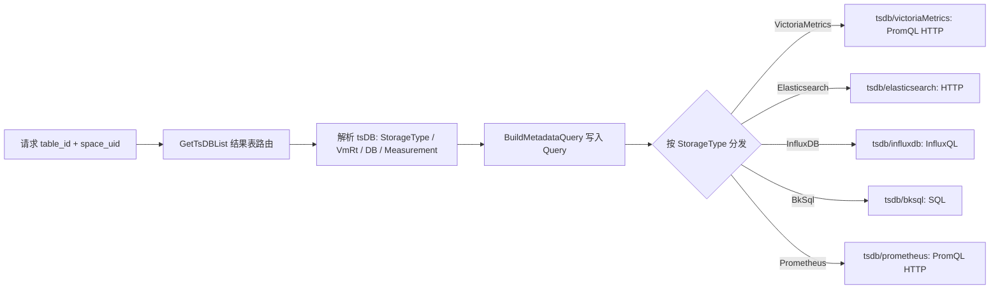

[待审核]

# 数据源与存储映射（DataSource → 目标存储）

<cite>
- [query/structured/route.go](file://bkmonitor-datalink/pkg/unify-query/query/structured/route.go#L20-L39) — DataSource 常量与合法值
- [query/structured/query_ts.go](file://bkmonitor-datalink/pkg/unify-query/query/structured/query_ts.go#L1170-L1195) — 路由解析：StorageType / VmRt 赋值
- [query/structured/route.go](file://bkmonitor-datalink/pkg/unify-query/query/structured/route.go#L142-L167) — RealMetricName 二段式（dataSource 作为命名前缀）
- [metadata/struct.go](file://bkmonitor-datalink/pkg/unify-query/metadata/struct.go#L156-L158) — VmRt / CmdbLevelVmRt（vm 的 rt）
- [tsdb/storage.go](file://bkmonitor-datalink/pkg/unify-query/tsdb/storage.go#L48-L74) — Storage.Type 分发（ES / InfluxDB）
- [tsdb/prometheus/tsdb_instance.go](file://bkmonitor-datalink/pkg/unify-query/tsdb/prometheus/tsdb_instance.go#L59-L134) — StorageType 到驱动分发
- [tsdb/victoriaMetrics/instance.go](file://bkmonitor-datalink/pkg/unify-query/tsdb/victoriaMetrics/instance.go#L736) — VmRt 作为 ResultTableList 查询 VM
</cite>

## 目录
- [两个维度：DataSource 与 StorageType](#两个维度datasource-与-storagetype)
- [DataSource 取值](#datasource-取值)
- [StorageType 与目标存储 / 驱动](#storagetype-与目标存储--驱动)
- [映射机制：从 table_id 到真实后端](#映射机制从-table_id-到真实后端)
- [各 DataSource 典型目标存储](#各-datasource-典型目标存储)
- [关键结论](#关键结论)

## 两个维度：DataSource 与 StorageType

unify-query 中"去哪查"由**两个独立维度**描述：

- **DataSource（业务分类）**：描述数据的业务来源，如监控自带指标 / 数据平台 / 日志 / APM / 自定义。它决定路由前缀与命名，但**不直接绑定**存储引擎。
- **StorageType（真实存储引擎）**：描述数据最终落在哪种存储，由**结果表路由详情**决定，框架据此分发到对应 tsdb 驱动。

二者关系：`DataSource` 是"业务归类 + 命名前缀"，`StorageType` 才是"真正的存储引擎"；同一 `DataSource` 下不同结果表（RT）可能落在不同 `StorageType`。

章节来源
- [query/structured/route.go](file://bkmonitor-datalink/pkg/unify-query/query/structured/route.go#L142-L167)
- [query/structured/query_ts.go](file://bkmonitor-datalink/pkg/unify-query/query/structured/query_ts.go#L1170-L1171)

## DataSource 取值

合法值由 `route.go` 常量与 `dataSourceMap` 定义（`route.go#L20-L39`）：

| DataSource | 含义 |
|------------|------|
| `bkmonitor`（默认） | 监控平台自带指标 |
| `bkdata` | 数据平台 / 计算平台 |
| `bklog` | 日志平台 |
| `bkapm` | APM |
| `custom` | 自定义数据源 |
| `bk_monitor`（别名） | `bkmonitor` 的别名 |

> SaaS 层命名兼容：`bk_data` / `bk_log_search` / `bk_apm` 会在解析时归一化为内部的 `bkdata` / `bklog` / `bkapm`（`query_ts.go#L176`）。当 `DataSource` 为空时默认补全为 `bkmonitor`（`query_ts.go#L734-L735`）。

章节来源
- [query/structured/route.go](file://bkmonitor-datalink/pkg/unify-query/query/structured/route.go#L20-L39)
- [query/structured/query_ts.go](file://bkmonitor-datalink/pkg/unify-query/query/structured/query_ts.go#L176)
- [query/structured/query_ts.go](file://bkmonitor-datalink/pkg/unify-query/query/structured/query_ts.go#L734-L735)

## StorageType 与目标存储 / 驱动

真正查询时，由 `StorageType` 分发到对应 tsdb 驱动（`tsdb/prometheus/tsdb_instance.go#L59-L134`、`tsdb/storage.go#L56-L74`）：

| StorageType | 真实后端 | tsdb 驱动 | 查询协议 |
|-------------|----------|-----------|----------|
| `ElasticsearchStorageType` | Elasticsearch 检索引擎 | `tsdb/elasticsearch` | ES 客户端（HTTP） |
| `InfluxDBStorageType` | InfluxDB 时序库 | `tsdb/influxdb` | HTTP（InfluxQL） |
| `VictoriaMetricsStorageType` | VictoriaMetrics 时序库 | `tsdb/victoriaMetrics` | PromQL HTTP |
| `PrometheusStorageType` | Prometheus | `tsdb/prometheus` | PromQL HTTP |
| `BkSqlStorageType` | 数据平台 SQL 引擎（底层 ClickHouse / Doris / SparkSQL 等） | `tsdb/bksql` | SQL 网关 |

章节来源
- [tsdb/storage.go](file://bkmonitor-datalink/pkg/unify-query/tsdb/storage.go#L48-L74)
- [tsdb/prometheus/tsdb_instance.go](file://bkmonitor-datalink/pkg/unify-query/tsdb/prometheus/tsdb_instance.go#L59-L134)

## 映射机制：从 table_id 到真实后端

`Query.ToQueryMetric` 在路由解析阶段，把请求里的 `table_id` + `space_uid` 交给结果表路由（consul 注册的存储集群），解析出 `tsDB`，再写入 `Query` 的定位字段（`query_ts.go#L1170-L1195`）：

图表来源
- [query/structured/query_ts.go](file://bkmonitor-datalink/pkg/unify-query/query/structured/query_ts.go#L1170-L1195)
- [tsdb/victoriaMetrics/instance.go](file://bkmonitor-datalink/pkg/unify-query/tsdb/victoriaMetrics/instance.go#L736)

关键赋值（`query_ts.go#L1170-L1195`）：
- `query.StorageType = tsDB.StorageType` —— 决定走哪个驱动；
- `query.VmRt = tsDB.VmRt`、`query.CmdbLevelVmRt = tsDB.CmdbLevelVmRt` —— VM 结果表标识（`struct.go#L156-L158` 注释"vm 的 rt"）；
- `query.VmCondition = allCondition.VMString(query.VmRt, ...)` —— VM 专属查询条件。

VM 查询时以 `query.VmRt` 作为 `ResultTableList` 向 VM 集群发起 PromQL 查询（`victoriaMetrics/instance.go#L736`）。

此外，`DataSource` 会作为对外指标名的前缀参与二段式命名 `{dataSource}:{db}:{measurement}:{metricName}`（`route.go#L142-L167`），进一步印证它属于"命名/分类"层而非"存储"层。

章节来源
- [query/structured/route.go](file://bkmonitor-datalink/pkg/unify-query/query/structured/route.go#L142-L167)
- [query/structured/query_ts.go](file://bkmonitor-datalink/pkg/unify-query/query/structured/query_ts.go#L1170-L1195)
- [metadata/struct.go](file://bkmonitor-datalink/pkg/unify-query/metadata/struct.go#L156-L158)

## 各 DataSource 典型目标存储

下表为"典型默认"映射；**实际落点以结果表路由详情的 `StorageType` 为准**。

| DataSource | 含义 | 典型 StorageType | 真实后端 | 说明 |
|------------|------|------------------|----------|------|
| `bkmonitor`（默认） | 监控平台自带指标 | `VictoriaMetricsStorageType`（部分 RT 在 `InfluxDBStorageType`） | VictoriaMetrics / InfluxDB | 托管指标带 `VmRt`，故默认走 VM |
| `bkdata` | 数据平台 / 计算平台 | `BkSqlStorageType` | 数据平台 SQL 引擎 | 走 SQL 网关，底层 ClickHouse / Doris 等 |
| `bklog` | 日志平台 | `ElasticsearchStorageType` | Elasticsearch | 日志检索；解析时 `isSkipField=true`（`query_ts.go#L842`） |
| `bkapm` | APM | `ElasticsearchStorageType`（部分 VM） | Elasticsearch / VictoriaMetrics | 链路/日志类检索；解析时 `isSkipField=true`（`query_ts.go#L842`） |
| `custom` | 自定义 | 取决于自定义 RT 注册 | 上述任意一类 | 指向用户/外部注册的自定义结果表 |

> 说明：`bklog` / `bkapm` 在 `query_ts.go#L842` 仅设置 `isSkipField`（跳过字段匹配）以适配日志/AP 场景，其真实引擎仍由结果表路由的 `StorageType` 决定，并非硬编码为 ES。

章节来源
- [query/structured/query_ts.go](file://bkmonitor-datalink/pkg/unify-query/query/structured/query_ts.go#L739)
- [query/structured/query_ts.go](file://bkmonitor-datalink/pkg/unify-query/query/structured/query_ts.go#L842)
- [query/structured/query_ts.go](file://bkmonitor-datalink/pkg/unify-query/query/structured/query_ts.go#L1186-L1195)

## 关键结论

1. **DataSource 不等于存储**：它是业务分类与指标命名前缀（`{dataSource}:{db}:{measurement}:{metricName}`）。
2. **StorageType 才是最终落点**：由结果表路由详情决定，框架按此分发到 `tsdb/*` 驱动。
3. **bkmonitor 自带指标典型落 VM**：因其结果表带 `VmRt`，经 `tsdb/victoriaMetrics` 以 PromQL HTTP 查询。
4. **同一 DataSource 可跨存储**：如 bkmonitor 既有 VM 也有 InfluxDB 的 RT，bklog/bkapm 也可能混合 ES 与 VM。

章节来源
- [query/structured/route.go](file://bkmonitor-datalink/pkg/unify-query/query/structured/route.go#L142-L167)
- [query/structured/query_ts.go](file://bkmonitor-datalink/pkg/unify-query/query/structured/query_ts.go#L1170-L1195)
