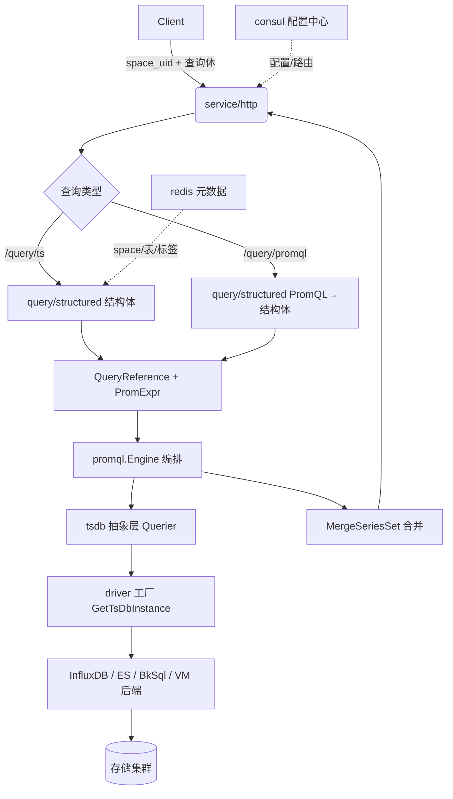

<!-- [待审核] AI 自动生成，请人工确认后移除此标记 -->
# unify-query 系统架构与设计理念

<cite>
**本文引用的文件**
- [main.go](file://bkmonitor-datalink/pkg/unify-query/main.go#L26-L28)
- [cmd/root.go](file://bkmonitor-datalink/pkg/unify-query/cmd/root.go#L36-L108)
- [config/hook.go](file://bkmonitor-datalink/pkg/unify-query/config/hook.go#L24-L56)
- [service/http/service.go](file://bkmonitor-datalink/pkg/unify-query/service/http/service.go#L31-L123)
- [define/service.go](file://bkmonitor-datalink/pkg/unify-query/define/service.go#L16-L22)
- [consul/consul.go](file://bkmonitor-datalink/pkg/unify-query/consul/consul.go#L19-L108)
</cite>

## 目录
1. [简介](#简介)
2. [项目结构](#项目结构)
3. [核心组件](#核心组件)
4. [架构总览](#架构总览)
5. [启动流程](#启动流程)
6. [请求生命周期](#请求生命周期)
7. [关键设计](#关键设计)
8. [依赖关系分析](#依赖关系分析)
9. [结论](#结论)

## 简介

unify-query（bk-unify-query）是蓝鲸监控（BlueKing Monitor）的**统一查询模块**，为可观测数据提供统一的查询入口。它屏蔽底层多种时序存储引擎的差异，对外以**结构体查询**（`/query/ts`）与 **PromQL 查询**（`/query/promql`）两种形态暴露能力，内部将两者归一为统一的 PromQL 执行引擎，从而支持 InfluxDB、Elasticsearch、BkSql、VictoriaMetrics 等多种后端。

设计核心目标：
- **统一入口**：上层无需关心后端存储类型，统一以 `space_uid` 标识租户、以 `metadata.Query` 表达查询意图。
- **引擎归一**：PromQL 与结构体查询最终都编译为 PromQL AST，交由内置 Prometheus 引擎编排、并发下发与结果合并。
- **可插拔存储**：存储后端通过 `tsdb.Instance` 接口与 driver 工厂接入，新增引擎无需改动查询编排层。

章节来源
- [main.go](file://bkmonitor-datalink/pkg/unify-query/main.go#L19-L28)

## 项目结构

unify-query 以 Go 编写，按职责分层。顶层与关键子目录如下：

```
pkg/unify-query/
├── main.go                 # 进程入口，仅调用 cmd.Execute()
├── cmd/                    # cobra 命令与启动编排（rootCmd / run）
├── config/                 # viper 配置加载 + 事件钩子
├── define/                 # 全局接口/类型（Service、错误等）
├── service/                # 业务服务层（http/influxdb/tsdb/promql/redis/...）
│   └── http/               # HTTP 服务、路由注册、所有 handler
├── query/                  # 查询语义层（structured 结构体 / promql）
├── internal/               # 内部能力（promql_parser / doris_parser / function / ...）
├── tsdb/                   # 时序存储抽象与 driver 工厂
│   └── influxdb/ elasticsearch/ bksql/ victoria_metrics/ prometheus/ redis/
├── influxdb/               # InfluxDB 后端 SDK（连接/路由/解码）
├── metadata/               # 空间/result_table/storage 元数据模型
├── redis/                  # redis 客户端
├── consul/                 # 配置中心与服务发现
├── cmdb/                   # CMDB 拓扑/关系查询集成
├── downsample/             # LTTB 降采样
├── segmented/              # 区间分片容器
└── ...（eventbus / trace / kvstore / memcache / featureFlag / log）
```

章节来源
- [service/http/service.go](file://bkmonitor-datalink/pkg/unify-query/service/http/service.go#L31-L123)
- [query/structured/query_ts.go](file://bkmonitor-datalink/pkg/unify-query/query/structured/query_ts.go#L138-L253)
- [tsdb/interfaces.go](file://bkmonitor-datalink/pkg/unify-query/tsdb/interfaces.go#L24-L42)

## 核心组件

系统由一组以 `define.Service` 接口统一约束的"服务组件"构成，在启动期被 `Reload` 注入运行：

| 组件 | 职责 | 关键文件 |
|------|------|----------|
| `cmd` | 命令入口与启动编排，构造 `serviceList` 并逐个 `Reload` | [cmd/root.go](file://bkmonitor-datalink/pkg/unify-query/cmd/root.go#L56-L65) |
| `config` | viper 加载 yaml + env，发布配置前后事件 | [config/hook.go](file://bkmonitor-datalink/pkg/unify-query/config/hook.go#L24-L56) |
| `service/http` | 唯一对外 HTTP 端口（默认 10205），承载全部 API | [service/http/service.go](file://bkmonitor-datalink/pkg/unify-query/service/http/service.go#L95-L100) |
| `service/influxdb` | 元数据后台加载/缓存（storage/table/router） | [service/influxdb/service.go](file://bkmonitor-datalink/pkg/unify-query/service/influxdb/service.go) |
| `service/tsdb` / `promql` | 查询引擎封装 | [service/tsdb/service.go](file://bkmonitor-datalink/pkg/unify-query/service/tsdb/service.go) |
| `consul` | 配置中心 + 服务发现 | [consul/consul.go](file://bkmonitor-datalink/pkg/unify-query/consul/consul.go#L42-L59) |
| `redis` | 元数据 Redis 客户端 | [service/redis/redis.go](file://bkmonitor-datalink/pkg/unify-query/service/redis/redis.go) |
| `featureFlag` | 特性开关 | [service/featureFlag/featureFlag.go](file://bkmonitor-datalink/pkg/unify-query/service/featureFlag/featureFlag.go#L85-L121) |
| `trace` | OpenTelemetry 链路追踪 | [trace/trace.go](file://bkmonitor-datalink/pkg/unify-query/trace/trace.go#L23-L66) |

章节来源
- [define/service.go](file://bkmonitor-datalink/pkg/unify-query/define/service.go#L16-L22)
- [service/http/service.go](file://bkmonitor-datalink/pkg/unify-query/service/http/service.go#L52-L123)

## 架构总览

unify-query 采用"入口 → 服务层 → 查询语义层 → 存储抽象层 → 存储后端"的纵向分层，横向以 `consul` 配置中心与 `redis` 元数据存储贯穿。



图表来源
- [service/http/service.go](file://bkmonitor-datalink/pkg/unify-query/service/http/service.go#L86-L89)
- [service/http/query.go](file://bkmonitor-datalink/pkg/unify-query/service/http/query.go#L900-L993)
- [tsdb/prometheus/querier.go](file://bkmonitor-datalink/pkg/unify-query/tsdb/prometheus/querier.go#L92-L110)

章节来源
- [service/http/service.go](file://bkmonitor-datalink/pkg/unify-query/service/http/service.go#L86-L89)
- [service/http/query.go](file://bkmonitor-datalink/pkg/unify-query/service/http/query.go#L900-L993)
- [tsdb/prometheus/querier.go](file://bkmonitor-datalink/pkg/unify-query/tsdb/prometheus/querier.go#L92-L110)

## 启动流程

1. `main()` 仅引入两个 import 副作用（`influxdb1-client`、`automaxprocs`），随后调用 `cmd.Execute()`。
2. `cmd.Execute()` 执行 cobra 的 `rootCmd`（默认子命令即 `run`，即启动服务）。
3. `rootCmd.Run` 中依次：`config.InitConfig()` 加载配置 → `metadata.InitHashID(ctx)` 注入用户 hash → 启动 `agent.Listen`（gops）。
4. 构造 `serviceList`（各 `define.Service` 实现），逐个调用 `Reload()` 完成初始化与路由注册。
5. `signal.Notify` 监听 `SIGUSR1`（热重载配置）与 `SIGTERM/SIGINT`（优雅退出）。

章节来源
- [main.go](file://bkmonitor-datalink/pkg/unify-query/main.go#L26-L28)
- [cmd/root.go](file://bkmonitor-datalink/pkg/unify-query/cmd/root.go#L40-L99)
- [config/hook.go](file://bkmonitor-datalink/pkg/unify-query/config/hook.go#L24-L56)

## 请求生命周期

以结构体查询 `/query/ts` 为例：

1. HTTP 中间件链：`Recovery → otel → MetaData（解析 space_uid 等上下文）→ JwtAuth（鉴权）`。
2. `HandlerQueryTs` 解析 `structured.QueryTs`，用 header 的 `space_uid` 覆盖，校验后调用 `queryTsWithPromEngine`。
3. `queryTs.ToQueryReference` 生成 `metadata.QueryReference`（每个 reference 对应的存储路由集合）；`queryTs.ToPromExpr` 生成最终 PromQL AST。
4. 构造 `prometheus.Instance` 与 `QueryRangeStorage`，交由 `promql.Engine` 执行 `DirectQueryRange`。
5. 引擎经 `Querier.Select` 按指标名取 `Query`，经 `GetTsDbInstance` 构造后端实例，并发 `QuerySeriesSet`，再 `MergeSeriesSet` 合并。
6. 结果装回 `promql.Tables` 并经 `resp.Fill(tables)` 输出 JSON。

章节来源
- [service/http/handler.go](file://bkmonitor-datalink/pkg/unify-query/service/http/handler.go#L417-L481)
- [service/http/query.go](file://bkmonitor-datalink/pkg/unify-query/service/http/query.go#L900-L935)
- [tsdb/prometheus/querier.go](file://bkmonitor-datalink/pkg/unify-query/tsdb/prometheus/querier.go#L116-L265)

## 关键设计

- **依赖注入式服务列表**：所有后台能力（http/influxdb/tsdb/promql/redis/consul/featureFlag/trace）统一实现 `define.Service`（`Type/Start/Close/Reload/Wait`），由 `cmd` 统一编排生命周期，新增能力只需追加到 `serviceList`。
- **中间件链**：HTTP 服务构造 gin 引擎时固定注入 `Recovery → otel → MetaData → JwtAuth`，保证每个请求都带有租户上下文与鉴权。
- **配置中心驱动**：配置经 viper 从 yaml + 环境变量（`unify-query` 前缀）加载，并通过 `eventbus` 在解析前后发布 `EventSignalConfigPreParse`/`EventSignalConfigPostParse`，各模块据此设置默认值并热加载；存储/路由配置来自 consul KV。
- **引擎归一**：结构体与 PromQL 两条链路在 `query/structured` 层汇合，统一编译为 PromQL AST 后由同一引擎执行，避免两套执行逻辑。

章节来源
- [define/service.go](file://bkmonitor-datalink/pkg/unify-query/define/service.go#L16-L22)
- [cmd/root.go](file://bkmonitor-datalink/pkg/unify-query/cmd/root.go#L56-L65)
- [service/http/service.go](file://bkmonitor-datalink/pkg/unify-query/service/http/service.go#L77-L84)
- [config/hook.go](file://bkmonitor-datalink/pkg/unify-query/config/hook.go#L24-L56)
- [consul/consul.go](file://bkmonitor-datalink/pkg/unify-query/consul/consul.go#L42-L59)
- [service/http/query.go](file://bkmonitor-datalink/pkg/unify-query/service/http/query.go#L1017-L1129)

## 依赖关系分析

- **上层依赖底层**：`service/http` 依赖 `query/structured` 做语义解析；`query/structured` 依赖 `metadata` 做空间/表路由；存储抽象 `tsdb` 依赖具体后端包（`influxdb`/`elasticsearch`/`bksql`/`victoria_metrics`）。
- **横向基础设施**：`consul`（配置/服务发现）、`redis` + `kvstore` + `memcache`（元数据存储与缓存）、`eventbus` + `trace`（运行期支撑）被多个层级共享。
- **解耦点**：查询编排层（engine/querier）只依赖 `tsdb.Instance` 接口与 `GetTsDbInstance` 工厂，与具体后端完全解耦；新增存储引擎只需实现接口并在工厂 `switch` 增加分支。

章节来源
- [tsdb/interfaces.go](file://bkmonitor-datalink/pkg/unify-query/tsdb/interfaces.go#L24-L42)
- [tsdb/prometheus/tsdb_instance.go](file://bkmonitor-datalink/pkg/unify-query/tsdb/prometheus/tsdb_instance.go#L32-L153)

## 结论

unify-query 以"统一入口 + 引擎归一 + 可插拔存储"为设计主线：纵向分层清晰（http 服务 → 查询语义 → 存储抽象 → 后端），横向以 consul/redis 等基础设施贯穿。其最关键的可扩展性来自 `tsdb.Instance` 接口与 `GetTsDbInstance` driver 工厂——查询编排层对后端零耦合，使新存储引擎的接入只落在接口实现与工厂分支两处。后续页面将展开各层细节：核心模块（`模块详解.md`）、查询执行链路（`查询执行.md`）、存储集成（`存储引擎集成.md`）、元数据与缓存（`元数据与缓存.md`）、API（`API接口说明.md`）与关系查询（`关系查询.md`）。

章节来源
- 本节为结论性内容，综合前述各章来源
