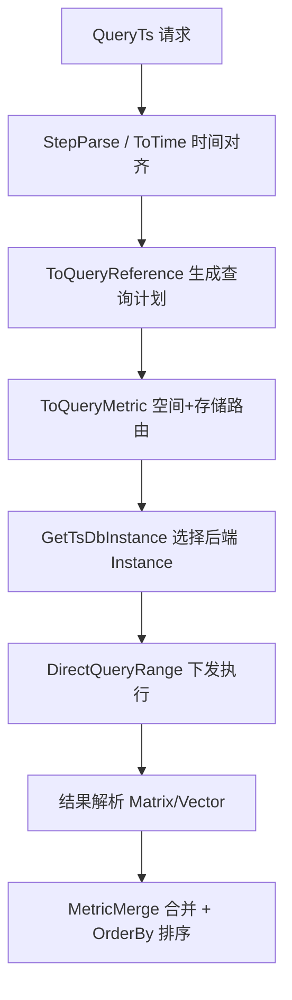

[待审核]

# 查询执行链路

<cite>
- [query/structured/query_ts.go](file://bkmonitor-datalink/pkg/unify-query/query/structured/query_ts.go#L42-L112)
- [query/structured/query_ts.go](file://bkmonitor-datalink/pkg/unify-query/query/structured/query_ts.go#L690-L1020)
- [service/http/query.go](file://bkmonitor-datalink/pkg/unify-query/service/http/query.go#L641-L793)
- [query/structured/query_promql.go](file://bkmonitor-datalink/pkg/unify-query/query/structured/query_promql.go#L149-L215)
- [query/structured/query_ts.go](file://bkmonitor-datalink/pkg/unify-query/query/structured/query_ts.go#L623-L687)
- [downsample/downsample.go](file://bkmonitor-datalink/pkg/unify-query/downsample/downsample.go#L24-L40)
- [segmented/segmented.go](file://bkmonitor-datalink/pkg/unify-query/segmented/segmented.go#L71-L110)
</cite>

## 目录
- [概述](#概述)
- [结构体查询执行链路](#结构体查询执行链路)
- [PromQL 查询执行链路](#promql-查询执行链路)
- [存储路由与切片](#存储路由与切片)
- [时间聚合与降采样下推](#时间聚合与降采样下推)
- [分段查询](#分段查询)
- [结果合并与对齐](#结果合并与对齐)

## 概述

unify-query 提供两种查询入口：**结构体查询**（`/query/ts`，面向前端结构化参数）与 **PromQL 查询**（`/query/promql`，面向表达式）。两者最终都被规约为统一的 `QueryTs` 模型，交给以 Prometheus `promql.Engine` 为核心的执行引擎完成「规划 → 路由 → 下发 → 合并」。

两种入口的差异仅在于"表达式从何而来"：结构体查询的 `MetricMerge` 由后端拼装；PromQL 查询的 `MetricMerge` 由解析器把 PromQL 文本切分为多个 `VectorSelector` 分组后回填生成。执行阶段两者完全共用同一条链路。

章节来源
- [service/http/query.go](file://bkmonitor-datalink/pkg/unify-query/service/http/query.go#L641-L793)
- [query/structured/query_ts.go](file://bkmonitor-datalink/pkg/unify-query/query/structured/query_ts.go#L42-L112)

## 结构体查询执行链路

请求 `QueryTs`（`query/structured/query_ts.go#L42-L112`）携带 `QueryList`、`MetricMerge`、`Step`、`DownSampleRange`、`SpaceUid` 等字段。执行流程如下：

1. **解析与时间对齐**：`StepParse`（`query_ts.go#L114-L128`）解析步长；`ToTime`（`query_ts.go#L138-L165`）按时区对齐 `start`，当 `Reference=false` 时按 `TimeOffset` 以 `step` 对齐。
2. **生成查询计划**：`ToQueryReference`（`query_ts.go#L167-L253`）逐条 `Query` 生成 `metadata.QueryMetric`，通过 `AddDimensions` 合并聚合维度，将 `ResultColumns` 透传为 `KeepColumns`，并最终 `metadata.SetQueryReference` 写入 ctx。
3. **按空间/存储路由**：`ToQueryMetric`（`query_ts.go#L690-L1020`）依据 `space_uid` 与时间段命中存储，详见「存储路由与切片」。
4. **结果合并**：编排层 `queryReferenceWithPromEngine`（`service/http/query.go#L641-L793`）构造 `prometheus.NewInstance` 后调用 `DirectQueryRange`，将结果解析为 `promql.Matrix/Vector` 并转成 `promql.Tables`，最后按 `OrderBy` 排序。

图表来源
- [query/structured/query_ts.go](file://bkmonitor-datalink/pkg/unify-query/query/structured/query_ts.go#L167-L253)
- [service/http/query.go](file://bkmonitor-datalink/pkg/unify-query/service/http/query.go#L641-L793)

章节来源
- [query/structured/query_ts.go](file://bkmonitor-datalink/pkg/unify-query/query/structured/query_ts.go#L42-L112)
- [query/structured/query_ts.go](file://bkmonitor-datalink/pkg/unify-query/query/structured/query_ts.go#L114-L128)
- [query/structured/query_ts.go](file://bkmonitor-datalink/pkg/unify-query/query/structured/query_ts.go#L138-L165)
- [query/structured/query_ts.go](file://bkmonitor-datalink/pkg/unify-query/query/structured/query_ts.go#L167-L253)
- [service/http/query.go](file://bkmonitor-datalink/pkg/unify-query/service/http/query.go#L717)

## PromQL 查询执行链路

`QueryPromQL`（`query/structured/query_promql.go#L27-L54`）把 PromQL 文本转为结构体查询：

1. **解析**：`NewQueryPromQLExpr` 将 `now()` 转毫秒时间戳；`QueryTs()` 调用 `parser.ParseExpr` 解析 AST（`query_promql.go#L217-L229`）。
2. **切分与回填**：`splitVecGroups`（`query_promql.go#L149-L215`）把 AST 切分为多个 `VectorSelector` 分组，逐组转成 `Query`。`MatrixSelector/Call` 中的 matrix 函数（如 `count_over_time`）写入 `TimeAggregation`，vector 函数写入 `AggregateMethodList`（`query_promql.go#L287-L371`）；`AggregateExpr`（sum/avg…）经 `convertMethod`（`query_promql.go#L542-L572`）映射为聚合方法名。最终用各组 `ID`（a/b/c…）替换原 metric 位置拼出 `MetricMerge`（`query_promql.go#L405-L424`）。

由此，PromQL 查询与结构体查询在 `MetricMerge` 这一层完全汇合，后续执行链路一致。详见 [PromQL支持与扩展.md](PromQL支持与扩展.md)。

章节来源
- [query/structured/query_promql.go](file://bkmonitor-datalink/pkg/unify-query/query/structured/query_promql.go#L27-L54)
- [query/structured/query_promql.go](file://bkmonitor-datalink/pkg/unify-query/query/structured/query_promql.go#L149-L215)
- [query/structured/query_promql.go](file://bkmonitor-datalink/pkg/unify-query/query/structured/query_promql.go#L217-L229)
- [query/structured/query_promql.go](file://bkmonitor-datalink/pkg/unify-query/query/structured/query_promql.go#L287-L398)

## 存储路由与切片

`ToQueryMetric`（`query/structured/query_ts.go#L690-L1020`）是路由核心：

- **bkdata 数据源**走专属路径，直接 `MakeRouteFromTableID` 生成 `metadata.Query` 并带权限校验 `isMatchBizID`（`query_ts.go#L739-L839`）。
- **其他数据源**通过 `GetTsDBList` 做空间路由匹配（`query_ts.go#L845-L860`），遍历 `tsDBs` 调用 `GetStorageIDRangesWithDirectionalOverlap` 做**按时间段命中的存储路由**（含方向性 overlap 处理），生成 `storageRange`（`query_ts.go#L871-L874`）。
- 命中多个 storage 时覆盖 `StorageType/StorageName/ClusterName/DB/Measurement` 并写入 `RouteStart/RouteEnd`（`query_ts.go#L876-L913`）。
- `VmRt` 非空时做 VM/InfluxDB 判定（`query_ts.go#L928-L950`）；同 storage 合并 DB（`GetMergeDBStatus`）按 `StorageUUID` 合并，解决 ES+Doris 混合场景（`query_ts.go#L984-L1015`）。

路由得到的目标存储 ID 最终交给 `GetTsDbInstance` 工厂构造对应的 `tsdb.Instance`（扩展点见 [存储引擎集成.md](存储引擎集成.md)）。

章节来源
- [query/structured/query_ts.go](file://bkmonitor-datalink/pkg/unify-query/query/structured/query_ts.go#L690-L1020)
- [query/structured/query_ts.go](file://bkmonitor-datalink/pkg/unify-query/query/structured/query_ts.go#L739-L839)
- [query/structured/query_ts.go](file://bkmonitor-datalink/pkg/unify-query/query/structured/query_ts.go#L845-L913)

## 时间聚合与降采样下推

`Query.Aggregates`（`query/structured/query_ts.go#L623-L687`）决定时间聚合如何执行：

- `TimeAggregation` + 第一层 `AggregateMethod` 组合命中 `domSampledFunc`（`query/structured/settings.go#L29`，如 `sum`+`sum_over_time`）时，将降采样计算**下推到存储引擎**并标记 `IsDomSampled=true`；当 `step < window` 时则不下推（`query_ts.go#L664-L667`）。
- 降采样触发由 `downsample.CheckDownSampleRange`（`downsample/downsample.go#L40`）按 `step` 与 `DownSampleRange` 判断，`downsample.Downsample`（`downsample/downsample.go#L24`）执行抽点（LTTB 算法见 `downsample/lttb.go`）。
- 时间对齐/重对齐逻辑在 `downsample/realignment.go`，保证跨段数据步长一致。

章节来源
- [query/structured/query_ts.go](file://bkmonitor-datalink/pkg/unify-query/query/structured/query_ts.go#L623-L687)
- [query/structured/settings.go](file://bkmonitor-datalink/pkg/unify-query/query/structured/settings.go#L29)
- [downsample/downsample.go](file://bkmonitor-datalink/pkg/unify-query/downsample/downsample.go#L24-L40)

## 分段查询

长周期（大时间跨度、大 step）查询会被切成多段**并行下发**再合并，由 `segmented.NewSegmented`（`segmented/segmented.go#L71`）构建分段集合，`Add/List/Count` 维护各段时间点；实际切分与合并在存储后端实现，如 `tsdb/elasticsearch/segmented.go#L28` 基于 `segmented.NewSegmented` 拆分时间区间。

分段能力由 featureFlag 控制：

- `http.segmented.enable`（`service/http/settings.go#L67`）
- `http.segmented.max_routines`（`service/http/settings.go#L68`）
- `http.segmented.min_interval`（`service/http/settings.go#L69`）

章节来源
- [segmented/segmented.go](file://bkmonitor-datalink/pkg/unify-query/segmented/segmented.go#L71-L110)
- [tsdb/elasticsearch/segmented.go](file://bkmonitor-datalink/pkg/unify-query/tsdb/elasticsearch/segmented.go#L28)
- [service/http/settings.go](file://bkmonitor-datalink/pkg/unify-query/service/http/settings.go#L67-L69)

## 结果合并与对齐

返回结果经 `promql.Matrix/Vector` 解析为 `promql.Tables`（`service/http/query.go#L729-L973`）后：

- 按 `OrderBy` 排序（`service/http/query.go#L978`）；
- `MetricMerge`（即最终 PromQL 表达式）作为合并表达式下发给引擎，支持全部 PromQL 语法（`query/structured/query_ts.go#L49-L50`）；
- 多存储/多子查询的结果在引擎 querier 层按时间序列对齐合并，字段列由 `KeepColumns` 控制（`query/structured/query_ts.go#L228-L230`）。

章节来源
- [service/http/query.go](file://bkmonitor-datalink/pkg/unify-query/service/http/query.go#L729-L973)
- [query/structured/query_ts.go](file://bkmonitor-datalink/pkg/unify-query/query/structured/query_ts.go#L49-L50)
- [query/structured/query_ts.go](file://bkmonitor-datalink/pkg/unify-query/query/structured/query_ts.go#L228-L230)
