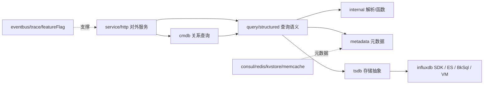

<!-- [待审核] AI 自动生成，请人工确认后移除此标记 -->
# unify-query 核心模块详解

<cite>
**本文引用的文件**
- [service/http/service.go](file://bkmonitor-datalink/pkg/unify-query/service/http/service.go#L31-L123)
- [service/http/handler.go](file://bkmonitor-datalink/pkg/unify-query/service/http/handler.go#L417-L481)
- [service/http/register_urls.go](file://bkmonitor-datalink/pkg/unify-query/service/http/register_urls.go#L25-L94)
- [query/structured/query_ts.go](file://bkmonitor-datalink/pkg/unify-query/query/structured/query_ts.go#L138-L253)
- [query/structured/query_promql.go](file://bkmonitor-datalink/pkg/unify-query/query/structured/query_promql.go#L217-L524)
- [internal/promql_parser/antlr4/PromQLParser.g4](file://bkmonitor-datalink/pkg/unify-query/internal/promql_parser/antlr4/PromQLParser.g4#L32-L231)
- [internal/function/function.go](file://bkmonitor-datalink/pkg/unify-query/internal/function/function.go#L266-L278)
- [tsdb/interfaces.go](file://bkmonitor-datalink/pkg/unify-query/tsdb/interfaces.go#L24-L42)
- [tsdb/prometheus/tsdb_instance.go](file://bkmonitor-datalink/pkg/unify-query/tsdb/prometheus/tsdb_instance.go#L32-L153)
- [influxdb/instance.go](file://bkmonitor-datalink/pkg/unify-query/influxdb/instance.go#L39-L97)
- [influxdb/router.go](file://bkmonitor-datalink/pkg/unify-query/influxdb/router.go#L84-L363)
- [influxdb/decoder/factory.go](file://bkmonitor-datalink/pkg/unify-query/influxdb/decoder/factory.go#L17-L32)
- [cmdb/cmdb.go](file://bkmonitor-datalink/pkg/unify-query/cmdb/cmdb.go#L16-L22)
- [cmdb/v1beta1/v1beta1.go](file://bkmonitor-datalink/pkg/unify-query/cmdb/v1beta1/v1beta1.go#L158-L621)
- [eventbus/settings.go](file://bkmonitor-datalink/pkg/unify-query/eventbus/settings.go#L16-L23)
- [trace/trace.go](file://bkmonitor-datalink/pkg/unify-query/trace/trace.go#L23-L116)
</cite>

## 目录
1. [简介](#简介)
2. [模块全景](#模块全景)
3. [服务层 service/http](#服务层-servicehttp)
4. [查询语义层 query/structured](#查询语义层-querystructured)
5. [内部能力层 internal](#内部能力层-internal)
6. [存储抽象层 tsdb](#存储抽象层-tsdb)
7. [后端 SDK influxdb](#后端-sdk-influxdb)
8. [CMDB 关系层](#cmdb-关系层)
9. [运行期支撑](#运行期支撑)
10. [结论](#结论)

## 简介

unify-query 的功能由一组边界清晰的模块承担。本文按"对外服务 → 查询语义 → 内部能力 → 存储抽象 → 后端 SDK → 关系集成 → 运行期支撑"的顺序，逐模块说明其职责、关键文件与对外接口，为后续 `查询执行.md` / `存储引擎集成.md` / `API接口说明.md` / `关系查询.md` 提供组件级基线。

章节来源
- [service/http/service.go](file://bkmonitor-datalink/pkg/unify-query/service/http/service.go#L31-L123)

## 模块全景

图表来源
- [service/http/service.go](file://bkmonitor-datalink/pkg/unify-query/service/http/service.go#L86-L89)
- [query/structured/query_ts.go](file://bkmonitor-datalink/pkg/unify-query/query/structured/query_ts.go#L167-L253)
- [tsdb/interfaces.go](file://bkmonitor-datalink/pkg/unify-query/tsdb/interfaces.go#L24-L42)

章节来源
- [service/http/service.go](file://bkmonitor-datalink/pkg/unify-query/service/http/service.go#L86-L89)
- [query/structured/query_ts.go](file://bkmonitor-datalink/pkg/unify-query/query/structured/query_ts.go#L167-L253)
- [tsdb/interfaces.go](file://bkmonitor-datalink/pkg/unify-query/tsdb/interfaces.go#L24-L42)

## 服务层 service/http

`service/http` 是系统**唯一对外端口**（默认 10205），承载全部 API 路由注册与 handler 实现，并以 gin 引擎注入中间件链。

- 服务结构体与启动：`service/http/service.go#L31-L123`，`Reload` 内重建 gin 引擎并 `go server.ListenAndServe()`（核心在 `#95-L100`）。
- 中间件顺序：`Recovery → otel → MetaData（解析 space_uid）→ JwtAuth`：`service/http/service.go#L77-L84`。
- 路由总入口：`registerDefaultHandlers` + `RegisterRelation` + `registerProxyHandler`：`service/http/service.go#L86-L89`，具体路由在 `register_urls.go#L25-L94`。
- 查询主流程：`HandlerQueryTs` 解析 `structured.QueryTs` → 用 header `space_uid` 覆盖 → 校验 → `queryTsWithPromEngine`：`service/http/handler.go#L417-L481`。

章节来源
- [service/http/service.go](file://bkmonitor-datalink/pkg/unify-query/service/http/service.go#L31-L123)
- [service/http/register_urls.go](file://bkmonitor-datalink/pkg/unify-query/service/http/register_urls.go#L25-L94)
- [service/http/handler.go](file://bkmonitor-datalink/pkg/unify-query/service/http/handler.go#L417-L481)

## 查询语义层 query/structured

`query/structured` 将"结构体查询"与"PromQL 查询"归一为统一的 `QueryTs` 表达，并负责查询规划（生成 `QueryReference` 与 PromQL AST）。

- **结构体链路**：`QueryTs.ToTime` 解析 start/end/step 并按对齐策略对齐（`query_ts.go#L138-L165`）；`ToQueryReference` 遍历 `QueryList` 调 `ToQueryMetric` 生成 `metadata.Query`（`query_ts.go#L167-L253`）；`ToPromExpr` 把聚合/时间聚合/条件拼为 PromQL AST（`query_ts.go#L312-L401`）。
- **PromQL 链路**：`NewQueryPromQLExpr(q).QueryTs()` 先用官方 `parser.ParseExpr` 解析整句，再 `splitVecGroups` 按 `VectorSelector` 切成若干 `Query`，`matrix` 型函数→`TimeAggregation`、`vector` 型→`AggregateMethodList`、`AggregateExpr`→聚合维度（`query_promql.go#L217-L524`）。

章节来源
- [query/structured/query_ts.go](file://bkmonitor-datalink/pkg/unify-query/query/structured/query_ts.go#L138-L253)
- [query/structured/query_promql.go](file://bkmonitor-datalink/pkg/unify-query/query/structured/query_promql.go#L217-L524)

## 内部能力层 internal

`internal/` 提供查询运转所需的底层能力，典型包括 PromQL 解析器、多源解析器与函数库。

- **PromQL 解析器**：基于 ANTLR4 文法 `internal/promql_parser/antlr4/PromQLParser.g4`（定义 `expression/vectorOperation/instantSelector/matrixSelector/function_/aggregation` 等规则，支持 subquery `[1m:2m]` 与 `offset`），配合 `PromQLLexer.g4` 词法（`PromQLParser.g4#L32-L231`）。
- **函数与时间对齐**：`internal/function` 实现聚合函数与 `TimeOffset` 时间对齐（如 `function.TimeOffset` 在 `function.go#L266-L278`），是 step/window 对齐的核心。

章节来源
- [internal/promql_parser/antlr4/PromQLParser.g4](file://bkmonitor-datalink/pkg/unify-query/internal/promql_parser/antlr4/PromQLParser.g4#L32-L231)
- [internal/function/function.go](file://bkmonitor-datalink/pkg/unify-query/internal/function/function.go#L266-L278)

## 存储抽象层 tsdb

`tsdb` 定义统一存储接口并通过 driver 工厂分发到具体后端，是"可插拔存储"的核心（详见 `存储引擎集成.md`）。

- **统一接口 `tsdb.Instance`**：结构化查询（`QuerySeriesSet`/`QueryRawData`/`QueryLabelValues`…）、PromQL 直查（`DirectQueryRange`/`DirectQuery`）、元信息（`InstanceType`/`GetRequestBody`）三组方法；并嵌入 `DefaultInstance` 供后端省去空实现（`tsdb/interfaces.go#L24-L42`）。
- **driver 工厂 `GetTsDbInstance`**：按 `StorageType` 的 `switch` 分发到 `influxdb`/`elasticsearch`/`bk_sql`/`victoria_metrics` 各后端 `NewInstance`（`tsdb/prometheus/tsdb_instance.go#L32-L153`）。

章节来源
- [tsdb/interfaces.go](file://bkmonitor-datalink/pkg/unify-query/tsdb/interfaces.go#L24-L42)
- [tsdb/prometheus/tsdb_instance.go](file://bkmonitor-datalink/pkg/unify-query/tsdb/prometheus/tsdb_instance.go#L32-L153)

## 后端 SDK influxdb

`influxdb/`（注意与 `tsdb/influxdb/` 区分）是 InfluxDB 后端的独立 SDK，负责连接、路由与解码；`tsdb/influxdb/` 则是 `tsdb.Instance` 的实现（翻译 + 下发）。

- **连接管理**：`Instance` 持有 `client.Client`，查询经 `i.cli.Query(...)`（`influxdb/instance.go#L39-L97`）；`endpoint.go` 的 `endpointSet` 管理 gRPC 端点池（`influxdb/endpoint.go#L36-L169`）。
- **路由**：`router.go` 提供 `TsDBRouter`/`BizRouter`/`TableRouter`/`MetricRouter` 四类 `sync.Map` 路由，并热重载（`influxdb/router.go#L84-L363`）。
- **解码**：`decoder` 注册表支持 json/msgpack，`decoders` 表在 `decoder/factory.go#L17-L32`。

章节来源
- [influxdb/instance.go](file://bkmonitor-datalink/pkg/unify-query/influxdb/instance.go#L39-L97)
- [influxdb/router.go](file://bkmonitor-datalink/pkg/unify-query/influxdb/router.go#L84-L363)
- [influxdb/decoder/factory.go](file://bkmonitor-datalink/pkg/unify-query/influxdb/decoder/factory.go#L17-L32)

## CMDB 关系层

`cmdb/` 提供 CMDB 拓扑/资源关系查询能力，是 `/api/v1/relation/*` 关系查询的底座（详见 `关系查询.md`）。

- **接口与模型**：`CMDB` 接口仅 `QueryResourceMatcher`（instant）与 `QueryResourceMatcherRange`（range）两方法（`cmdb/cmdb.go#L16-L22`）；领域类型 `Index/Matcher/Resource/Relation/Path` 描述多资源拓扑（`cmdb/struct.go`）。
- **实现 v1beta1**：基于 `relation.SchemaProvider` 构建资源关系有向图，求 source→target 全部路径并翻译为 PromQL 查询（`cmdb/v1beta1/v1beta1.go#L158-L621`）。

章节来源
- [cmdb/cmdb.go](file://bkmonitor-datalink/pkg/unify-query/cmdb/cmdb.go#L16-L22)
- [cmdb/v1beta1/v1beta1.go](file://bkmonitor-datalink/pkg/unify-query/cmdb/v1beta1/v1beta1.go#L158-L621)

## 运行期支撑

- **eventbus**：进程内事件总线，仅定义 `EventSignalConfigPreParse`/`EventSignalConfigPostParse` 两个配置信号，供各模块在配置解析前后订阅（`eventbus/settings.go#L16-L23`）。
- **trace**：基于 OpenTelemetry 的链路追踪封装，Tracer 名 `bk-monitorv3/unify-query`，提供 `NewSpan`/`TraceID`/`Set`/`End`（`trace/trace.go#L23-L116`），在 relation 查询各阶段广泛使用。
- **featureFlag**：特性开关服务，在 `Reload` 时加载并对外提供调试接口（`service/featureFlag/featureFlag.go#L85-L121`）。

章节来源
- [eventbus/settings.go](file://bkmonitor-datalink/pkg/unify-query/eventbus/settings.go#L16-L23)
- [trace/trace.go](file://bkmonitor-datalink/pkg/unify-query/trace/trace.go#L23-L116)

## 结论

unify-query 的模块划分遵循清晰的分层与单一职责：`service/http` 收敛所有对外能力，`query/structured` 统一查询语义，`tsdb` + 各后端 SDK 解耦存储，`cmdb` 提供关系查询，`eventbus`/`trace`/`featureFlag` 提供运行期支撑。模块间通过 `metadata`（`space_uid`/表/存储元数据）与 `define.Service` 生命周期接口协作，下一页将展开元数据与缓存层如何支撑上述查询（`元数据与缓存.md`）。

章节来源
- 本节为结论性内容，综合前述各章来源
