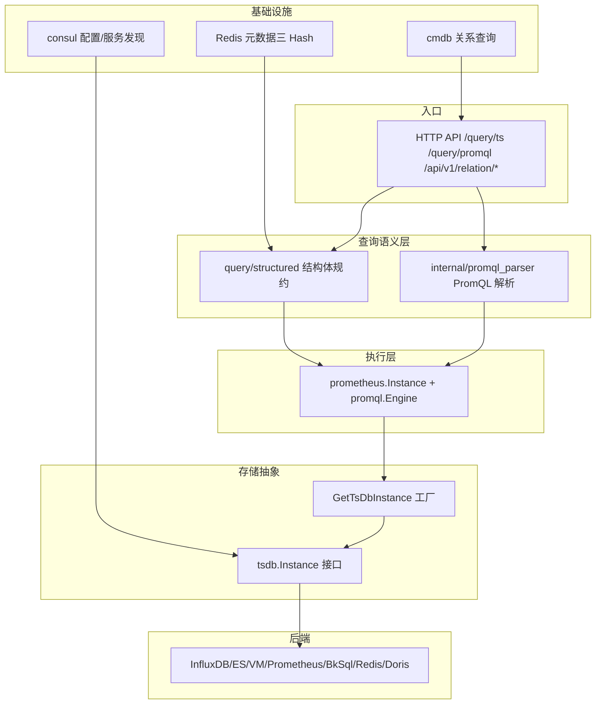

[待审核]

# unify-query 文档首页

<cite>
- [service/http/service.go](file://bkmonitor-datalink/pkg/unify-query/service/http/service.go#L52-L92)
- [query/structured/query_ts.go](file://bkmonitor-datalink/pkg/unify-query/query/structured/query_ts.go#L42-L112)
- [tsdb/interfaces.go](file://bkmonitor-datalink/pkg/unify-query/tsdb/interfaces.go#L24-L42)
</cite>

## 目录
- [概述](#概述)
- [系统架构](#系统架构)
- [文档导航](#文档导航)
- [关键设计理念](#关键设计理念)

## 概述

`unify-query` 是 BK-Monitor 的**统一查询服务**，负责把前端的结构体查询与 PromQL 表达式，归一化后下发到 InfluxDB / Elasticsearch / VictoriaMetrics / Prometheus / BkSql / Redis / Doris 等多种时序存储后端，并返回对齐合并的结果。它以"统一入口 + 引擎归一 + 可插拔存储"为主线，通过 `tsdb.Instance` 接口与 `GetTsDbInstance` 工厂实现后端零耦合。

章节来源
- [query/structured/query_ts.go](file://bkmonitor-datalink/pkg/unify-query/query/structured/query_ts.go#L42-L112)
- [tsdb/interfaces.go](file://bkmonitor-datalink/pkg/unify-query/tsdb/interfaces.go#L24-L42)

## 系统架构

图表来源
- [service/http/service.go](file://bkmonitor-datalink/pkg/unify-query/service/http/service.go#L52-L92)
- [tsdb/prometheus/tsdb_instance.go](file://bkmonitor-datalink/pkg/unify-query/tsdb/prometheus/tsdb_instance.go#L32-L153)

章节来源
- [service/http/service.go](file://bkmonitor-datalink/pkg/unify-query/service/http/service.go#L52-L92)
- [tsdb/interfaces.go](file://bkmonitor-datalink/pkg/unify-query/tsdb/interfaces.go#L24-L42)

## 文档导航

| 文档 | 主题 |
|------|------|
| [架构.md](架构.md) | 系统架构与设计理念（启动/分层/请求生命周期） |
| [模块详解.md](模块详解.md) | 核心模块详解（service/http、query、internal、tsdb、influxdb、cmdb） |
| [元数据与缓存.md](元数据与缓存.md) | 元数据与缓存（space_uid 映射 / Redis 三 Hash / bbolt / Ristretto） |
| [查询执行.md](查询执行.md) | 查询执行链路（结构体/PromQL→规划→路由→降采样/分段→合并） |
| [PromQL支持与扩展.md](PromQL支持与扩展.md) | PromQL 语法/解析器/引擎/翻译/函数映射/与标准差异 |
| [存储引擎集成.md](存储引擎集成.md) | 存储引擎集成（tsdb.Instance + 如何扩展新引擎） |
| [API接口说明.md](API接口说明.md) | API 接口说明（路由/handler/请求响应/鉴权） |
| [数据源与存储映射.md](数据源与存储映射.md) | 数据源与存储映射（DataSource 业务分类 → StorageType 真实后端） |
| [接口文档/](接口文档/) | 21 个接口独立文档（每个接口一个文件，索引见 [API接口说明.md#接口文档索引](API接口说明.md#接口文档索引)） |
| [关系查询.md](关系查询.md) | 关系/拓扑查询（CMDB v1beta1 图算法） |

章节来源
- 本节为导航页，链接指向同目录其他文档，不直接分析具体源码文件。

## 关键设计理念

- **统一入口**：结构体查询与 PromQL 查询最终都规约为 `QueryTs`，共用同一条执行链路。
- **引擎归一**：复用 Prometheus 官方 `promql.Engine` 作为计算内核，后端只需实现 `tsdb.Instance`。
- **可插拔存储**：新增后端只需实现接口 + 工厂分支 + consul 登记，上层无感（见 [存储引擎集成.md](存储引擎集成.md)）。
- **离线派生关系**：CMDB 拓扑经 worker 派生为指标，关系查询用图算法 + PromQL 还原（见 [关系查询.md](关系查询.md)）。

章节来源
- [tsdb/interfaces.go](file://bkmonitor-datalink/pkg/unify-query/tsdb/interfaces.go#L24-L42)
- [tsdb/prometheus/tsdb_instance.go](file://bkmonitor-datalink/pkg/unify-query/tsdb/prometheus/tsdb_instance.go#L32-L153)
