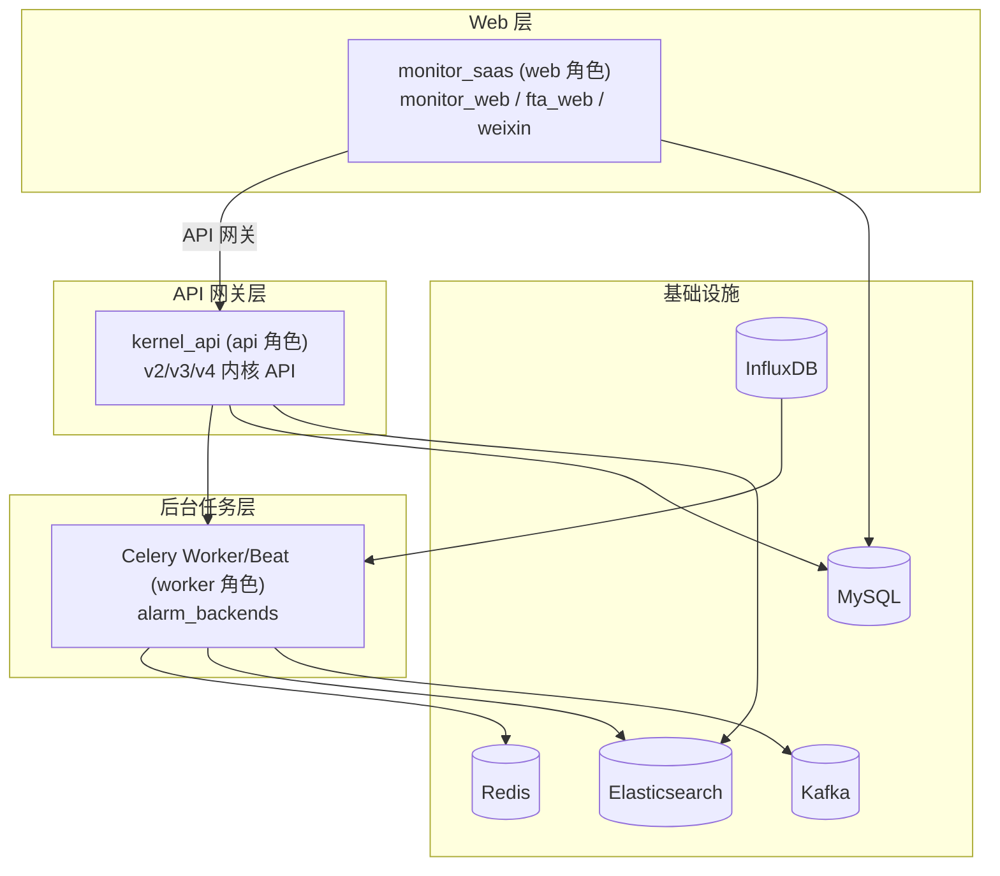
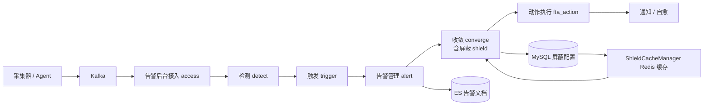

# BK-Monitor 项目全局

> 项目级共享资产：描述项目全局信息，供所有专家共享。粒度止于"服务 → 代码位置 → 一句话职责"，模块级契约/实现细节见各专家资产。
> 信息来源：`monitor-memory` scope 项目记忆（背景与目标 / 系统配置与异常 / Resource 框架 / 技术栈选型 / 通用记忆片段）+ 项目扫描。

## 1. 项目基本信息

- **业务领域**：企业级可观测性 / 监控平台（BlueKing Monitor，BK-MONITOR）
- **项目用途**：蓝鲸 PaaS 官方集成的统一监控平台，提供可扩展的数据采集、大规模数据处理、简洁 UI 与可扩展能力，覆盖"采集 → 传输 → 存储 → 查询 → 检测 → 告警 → 处置"全链路监控闭环。
- **项目形态**：模块化 AI 增强架构——在传统 Django 单体中集成 AI Agent 能力（`ai_agent/`、`ai-docs/`）。
- **发布**：`master` 分支不稳定，稳定版本通过 GitHub Releases 发布。

## 2. 技术栈

- **后端**：Python + Django 4.2（单体架构）+ Celery + Gunicorn
- **前端**：Vue/webpack 构建（Node.js 20 + pnpm），打包进镜像（目录位置：`bkmonitor/webpack/`、`bkmonitor/static/`）
- **中间件/存储**：MySQL 5.7+、Redis、Kafka、Elasticsearch 7.x、InfluxDB（经 influxdb-proxy）
- **AI/数据分析**：duckdb（嵌入式 SQL 分析）、SiliconFlow Qwen Embedding-8B / Reranker-8B
- **包管理**：uv（Python 依赖）

## 3. 架构形态

- **前后端**：Django 单体（后端渲染 + REST API），前端构建产物打包进镜像。
- **部署形态**：单进程多角色——同一 Django 工程按 **ROLE**（web / api / worker）加载不同配置，部署为三个独立进程/容器（架构硬隔离）：
  - `web`（monitor_saas）：全模块（monitor_web / fta_web / weixin），**不含 alarm_backends**
  - `api`（kernel_api）：精简 INSTALLED_APPS + Token 认证，**含 alarm_backends**（继承 worker 配置）
  - `worker`（Celery Worker/Beat）：后台模块（alarm_backends），**不含 monitor_web / fta_web / weixin**
- **调用边界**：monitor_saas（web 角色）**不能直接 import alarm_backends**（非 INSTALLED_APPS），须经 API 网关访问 kernel_api（api 角色）中转。

## 4. 核心功能

- **监控数据采集**：Kubernetes Operator 自动化采集（CRD + Secret + Reloader 热重载），多服务发现
- **告警流水线**：接入 → 检测 → 触发 → 恢复 → 事件 → 动作（含屏蔽/收敛/通知）→ 自监控
- **APM 全栈监控**：应用拓扑、链路追踪、指标/日志/画像，eBPF/DeepFlow
- **元数据与数据源管理**：数据源/结果表/字段/ETL 统一治理，v3/v4 多链路版本
- **可视化与 API**：ResourceViewSet 统一暴露；Monitor API 资源可自动暴露到 OpenAI

## 5. 核心服务清单（本仓库内）

> 代码位置为**相对仓库根 `/root/bk-monitor`** 的路径；其中 `bkmonitor/` 前缀即 Django 工程根 `/root/bk-monitor/bkmonitor` 下内容。

| 服务/模块名 | 一句话职责 | 代码位置 | 测试可执行性 |
|---|---|---|---|
| monitor_web | Web 管理面：策略、告警、屏蔽、场景视图等 CRUD 与展示 | `bkmonitor/packages/monitor_web/` | ⚠️ 依赖外部环境 |
| fta_web | 告警动作执行、快捷操作（quick_shield / quick_ack） | `bkmonitor/packages/fta_web/` | ✅ 部分可跑（纯单测可跑） |
| alarm_backends | 告警运行时引擎：接入/检测/收敛/屏蔽/通知 | `bkmonitor/alarm_backends/` | ⚠️ 依赖外部环境 |
| apm | 应用性能监控（拓扑/追踪/画像/订阅） | `bkmonitor/apm/` | ⚠️ 依赖外部环境 |
| metadata | 元数据治理：数据源/结果表/字段/ETL | `bkmonitor/metadata/` | ⚠️ 依赖外部环境 |
| kernel_api | API 网关角色：暴露 v2/v3/v4 内核 API，web→后台中转层 | `bkmonitor/kernel_api/` | ⚠️ 依赖外部环境 |
| bkmonitor 核心 | 模型/文档/工具/异常/DRF 资源框架 | `bkmonitor/bkmonitor/` + `bkmonitor/core/` | ⚠️ 依赖外部环境 |
| ai_agent | 平台 AI Agent 逻辑（与监控组件融合） | `ai_agent/` | ⚠️ 依赖外部环境 |
| bk-monitor-base | 共享基础库（Django 配置合并、基础组件） | `bk-monitor-base/`（独立仓库） | ⚠️ 依赖外部环境 |
| bk-monitor-wiki | 内部技术文档与知识库（独立仓库） | `bk-monitor-wiki/`（独立仓库） | 无测试 |
| 数据链路（Go） | 采集/传输/统一查询（独立 Go 仓库） | `bkmonitor-datalink`（独立仓库） | 无测试（独立仓库） |

> **测试可执行性实测结论**（2026-08-03，当前开发环境）：
> - ✅ 纯单元测试可跑：`packages/fta_web/tests/alert/test_quick_shield.py`（11 passed）、`alarm_backends/tests/core/cache/test_strategy_target_shield.py`（3 passed）
> - ⚠️ 依赖完整环境：`tests/api/fta/test_add_shield.py`（app 注册问题）、`alarm_backends/tests/service/converge/test_shield.py`（迁移图不一致 + 测试库残留）——需完整检出 + 可写 MySQL 测试库
> - **全局前置**：`--override-ini "filterwarnings="`（pyproject 引用的 `RemovedInDjango51Warning` 在 Django 4.2.27 解析失败）+ 显式 `BKAPP_DEPLOY_PLATFORM=community` 等环境变量 + 使用 `.venv`
> - 标注「⚠️ 依赖外部环境」的服务未在本环境逐条实测

## 6. 配套服务关系（独立部署的配套服务）

| 服务A | 关系 | 服务B | 说明 |
|---|---|---|---|
| monitor_saas (web) | 依赖（API 网关） | kernel_api (api) | web 调用告警后台能力必须经 API 网关中转 |
| kernel_api (api) | 依赖 | alarm_backends | api 角色继承 worker 配置，挂载 alarm_backends |
| alarm_backends | 依赖 | Redis / Kafka / ES / MySQL | 告警队列、持久化、策略配置 |
| monitor_saas | 协作 | CMDB / BCS / PaaS / SOPS / IAM | 蓝鲸生态集成 |
| bkmonitor（主工程） | 独立仓库 | bk-monitor-wiki / bk-monitor-base / bkmonitor-datalink | 各仓库独立版本历史 |

## 7. 运行环境（解释器/执行方式）

> **执行路径（Django 工程根 / 工作目录）**：`/root/bk-monitor/bkmonitor`
> - `manage.py`、`settings.py`、`pyproject.toml`、`.venv/` 均位于此目录；所有命令（Django/Celery/pytest）均需在此目录下执行。
> - 仓库根为 `/root/bk-monitor`（含 `bk-monitor-wiki/`、`bk-monitor-base/` 等独立仓库），`bkmonitor/` 是其下的 Django 主工程子目录。

| 场景 | 推荐方式 | 说明 |
|---|---|---|
| 工作目录 | `cd /root/bk-monitor/bkmonitor` | 所有执行命令的基准目录 |
| Python 执行 | `/root/bk-monitor/bkmonitor/.venv/bin/python` | 系统 Python 缺 `bkcrypto` 等依赖链，settings 无法加载 |
| Django 启动 | `manage.py runserver`（dev）/ Gunicorn（prod） | 需先设置 `DJANGO_CONF_MODULE` / `BKAPP_DEPLOY_PLATFORM` |
| Celery | `celery worker` / `beat` | Broker 默认 Redis |
| 测试 | `pytest` + `--override-ini "filterwarnings="` | 需显式环境变量 + `.venv`（见 §5） |

## 8. 架构图（服务级）

## 9. 数据流向图（服务级）

