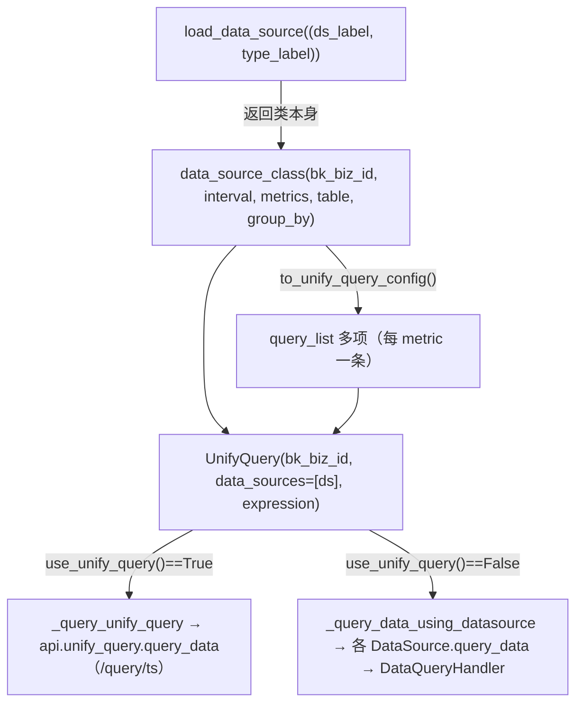

# UnifyQuery 架构与全景

## 简介

BK-Monitor 的查询统一由 `UnifyQuery` 门面编排。业务代码不直接拼 HTTP，而是先通过工厂函数 `load_data_source((data_source_label, data_type_label))` 拿到数据源类，构造一个**查询描述对象**（传入 `bk_biz_id、interval、metrics、table、group_by`），再交给 `UnifyQuery(...).query_data(...)` 执行。执行时 `UnifyQuery` 决定走「统一查询后端 HTTP 接口」还是「下推各数据源原生查询」。

## 三层查询架构

- **第一层 工厂函数** `load_data_source`：用 `(data_source_label, data_type_label)` 二元组返回对应 `DataSource` 子类（如 `BkMonitorTimeSeriesDataSource`），返回值是**类本身**而非实例。
- **第二层 查询描述对象**：实例化 `data_source_class(...)` 构造查询描述。`metrics` 每项 `{field, method, alias}`（`field`=真实指标名，`method`=聚合函数，`alias`=别名）；`group_by` 为维度字段列表，每组一条记录。
- **第三层 统一查询门面** `UnifyQuery`：可包多个数据源，`expression` 是指标引用表达式（如 `"a"` 引用 alias=A 的指标）。`query_data()` 执行时先由 `use_unify_query()` 判定走统一查询后端还是直连存储。

## 表名与字段来源

查询描述里的 `table` / `metrics[].field` / `group_by` 都来自元数据：

- **ResultTable 模型**：`table_id`（如 `system.load`）、`label`（如 `os`）、`schema_type`、`default_storage`；命名规则 `DB.TABLE_NAME`（DB=监控范围 `system/docker`，TABLE_NAME=指标集合 `cpu/mem`）。
- **ResultTableField 模型**：`table_id` + `field_name` 联合唯一，`tag` 区分角色——`metric`=指标（可聚合数值、带 unit）、`dimension`=维度（描述性字符串、用于分组/过滤）、`timestamp`=时间。
- **初始化数据 `init_resulttable.json`**：如 `system.load` 表含 `load1/load5/load15`（`tag=metric`）、`bk_host_id`（`tag=dimension`）；`system.proc` 含 `display_name`（进程显示名称）、`pid`、`username` 等维度与 `cpu_usage_pct`、`uptime`、`fd_num` 等指标。

### DataSource 与 ResultTable 的关系
- **DataSource 模型**：`bk_data_id`（主键）、`data_name`、`etl_config`、`source_label`、`type_label`——定义采集通道，一个数据源可采集多种指标。
- **DataSourceResultTable 关系表**：`bk_data_id` + `table_id`，关系**一对多**（如 `snapshot`=1001 对应 `system.cpu_summary`、`system.io`、`system.disk`、`system.mem` 等多结果表）。

## 关键发现与常见坑

1. **instant 查询行为与非 instant 完全不同**：`instant=True` 触发三个独立行为——① `step` 强制为 `"1m"`；② **保留 `end_time` 边界点**（非 instant 会丢弃该点）；③ 仅返回单个评估点。`start_time` 不会被重算，但 instant 模式只看 `end_time` 单点所以不依赖 `start_time`。
2. **`query_dimensions` 本质分叉**：单数据源不拼时序 `query_list/step`，而是复用 `to_unify_query_config()[0]` 改走 `/query/ts/info/tag_values` 维度端点；多数据源兜底才复用 `query_data` 全量拉取再内存去重。
3. **`(BK_MONITOR_COLLECTOR, TIME_SERIES)` 恒走 unify-query 分支**：`use_unify_query()` 对其恒返回 `True`，绝不会进入 `_query_data_using_datasource`。
4. **指标平铺**：`metrics` 多指标被展开为 `query_list` 多条，每条独立 `reference_name`（a0~aN），须经 `metric_merge` 合成单条 PromQL 才能执行——多条目是为关联计算设计，不是批量独立查询。

## 契约层索引

- [C0-使用总览.md](../C0-使用总览.md) — 能力清单、边界、已知问题
- [C1-能力契约.md](../C1-能力契约.md) — `UnifyQuery` 公开方法契约、聚合映射、入参→HTTP 对照
- [C2-使用流程.md](../C2-使用流程.md) — 三条常见使用流程

## 实现层切面索引

| 切面 | 文件 | 覆盖内容 |
|------|------|----------|
| 架构与全景 | [01-架构.md](01-架构.md) | 三层架构、表名字段来源、本索引（本文） |
| 参数拼接实现 | [02-实现.md](02-实现.md) | `to_unify_query_config` → `get_unify_query_params` → `_query_unify_query` |
| 数据流转 | [03-数据流转.md](03-数据流转.md) | 六个公开入口链路 + 两条总分支对照 |
| 后端接口契约 | [05-接口.md](05-接口.md) | QueryDataResource / QueryRawResource / QueryReferenceResource / GetDimensionDataResource |

## 术语表

- **统一查询后端**：`unify-query` Go 微服务，HTTP `/query/ts` 等接口，由 `UnifyQuery` 在 `use_unify_query()==True` 时调用。
- **数据源原生查询**：`_query_data_using_datasource` 分支，查询下推到各 `DataSource.query_data` → `DataQueryHandler`，最终多为外部 API（metadata/log_search/bkdata）或直连 ES。
- **DataQueryHandler**：按 `(data_source_label, data_type_label)` 路由存储后端查询执行器的工厂。
- **query_list**：提交给统一查询后端的查询条目数组，每 `metric` 一条，由 `reference_name` 区分。
- **metric_merge**：将多条 `query_list` 合成为单条 PromQL 的表达式（如 `"a"`、`"a/b"`）。
