# UnifyQuery 参数拼接实现

## 简介

本文聚焦 `query_data` 基线链路，追踪 `data_source_class(bk_biz_id, interval, metrics, table, group_by)` 的入参如何最终拼成统一查询后端的 HTTP 请求参数。其余入口（`with_stat` / `reference` / `log` / `dimensions`）均在此基础上扩展或分叉，详见 `03-数据流转.md`。

## 拼接链路总览

```mermaid
flowchart LR
    A["data_source_class(...)"] -->|"to_unify_query_config()"| B["query_list 多条目（每 metric 一条）"]
    B --> C["UnifyQuery(bk_biz_id, data_sources, expression)"]
    C -->|"query_data()"| D["_query_data_internal"]
    D -->|"with_series_stat=False"| E["_query_unify_query()"]
    E -->|"get_unify_query_params() 补 instant/step/down_sample/timezone"| F["api.unify_query.query_data(**params) → POST /query/ts"]
```



## to_unify_query_config：描述对象 → query_list

`TimeSeriesDataSource.to_unify_query_config`（`BK_MONITOR_COLLECTOR / TIME_SERIES`）核心规则：

- **指标平铺**：`metrics` 列表（多指标）展开成 `query_list` 数组里的多条独立条目；每条携带相同的 `table_id/group_by/time_field/conditions`，但各自有独立的 `field_name / reference_name / keep_columns`。
- **聚合映射**（`method` 非实时时）：
  - 命中 `*_without_time` 变体（`sum_without_time`/`avg_without_time` 等）→ `function[0].method = AggMethods[method].method`，**不写 `time_aggregation`**（无时间窗口）。
  - 其余普通 method（`avg`/`sum`/`count`/`max`/`min`）→ 走 `else` 分支：`time_aggregation = {"function": "<method>_over_time", "window": "<interval>s" 或 "1h"}`，`function[0].method` 经 `{"avg":"mean","count":"sum"}` 映射。
  - 分位数 `CpAggMethods`（如 `cp95`）→ 额外带 `vargs_list / position` 到 `time_aggregation`。
- `reference_name = (alias or field).lower()`；`table_id = data_label or table.lower()`；`driver = "influxdb"`；`time_field` 默认 `"time"`；`keep_columns = ["_time", reference_name, *group_by]`。

以 `system.proc` 进程查询为例，`group_by=["bk_host_id","bk_target_ip","bk_target_cloud_id","display_name","pid","username"]` 时，单条 `query_list` 形如：
```python
{
    "table_id": "system.proc",
    "time_aggregation": {"function": "avg_over_time", "window": "180s"},
    "field_name": "cpu_usage_pct",
    "reference_name": "a0",
    "dimensions": ["bk_host_id","bk_target_ip","bk_target_cloud_id","display_name","pid","username"],
    "driver": "influxdb", "time_field": "time",
    "conditions": {"field_list": [], "condition_list": []},
    "function": [{"method": "mean", "dimensions": ["bk_host_id","bk_target_ip","bk_target_cloud_id","display_name","pid","username"]}],
    "offset": "", "offset_forward": False,
    "keep_columns": ["_time","a0","bk_host_id","bk_target_ip","bk_target_cloud_id","display_name","pid","username"]
}
```

## get_unify_query_params：组装顶层 params

- `step`：`interval` 有值取 `interval`，否则默认 `"60"` → 形如 `"180s"`。
- `expression`：非空直接用（如 `"a"`）；为空则 `or` 拼接各 `reference_name`。
- `metric_merge = add_expression_functions(expression, functions)`；`functions` 为空 → 原样返回 expression。
- `order_by`：未传 → `["-_time"]`。
- `space_uid = bk_biz_id_to_space_uid(bk_biz_id)`、`bk_tenant_id = bk_biz_id_to_bk_tenant_id(bk_biz_id)`（构造时已由 `set_bk_tenant_id` 注入各 data_source）。
- `start_time/end_time`：`time_alignment=True` 且 `not_time_align=False` → 经 `time_interval_align(sec, step)` **时间对齐**到步长边界。

## _query_unify_query：补 instant/step/timezone

- `instant=True` 触发：`params["instant"] = True`，且 **`step` 被覆盖为 `"1m"`**（固定 1 分钟，忽略原 interval）。
- 补 `down_sample_range = ""`、`timezone = get_current_timezone_name()`。
- 调用 `api.unify_query.query_data(**params)` → `QueryDataResource`。

### instant 行为详解

`instant` 参数在请求链路中有**两个独立的作用点**：

**作用点 1：HTTP 参数层**（`_query_unify_query`）
- `instant=True` → `params["instant"] = True` + `params["step"] = "1m"`
- `instant=False/None` → 不追加 `instant` 键，`step` 保持原值
- `step` 是**采样步长**，不是聚合窗口；真正的聚合窗口是 `time_aggregation.window`（由 `interval` 决定）

**作用点 2：结果后处理层**（`process_unify_query_data`）——**最关键差异**
- 非 instant 模式：**丢弃 `_time_` 等于 `end_time` 的最后一条数据**（SaaS 侧约定：end_time 边界点采集周期不完整，时序图表中应排除）
- instant 模式：**保留 `end_time` 边界点**（instant 就是查"此刻"的瞬时值，丢弃边界点会导致结果为空）

**Builder 层的 `align_interval` 补偿**：
- `UnifyQuerySet.instant(align_interval=N)` 在设 `instant=True` 的同时，把 `end_time` **前移** N 毫秒
- 目的：让 instant 返回 `end_time - interval` 时刻的点，与非 instant 模式丢弃 end_time 边界点后保留的最后有效点对齐

**重要澄清**：
- `instant` **不改变聚合函数**——每个评估点的计算方式（`avg_over_time` + `mean`）完全一致
- `instant` **不直接修改 `start_time`**——传入的 start_time 原样传下去
- `instant` 对 `_query_data_using_datasource` 分支**无效**（该分支不接收 instant 参数）

## 两层聚合语义：时间聚合 vs 维度聚合

`to_unify_query_config` 把 `metrics[].method` 分解为两个独立的聚合层，分别控制不同的聚合维度：

```
  第二层 function[0].method（跨 series 聚合）
        ↓
  avg by (dim1, dim2) (
      avg_over_time(cpu_usage[5m])           ← 第一层 time_aggregation（时间轴聚合）
  )
```

| 聚合层 | 字段 | 聚合对象 | 窗口 | 输出 |
|--------|------|----------|------|------|
| **第一层** | `time_aggregation` | 单个 series 的**时间轴** | `window={interval}s` | N 个原始采集点 → 1 个平滑值 |
| **第二层** | `function[0]` | 同一 group 内的**多条 series** | 无（每个时间点独立） | 同 group 内 M 条 series → 1 个组值 |

### 两个分支的行为差异

**`if` 分支**（命中 `AggMethods`= `*_without_time` 变体，如 `avg_without_time`）：
- **不设置 `time_aggregation`**（跳过时间轴聚合）
- 只执行第二层 `function[0].method`（直接跨 series 聚合）
- 用途：原始采集点已经很稀疏，不想做窗口平滑；或者需要取瞬时值而非时间段平均值

**`else` 分支**（普通 method，如 `avg`/`sum`/`count`/`max`/`min`）：
- 设置 `time_aggregation.function="{method}_over_time"` + `time_aggregation.window="{interval}s"`
- 再执行第二层 `function[0].method`（跨 series 聚合）
- `avg` → `function[0].method` 映射为 `"mean"`（PromQL 惯用名）；`count` → `"sum"`

**注意**：`AggMethods` 仅含 `sum_without_time` / `avg_without_time` / `count_without_time` / `min_without_time` / `max_without_time` 五种。普通 `avg`/`sum` 等**不在其中**，一定走 `else` 分支生成两层聚合。

`CpAggMethods`（`cp50`/`cp90`/`cp95`/`cp99`）特殊处理：`time_aggregation.function="histogram_quantile"` + 额外 `vargs_list`/`position`，`function[0].method` 仍为 `"mean"`。

### 后处理

- `process_unify_query_data`：从 `series` 的 `group_keys/group_values` 提取维度，`columns` 中 `_time`→`_time_`、`_result/_value`→`_result_`，时间列秒级转毫秒；返回 `list[dict]`。
- `BK_MONITOR_COLLECTOR / TIME_SERIES` **不在** `process_data_by_datasource` 的特例列表（`CUSTOM/EVENT`、`BK_MONITOR_COLLECTOR/LOG`）内，故不额外调用 `ds.process_unify_query_data`，直接返回。

## 关键映射小结

| 入参 | 最终落点 |
|------|----------|
| metrics 多指标 | 平铺为 query_list 多条，各自 reference_name=a0~aN |
| method="AVG" | function[0].method="mean" + time_aggregation={"function":"avg_over_time","window":"<interval>s"} |
| table | table_id（data_label 未传则 table.lower()） |
| group_by | 同时写入 dimensions / function[0].dimensions / keep_columns |
| interval | 决定 time_aggregation.window；普通查询 step="<interval>s"，instant 覆盖为 "1m" |
| expression | metric_merge（UnifyQuery 级表达式，引用 data_source） |
| bk_biz_id | 经 UnifyQuery 转为 space_uid/bk_tenant_id，不直接进 query 项 |
