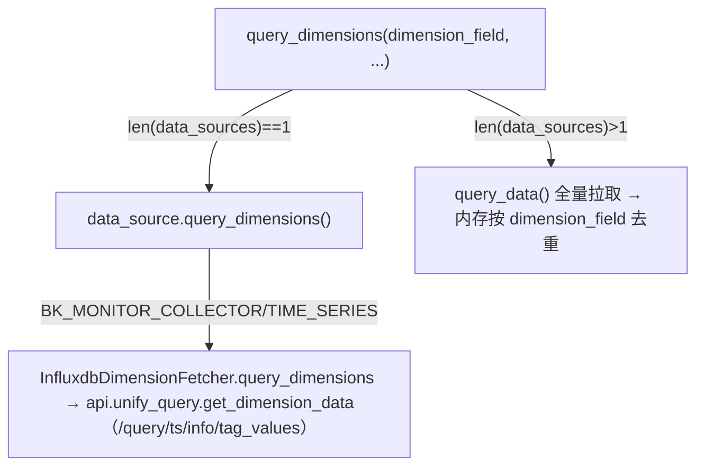

# UnifyQuery 数据流转与多入口链路

## 简介

`UnifyQuery` 对外暴露 6 个公开查询入口（`query_data` / `query_data_with_stat` / `query_reference` / `query_log` / `query_dimensions` / `_query_data_using_datasource`），全部经过 `use_unify_query()` 判定再分流。本文按入口逐一说明链路与差异，并给出最终落点对照。基线链路的参数拼装细节见 `02-实现.md`，后端 API 契约见 `05-接口.md`。

## 两条总分支：use_unify_query 判定

`use_unify_query()` 返回 `False` 的全部情形：

| # | 条件 | 说明 |
|---|------|------|
| 1 | `data_sources[0].id` **不在** `UnifyQueryDataSources + GrayUnifyQueryDataSources` | **恒走下推分支** |
| 2 | 灰度数据源 `switch_unify_query(bk_biz_id)` 返回 `False` | 仅 `GrayUnifyQueryDataSources` 命中 |
| 3 | 接入数据平台（`IS_ACCESS_BK_DATA`）+ cmdb-level 查询 + 表在 `BKDATA_CMDB_LEVEL_TABLES` 白名单 | 仅 `BkdataTimeSeriesDataSource` 命中 |

其余情形（多指标、有表达式、有 functions、命中 `AggMethods/CpAggMethods`、无 table 或负 biz_id）一律走统一查询后端。

> `(BK_MONITOR_COLLECTOR, TIME_SERIES)` 与 `(CUSTOM, TIME_SERIES)` **永远走统一查询后端分支**，不会进入下推分支。

## query_data 链路

```
data_source_class(...) → UnifyQuery → query_data()
  → _query_data_internal(with_series_stat=False)
  → _query_unify_query() → api.unify_query.query_data(**params)  # POST /query/ts
```

详见 `02-实现.md`。返回 `list[dict]`。

## query_data_with_stat 链路

与 `query_data` **参数拼装完全一致**，唯一分叉点是 `_query_data_internal(with_series_stat=True)`；`unify-query` 返回的每个 `series` 自带 `stat`，经 `process_unify_query_series_stat` 以 `(dimensions, metric_field)` 二元组为 key 归并，返回值由 `list` 变为 `{"series", "series_stat"}` 字典。

## query_reference 链路

```
query_reference(...) → _query_reference_using_unify_query()
  → get_unify_query_params(order_by=...)  # 透传 order_by
  → 逐条 query.update({"limit": limit or 1, "from": offset or 0})
  → api.unify_query.query_reference(**params)  # POST /query/ts/reference
```

- 分页 `limit/from` 是**每条子查询级别**（与 `query_data` 顶层 `slimit/limit` 语义不同）。
- 不设置 `down_sample_range`；`not_time_align=False` 由 `get_unify_query_params` 默认写入但 `QueryReferenceResource` 未声明→API 忽略。
- 不计算 `series_stat`。返回 `list[dict]`。

## query_log 链路

```
query_log(...) → _query_log_using_unify_query()
  → get_unify_query_params(order_by=...)
  → 逐条 query.update({"function": [], "field_name": "", "time_aggregation": {}})  # 剥离聚合
  → params["limit"]=limit or 1; params["_from"]=offset or 0
  → api.unify_query.query_raw(**params)  # POST /query/ts/raw
```

- 主要服务于 LOG 类数据源；逐条**剥离聚合**（原始日志查询无需聚合）。
- **不支持 instant**（本链路不读取 instant，不覆盖 step）。
- `total` 在 unify-query 路径下硬编码为 `0`（真实总数仅在 `_query_log_using_datasource` 原生路径返回）。返回 `(list[dict], total)` 二元组。

## query_dimensions 链路



- **单数据源**：复用 `to_unify_query_config()[0]` 提取 `table_id/field_name/conditions`，改走 unify-query 的「维度值」接口 `/query/ts/info/tag_values`（`GetDimensionDataResource`）——**仍触碰 unify-query，只是不同端点、不同参数结构**。
- **多数据源**：退化为用 `query_data` 拉全量，再在 Python 侧对 `dimension_field` 去重。返回 `list`（维度值）。
- `BkDataTimeSeriesDataSource` 的 `query_dimensions` 给字段包反引号后走 `_get_queryset` 原生查询（非聚焦路径）。

## 下推分支：_query_data_using_datasource

当 `use_unify_query()==False` 时进入：逐数据源循环调 `data_source.query_data`（或 `query_data_with_stat`），最终收敛到 `_get_queryset` → `DataQueryHandler` 路由到存储后端执行器。

- 单数据源时把 `metrics[0]` 字段（优先 `alias`）复制到统一字段 `_result_`，与 unify 分支输出结构对齐。
- **最终落点**：绝大多数走外部 API（metadata 服务→ES / log_search / bkdata BKSQL）；仅有 FTA 事件/告警（`BK_FTA/*`、`BK_MONITOR_COLLECTOR/EVENT|ALERT`）**直连 ES**；没有直接连关系型数据库。
- `PrometheusTimeSeriesDataSource` 恒走本分支但执行 PromQL（不经 `_get_queryset`/`DataQueryHandler`），结果仍复用 `process_unify_query_data` 归一。

## 六入口对照表

| 维度 | query_data | with_stat | reference | log | dimensions | using_datasource |
|------|-----------|-----------|-----------|-----|------------|------------------|
| HTTP/目标 | /query/ts | /query/ts | /query/ts/reference | /query/ts/raw | /query/ts/info/tag_values | DataQueryHandler |
| 顶层 params | ✅ | ✅同 | ✅(order_by透传) | ✅(聚合剥离) | ⚠️单源不走时序params | 透传 start/end/limit |
| instant→step=1m | ✅ | ✅ | ✅ | ❌ | — | — |
| down_sample_range | ✅ | ✅ | ❌ | ❌ | — | — |
| series_stat | ❌ | ✅ | ❌ | ❌ | — | 仅 with_stat 且支持 |
| 返回 | list | {series,stat} | list | (list,total) | list | (data, stat) |
