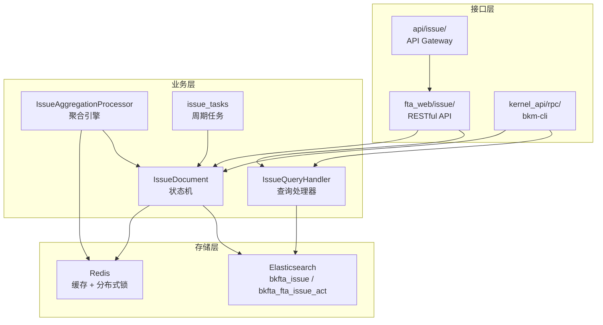
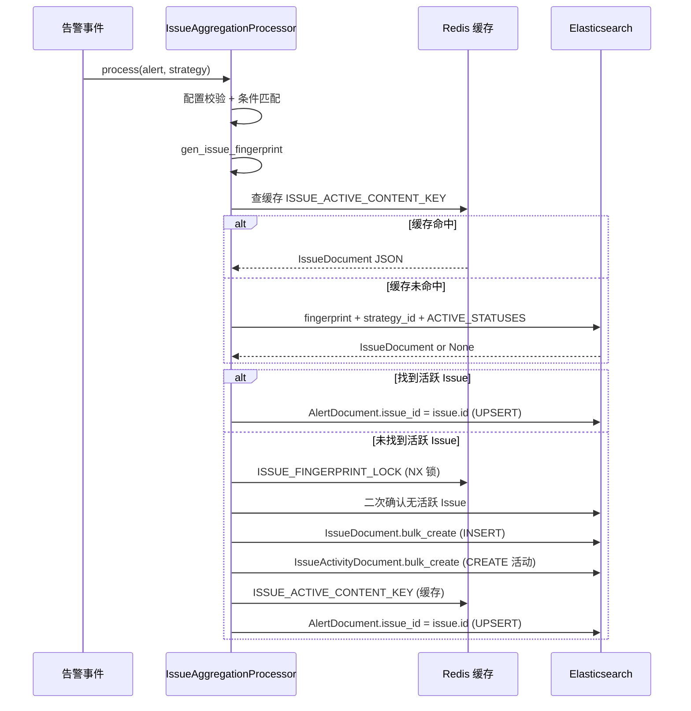

# Issue 实现文档

> 父专家：[agent.md](agent.md)
> 最后更新：2026-07-31

## 架构

## 模块拓扑

| 模块 | 路径 | 职责 |
|------|------|------|
| Web 接口层 | `packages/fta_web/issue/` | RESTful API、查询处理器、序列化 |
| 聚合处理器 | `alarm_backends/service/fta_action/issue_processor.py` | 告警 → Issue 聚合 |
| 周期任务 | `alarm_backends/service/fta_action/tasks/issue_tasks.py` | 后台统计同步 |
| 数据模型 | `bkmonitor/documents/issue.py` | ES 文档 + 状态机 |
| 常量 | `constants/issue.py` | 枚举定义 |
| 合并逻辑 | `bkmonitor/issue_merge.py` | Issue 合并/展开 |
| CLI/RPC | `kernel_api/rpc/functions/bkm_cli/issue.py` | bkm-cli 诊断 |
| API Gateway | `api/issue/default.py` | 蓝鲸网关接口 |
| LLM 标题 | `alarm_backends/service/fta_action/llm_title.py` | LLM 标题生成 |

## 数据流：告警 → Issue

## 关键设计决策

| 决策 | 说明 |
|------|------|
| fingerprint 指纹聚合 | `count_md5`，策略 ID + 排序维度值，维度缺失返回 None 跳过 |
| 三级活跃 Issue 查找 | Redis 缓存 → ES 标准查找 → Legacy 兜底 |
| 分布式锁 | 按 fingerprint 粒度，Lua 脚本 Token 锁防误删 |
| 高基数防护 | warn-only，不阻塞新建 |
| 双写策略 | 先 ES 后 Redis，ES 失败重试 1 次，Redis fail-silent |
| 批量操作 | ThreadPoolExecutor，max_workers=10，单条失败隔离 |
| backfill 优化 | O(N×M) → O(N+M)，策略级去重 |
| LLM 标题 | 独立队列 + 两级闸门 + CAS 保护 + 失败静默 |
