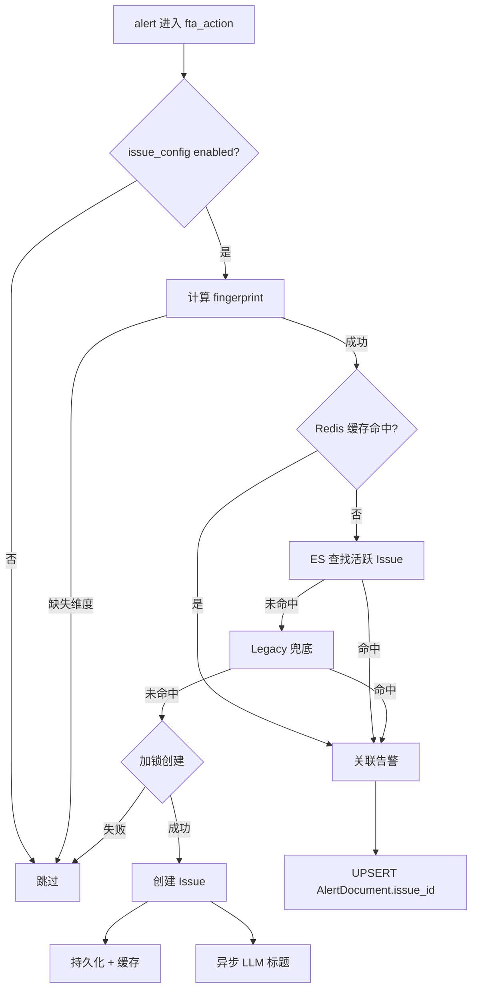

# 实现：Issue 专家

**本文引用的文件**
- [resources.py](file://bkmonitor/packages/fta_web/issue/resources.py)
- [views.py](file://bkmonitor/packages/fta_web/issue/views.py)
- [handlers/issue.py](file://bkmonitor/packages/fta_web/issue/handlers/issue.py)
- [documents/issue.py](file://bkmonitor/bkmonitor/documents/issue.py)
- [alarm_backends/service/fta_action/issue_processor.py](file://bkmonitor/alarm_backends/service/fta_action/issue_processor.py)
- [alarm_backends/service/fta_action/tasks/issue_tasks.py](file://bkmonitor/alarm_backends/service/fta_action/tasks/issue_tasks.py)

## 目录
1. [简介](#简介)
2. [核心流程](#核心流程)
3. [设计模式](#设计模式)
4. [关键类与函数](#关键类与函数)
5. [热点路径](#热点路径)
6. [技术债](#技术债)
7. [结论](#结论)

## 简介

Issue 模块的实现层横跨 Web API、ES 查询、状态机、聚合引擎、周期任务五大区域。Web 层以 DRF Resource 模式组织；聚合引擎在告警处理链路中异步执行；周期任务负责最终一致性补偿。

章节来源：[resources.py](file://bkmonitor/packages/fta_web/issue/resources.py#L1-L50)

## 核心流程

### 告警聚合流程

图表来源：[issue_processor.py](file://bkmonitor/alarm_backends/service/fta_action/issue_processor.py#L80-L200)

### Issue 状态变更批量流程

图表来源：[resources.py](file://bkmonitor/packages/fta_web/issue/resources.py#L75-L140)

章节来源：[resources.py](file://bkmonitor/packages/fta_web/issue/resources.py#L75-L140)

## 设计模式

| 模式 | 位置 | 用途 |
|------|------|------|
| Resource 模式 | `resources.py` | 每个 HTTP 端点对应一个 DRF Resource 类，统一入口 |
| 批量操作框架 | `_run_batch` | ThreadPoolExecutor 并发，错误隔离 |
| 状态机 | `IssueDocument` | 状态流转由模型方法封装，前置条件校验 |
| 查询转换器 | `IssueQueryTransformer` | 前端查询参数 → ES DSL 字段映射 |
| 三级查找 | `IssueAggregationProcessor._find_active_issue` | Redis → ES → Legacy 兜底，兼容迁移期数据 |

章节来源：[handlers/issue.py](file://bkmonitor/packages/fta_web/issue/handlers/issue.py#L39-L90)

## 关键类与函数

| 名称 | 路径 | 职责 |
|------|------|------|
| `IssueViewSet` | `views.py` | 注册所有 Issue/TAPD 路由，配置权限 |
| `IssueBusinessActionPermission` | `views.py` | 从多种来源提取 bk_biz_id 做 IAM 校验 |
| `TAPDAuthPermission` | `views.py` | 校验 TAPD 用户态 token，未授权引导 OAuth |
| `_run_batch` | `resources.py` | 批量操作公共框架 |
| `IssueQueryHandler` | `handlers/issue.py` | Issue 列表查询处理 |
| `IssueQueryTransformer` | `handlers/issue.py` | 查询字段转换 |
| `IssueDocument` | `documents/issue.py` | ES 文档模型 + 状态机 |
| `IssueAggregationProcessor` | `issue_processor.py` | 告警 → Issue 聚合 |
| `sync_issue_alert_stats` | `issue_tasks.py` | 周期同步与补偿 |

章节来源：[views.py](file://bkmonitor/packages/fta_web/issue/views.py#L20-L180)

## 热点路径

### 1. 告警聚合入口

- 文件：`issue_processor.py`
- 特点：每条告警触发一次，高并发。
- 优化：Redis 缓存活跃 Issue、按 fingerprint 分布式锁、ES count 缓存 5 分钟。

章节来源：[issue_processor.py](file://bkmonitor/alarm_backends/service/fta_action/issue_processor.py#L80-L160)

### 2. Issue 列表查询

- 文件：`handlers/issue.py`
- 特点：复杂过滤 + 时间分片 + 聚合统计。
- 优化：虚拟状态转换、TopN 时间分片并行、趋势查询结果缓存。

章节来源：[handlers/issue.py](file://bkmonitor/packages/fta_web/issue/handlers/issue.py#L557-L700)

### 3. 批量状态变更

- 文件：`resources.py`
- 特点：单条失败不能影响整体。
- 优化：ThreadPoolExecutor 10 并发，错误隔离，返回 succeeded/failed。

章节来源：[resources.py](file://bkmonitor/packages/fta_web/issue/resources.py#L75-L140)

## 技术债

| # | 问题 | 位置 | 影响 |
|---|------|------|------|
| 1 | Legacy 数据兜底逻辑 | `issue_processor.py` | 迁移期兼容代码，后续可清理 |
| 2 | `resources.py` 142KB 大文件 | `resources.py` | 单文件职责过重，可按子域拆分 |
| 3 | `query_log` 的 `total` 在统一查询路径恒为 0 | IssueLogContentResource | 如需精确总数需走原生路径 |
| 4 | TAPD token 加密依赖 `SECRET_KEY` | `utils/tapd.py` | 密钥轮转需同步处理 |

章节来源：[issue_processor.py](file://bkmonitor/alarm_backends/service/fta_action/issue_processor.py#L200-L300)

## 结论

Issue 模块通过 Resource 模式统一 Web 入口，状态机封装业务规则，聚合引擎与周期任务分离实时与最终一致性路径。实现上需特别关注高并发聚合性能与 ES 查询的正确性。
