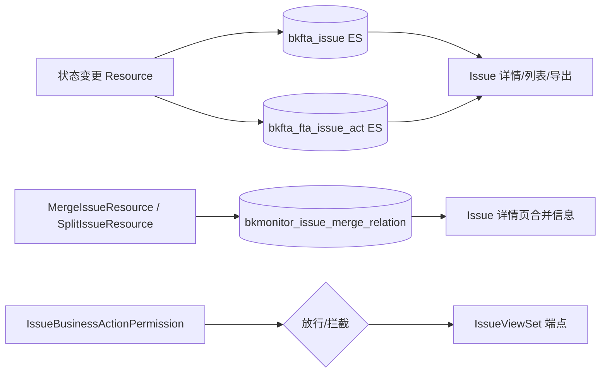

# 数据流向与消费：Issue API 子专家

> 契约快照生成于 2026-07-31。
> 若使用中发现行为与契约不符，可能代码已变更——expert-lookup 会自动增量修正，或用 expert-team 全量重建。

## 数据实体清单

| 数据实体 | 产生入口（本模块接口） | 去向 | 消费方（模块/功能级） | 业务用途 |
|----------|------------------------|------|----------------------|----------|
| Issue 文档修改 | `AssignIssueResource`、`ResolveIssueResource`、`ArchiveIssueResource`、`ReopenIssueResource`、`RestoreIssueResource`、`UpdateIssuePriorityResource`、`RenameIssueResource` | ES 索引 `bkfta_issue` | Issue Web API（详情/列表/导出）、告警详情页、周期任务 `sync_issue_alert_stats`、TAPD 集成模块 | 持久化 Issue 状态与元数据变更 |
| Issue 活动日志 | `AddIssueFollowUpResource`、`EditIssueFollowUpResource`、各类状态变更 Resource | ES 索引 `bkfta_fta_issue_act` | Issue 详情页活动流、审计查询 | 记录用户操作与评论，支持审计与回溯 |
| 批量操作结果 | `_run_batch` 框架 | HTTP 响应 `succeeded`/`failed` | 前端批量操作反馈 | 告知用户哪些 Issue 操作成功/失败 |
| Issue 合并关系 | `MergeIssueResource`、`SplitIssueResource` | MySQL `bkmonitor_issue_merge_relation` | 合并/拆分接口、Issue 详情页 | 记录主 Issue 与子 Issue 关系，支持拆分恢复 |
| 权限校验结果 | `IssueBusinessActionPermission`、`TAPDAuthPermission` | DRF 权限决策 | IssueViewSet 所有端点 | 控制接口访问权限与 TAPD 授权引导 |

## 数据流向图（黑盒级）

## 消费方影响提示

- 状态变更接口写入 ES 后，列表查询需等待 ES 近实时刷新才能看到最新状态。
- 批量操作中部分失败不会影响其他条目的持久化结果；调用方必须处理 `failed` 数组。
- Issue 合并后，源 Issue 被冻结，其状态变更只能通过主 Issue 级联触发，或先拆分后独立操作。
