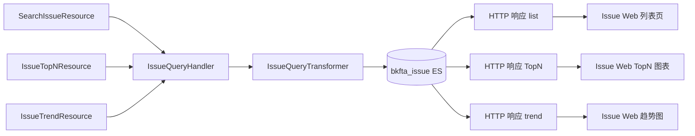

# 数据流向与消费：Issue 查询子专家

> 契约快照生成于 2026-07-31。
> 若使用中发现行为与契约不符，可能代码已变更——expert-lookup 会自动增量修正，或用 expert-team 全量重建。

## 数据实体清单

| 数据实体 | 产生入口（本模块接口） | 去向 | 消费方（模块/功能级） | 业务用途 |
|----------|------------------------|------|----------------------|----------|
| Issue 列表结果 | `IssueQueryHandler.search()` | HTTP 响应 `list` | Issue Web 列表页、导出功能 | 展示 Issue 列表与分页 |
| Issue 聚合统计结果 | `IssueQueryHandler.top_n()` | HTTP 响应 TopN 数据 | Issue Web TopN 图表、Dashboard | 按维度展示 Issue 分布 |
| Issue 趋势数据 | `IssueTrendResource.perform_request()` | HTTP 响应 trend 数据 | Issue Web 趋势图 | 展示 Issue 活跃/已解决趋势 |
| 原始 ES DSL | `IssueQueryHandler.search(show_dsl=True)` | 调试返回 | 开发/测试排查 | 用于定位查询问题 |

## 数据流向图（黑盒级）

## 消费方影响提示

- 查询结果是 ES 近实时数据，新建/状态变更后可能需等待刷新。
- `show_dsl=True` 仅用于调试，生产环境不建议开启。
- TopN 与趋势查询在大时间范围时会触发分片并行，调用方无需关心去重细节。
