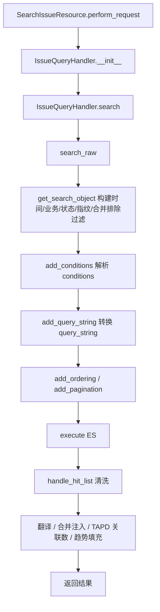
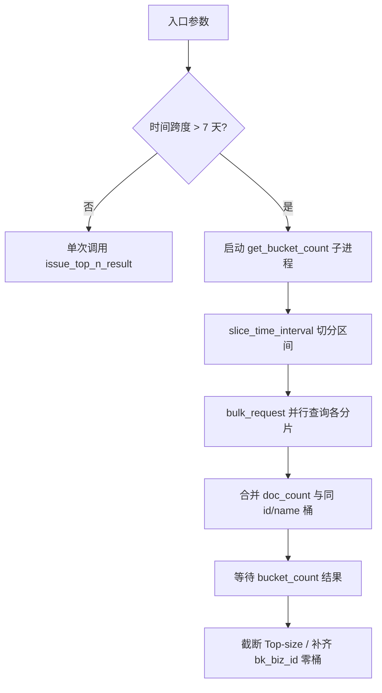

# 实现：Issue 查询子专家

**本文引用的文件**
- [Issue 查询处理器](file://bkmonitor/packages/fta_web/issue/handlers/issue.py)
- [Issue Resource](file://bkmonitor/packages/fta_web/issue/resources.py)
- [Base 查询处理器](file://bkmonitor/packages/fta_web/alert/handlers/base.py)
- [时间分片工具](file://bkmonitor/packages/fta_web/alert/utils.py)

## 目录
1. [简介](#简介)
2. [核心查询构建流程](#核心查询构建流程)
3. [字段转换与映射模式](#字段转换与映射模式)
4. [TopN 聚合实现](#topn-聚合实现)
5. [时间分片与并行查询](#时间分片与并行查询)
6. [关键类与函数](#关键类与函数)
7. [热点路径](#热点路径)
8. [技术债](#技术债)
9. [结论](#结论)

## 简介

Issue 查询子专家的实现核心是 `IssueQueryHandler` + `IssueQueryTransformer`：前者负责把前端请求参数组装成 ES DSL 并清洗结果；后者负责字段名到 ES 字段的映射、query_string 转换。TopN 与趋势在 Resource 层做分片编排，`IssueQueryHandler` 提供原子查询能力。
章节来源：[issue.py](file://bkmonitor/packages/fta_web/issue/handlers/issue.py#L35-L574)

## 核心查询构建流程

图表来源：[issue.py](file://bkmonitor/packages/fta_web/issue/handlers/issue.py#L145-L574)

- `get_search_object` 是查询条件的主入口，按状态分流时间过滤：活跃状态不受 `start_time` / `end_time` 限制；已解决按 `resolved_time`、已归档按 `update_time` 归属。
- 时间分片模式下，非最终分片只取 `create_time <= end_time` 且已解决/已归档落在 `[start, end)` 的文档；最终分片额外承接所有活跃 Issue。
章节来源：[issue.py](file://bkmonitor/packages/fta_web/issue/handlers/issue.py#L145-L240)

## 字段转换与映射模式

`IssueQueryTransformer` 通过 `query_fields` 定义可查询字段：

- 普通字段直接映射为 ES 字段；
- `KEYWORD_FIELD_MAPPING` 把 `name` / `strategy_name` 重定向到 `.raw` 精确字段；
- `impact_scope.{dim}` 动态字段通过 `ImpactScopeDimension.get_full_dimension(dim)` 解析为 `impact_scope.{dim}.instance_list.{id_field}`；
- `VALUE_TRANSLATE_FIELDS` 支持 `status` / `priority` 的中英文互转。

`parse_condition_item` 覆盖两类特殊查询：

- `key == "impact_dimensions"`：构造 `exists` 查询，判断 Issue 是否包含某影响维度；
- `key in KEYWORD_FIELD_MAPPING`：把前端 key 替换为 ES key 后交给基类 terms 处理。
章节来源：[issue.py](file://bkmonitor/packages/fta_web/issue/handlers/issue.py#L35-L265)

## TopN 聚合实现

`IssueQueryHandler.top_n()` 统一处理聚合：

1. 调用 `get_search_object()` + `add_conditions()` + `add_query_string()` 构造过滤后的 Search；
2. 对每个 `field` 调用 `add_agg_bucket()` 挂载 terms / filters 聚合，并可选挂载 cardinality 基数聚合；
3. 按字段类型分别解析桶：
   - `impact_dimensions`：filters 聚合，返回有数据的维度；
   - `impact_scope.{dim}`：terms 聚合 + `top_hits` 子聚合取 `display_name`；
   - `dimension_values.{key}`：Flattened 子字段 terms 聚合；
   - `bk_biz_id`：补齐授权业务中 0 计数的桶；
   - 其他：标准 terms 聚合。
4. 通过 `translators` 把 `id` 翻译为可读 `name`，并对 `is_char` 字段的 `id` 加双引号。

章节来源：[issue.py](file://bkmonitor/packages/fta_web/issue/handlers/issue.py#L266-L556)

## 时间分片与并行查询

`IssueTopNResource.perform_request()` 负责大时间范围的分片：

图表来源：[resources.py](file://bkmonitor/packages/fta_web/issue/resources.py#L219-L438)

- `slice_time_interval` 根据跨度选择日/周/月分片策略：跨度 >=30 天按月、>=7 天按周、>=1 天按日、<1 天不分片。
- 分片合并时以 `(id, name)` 为唯一键累加 `count`，避免同名不同 id 或同 id 不同 name 的桶被错误合并。
- `bucket_count` 需要跨全时间范围基数聚合，单独放在子进程中与分片查询并行。
章节来源：[utils.py](file://bkmonitor/packages/fta_web/alert/utils.py#L178-L210)

## 关键类与函数

| 名称 | 路径 | 职责 |
|------|------|------|
| `IssueQueryTransformer` | [issue.py](file://bkmonitor/packages/fta_web/issue/handlers/issue.py#L35-L110) | Issue ES 字段转换器：字段映射、query_string 转换 |
| `IssueQueryHandler` | [issue.py](file://bkmonitor/packages/fta_web/issue/handlers/issue.py#L112-L574) | Issue 查询主处理器 |
| `IssueQueryHandler.get_search_object()` | [issue.py](file://bkmonitor/packages/fta_web/issue/handlers/issue.py#L145-L240) | 构建带时间/业务/状态/指纹/合并排除的 Search 对象 |
| `IssueQueryHandler.parse_condition_item()` | [issue.py](file://bkmonitor/packages/fta_web/issue/handlers/issue.py#L240-L265) | 处理 impact_scope / 普通 conditions |
| `IssueQueryHandler.top_n()` | [issue.py](file://bkmonitor/packages/fta_web/issue/handlers/issue.py#L266-L556) | TopN 聚合主入口 |
| `IssueQueryHandler.search()` | [issue.py](file://bkmonitor/packages/fta_web/issue/handlers/issue.py#L574-L689) | 列表查询主入口 |
| `IssueQueryHandler.add_alert_trend()` | [issue.py](file://bkmonitor/packages/fta_web/issue/handlers/issue.py#L800-L898) | 批量查询告警趋势并回填 |
| `IssueQueryHandler.get_alert_trend()` | [issue.py](file://bkmonitor/packages/fta_web/issue/handlers/issue.py#L900-L955) | 按 Issue ID 批量查询趋势 |
| `IssueTopNResource` | [resources.py](file://bkmonitor/packages/fta_web/issue/resources.py#L219-L319) | TopN HTTP 入口与分片编排 |
| `IssueTopNResultResource` | [resources.py](file://bkmonitor/packages/fta_web/issue/resources.py#L199-L224) | 供 bulk_request 调用的子资源 |
| `IssueTrendResource` | [resources.py](file://bkmonitor/packages/fta_web/issue/resources.py#L461-L495) | 趋势查询 HTTP 入口 |
| `SearchIssueResource` | [resources.py](file://bkmonitor/packages/fta_web/issue/resources.py#L438-L460) | Issue 列表 HTTP 入口 |
| `slice_time_interval` | [utils.py](file://bkmonitor/packages/fta_web/alert/utils.py#L190-L210) | 智能时间分片 |

## 热点路径

1. **Issue 列表页**：`SearchIssueResource` 高频调用，每次触发 ES 查询 + AlertDocument 趋势查询 + TAPD 关联数 SQL 查询；大时间范围/大 page_size 时性能敏感。
2. **TopN 仪表盘**：`IssueTopNResource` 在大时间范围下走分片并行，对 ES 聚合压力较大；`impact_scope` / `dimension_values` 聚合涉及 flattened 字段与 top_hits，成本高于普通 terms。
3. **合并/拆分 hydrate**：`IssueMergeResolver.hydrate_aggregations` 与 `get_active_member_ids` 在列表/TopN/Export 路径都会执行，涉及 SQL 与 ES 双读。
章节来源：[issue.py](file://bkmonitor/packages/fta_web/issue/handlers/issue.py#L619-L640)

## 技术债

- `IssueTopNResource` 使用 `ThreadPool(processes=1)` 跑 `get_bucket_count`，随后在同一进程里再启动大量 bulk_request 子请求，进程模型较厚重，可考虑轻量线程池或协程优化。
- `add_alert_trend` 中默认时间序列的 `aligned_end` 计算为 `trend_end // interval * interval + interval`，可能超出用户请求的 `trend_end_time`。
- `IssueQueryHandler.get_search_object` 中合并排除逻辑依赖 `IssueMergeResolver.get_active_member_ids`，大业务集合时返回的 member ID 列表可能很大，terms 排除存在 ES 上限风险。
- `search()` 方法职责较重，集查询、翻译、合并注入、拆分注入、TAPD 查询、趋势填充于一体，后续可考虑拆分为多个 pipeline stage。
- 全文检索的 `query_string` 仍走 Lucene 语法解析，对前端用户不够友好，且特殊字符需转义。

## 结论

Issue 查询实现以 ES 为核心，通过 `IssueQueryTransformer` 屏蔽字段差异，通过 `IssueQueryHandler` 统一处理列表/TopN/趋势三类查询。时间分片与合并/拆分视图是两条关键复杂度来源，所有查询路径都复用了同一套 `get_search_object` 过滤逻辑以保证口径一致。
