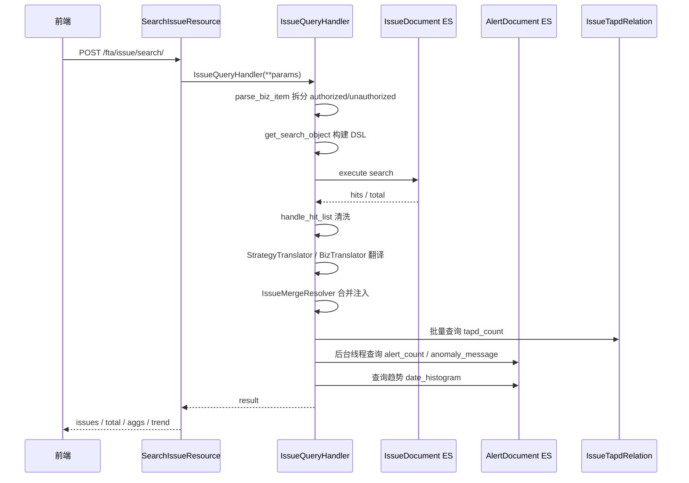
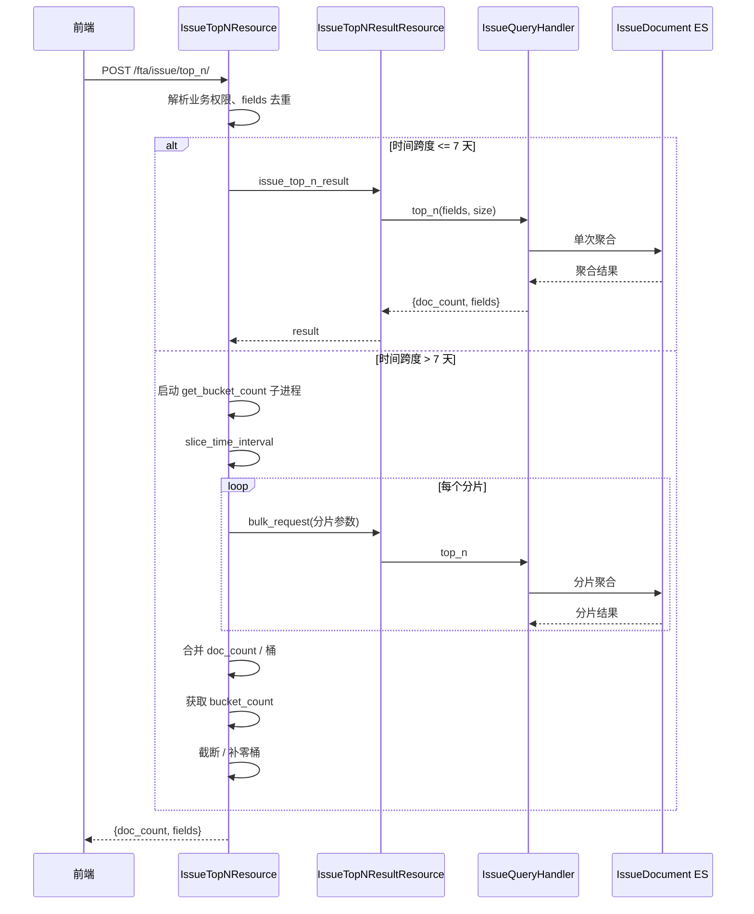

# 数据流转：Issue 查询子专家

**本文引用的文件**
- [Issue 查询处理器](file://bkmonitor/packages/fta_web/issue/handlers/issue.py)
- [Issue Resource](file://bkmonitor/packages/fta_web/issue/resources.py)
- [Base 查询处理器](file://bkmonitor/packages/fta_web/alert/handlers/base.py)
- [时间分片工具](file://bkmonitor/packages/fta_web/alert/utils.py)

## 目录
1. [简介](#简介)
2. [Issue 列表查询生命周期](#issue-列表查询生命周期)
3. [TopN 查询生命周期](#topn-查询生命周期)
4. [时间分片逻辑](#时间分片逻辑)
5. [结果合并与回填](#结果合并与回填)
6. [异常与降级](#异常与降级)
7. [结论](#结论)

## 简介

Issue 查询的数据流以 ES `IssueDocument` 为主存储，查询结果在返回前会经过字段清洗、业务翻译、合并/拆分视图注入、告警趋势/数量回填等加工。TopN 与趋势查询还会涉及 AlertDocument 与 SQL 关系表。本章描述请求从入口到响应的完整生命周期。
章节来源：[issue.py](file://bkmonitor/packages/fta_web/issue/handlers/issue.py#L1-L30)

## Issue 列表查询生命周期

图表来源：[issue.py](file://bkmonitor/packages/fta_web/issue/handlers/issue.py#L574-L689)

- 入口 `SearchIssueResource.perform_request` 从请求参数中弹出 `show_aggs`、`show_dsl`、`show_trend` 后，把其余参数透传给 `IssueQueryHandler`。
- `search()` 先调用 `search_raw()` 拿到 ES 结果与可选 DSL，再依次做结果后处理。
- 趋势查询 `add_alert_trend` 与 `add_alert_summary` 会根据 `show_trend` 二选一执行。
章节来源：[resources.py](file://bkmonitor/packages/fta_web/issue/resources.py#L438-L460)

## TopN 查询生命周期

图表来源：[resources.py](file://bkmonitor/packages/fta_web/issue/resources.py#L219-L438)

- `IssueTopNResultResource` 是原子资源，仅负责把参数转成 `IssueQueryHandler.top_n()` 调用。
- `IssueTopNResource` 是分片编排层，不直接执行 ES 查询。
章节来源：[resources.py](file://bkmonitor/packages/fta_web/issue/resources.py#L199-L224)

## 时间分片逻辑

`slice_time_interval` 根据时间跨度决定分片粒度：

| 时间跨度 | 分片粒度 |
|----------|----------|
| < 1 天 | 不分片 |
| >= 1 天 且 < 30 天 | 按天 |
| >= 7 天 且 < 30 天 | 按周 |
| >= 30 天 | 按月 |

章节来源：[utils.py](file://bkmonitor/packages/fta_web/alert/utils.py#L190-L210)

在 `get_search_object` 中，分片参数 `is_time_partitioned` 与 `is_finally_partition` 控制时间过滤口径：

- 非最终分片：`create_time <= end_time`，且已解决/已归档的 close 时间落在 `[start, end)`；
- 最终分片/非分片：活跃状态不过滤时间，已解决/已归档按 close 时间过滤，非最终分片有 `end_time` 上界。

这样保证跨天存在的 Issue 不会被重复计数：已解决 Issue 按 `resolved_time` 唯一归属某个分片。
章节来源：[issue.py](file://bkmonitor/packages/fta_web/issue/handlers/issue.py#L145-L240)

## 结果合并与回填

### TopN 合并

- `doc_count` 直接相加（分片间按 `resolved_time` 不重叠）。
- 每个字段以 `(id, name)` 为键累加 `count`。
- `bucket_count` 来自全时间范围的基数聚合；若 `bucket_count <= size`，则使用实际桶数。
- `bk_biz_id` 字段补齐授权业务中 0 计数的桶，再按 `size` 截断。
章节来源：[resources.py](file://bkmonitor/packages/fta_web/issue/resources.py#L319-L438)

### 趋势合并

`get_alert_trend` 中：

1. 先按 `MergeResolverContext` 把请求 ID resolve 到主 Issue ID；
2. 展开为 `[main, ...members]` 查询 AlertDocument；
3. 按 100 个 Issue 一批查询 `IssueAlertDateHistogramResultResource`；
4. 同一 display_issue_id 下按时间戳累加 count；
5. 最终返回 key 为原始请求 ID 的时间序列。
章节来源：[issue.py](file://bkmonitor/packages/fta_web/issue/handlers/issue.py#L900-L955)

### 合并/拆分视图回填

- `search()` 中按页内 distinct `bk_biz_id` 构建 `MergeResolverContext`，加载后调用 `hydrate_aggregations`；
- 对 role=main 的 Issue 重新 enrich `impact_scope`，保证 member instance 的 `alert_query_fields` 一致；
- 拆分信息 `split_info` 按页内 Issue ID 批量查询 `IssueMergeRelation`；
- TAPD 关联数 `tapd_count` 按页内 Issue ID + bk_biz_id 批量查询 SQL。
章节来源：[issue.py](file://bkmonitor/packages/fta_web/issue/handlers/issue.py#L619-L689)

## 异常与降级

| 异常点 | 行为 | 来源 |
|--------|------|------|
| ES search 失败 | 返回空列表 + total=0，异常 `data` 携带该结果后抛出 | [issue.py](file://bkmonitor/packages/fta_web/issue/handlers/issue.py#L577-L589) |
| TAPD 关联数查询失败 | `tapd_count` 默认 0，不阻塞主路径 | [issue.py](file://bkmonitor/packages/fta_web/issue/handlers/issue.py#L677-L688) |
| 合并关系加载失败 | `merge_status` 不注入，查询结果仍返回 | [issue.py](file://bkmonitor/packages/fta_web/issue/handlers/issue.py#L619-L640) |
| 趋势查询失败 | `trend` 返回默认零值序列，`alert_count=0`，`anomaly_message="--"` | [issue.py](file://bkmonitor/packages/fta_web/issue/handlers/issue.py#L850-L865) |
| `_fill_anomaly_message` 失败 | `alert_count=0`，`anomaly_message="--"` | [issue.py](file://bkmonitor/packages/fta_web/issue/handlers/issue.py#L957-L1026) |

## 结论

Issue 查询的数据流呈现"一个主 ES 查询 + 多个后置回填"的模式：主查询负责命中与分页，后置回填负责业务可读性、合并/拆分视图、告警趋势。时间分片只在 TopN 路径显式编排，趋势查询通过 `IssueAlertDateHistogramResultResource.sliced_date_histogram` 复用分片能力。所有降级都遵循 fail-open，避免查询侧故障扩散。
