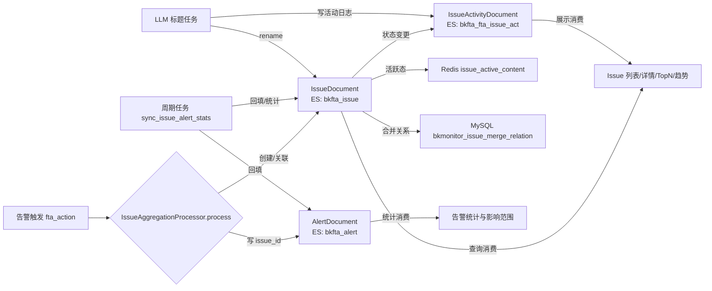

# 数据流向与消费：Issue 状态聚合子专家

> 契约快照生成于 2026-07-31。
> 若使用中发现行为与契约不符，可能代码已变更——expert-lookup 会自动增量修正，或用 expert-team 全量重建。

## 数据实体清单

| 数据实体 | 产生入口（本模块接口） | 去向 | 消费方（模块/功能级） | 业务用途 |
|----------|------------------------|------|----------------------|----------|
| Issue 文档 | `IssueDocument` 状态机方法（`assign`/`resolve`/`archive`/`reopen`/`restore`）、`IssueAggregationProcessor.process` | ES 索引 `bkfta_issue` | Issue 列表查询、Issue 详情、TopN/趋势统计、TAPD 关联 | 作为问题聚合与跟踪的持久化主体，承载状态、负责人、优先级、告警统计、影响范围 |
| 活动日志 | `IssueDocument` 状态机方法、合并/拆分操作 | ES 索引 `bkfta_fta_issue_act` | Issue 详情时间线、审计追溯、LLM 标题来源判别、归档前状态推断 | 记录 Issue 生命周期中的状态、负责人、优先级、评论、合并/拆分等变更，供前端时间线与审计使用 |
| 告警-Issue 关联 | `IssueAggregationProcessor.process` 写入 `AlertDocument.issue_id` | ES 索引 `bkfta_alert` | 周期任务统计、影响范围重算、告警详情展示 | 将单条告警归属到对应 Issue，使 Issue 能聚合同根因告警 |
| Redis 活跃 Issue 缓存 | `_update_redis_cache` / `_delete_redis_cache` | Redis `issue_active_content:{fingerprint}` | `IssueAggregationProcessor` 查找活跃 Issue | 按 fingerprint 缓存活跃 Issue 全量字典，减少高频告警聚合时的 ES 查询 |
| Redis 单策略活跃数缓存 | `_check_active_issue_count` | Redis `issue_active_count:{strategy_id}` | 高基数监控指标 | 采样缓存单策略活跃 Issue 数，供 Prometheus 指标 `bkmonitor_issue_fingerprint_blocked{reason=high_cardinality}` 观测 |
| Redis legacy 迁移哨兵 | `_mark_legacy_migration_done` / `_renew_legacy_migration_done_sentinel_if_needed` | Redis `issue_legacy_migration_done` | `IssueAggregationProcessor._find_active_issue` | 标记旧 1:1 模型数据已迁移完成，processor 据此跳过 legacy fallback ES 查询 |
| Redis LLM 标题限流计数 | `acquire_rate_limit_token` | Redis `issue_llm_title_rate_limit:{bk_biz_id}:{minute}` | LLM 标题生成任务 | 按业务分钟级固定窗口限流，防止 LLM 网关被打满 |
| Redis few-shot 示例缓存 | `refresh_issue_llm_title_examples` | Redis `issue_llm_examples_strategy:{strategy_id}` / `issue_llm_examples_biz:{bk_biz_id}` | LLM 标题生成 prompt 组装 | 缓存用户认可的标题示例，为 LLM 生成提供风格参考 |
| Issue 合并关系 | `IssueMergeRelation.objects.create` / `update` | MySQL 表 `bkmonitor_issue_merge_relation` | Issue 合并/拆分 API、状态机冻结守卫、级联状态同步 | 维护主 Issue 与成员 Issue 的映射关系，实现合并组生命周期管理 |
| Issue-TAPD 关联 | 由 TAPD 集成子专家写入（本专家只消费其存在性做冻结守卫） | MySQL 表 `bkmonitor_issue_tapd_relation` | TAPD 集成子专家 | 标记 Issue 与 TAPD 单据的关联，解绑工作区时校验活跃关联 |

## 数据流向图（黑盒级）

## 消费方影响提示

- 调用 `IssueDocument` 状态机方法会同步写入 ES 与活动日志；失败时抛 `IssueDocumentWriteError`，调用方应提示用户操作未生效。
- 告警聚合路径（`IssueAggregationProcessor.process`）对 ES/Redis 异常是 fail-silent 的，不会阻断通知等主流程；但可能导致告警未即时归属到 Issue，由周期任务后续补偿。
- Redis 缓存仅在 worker/api role 可写；web role 调用状态机时因无 Redis 配置会跳过缓存操作，功能仍正确但性能略降。
- LLM 标题生成是体验增强型异步任务，失败保留默认名，不影响 Issue 核心数据。
