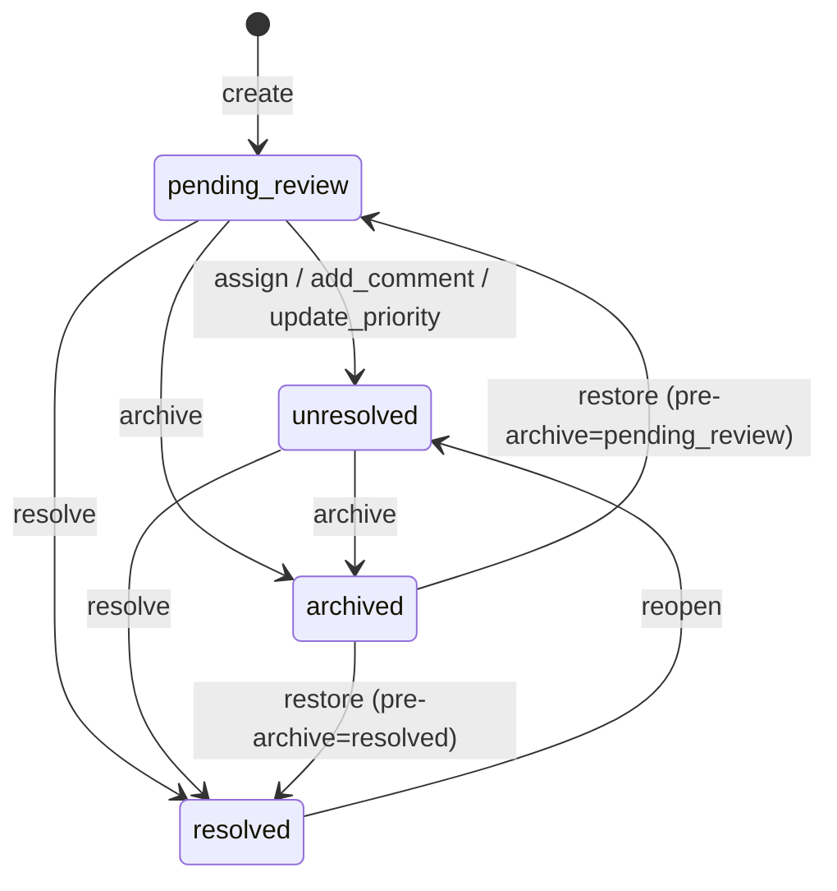
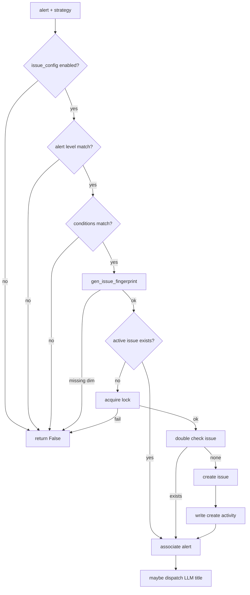
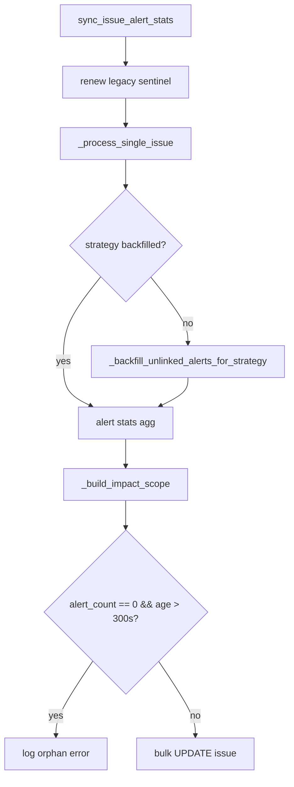
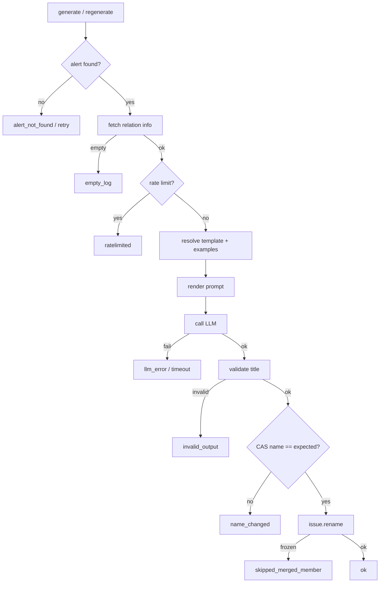

# 实现：Issue 状态聚合子专家

**本文引用的文件**
- [Issue 数据模型](file://bkmonitor/documents/issue.py)
- [聚合处理器](file://alarm_backends/service/fta_action/issue_processor.py)
- [周期任务](file://alarm_backends/service/fta_action/tasks/issue_tasks.py)
- [LLM 标题](file://alarm_backends/service/fta_action/llm_title.py)
- [Issue 标题工具](file://bkmonitor/utils/issue_title.py)
- [合并关系解析器](file://bkmonitor/issue_merge/resolver.py)
- [Issue 常量](file://constants/issue.py)

## 目录
1. [简介](#简介)
2. [状态机实现](#状态机实现)
3. [聚合引擎实现](#聚合引擎实现)
4. [周期任务实现](#周期任务实现)
5. [LLM 标题生成实现](#llm-标题生成实现)
6. [关键类与函数](#关键类与函数)
7. [热点路径](#热点路径)
8. [技术债与注意事项](#技术债与注意事项)
9. [结论](#结论)

## 简介

Issue 状态聚合子专家负责把告警收敛为 Issue、维护 Issue 生命周期、周期同步统计信息、以及为日志类 Issue 生成可读标题。实现代码主要分布在 `documents/issue.py`（状态机与持久化）、`issue_processor.py`（告警 → Issue 聚合）、`tasks/issue_tasks.py`（周期同步与 LLM 标题任务）、`llm_title.py`（LLM 标题渲染与校验）四个文件中。

章节来源：[Issue 数据模型](file://bkmonitor/documents/issue.py#L44-L60)、[聚合处理器](file://alarm_backends/service/fta_action/issue_processor.py#L82-L90)

## 状态机实现

`IssueDocument` 在 ES 文档模型上直接封装状态机方法：`assign`、`reassign`、`resolve`、`archive`、`reopen`、`restore`、`add_comment`、`update_priority`、`rename`。每个方法入口调用 `IssueMergeResolver.assert_not_frozen` 防止直接操作合并 member；状态校验不通过时构造面向用户的中文报错。

状态流转矩阵：

图表来源：[Issue 数据模型](file://bkmonitor/documents/issue.py#L175-L335)

状态机方法的共同模式：

- 先过 `assert_not_frozen` 守卫。
- 校验当前状态是否允许目标动作；`resolve` 先做幂等短路（已是 `resolved` 则 no-op）。
- 修改字段、`update_time`；终态写入 `resolved_time`，`reopen`/`restore` 到活跃态时清空 `resolved_time`（`skip_empty=False` 显式写 null）。
- 调用 `_persist_and_cache(active=...)` 双写 ES 与 Redis。
- 调用 `_write_activities` 写活动日志。
- `resolve`/`archive`/`reopen`/`restore` 结尾调用 `_cascade_follow_status`，同步所有 active member 的 ES status。

章节来源：[Issue 数据模型](file://bkmonitor/documents/issue.py#L175-L335)

## 聚合引擎实现

`IssueAggregationProcessor.process` 是告警 → Issue 聚合的唯一入口。流程：

图表来源：[聚合处理器](file://alarm_backends/service/fta_action/issue_processor.py#L90-L170)

核心设计点：

- **指纹来源**：`gen_issue_fingerprint` 从 `alert.event.extra_info.origin_alarm.data.dimensions` 取值，与 `aggregate_dimensions` 的键对齐；维度缺失/空值时返回 `None`，该告警被跳过。
- **查找活跃 Issue**：Redis 缓存 → ES 标准 fingerprint 查询 → legacy fallback（部署窗口期）。缓存命中时反序列化为 `IssueDocument`；标准查询命中后回写缓存。
- **并发控制**：按 fingerprint 抢 `SET NX EX` 锁，token 保证只释放自己持有的锁；同 fingerprint 并发只允许一个 worker 创建 Issue。
- **高基数防护**：`ISSUE_MAX_ACTIVE_PER_STRATEGY` 阈值触达时仅 metric + warning，不阻塞新建；ES count 结果缓存 5 分钟并带 jitter。
- **回归判断**：同 fingerprint 存在 `resolved` 历史则新 Issue 标记 `is_regression`，默认名前缀 `[回归]`。

章节来源：[聚合处理器](file://alarm_backends/service/fta_action/issue_processor.py#L30-L80)、[聚合处理器](file://alarm_backends/service/fta_action/issue_processor.py#L298-L370)

## 周期任务实现

`sync_issue_alert_stats` 是 `celery_action_cron` 队列上的周期任务。主循环使用 `search_after` 逐页扫描活跃 Issue，对每个 Issue 调用 `_process_single_issue`：

图表来源：[周期任务](file://alarm_backends/service/fta_action/tasks/issue_tasks.py#L55-L140)、[周期任务](file://alarm_backends/service/fta_action/tasks/issue_tasks.py#L157-L230)

`_backfill_unlinked_alerts_for_strategy` 是性能关键路径：

- 旧实现为每条 Issue 单独扫描同 strategy unlinked alerts，复杂度 O(N×M)。
- 新实现按 strategy 一次扫描所有活跃 Issue 分组建 map，再扫描一次 unlinked alerts，内存匹配，复杂度 O(N+M)。
- 匹配优先级：live config 对应 group 优先，其余按聚合维度长度降序（具体优先于 catch-all）。
- 时间边界：`alert.begin_time >= issue.create_time`，否则跳过，避免时间线断裂。
- 扫描下界：`max(earliest_create_time, now - 7 天)`，防止长生命周期策略 alert scan 爆炸。

章节来源：[周期任务](file://alarm_backends/service/fta_action/tasks/issue_tasks.py#L240-L370)

`impact_scope` 构建：

- 扫描所有关联告警的 dimensions，按资源类型聚合为 `set`、`host`、`service_instances`、`cluster`/`node`/`service`/`pod`、`apm_app`/`apm_service`。
- 聚合维度非空时，只输出与维度类型对应的 key；空维度时全量输出。
- 输出含 `count`、`instance_list`、`link_tpl`，支持前端跳转。

章节来源：[周期任务](file://alarm_backends/service/fta_action/tasks/issue_tasks.py#L460-L740)

## LLM 标题生成实现

LLM 标题生成有两条入口：自动派发 `generate_issue_llm_title` 与运维补偿 `regenerate_issue_llm_title`，两者共享 `_apply_llm_title` 核心逻辑：

图表来源：[周期任务](file://alarm_backends/service/fta_action/tasks/issue_tasks.py#L800-L1080)、[LLM 标题](file://alarm_backends/service/fta_action/llm_title.py#L180-L260)

核心设计点：

- **两级闸门**：部署级 `ENABLE_ISSUE_LLM_TITLE` + 运行时业务白名单 `ISSUE_LLM_TITLE_BIZ_WHITE_LIST`。
- **CAS 保护**：写入前检查当前 `name` 是否仍为 `expected_name`，防止覆盖用户抢先改名。
- **回归前缀**：由代码层按 `is_regression` 拼接 `[回归]`，不交给 LLM。
- **失败静默**：任何失败保留默认名，不重试不入队。
- **few-shot 示例**：`refresh_issue_llm_title_examples` 周期扫描近 30 天用户改名，按 strategy / biz 两级写入 Redis；读路径纯 GET。

章节来源：[周期任务](file://alarm_backends/service/fta_action/tasks/issue_tasks.py#L800-L1080)、[LLM 标题](file://alarm_backends/service/fta_action/llm_title.py#L1-L120)

## 关键类与函数

| 名称 | 路径 | 职责 |
|------|------|------|
| `IssueDocument` | [bkmonitor/documents/issue.py](file://bkmonitor/documents/issue.py#L44) | ES 文档模型 + 状态机 + 持久化 |
| `IssueActivityDocument` | [bkmonitor/documents/issue.py](file://bkmonitor/documents/issue.py#L911) | 活动/评论日志模型 |
| `IssueAggregationProcessor` | [alarm_backends/service/fta_action/issue_processor.py](file://alarm_backends/service/fta_action/issue_processor.py#L82) | 告警 → Issue 聚合 |
| `gen_issue_fingerprint` | [alarm_backends/service/fta_action/issue_processor.py](file://alarm_backends/service/fta_action/issue_processor.py#L30) | 生成 Issue 唯一指纹 |
| `_TokenLock` | [alarm_backends/service/fta_action/issue_processor.py](file://alarm_backends/service/fta_action/issue_processor.py#L580) | Redis token 锁，安全释放 |
| `sync_issue_alert_stats` | [alarm_backends/service/fta_action/tasks/issue_tasks.py](file://alarm_backends/service/fta_action/tasks/issue_tasks.py#L55) | 周期同步入口 |
| `_backfill_unlinked_alerts_for_strategy` | [alarm_backends/service/fta_action/tasks/issue_tasks.py](file://alarm_backends/service/fta_action/tasks/issue_tasks.py#L240) | 按 strategy 批量回填漏关联告警 |
| `_build_impact_scope` | [alarm_backends/service/fta_action/tasks/issue_tasks.py](file://alarm_backends/service/fta_action/tasks/issue_tasks.py#L460) | 按关联告警汇总影响范围 |
| `generate_issue_llm_title` | [alarm_backends/service/fta_action/tasks/issue_tasks.py](file://alarm_backends/service/fta_action/tasks/issue_tasks.py#L820) | 自动 LLM 标题任务 |
| `regenerate_issue_llm_title` | [alarm_backends/service/fta_action/tasks/issue_tasks.py](file://alarm_backends/service/fta_action/tasks/issue_tasks.py#L1180) | 运维显式补偿 |
| `_apply_llm_title` | [alarm_backends/service/fta_action/tasks/issue_tasks.py](file://alarm_backends/service/fta_action/tasks/issue_tasks.py#L960) | LLM 标题生成核心逻辑 |
| `build_issue_default_name` | [bkmonitor/utils/issue_title.py](file://bkmonitor/utils/issue_title.py#L47) | 生成默认名称 |
| `IssueMergeResolver` | [bkmonitor/issue_merge/resolver.py](file://bkmonitor/issue_merge/resolver.py#L90) | 合并关系解析与 member 冻结守卫 |

章节来源：[Issue 数据模型](file://bkmonitor/documents/issue.py#L44-L60)、[聚合处理器](file://alarm_backends/service/fta_action/issue_processor.py#L82-L90)、[周期任务](file://alarm_backends/service/fta_action/tasks/issue_tasks.py#L55-L70)

## 热点路径

- **告警聚合**：`IssueAggregationProcessor.process` 在每次 fta_action 异常/无数据信号时执行，QPS 与告警量成正比。指纹计算、Redis 缓存读取、ES 查询是主要开销。
- **周期同步**：`sync_issue_alert_stats` 扫描全量活跃 Issue，高基数策略下 `_backfill_unlinked_alerts_for_strategy` 的 alert scan 是主要开销；通过按 strategy 去重与 7 天回界控制。
- **LLM 标题**：独立队列 `celery_llm_task`，取关联日志与 LLM 调用是耗时点；设有 soft/hard time limit 与业务级限流。
- **impact_scope 构建**：逐条扫描关联告警 dimensions，Issue 关联告警量大时成为 CPU/IO 热点；输出被前端列表/详情高频读取。

章节来源：[聚合处理器](file://alarm_backends/service/fta_action/issue_processor.py#L90-L170)、[周期任务](file://alarm_backends/service/fta_action/tasks/issue_tasks.py#L55-L140)、[周期任务](file://alarm_backends/service/fta_action/tasks/issue_tasks.py#L460-L740)

## 技术债与注意事项

- **legacy fallback**：部署窗口期 `fingerprint=null` 的活跃 Issue 会被 read-only 关联；关联后不会被周期任务重新迁移，alert 永久指向旧 Issue。这是指纹改造已知权衡。
- **web role 无 Redis 配置**：`ISSUE_ACTIVE_CONTENT_KEY` 等缓存写入只在 worker/api role 生效；web 进程调用状态机时 Redis 操作被 guard 跳过。
- **ES NRT 延迟**：`regenerate_issue_llm_title` 的 CAS 基于 search-read，存在极窄误判窗口；设计为 best-effort，误覆盖可由用户再次改名修正。
- **状态机幂等**：`resolve` 的幂等短路放在 `assert_not_frozen` 之前，使重复 resolve 合并 member 时不抛 `IssueFrozenError`。
- **活动日志写失败不阻塞主流程**：`add_comment`/`edit_comment`/`rename` 等活动日志写入失败仅日志，不抛异常；但 `_persist_and_cache` 失败会抛 `IssueDocumentWriteError`。

章节来源：[Issue 数据模型](file://bkmonitor/documents/issue.py#L190-L230)、[Issue 数据模型](file://bkmonitor/documents/issue.py#L840-L870)、[周期任务](file://alarm_backends/service/fta_action/tasks/issue_tasks.py#L1050-L1080)

## 结论

Issue 状态聚合子专家的实现以 ES 为唯一持久化存储，Redis 仅作热缓存与分布式锁；状态机与聚合引擎分别对应「人工处置」与「自动收敛」两条主线。周期任务负责最终一致性与漏关联补偿，LLM 标题任务作为体验增强独立运行。设计反复强调 fail-open / best-effort，确保单点故障不阻塞告警处理主流程。
