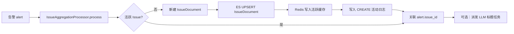
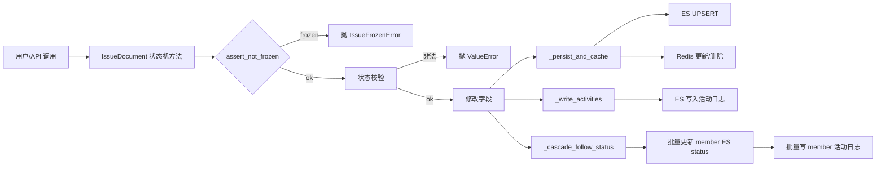
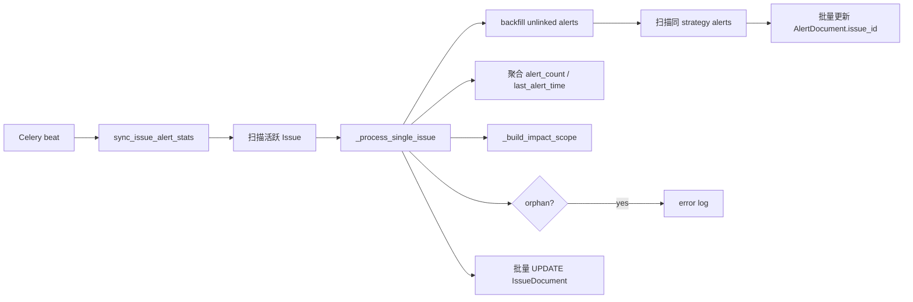
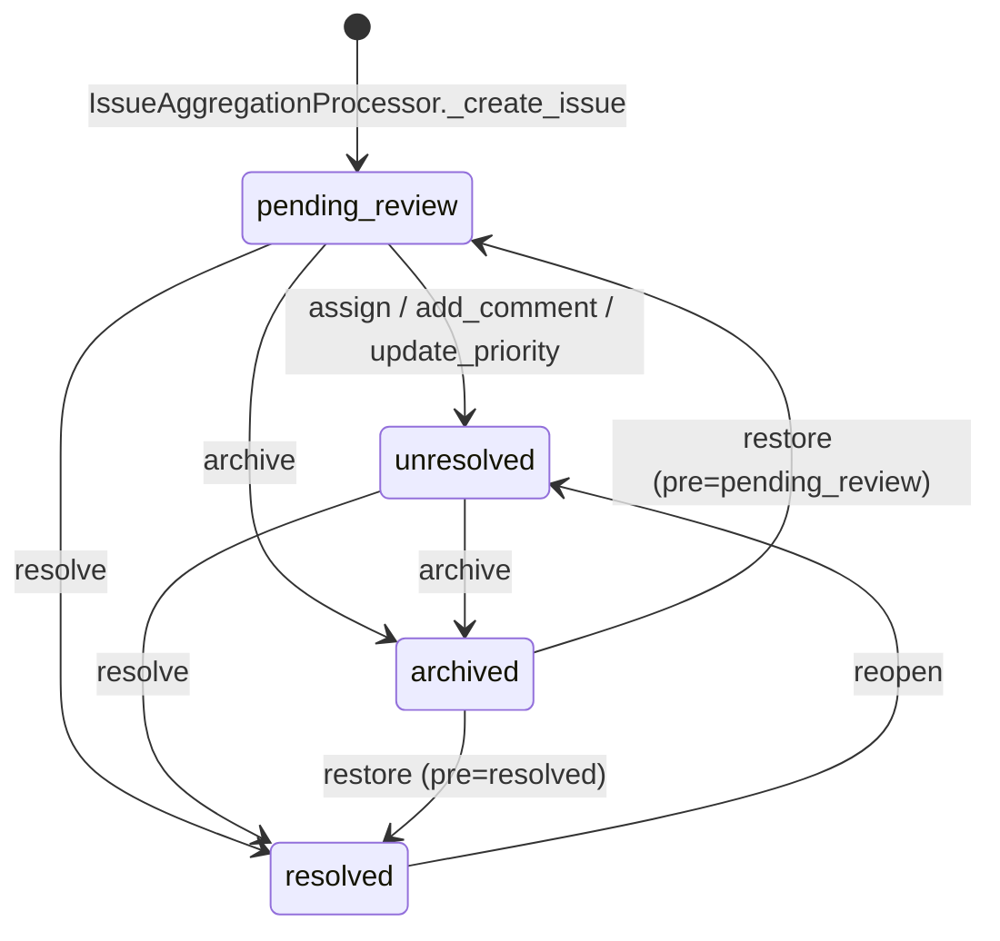
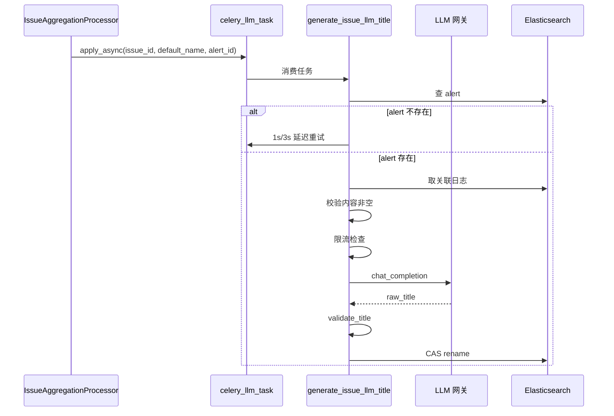
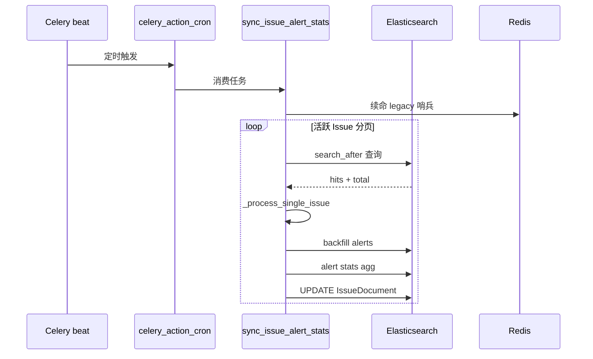

# 数据流转：Issue 状态聚合子专家

**本文引用的文件**
- [Issue 数据模型](file://bkmonitor/documents/issue.py)
- [聚合处理器](file://alarm_backends/service/fta_action/issue_processor.py)
- [周期任务](file://alarm_backends/service/fta_action/tasks/issue_tasks.py)
- [合并关系解析器](file://bkmonitor/issue_merge/resolver.py)
- [Issue 常量](file://constants/issue.py)

## 目录
1. [简介](#简介)
2. [数据生命周期](#数据生命周期)
3. [状态流转](#状态流转)
4. [异步流](#异步流)
5. [结论](#结论)

## 简介

Issue 状态聚合子专家的数据流转围绕三类持久化数据展开：

- **IssueDocument / IssueActivityDocument**：ES 索引，分别存储 Issue 主体与活动日志。
- **AlertDocument.issue_id**：告警文档上的外键式字段，表示告警归属的 Issue。
- **IssueMergeRelation**：MySQL 表，记录 Issue 合并/拆分关系。

数据流主线：告警触发 fta_action → 聚合引擎创建/查找 Issue → 写入 `AlertDocument.issue_id`；人工/系统操作变更 Issue 状态 → 写回 ES 与活动日志；周期任务扫描校准统计与影响范围。

章节来源：[Issue 数据模型](file://bkmonitor/documents/issue.py#L44-L60)、[聚合处理器](file://alarm_backends/service/fta_action/issue_processor.py#L82-L90)

## 数据生命周期

### 创建 Issue

图表来源：[聚合处理器](file://alarm_backends/service/fta_action/issue_processor.py#L90-L170)

创建阶段关键数据变换：

- `fingerprint` 由 `gen_issue_fingerprint(strategy_id, aggregate_dimensions, data_dimensions)` 计算，决定后续同维度告警是否归属同一 Issue。
- `dimension_values` 与 fingerprint 同源同口径，作为 Issue 的维度快照。
- `name` 默认由 `build_issue_default_name` 生成，含策略名与维度值后缀；回归 Issue 带 `[回归]` 前缀。
- `impact_scope` 初始为空 `{}`，由周期任务首次扫描时回填。

### 状态变更

图表来源：[Issue 数据模型](file://bkmonitor/documents/issue.py#L175-L335)、[Issue 数据模型](file://bkmonitor/documents/issue.py#L840-L870)

状态变更写入顺序：

1. ES UPSERT IssueDocument（重试 1 次）。
2. Redis 缓存：活跃状态更新，非活跃状态删除。
3. 写活动日志（`ASSIGNEE_CHANGE`、`STATUS_CHANGE`、`PRIORITY_CHANGE`、`NAME_CHANGE`、`COMMENT` 等）。
4. 级联同步 active member 的 ES status 与活动日志（best-effort，失败不阻塞主 Issue）。

### 周期同步

图表来源：[周期任务](file://alarm_backends/service/fta_action/tasks/issue_tasks.py#L55-L230)

周期同步的数据变换：

- `alert_count`：对 `issue_id` 做 value_count 聚合。
- `last_alert_time`：取关联告警最大 `begin_time`（ES 返回毫秒，转换为 epoch_second）。
- `impact_scope`：按关联告警 dimensions 重新汇总资源实例。
- `update_time`：每次同步更新为当前时间。
- orphan Issue：创建超过 5 分钟且 `alert_count == 0` 时记录 error 日志。

## 状态流转

Issue 状态机围绕四个状态展开，转换规则如下：

图表来源：[Issue 数据模型](file://bkmonitor/documents/issue.py#L175-L335)、[Issue 常量](file://constants/issue.py#L25-L45)

状态变更的持久化语义：

- `resolved_time` 在 `resolve` 时写入当前时间戳；`reopen`/`restore` 到活跃态时显式清空为 null。
- `update_time` 在每次写操作时刷新。
- Redis 缓存与状态联动：活跃状态写入/更新缓存，终态删除缓存。
- 合并 member 的状态通过 `_cascade_follow_status` 跟随主 Issue 同步，但不破坏合并关系、不动 assignee。

## 异步流

### LLM 标题生成

图表来源：[周期任务](file://alarm_backends/service/fta_action/tasks/issue_tasks.py#L820-L1080)

LLM 标题异步流特点：

- 独立队列 `celery_llm_task`，与通知/周期任务隔离。
- 失败静默：除 `alert_not_found` 外不重试，保留默认名。
- `regenerate_issue_llm_title` 是同步运维补偿入口，同样调用 `_apply_llm_title`。

### 周期任务

图表来源：[周期任务](file://alarm_backends/service/fta_action/tasks/issue_tasks.py#L55-L140)

周期任务异步流特点：

- 无全局事务，单条失败不影响整体。
- legacy 迁移哨兵 30 天 TTL，周期任务在探测到无 legacy 活跃 Issue 时续命，防止 processor 退化到 fallback ES 查询。

## 结论

Issue 状态聚合子专家的数据流以 ES 为唯一持久化存储，Redis 作为缓存/锁/哨兵辅助。核心设计原则：

- **写入顺序**：先 ES 后 Redis，ES 失败抛异常，Redis 失败 fail-silent。
- **状态机**：单 Issue 操作强一致（UPSERT + 活动日志），member 级联 best-effort。
- **周期任务**：最终一致，负责统计校准、漏关联回填、orphan 检测。
- **LLM 标题**：独立异步流，失败不影响核心数据，CAS 防并发改名覆盖。
