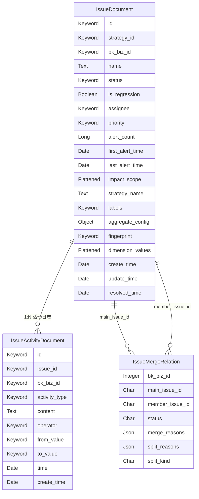

# 模型：Issue 状态聚合子专家

**本文引用的文件**
- [Issue 数据模型](file://bkmonitor/documents/issue.py)
- [ES 文档基类](file://bkmonitor/documents/base.py)
- [Issue 合并关系模型](file://bkmonitor/models/issue.py)
- [Issue 常量](file://constants/issue.py)

## 目录
1. [简介](#简介)
2. [IssueDocument](#issuedocument)
3. [IssueActivityDocument](#issueactivitydocument)
4. [IssueMergeRelation](#issuemergerelation)
5. [索引与持久化语义](#索引与持久化语义)
6. [字段对照速查](#字段对照速查)
7. [数据关系图](#数据关系图)
8. [结论](#结论)

## 简介

Issue 状态聚合子专家涉及三类模型：

- `IssueDocument`：ES 文档，Issue 主体与当前状态。
- `IssueActivityDocument`：ES 文档，Issue 活动/评论/审计日志。
- `IssueMergeRelation`：MySQL 表，Issue 合并/拆分关系映射层。

所有 ES 模型继承自 `BaseDocument`，按时间拆分索引；MySQL 模型继承 `AbstractRecordModel`，记录创建/更新时间与人。

章节来源：[Issue 数据模型](file://bkmonitor/documents/issue.py#L44-L60)、[ES 文档基类](file://bkmonitor/documents/base.py#L44-L60)

## IssueDocument

`IssueDocument` 是 Issue 的唯一持久化存储，注册索引 `bkfta_issue`。

### 字段说明

| 字段 | 类型 | 说明 |
|------|------|------|
| `id` | Keyword | Issue 唯一 ID，格式 `{10位时间戳}{8位uuid}`，由 `__init__` 自动生成 |
| `strategy_id` | Keyword | 所属策略 ID |
| `bk_biz_id` | Keyword | 业务 ID |
| `name` | Text + raw Keyword | Issue 标题；`.raw` 子字段用于精确匹配与唯一性校验 |
| `status` | Keyword | 状态：`pending_review`、`unresolved`、`resolved`、`archived` |
| `is_regression` | Boolean | 是否为回归 Issue |
| `assignee` | Keyword(multi) | 负责人列表 |
| `priority` | Keyword | 优先级：`P0`、`P1`、`P2` |
| `alert_count` | Long | 关联告警数量 |
| `first_alert_time` | Date(epoch_second) | 首次关联告警时间 |
| `last_alert_time` | Date(epoch_second) | 最近一次关联告警时间 |
| `impact_scope` | Flattened | 影响范围，按资源维度聚合 |
| `strategy_name` | Text + raw Keyword | 策略名称 |
| `labels` | Keyword(multi) | 标签列表 |
| `aggregate_config` | Object(enabled=False) | 聚合配置快照，不参与索引 |
| `fingerprint` | Keyword | 活跃 Issue 指纹（strategy + 聚合维度取值），创建后不变 |
| `dimension_values` | Flattened | 聚合维度取值快照，与 `fingerprint` 一对一 |
| `create_time` | Date(epoch_second) | 创建时间 |
| `update_time` | Date(epoch_second) | 最近更新时间 |
| `resolved_time` | Date(epoch_second) | 解决时间；活跃态为 null |

### 关键行为

- **ID 自生成**：`__init__` 在未传入 `id` 时按 `{timestamp}{uuid[:8]}` 生成，保证时间有序且全局唯一。
- **跨索引读取**：所有查询方法（`get_issue_or_raise`、状态机等）默认使用 `all_indices=True`，避免跨天索引遗漏。
- **全字段反序列化**：`get_issue_or_raise` 需显式传入 `meta.id` 并 `pop("id")`，否则 `__init__` 会收到重复 `id` 参数或重新生成 ID。
- **持久化策略**：`_persist_and_cache` 先 UPSERT ES，成功后根据 `active` 更新/删除 Redis 缓存；ES 失败抛 `IssueDocumentWriteError`，Redis 失败 fail-silent。

章节来源：[Issue 数据模型](file://bkmonitor/documents/issue.py#L44-L91)、[Issue 数据模型](file://bkmonitor/documents/issue.py#L111-L150)、[Issue 数据模型](file://bkmonitor/documents/issue.py#L840-L870)

## IssueActivityDocument

`IssueActivityDocument` 是 append-only 的活动/评论日志，注册索引 `bkfta_fta_issue_act`。

### 字段说明

| 字段 | 类型 | 说明 |
|------|------|------|
| `id` | Keyword | 活动 ID，格式同 `IssueDocument` |
| `issue_id` | Keyword | 所属 Issue ID |
| `bk_biz_id` | Keyword | 业务 ID |
| `activity_type` | Keyword | 活动类型：create、comment、comment_edit、status_change 等 |
| `content` | Text | 内容；COMMENT 为评论文本；MERGED_INTO/SPLIT_FROM 为结构化 JSON |
| `operator` | Keyword | 操作人 |
| `from_value` | Keyword | 变更前值；状态/负责人/优先级/名称变更时使用 |
| `to_value` | Keyword | 变更后值 |
| `time` | Date(epoch_second) | 活动发生时间 |
| `create_time` | Date(epoch_second) | 文档创建时间；评论编辑时复用原评论时间 |

### 关键行为

- **写后读延迟规避**：`_write_activities` 在 bulk_create 前先调用 `_read_activities` 读取历史记录，再与本次新增拼接返回，避免依赖 ES 的 near-real-time 刷新。
- **评论编辑**：`edit_comment` 使用 UPSERT 覆盖原 COMMENT 文档，并追加一条 `COMMENT_EDIT` 记录；权限校验仅原作者可编辑。
- **批量写入**：合并/拆分/级联等路径直接调用 `IssueActivityDocument.bulk_create`，避免 N 次实例方法回读。

章节来源：[Issue 数据模型](file://bkmonitor/documents/issue.py#L980-L1010)、[Issue 数据模型](file://bkmonitor/documents/issue.py#L805-L835)

## IssueMergeRelation

`IssueMergeRelation` 是合并/拆分关系的独立映射层，与 ES Issue 文档完全解耦。

### 表结构

| 字段 | 类型 | 说明 |
|------|------|------|
| `bk_biz_id` | Integer | 业务 ID |
| `main_issue_id` | CharField(64) | 主 Issue ID |
| `member_issue_id` | CharField(64) | 并入 Issue ID |
| `status` | CharField(16) | 关系状态：`active` / `split` |
| `merge_reasons` | JsonField | 合并依据 |
| `split_reasons` | JsonField | 拆分依据 |
| `split_kind` | CharField(16) | 拆分类型；新写入仅 `manual` |

### 索引

| 索引名 | 字段 |
|--------|------|
| `idx_imr_biz_status_main` | `bk_biz_id`, `status`, `main_issue_id` |
| `idx_imr_main_status` | `main_issue_id`, `status` |
| `idx_imr_member_status` | `member_issue_id`, `status` |

### 约束

- `ck_imr_main_ne_member`：`main_issue_id != member_issue_id`，数据库层禁止自环合并。
- 无 UNIQUE 约束；唯一性由应用层 SELECT 保证，极小概率 race window 通过运维命令修复。

### 关键行为

- `create_time` / `create_user` 表示合并发生时间与操作人。
- `status='split'` 时，`update_time` / `update_user` 表示拆分时间与操作人。
- 主状态变更通过 `_cascade_follow_status` 同步 member 的 ES status，不破坏关系；用户主动 split 才将关系置为 `split` 并清空 member 状态。

章节来源：[Issue 合并关系模型](file://bkmonitor/models/issue.py#L22-L55)

## 索引与持久化语义

### ES 索引

| 文档类 | 索引前缀 | 写索引 | 读索引 |
|--------|----------|--------|--------|
| `IssueDocument` | `bkfta_issue` | `write_YYYYMMDD_bkfta_issue` | `bkfta_issue_YYYYMMDD_read` |
| `IssueActivityDocument` | `bkfta_fta_issue_act` | `write_YYYYMMDD_bkfta_fta_issue_act` | `bkfta_fta_issue_act_YYYYMMDD_read` |

`BaseDocument` 通过 `get_index_time()` 决定文档落入哪个日索引；`IssueDocument` 与 `IssueActivityDocument` 均用 `create_time` 或从 `id` 前 10 位解析的时间戳。

### 写入语义

- `bulk_create` 支持 `CREATE` / `INDEX` / `UPDATE` / `DELETE` / `UPSERT`。
- `UPSERT` 实际映射为 ES `update` + `doc_as_upsert`，用于 Issue 状态增量更新。
- `skip_empty=True` 时 `None` 字段被跳过，适合增量更新；`skip_empty=False` 时 `None` 字段写为 `null`，用于 `reopen`/`restore` 清空 `resolved_time`。
- `dynamic=false`：未在模型声明的字段不会被 ES 索引，防止脏数据。

### Redis 缓存

- `ISSUE_ACTIVE_CONTENT_KEY`：按 `fingerprint` 缓存活跃 Issue 全量字典，TTL 30 秒。
- 缓存仅 worker/api role 可写；web role 调用状态机时因无 Redis 配置而跳过。
- 非活跃化（resolve/archive）时删除缓存；活跃状态变更时更新缓存。

章节来源：[ES 文档基类](file://bkmonitor/documents/base.py#L95-L180)、[Issue 数据模型](file://bkmonitor/documents/issue.py#L850-L880)

## 字段对照速查

### 状态常量

| 常量 | 值 |
|------|-----|
| `IssueStatus.PENDING_REVIEW` | `pending_review` |
| `IssueStatus.UNRESOLVED` | `unresolved` |
| `IssueStatus.RESOLVED` | `resolved` |
| `IssueStatus.ARCHIVED` | `archived` |

### 优先级常量

| 常量 | 值 |
|------|-----|
| `IssuePriority.P0` | `P0` |
| `IssuePriority.P1` | `P1` |
| `IssuePriority.P2` | `P2`（默认） |

### 活动类型常量

| 常量 | 值 |
|------|-----|
| `IssueActivityType.CREATE` | `create` |
| `IssueActivityType.COMMENT` | `comment` |
| `IssueActivityType.COMMENT_EDIT` | `comment_edit` |
| `IssueActivityType.STATUS_CHANGE` | `status_change` |
| `IssueActivityType.ASSIGNEE_CHANGE` | `assignee_change` |
| `IssueActivityType.PRIORITY_CHANGE` | `priority_change` |
| `IssueActivityType.NAME_CHANGE` | `name_change` |
| `IssueActivityType.MERGED_INTO` | `merged_into` |
| `IssueActivityType.SPLIT_FROM` | `split_from` |
| `IssueActivityType.CREATE_TAPD` | `create_tapd` |
| `IssueActivityType.TAPD_LINK` | `tapd_link` |

章节来源：[Issue 常量](file://constants/issue.py#L15-L80)

## 数据关系图

图表来源：[Issue 数据模型](file://bkmonitor/documents/issue.py#L44-L91)、[Issue 数据模型](file://bkmonitor/documents/issue.py#L980-L1000)、[Issue 合并关系模型](file://bkmonitor/models/issue.py#L22-L55)

## 结论

Issue 状态聚合子专家的模型层以 ES 为唯一状态存储，MySQL 仅保留合并关系这一需要强一致事务的映射。`IssueDocument` 承载状态机与聚合统计，`IssueActivityDocument` 提供审计与评论，`IssueMergeRelation` 解耦合并组生命周期与 ES 文档。索引按日拆分、缓存按 fingerprint 组织，整体服务于高吞吐告警聚合与最终一致性同步。
