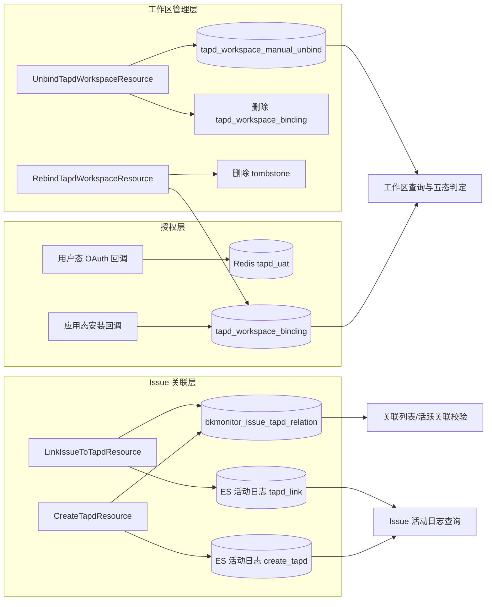

# 数据流向与消费：TAPD 集成子专家

> 契约快照生成于 2026-07-31。
> 若使用中发现行为与契约不符，可能代码已变更——expert-lookup 会自动增量修正，或用 expert-team 全量重建。

## 数据实体清单

| 数据实体 | 产生入口（本模块接口） | 去向 | 消费方（模块/功能级） | 业务用途 |
|----------|------------------------|------|----------------------|----------|
| TAPD 用户态 token | `tapd_user_oauth_callback` 通过 code 换取 | Redis `tapd_uat:{tenant}:{user}` | `TAPDAuthPermission`、用户态 TAPD API 调用 | 代表当前用户调用 TAPD 用户态接口 |
| TAPD 项目本地绑定 | `tapd_app_install_callback`、自动重绑、手动重绑 | MySQL `tapd_workspace_binding` | `ListUserTapdWorkspaceResource` 五态判定、`LinkIssueToTapdResource` 校验、`UnbindTapdWorkspaceResource` | 记录业务空间与 TAPD 项目的关联关系 |
| 手动解绑 tombstone | `UnbindTapdWorkspaceResource` | MySQL `tapd_workspace_manual_unbind` | `ListUserTapdWorkspaceResource` 五态判定、`try_bind_importable` | 阻止已解绑项目被自动重绑 |
| Issue-TAPD 关联 | `CreateTapdResource`、`LinkIssueToTapdResource` | MySQL `bkmonitor_issue_tapd_relation` | `ListIssueTapdRelationsResource`、`UnbindTapdWorkspaceResource` 活跃关联校验、外部同步任务 | 持久化 Issue 与 TAPD 单据的映射关系 |
| TAPD 创建活动日志 | `CreateTapdResource` | ES `bkfta_fta_issue_act` | `ListIssueActivitiesResource` | 审计：记录为 Issue 创建了 TAPD 单据 |
| TAPD 关联活动日志 | `LinkIssueToTapdResource` | ES `bkfta_fta_issue_act` | `ListIssueActivitiesResource` | 审计：记录 Issue 关联到已有 TAPD 单据 |

## 数据流向图（黑盒级）

## 消费方影响提示

- **token 写入 Redis 后**：后续 TAPD 用户态接口调用可直接使用；token 过期或被清除后需重新授权。
- **写入 `tapd_workspace_binding` 后**：工作区查询会标记为 `bound`；创建/关联 TAPD 单时会校验该绑定存在。
- **写入 `tapd_workspace_manual_unbind` 后**：对应项目不会再被 `try_bind_importable` 自动重绑，必须用户手动触发 `rebind_workspace` 才能恢复。
- **写入 `bkmonitor_issue_tapd_relation` 后**：
  - 解绑工作区前会检查是否存在活跃关联，存在则阻止解绑。
  - 外部状态同步任务可读取 `sync_status=True` 的记录，将 TAPD 单据状态同步回 Issue。
- **写入 ES 活动日志后**：`ListIssueActivitiesResource` 可查询到 `create_tapd` / `tapd_link` 类型的审计记录。
