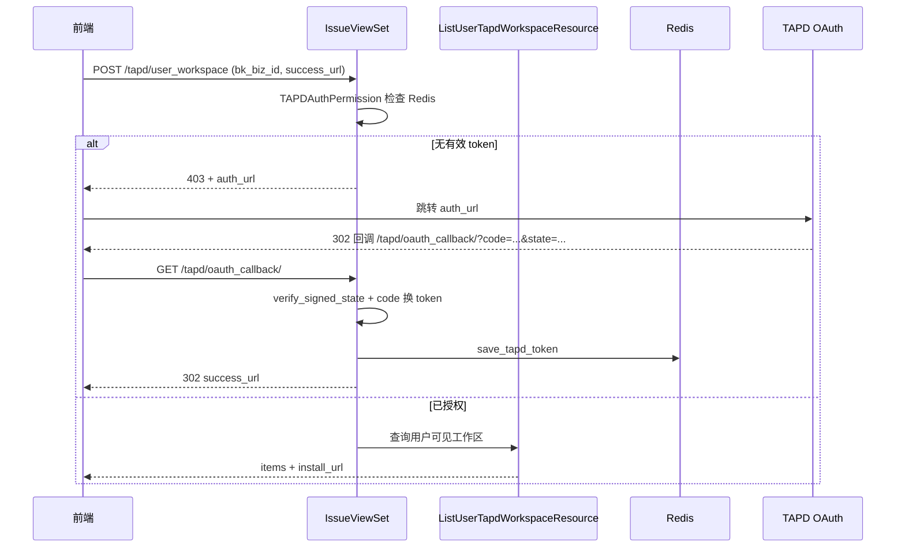
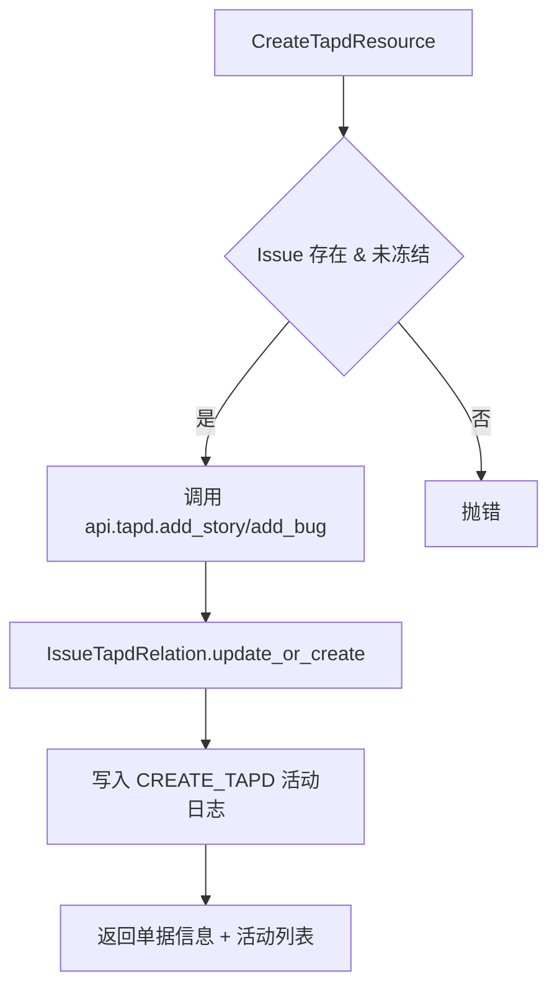
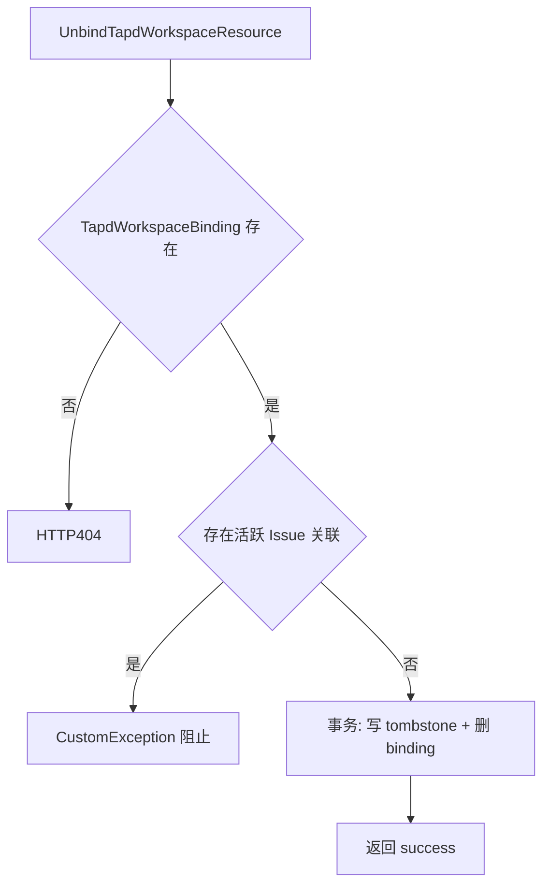

# 实现：TAPD 集成子专家

**本文引用的文件**
- [TAPD 工具函数](file://bkmonitor/packages/fta_web/issue/utils/tapd.py)
- [Issue Resource 层](file://bkmonitor/packages/fta_web/issue/resources.py)
- [Issue 视图与权限](file://bkmonitor/packages/fta_web/issue/views.py)
- [Issue 路由](file://bkmonitor/packages/fta_web/issue/urls.py)
- [TAPD 模型](file://bkmonitor/bkmonitor/models/tapd.py)
- [Issue 模型](file://bkmonitor/bkmonitor/models/issue.py)

## 目录
1. [简介](#简介)
2. [核心流程](#核心流程)
3. [关键类与函数](#关键类与函数)
4. [设计模式](#设计模式)
5. [热点路径](#热点路径)
6. [技术债与待确认](#技术债与待确认)
7. [结论](#结论)

## 简介

TAPD 集成子专家负责 Issue 与 TAPD 之间的授权、工作区管理和单据关联。核心代码集中在 `fta_web/issue/utils/tapd.py`、`resources.py` 的 TAPD 相关 Resource、`views.py` 的权限与 ViewSet 注册，以及 `urls.py` 的回调路由。

章节来源：[Issue Resource 层](file://bkmonitor/packages/fta_web/issue/resources.py#L1630-L3400)

## 核心流程

### 用户态授权流程

图表来源：[Issue 视图与权限](file://bkmonitor/packages/fta_web/issue/views.py#L70-L142)、[Issue Resource 层](file://bkmonitor/packages/fta_web/issue/resources.py#L2720-L2970)

### 创建 TAPD 单流程

图表来源：[Issue Resource 层](file://bkmonitor/packages/fta_web/issue/resources.py#L2049-L2290)

### 工作区解绑流程

图表来源：[Issue Resource 层](file://bkmonitor/packages/fta_web/issue/resources.py#L2980-L3100)

## 关键类与函数

| 名称 | 路径 | 职责 |
|------|------|------|
| `normalize_redirect_url` | [utils/tapd.py](file://bkmonitor/packages/fta_web/issue/utils/tapd.py#L31-L60) | 补全并校验前端重定向 URL，防 DisallowedHost |
| `save_tapd_token` | [utils/tapd.py](file://bkmonitor/packages/fta_web/issue/utils/tapd.py#L75-L112) | 加密用户态 token 写入 Redis |
| `get_tapd_token` | [utils/tapd.py](file://bkmonitor/packages/fta_web/issue/utils/tapd.py#L115-L138) | 解密读取用户态 token |
| `delete_tapd_token` | [utils/tapd.py](file://bkmonitor/packages/fta_web/issue/utils/tapd.py#L141-L148) | 删除 Redis token |
| `generate_signed_state` / `verify_signed_state` | [utils/tapd.py](file://bkmonitor/packages/fta_web/issue/utils/tapd.py#L151-L205) | 生成/验证自包含 state |
| `generate_auth_url` | [utils/tapd.py](file://bkmonitor/packages/fta_web/issue/utils/tapd.py#L243-L282) | 生成用户态 OAuth URL |
| `generate_install_url` | [utils/tapd.py](file://bkmonitor/packages/fta_web/issue/utils/tapd.py#L208-L240) | 生成应用态安装 URL |
| `is_manually_unbound` | [utils/tapd.py](file://bkmonitor/packages/fta_web/issue/utils/tapd.py#L285-L292) | 检查 tombstone 是否存在 |
| `try_bind_importable` | [utils/tapd.py](file://bkmonitor/packages/fta_web/issue/utils/tapd.py#L295-L329) | 为 importable 项目自动创建本地 binding |
| `ListTapdWorkspaceResource` | [resources.py](file://bkmonitor/packages/fta_web/issue/resources.py#L1632-L1718) | 查询应用态已授权 TAPD 项目 |
| `GetTapdFieldsResource` | [resources.py](file://bkmonitor/packages/fta_web/issue/resources.py#L1725-L1820) | 获取 TAPD 核心字段 |
| `SearchTAPDItemsResource` | [resources.py](file://bkmonitor/packages/fta_web/issue/resources.py#L1823-L2035) | 搜索已有 TAPD 单据 |
| `CreateTapdResource` | [resources.py](file://bkmonitor/packages/fta_web/issue/resources.py#L2049-L2290) | 创建 TAPD 单并关联 |
| `ListIssueTapdRelationsResource` | [resources.py](file://bkmonitor/packages/fta_web/issue/resources.py#L2350-L2390) | 查询 Issue 的 TAPD 关联 |
| `LinkIssueToTapdResource` | [resources.py](file://bkmonitor/packages/fta_web/issue/resources.py#L2392-L2550) | 关联已有 TAPD 单 |
| `ListUserTapdWorkspaceResource` | [resources.py](file://bkmonitor/packages/fta_web/issue/resources.py#L2720-L2970) | 查询用户可见工作区（五态） |
| `UnbindTapdWorkspaceResource` | [resources.py](file://bkmonitor/packages/fta_web/issue/resources.py#L2980-L3100) | 手动解绑工作区 |
| `RebindTapdWorkspaceResource` | [resources.py](file://bkmonitor/packages/fta_web/issue/resources.py#L3102-L3185) | 手动重绑工作区 |
| `RevokeTapdUserAuthResource` | [resources.py](file://bkmonitor/packages/fta_web/issue/resources.py#L3186-L3211) | 撤销用户态授权 |
| `tapd_user_oauth_callback` | [resources.py](file://bkmonitor/packages/fta_web/issue/resources.py#L3298-L3400) | 用户态 OAuth 回调视图 |
| `tapd_app_install_callback` | [resources.py](file://bkmonitor/packages/fta_web/issue/resources.py#L3212-L3296) | 应用态安装回调视图 |
| `IssueViewSet.TAPDAuthPermission` | [views.py](file://bkmonitor/packages/fta_web/issue/views.py#L70-L142) | TAPD 接口前置授权校验 |

章节来源：[TAPD 工具函数](file://bkmonitor/packages/fta_web/issue/utils/tapd.py#L1-L352)

## 设计模式

| 模式 | 位置 | 用途 |
|------|------|------|
| 自包含 signed_state | [utils/tapd.py](file://bkmonitor/packages/fta_web/issue/utils/tapd.py#L151-L205) | OAuth state 携带业务上下文，避免依赖 session；HMAC-SHA256 签名 + 过期校验 |
| 双 token 认证策略 | [api/tapd/default.py](file://bkmonitor/api/tapd/default.py#L23-L60) | `TapdAPIResource` 优先 Bearer Token， fallback Basic Auth，通过 `contextvars` 透传 access_token |
| 五态标记 | [resources.py](file://bkmonitor/packages/fta_web/issue/resources.py#L2860-L2970) | 以用户级授权为全集，按项目级授权×本地 binding 二维判定，额外增加 tombstone 状态 |
| tombstone 解绑 | [models/tapd.py](file://bkmonitor/bkmonitor/models/tapd.py#L45-L68)、[resources.py](file://bkmonitor/packages/fta_web/issue/resources.py#L2980-L3100) | 手动解绑写入 tombstone 阻止自动重绑，重绑时删除 |
| 批量查重 + bulk_create | [resources.py](file://bkmonitor/packages/fta_web/issue/resources.py#L2450-L2520) | 关联已有 TAPD 单时避免重复创建，MySQL bulk 后重新查询补 PK |

章节来源：[TAPD 模型](file://bkmonitor/bkmonitor/models/tapd.py#L1-L68)

## 热点路径

- `ListUserTapdWorkspaceResource.perform_request`：每次打开 TAPD 工作区选择器都会触发；内部需要调用用户态 API、应用态 API、本地 DB 查询 tombstone 与 binding，并发查询 workspace 详情。
- `CreateTapdResource._create_tapd`：创建 TAPD 单为同步外部 HTTP 调用，受 TAPD API 响应时间影响。
- `SearchTAPDItemsResource._query_tapd_items`：单据搜索为同步外部调用，内部还有字段信息查询补充 `status_display_name`。

章节来源：[Issue Resource 层](file://bkmonitor/packages/fta_web/issue/resources.py#L2720-L2970)

## 技术债与待确认

- `CreateTapdResource._record_activity` 与 `LinkIssueToTapdResource._record_link_activities` 重复实现活动日志先读后写 + 重试逻辑，可抽象为公共 helper。
- `tapd_app_install_callback` 与 `tapd_user_oauth_callback` 均直接定义在 `resources.py`，而非独立 `views.py`；当前 `urls.py` 从 `resources.py` import 回调视图，职责边界略模糊。
- `LinkIssueToTapdResource._validate_tapd_items` 对 bug 类型使用 `SearchTAPDItemsResource._query_tapd_items` 查询，字段映射逻辑分散在多个位置，维护成本高。
- `GetTapdFieldsResource` 当前仅支持 `template_id=0`，自定义模板字段未覆盖（代码注释已说明待扩展）。
- `signed_state` 过期时间为硬编码 15 分钟（`exp: int(time.time()) + 900`），未暴露为配置项。
- `tapd_app_install_callback` 收到的 `code` 参数当前未实际使用，仅按 TAPD 规范接收；未来若 TAPD 要求校验 code，需要在此处补充。

章节来源：[Issue Resource 层](file://bkmonitor/packages/fta_web/issue/resources.py#L2049-L2290)、[Issue 路由](file://bkmonitor/packages/fta_web/issue/urls.py#L1-L24)

## 结论

TAPD 集成的实现要点包括：

1. **授权双轨制**：用户态 OAuth 用于代表用户调用 API（Redis 加密存储），应用态 `open_app_install` 用于项目级授权（本地 `TapdWorkspaceBinding`）。
2. **自包含 state**：OAuth 回调不依赖 session，所有上下文通过 HMAC 签名保护。
3. **解绑持久化**：手动解绑通过 tombstone 表持久化，阻断自动重绑，重绑时清理 tombstone。
4. **单据关联幂等**：创建 TAPD 单使用 `update_or_create`，关联已有单使用批量查重 + bulk_create，均保证幂等。
5. **权限前置**：`IssueViewSet.TAPDAuthPermission` 统一拦截所有 TAPD 接口，未授权时引导跳转。
