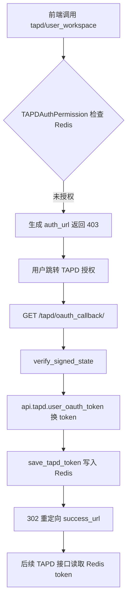
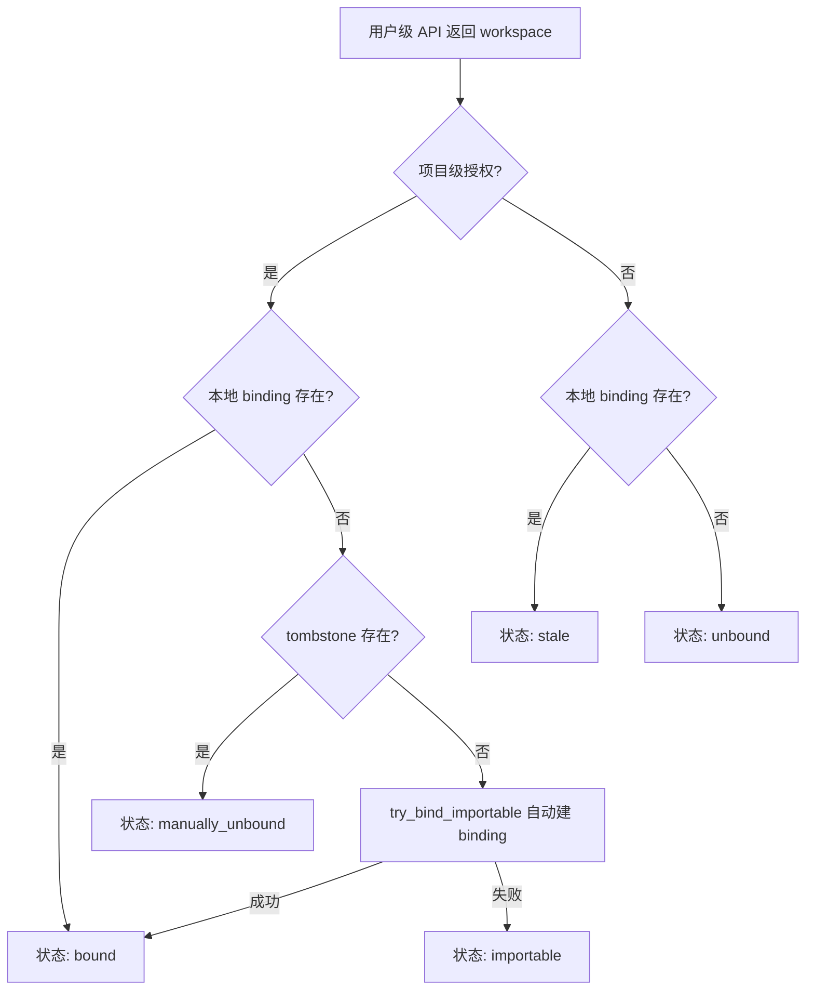
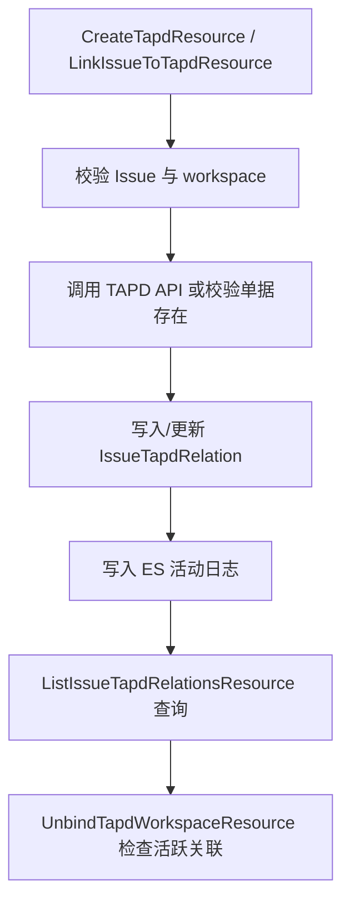
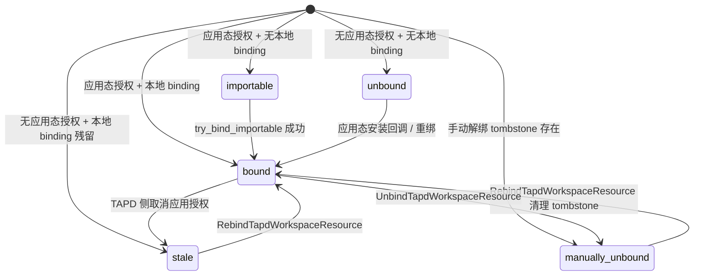

# 数据流转：TAPD 集成子专家

**本文引用的文件**
- [Issue Resource 层](file://bkmonitor/packages/fta_web/issue/resources.py)
- [TAPD 工具函数](file://bkmonitor/packages/fta_web/issue/utils/tapd.py)
- [Issue 视图与权限](file://bkmonitor/packages/fta_web/issue/views.py)
- [Issue 路由](file://bkmonitor/packages/fta_web/issue/urls.py)

## 目录
1. [简介](#简介)
2. [数据生命周期](#数据生命周期)
3. [状态流转](#状态流转)
4. [异步流](#异步流)
5. [结论](#结论)

## 简介

TAPD 集成涉及三类数据：用户态 token（Redis）、工作区绑定关系（MySQL）、Issue-TAPD 关联与活动日志（MySQL + ES）。本章描述这些数据从入口到出口的完整生命周期。

章节来源：[Issue Resource 层](file://bkmonitor/packages/fta_web/issue/resources.py#L1630-L3400)

## 数据生命周期

### 用户态 token 生命周期

图表来源：[TAPD 工具函数](file://bkmonitor/packages/fta_web/issue/utils/tapd.py#L75-L282)、[Issue Resource 层](file://bkmonitor/packages/fta_web/issue/resources.py#L3223-L3340)

### 工作区绑定生命周期

图表来源：[Issue Resource 层](file://bkmonitor/packages/fta_web/issue/resources.py#L2860-L2970)

### Issue-TAPD 关联生命周期

图表来源：[Issue Resource 层](file://bkmonitor/packages/fta_web/issue/resources.py#L2049-L2550)

## 状态流转

### 工作区五态

图表来源：[packages/fta_web/constants.py](file://bkmonitor/packages/fta_web/constants.py#L795-L810)、[Issue Resource 层](file://bkmonitor/packages/fta_web/issue/resources.py#L2980-L3185)

### Issue-TAPD 关联状态

- `link_mode=create`：通过 `CreateTapdResource` 创建 TAPD 单并建立关联。
- `link_mode=link`：通过 `LinkIssueToTapdResource` 关联已有 TAPD 单。
- `sync_status=True/False`：标记该关联是否参与外部状态同步（仅标记位，具体同步逻辑由外部消费方实现）。

章节来源：[Issue 模型](file://bkmonitor/bkmonitor/models/issue.py#L222-L256)

## 异步流

- 当前 TAPD 集成无内部队列/定时任务；所有流程均为同步 HTTP 调用 + DB/ES 写入。
- `try_bind_importable` 在 `ListUserTapdWorkspaceResource` 同步调用中静默创建本地 binding。
- 外部同步任务（未在本模块实现）可定期读取 `IssueTapdRelation.sync_status=True` 的记录，将 TAPD 单据完成状态同步回 Issue。

章节来源：[Issue Resource 层](file://bkmonitor/packages/fta_web/issue/resources.py#L2860-L2970)

## 结论

- TAPD 集成的数据一致性高度依赖同步调用；TAPD API 失败会直接影响前端响应。
- tombstone 表是解绑与自动重绑之间的关键仲裁者，删除 tombstone 后系统会重新尝试自动绑定。
- 活动日志与关联记录分别写入 ES 和 MySQL，存在极短暂的不一致窗口；活动日志写入失败不影响主流程。
