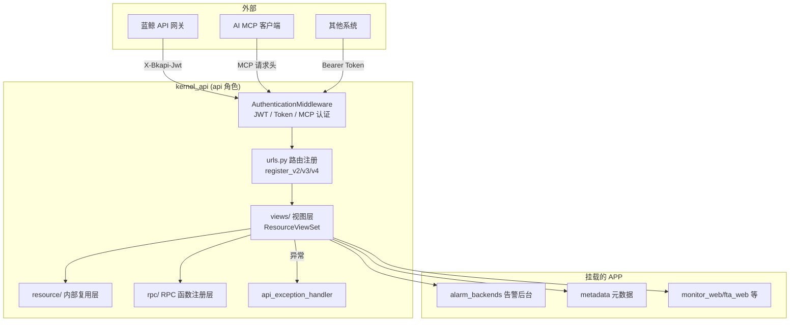
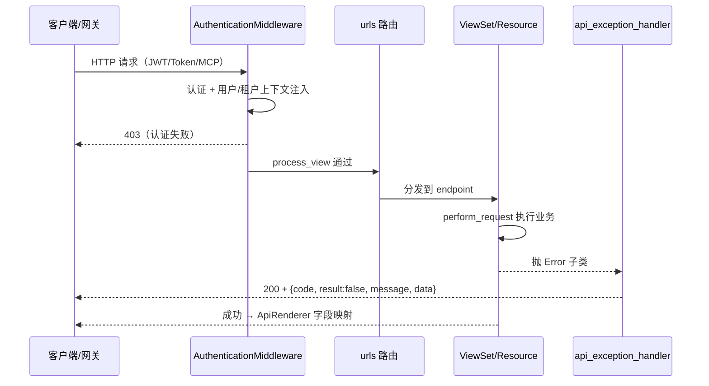

# 01-架构：kernel_api 网关

**本文引用的文件**
- [urls.py](file://bkmonitor/kernel_api/urls.py)
- [config/role/api.py](file://bkmonitor/config/role/api.py)
- [middlewares/authentication.py](file://bkmonitor/kernel_api/middlewares/authentication.py)
- [exceptions.py](file://bkmonitor/kernel_api/exceptions.py)
- [adapters.py](file://bkmonitor/kernel_api/adapters.py)
- [dbroutors.py](file://bkmonitor/kernel_api/dbroutors.py)
- [apps.py](file://bkmonitor/kernel_api/apps.py)

## 目录

1. [简介](#简介)
2. [架构定位与角色边界](#架构定位与角色边界)
3. [模块划分与分层](#模块划分与分层)
4. [请求生命周期](#请求生命周期)
5. [依赖关系](#依赖关系)
6. [子专家划分](#子专家划分)
7. [关键发现与风险](#关键发现与风险)
8. [术语表](#术语表)

## 简介

kernel_api 是 BK-Monitor 的**内核 API 网关** Django app，部署角色为 `api`。它在 `config/role/api.py` 中通过 `from config.role.web import *` + `from config.role.worker import *` 同时继承 web 与 worker 的 INSTALLED_APPS，从而在单进程内既能访问 SaaS 侧 Resource，又能访问 `alarm_backends` 后台能力。URLConf 为 `kernel_api.urls`，对外暴露 v2/v3/v4 三层版本 API。

章节来源：[config/role/api.py](file://bkmonitor/config/role/api.py)（关键符号：`INSTALLED_APPS` / `ROOT_URLCONF` / `ALLOW_EXTEND_API`）

## 架构定位与角色边界

图表来源：[urls.py](file://bkmonitor/kernel_api/urls.py)（关键符号：`register_url` / `register_v2` / `register_v3` / `register_v4`）

**角色边界**（PROJECT.md 引用）：
- web 角色（monitor_saas）不能直接 import `alarm_backends`（非 INSTALLED_APPS），必须经 API 网关访问 kernel_api 中转。
- api 角色 = web 配置 + worker 配置 + `kernel_api` app，`ROOT_URLCONF="kernel_api.urls"`。
- `SKIP_IAM_PERMISSION_CHECK=True`：api 角色默认跳过 IAM 权限中心检查（MCP 请求由中间件单独校验）。

章节来源：[config/role/api.py](file://bkmonitor/config/role/api.py)（关键符号：`SKIP_IAM_PERMISSION_CHECK` / `MIDDLEWARE` / `REST_FRAMEWORK`）

## 模块划分与分层

| 层 | 目录 | 职责 | 关键类/函数 |
|----|------|------|-------------|
| 路由注册 | `urls.py` | v2/v3/v4 版本化注册、扩展点加载 | `register_url` / `register_v2` / `register_v3` / `register_v4` |
| 中间件 | `middlewares/` | 认证、时区、语言、异常日志 | `AuthenticationMiddleware` / `ApiTimeZoneMiddleware` / `ApiLanguageMiddleware` / `LogExceptionMiddleware` |
| 异常处理 | `exceptions.py` | DRF 统一异常渲染 | `api_exception_handler` |
| 字段适配 | `adapters.py` | 响应字段映射 + 过滤器 | `ApiRenderer` / `ApiModelFilterSet` |
| DB 路由 | `dbroutors.py` | 双库路由 | `KernelAPIRouter` |
| 视图层 | `views/` | 对外 API 视图集（v2/v3/v4） | `ResourceViewSet` 子类 |
| 内部复用层 | `resource/` | 批发场景 Resource | `KernelRPCResource` 等 |
| RPC 层 | `rpc/` | 函数注册与执行 | `KernelRPCRegistry` |
| 扩展点 | `extend_*` | 可选扩展 | `extend_views` 等 |
| 序列化 | `serializers/` | MCP 时间跨度校验等 | `TimeSpanValidationPassThroughSerializer` |
| 管理命令 | `management/commands/` | API 配置校验 | `check_apis` |
| App 配置 | `apps.py` | app 加载时 hack 全局配置 | `KernelAPIConfig.ready` |

章节来源：[urls.py](file://bkmonitor/kernel_api/urls.py)（关键符号：`ROOT_MODULE` / `INSTALLED_APIS`）；[apps.py](file://bkmonitor/kernel_api/apps.py)（关键符号：`KernelAPIConfig.ready`）

## 请求生命周期

图表来源：[middlewares/authentication.py](file://bkmonitor/kernel_api/middlewares/authentication.py)（关键符号：`AuthenticationMiddleware.process_view`）；[exceptions.py](file://bkmonitor/kernel_api/exceptions.py)（关键符号：`api_exception_handler`）

## 依赖关系

**外部依赖**（非 kernel_api 自有）：
- `core.drf_resource`：`Resource` / `APIResource` / `ResourceViewSet` / `ResourceRoute` / `ResourceRouter`（公共框架）
- `bkmonitor.models`：`ApiAuthToken` / `AuthType`（Token 数据模型）
- `alarm_backends` / `metadata` / `apm` / `rum`：同工程挂载 app，经 Resource 调用
- `blueapps` / `bkm_space` / `bk_dataview` / `monitor_api`：PaaS 框架与网关基础组件

**依赖方向**：`views → resource → rpc/core`；`views → 挂载 app 的 Resource`；认证/异常/适配贯穿全链路。

章节来源：[urls.py](file://bkmonitor/kernel_api/urls.py)（关键符号：`ResourceRouter` / `include_docs_urls`）；[config/role/api.py](file://bkmonitor/config/role/api.py)（关键符号：`INSTALLED_APPS`）

## 子专家划分

按功能子域拆分 4 个子专家（详见各子专家 `implementation/01-架构.md`）：

| 子专家 | 边界 | 拆分理由 |
|--------|------|----------|
| 认证与安全子专家 | `middlewares/authentication.py` | 认证逻辑独立且复杂（三种认证 + 用户自动创建），与业务 API 解耦 |
| RPC 函数注册子专家 | `rpc/` | 函数注册/执行/租户推断自成体系，且体量大（50+ 文件） |
| 内部 Resource 复用子专家 | `resource/` | 批发场景复用层，与对外视图语义不同 |
| v4 API 视图子专家 | `views/v4/` | 对外 API 主版本，40+ 文件，按 endpoint 聚合 |

章节来源：[middlewares/authentication.py](file://bkmonitor/kernel_api/middlewares/authentication.py)（关键符号：`BkJWTClient` / `AuthenticationMiddleware`）；[rpc/registry.py](file://bkmonitor/kernel_api/rpc/registry.py)（关键符号：`KernelRPCRegistry`）

## 关键发现与风险

1. **HTTP 状态码恒 200**：`api_exception_handler` 的 `Response(json_data)` 不带 status，业务错误只靠 `body.code` 表达——web 端消费方必须认 code 而非状态码。
2. **`data` 白名单透传**：`api_exception_handler` 只透传 `error_code`/`next_actions`，防 `BKAPIError` 上游响应体泄露，但也意味着其余结构化 data 不会到调用方。
3. **认证优先级易踩坑**：`use_mcp_auth` 在 apigw JWT 之后判断，MCP 请求头缺失时回落 app_code 白名单路径；`use_api_token_auth` 判断 `Authorization: Bearer` 前缀。
4. **v3 按 `INSTALLED_APIS` 裁剪**：新增 v3 模块必须进环境变量 `INSTALLED_APIS` 才暴露。
5. **`get_request_tenant_id()` 不可靠**：标准请求中 `RequestProvider` 未调 `set_request()`，租户获取需走 `bk_biz_id_to_bk_tenant_id`（见记忆《get_request_tenant_id 在标准请求中不安全》）。

## 术语表

| 术语 | 含义 |
|------|------|
| v2/v3/v4 | kernel_api 的 API 版本前缀（`/api/v2/`、`/api/v3/{mod}/`、`/api/v4/`） |
| ResourceViewSet | DRF 视图基类，通过 `resource_routes` 声明 endpoint |
| ResourceRoute | 声明 HTTP 方法 + Resource 类 + endpoint 的路由项 |
| envelope | 蓝鲸标准响应体 `{result, message, data, code}` |
| 批发场景 | `resource/` 下 Resource 被其他 Resource/ViewSet 内部复用，不直接暴露前端 |
| bkm-cli op | 经 `BkmCliOpRegistry` 白名单映射的只读运维命令 |

**出处行**：生成日期 2026-08-06，git commit：未提交（工作区）
