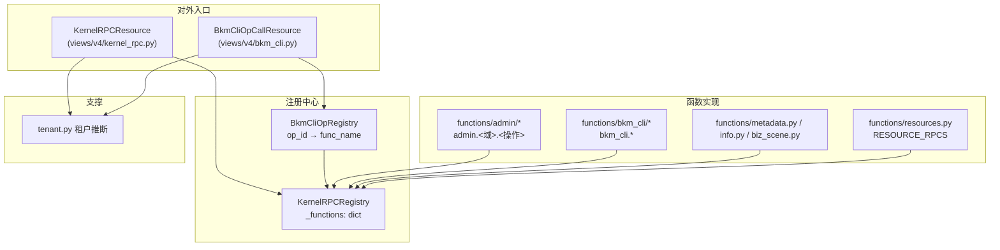

# 01-架构：RPC 函数注册子专家

**本文引用的文件**
- [rpc/registry.py](file://bkmonitor/kernel_api/rpc/registry.py)
- [rpc/functions/__init__.py](file://bkmonitor/kernel_api/rpc/functions/__init__.py)
- [rpc/tenant.py](file://bkmonitor/kernel_api/rpc/tenant.py)
- [rpc/bkm_cli_registry.py](file://bkmonitor/kernel_api/rpc/bkm_cli_registry.py)
- [resource/kernel_rpc.py](file://bkmonitor/kernel_api/resource/kernel_rpc.py)

## 目录

1. [简介](#简介)
2. [架构分层](#架构分层)
3. [双轨注册机制](#双轨注册机制)
4. [函数域分类](#函数域分类)
5. [依赖关系](#依赖关系)
6. [关键发现与风险](#关键发现与风险)

## 简介

RPC 层是 kernel_api 的"函数即服务"体系：`KernelRPCRegistry` 持有全局函数注册表，函数实现分布在 `rpc/functions/`，经 `KernelRPCResource` / `BkmCliOpCallResource` 对外暴露；租户上下文由 `rpc/tenant.py` 统一注入。

章节来源：[rpc/registry.py](file://bkmonitor/kernel_api/rpc/registry.py)（关键符号：`KernelRPCRegistry`）

## 架构分层

图表来源：[rpc/functions/__init__.py](file://bkmonitor/kernel_api/rpc/functions/__init__.py)（关键符号：`load_builtin_functions`）；[rpc/registry.py](file://bkmonitor/kernel_api/rpc/registry.py)（关键符号：`KernelRPCRegistry`）

## 双轨注册机制

1. **装饰器轨**（实际主力）：admin/bkm_cli/metadata/biz_scene/info 各模块顶部 `@KernelRPCRegistry.register(...)`，在 `load_builtin_functions` 导入模块时生效。
2. **RESOURCE_RPCS 列表轨**：模块定义 `RESOURCE_RPCS = [{func_name, resource_cls, summary, ...}]`，`load_builtin_functions` 统一 `register_resource_list`；当前仅 `resources.py` 使用且为空（兼容/扩展占位）。

`load_builtin_functions()`：`pkgutil.iter_modules(__path__)` 遍历 `functions/` 顶层模块/子包，跳过 `_` 开头，import 后取 `RESOURCE_RPCS`。**子包（admin/bkm_cli）依赖其 `__init__.py` 全量 import 成员模块**，从而触发装饰器注册。

章节来源：[rpc/functions/__init__.py](file://bkmonitor/kernel_api/rpc/functions/__init__.py)（关键符号：`load_builtin_functions`）

## 函数域分类

| 域 | 命名前缀 | 示例 | 语义 |
|----|----------|------|------|
| admin 运维巡检 | `admin.<域>.<操作>` | `admin.cluster_info.list`、`admin.es_storage.runtime_overview`、`admin.api_auth_token.create` | 运维/巡检/诊断（只读为主，个别管理操作经授权） |
| bkm-cli 命令 | `bkm_cli.*` | `bkm_cli.run_readonly_command`、`bkm_cli.read_db_model`、`bkm_cli.es_diagnose` | 只读命令，带 op 白名单 + 审计 |
| metadata 巡检 | `metadata_*` | `metadata_related_info`、`metadata_es_storage_check` | 元数据链路巡检（7 个） |
| 平台信息 | `info` / `biz_scene_related_info` | — | 环境/平台信息 |

章节来源：[rpc/functions/](file://bkmonitor/kernel_api/rpc/functions/)（关键符号：`load_builtin_functions`）

## 依赖关系

- `core.drf_resource`：`Resource` / `CustomException` / `get_serializer_fields` / `render_schema`（schema 反射）。
- `metadata.models`：Space / DataSource / ResultTable / TimeSeriesGroup（租户推断查询）。
- `bkmonitor.utils.tenant.bk_biz_id_to_bk_tenant_id`：业务 ID 反查租户。
- `kernel_api.resource.kernel_rpc.KernelRPCResource` / `bkm_cli.BkmCliOpCallResource`：对外入口（属内部 Resource 子专家）。

章节来源：[rpc/tenant.py](file://bkmonitor/kernel_api/rpc/tenant.py)（关键符号：`bk_biz_id_to_bk_tenant_id` / `models.Space`）

## 关键发现与风险

1. **全局注册表状态**：`KernelRPCRegistry._functions` / `BkmCliOpRegistry._ops` 是进程级全局，测试需 `_cleanup_registries` fixture 防污染（`test_bkm_cli_rpc.py`）。
2. **`__meta__` 保留名**：业务函数注册 `__meta__` 会被拒绝——协议安全设计。
3. **bkm-cli 404 语义**：`BkmCliOpNotFound` 显式注入 `code=404` 到 extra，防 `custom_exception_handler` 的 envelope code 被 None 覆盖。
4. **JSON-safe 归一**：`BkmCliOpCallResource` 出口统一 `json.dumps(default=str)`，杜绝 datetime/Decimal 序列化崩溃复发。

**出处行**：生成日期 2026-08-06，git commit：未提交（工作区）
