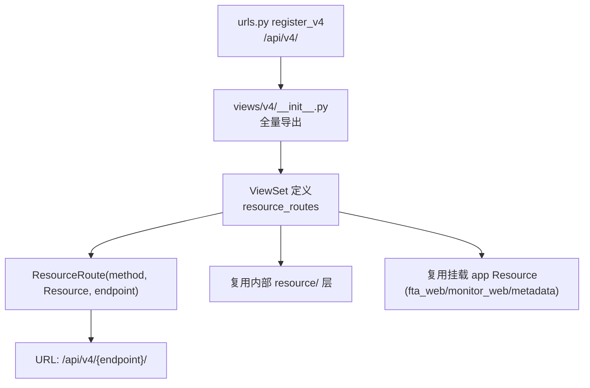

# 01-架构：v4 API 视图子专家

**本文引用的文件**
- [views/v4/__init__.py](file://bkmonitor/kernel_api/views/v4/__init__.py)
- [views/v4/alert.py](file://bkmonitor/kernel_api/views/v4/alert.py)
- [views/v4/issue.py](file://bkmonitor/kernel_api/views/v4/issue.py)
- [views/v4/kernel_rpc.py](file://bkmonitor/kernel_api/views/v4/kernel_rpc.py)

## 目录

1. [简介](#简介)
2. [装配模式](#装配模式)
3. [子域划分](#子域划分)
4. [依赖关系](#依赖关系)
5. [关键发现与风险](#关键发现与风险)

## 简介

`views/v4/` 是 kernel_api 对外 API 主版本（40 个 .py），全部为 `ResourceViewSet` 子类或独立 Resource 的薄装配层，经 `views/v4/__init__.py` 统一导出，由 `urls.py` 的 `register_v4()` 挂到 `/api/v4/`。

章节来源：[views/v4/__init__.py](file://bkmonitor/kernel_api/views/v4/__init__.py)（关键符号：`from .xxx import *`）

## 装配模式

图表来源：[views/v4/__init__.py](file://bkmonitor/kernel_api/views/v4/__init__.py)（关键符号：`from .alert import *`）

三种 ViewSet 形态（源码 confirmed）：
1. **自包含**：`ResourceRoute` 引用同文件独立 Resource（如 `issue.py` 的 12 个独立 Resource）。
2. **复用内部层**：`ResourceRoute` 引用 `kernel_api.resource.*`（如 `alert.py` 的 `SearchAlertViewSet` 引用 `ListAlertResource`）。
3. **继承挂载 app**：继承 `fta_web`/`monitor_web`/`apm` 的 ViewSet（如 `AlertV2ViewSet(fta_web.alert_v2.views.AlertV2ViewSet)`、apm 的 6 个继承类）。

章节来源：[views/v4/alert_v2.py](file://bkmonitor/kernel_api/views/v4/alert_v2.py)（关键符号：`AlertV2ViewSet`）

## 子域划分

| 子域 | 文件 | ViewSet 数量 | 说明 |
|------|------|--------------|------|
| 告警/事件 | alert.py / alert_v2.py / event.py / event_v2.py / event_plugin.py | 9 | 事件中心 + MCP + V2 |
| 策略/屏蔽/分派 | strategy*.py / shield.py / assign.py | 6 | 策略 CRUD、屏蔽、分派 |
| 动作/套餐 | action.py / action_config.py | 3 | ITSM 回调、处理套餐 |
| Issue | issue.py | 1 + 12 Resource | 告警聚合 Issue 状态机 |
| 日志 | log_search.py / log_extract.py | 2 | 检索/提取 |
| 协议入口 | kernel_rpc.py / bkm_cli.py / operation.py | 3 | RPC / op / 运营指标 |
| APM | apm.py | 7 | MCP + 继承 |
| 采集/上报 | collect.py / custom_report.py / ascode.py / plugin.py | 5 | 采集配置、AsCode |
| 其他 | bcs / grafana / gse / k8s_resource / relation / calendars / subscribe / import_export / new_report / mail_report / metrics / entity / notice_group / openclaw / ai_repo / utils | 16 | 各业务域 |

章节来源：[views/v4/](file://bkmonitor/kernel_api/views/v4/)（关键符号：`ResourceViewSet`）

## 依赖关系

- **`kernel_api.resource.*`**：内部复用层（alert/log_search/operation/kernel_rpc/bkm_cli 等）。
- **挂载 app**：`fta_web`（告警/策略/屏蔽/Issue/通知）、`monitor_web`（采集/统计/uptime_check）、`metadata`（日志/元数据）、`apm`、`rum`、`monitor_api`。
- **`core.drf_resource`**：`ResourceViewSet` / `ResourceRoute`。
- **父专家横切能力**：认证中间件、`api_exception_handler`、`ApiRenderer`。

章节来源：[views/v4/alert.py](file://bkmonitor/kernel_api/views/v4/alert.py)（关键符号：`ResourceRoute`）

## 关键发现与风险

1. **薄装配 + 大量继承**：修改挂载 app 的 ViewSet 会透传到 v4 接口——跨模块变更需回归 v4 接口。
2. **endpoint 命名两种风格**：`AlertViewSet` 用 `alert/search` 带前缀形式，其余多用裸 endpoint——新增接口遵循所在 ViewSet 的既有风格。
3. **MCP 与全量接口并存**：alert.py 同时有全量事件中心（`AlertViewSet`）与 MCP 精简版（`SearchAlertViewSet`），参数/返回语义不同，勿混用。
4. **Issue 专有错误码**：rename 重名 3327001，与 `core/errors/upgrade.py` 3318001 冲突段需规避（见记忆《错误码段冲突》）。

**出处行**：生成日期 2026-08-06，git commit：未提交（工作区）
