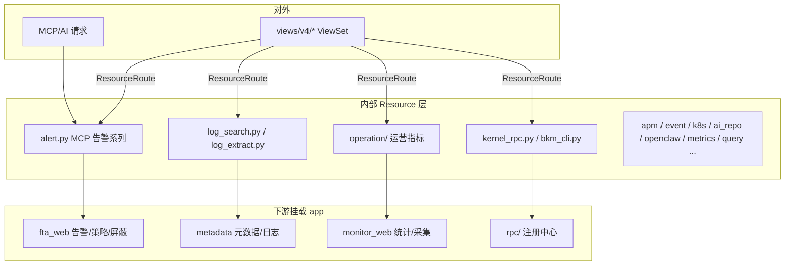

# 01-架构：内部 Resource 复用子专家

**本文引用的文件**
- [resource/alert.py](file://bkmonitor/kernel_api/resource/alert.py)
- [resource/log_search.py](file://bkmonitor/kernel_api/resource/log_search.py)
- [resource/operation/](file://bkmonitor/kernel_api/resource/operation/)
- [resource/kernel_rpc.py](file://bkmonitor/kernel_api/resource/kernel_rpc.py)
- [serializers/mixins.py](file://bkmonitor/kernel_api/serializers/mixins.py)

## 目录

1. [简介](#简介)
2. [架构定位](#架构定位)
3. [复用模式](#复用模式)
4. [子模块划分](#子模块划分)
5. [依赖关系](#依赖关系)
6. [关键发现与风险](#关键发现与风险)

## 简介

内部 Resource 层是 kernel_api 的"批发场景"：`resource/` 下的 Resource 被 `views/` ViewSet 或 MCP/AI 请求复用，提供告警/日志/事件/APM/K8s/运营指标等查询能力，并承载 `KernelRPCResource`/`BkmCliOpCallResource` 两个协议入口。

章节来源：[resource/](file://bkmonitor/kernel_api/resource/)（关键符号：`Resource`）

## 架构定位

图表来源：[resource/alert.py](file://bkmonitor/kernel_api/resource/alert.py)（关键符号：`ListAlertResource` / `AlertRelatedResource`）；[resource/kernel_rpc.py](file://bkmonitor/kernel_api/resource/kernel_rpc.py)（关键符号：`KernelRPCResource`）

## 复用模式

1. **薄封装适配**：内部 Resource 常封装下游调用，补全协议头/别名映射（如 `ListAlertResource` 内部调用 `SearchAlertResource` 等）。
2. **全局入口线程安全**：`resource.xxx.yyy()` 自动新建临时实例（`Resource.__call__`）；持有实例多次 `request()` 需自行保证实例级状态安全。
3. **序列化约定**：显式 `RequestSerializer`/`ResponseSerializer`；MCP 场景用 `TimeSpanValidationPassThroughSerializer`（serializers/mixins.py）做透传 + 时间跨度校验。

章节来源：[serializers/mixins.py](file://bkmonitor/kernel_api/serializers/mixins.py)（关键符号：`TimeSpanValidationPassThroughSerializer`）

## 子模块划分

| 子模块 | 职责 | 代表 Resource |
|--------|------|---------------|
| alert.py | MCP 告警/策略/屏蔽/通知组/套餐 | `ListAlertResource` / `AlertRelatedResource` / `SearchAlarmStrategiesResource` |
| log_search.py | 日志检索与分析 | `SearchLogResource` / `FieldAnalyzeResource` |
| log_extract.py | 日志提取任务 | `CreateLogExtractTaskResource` |
| operation/ | 运营指标（registry + handlers + resources） | `GetOperationMetricResource` |
| kernel_rpc.py / bkm_cli.py | RPC/op 协议入口 | `KernelRPCResource` / `BkmCliOpCallResource` |
| apm.py / event.py / k8s_resource.py / ai_repo.py / openclaw.py / metrics.py / query.py / qos.py / bcs.py / grafana.py / relation.py / permission.py | 各业务域查询 | 见 C1 §6 |

章节来源：[resource/](file://bkmonitor/kernel_api/resource/)（关键符号：`Resource`）

## 依赖关系

- 复用挂载 app：`fta_web`（告警/策略/屏蔽/通知）、`metadata`（日志/元数据）、`monitor_web`（统计/采集）、`apm`、`rum`。
- 复用 `core.drf_resource`（Resource 基类 + resource 全局入口 + CacheResource/FaultTolerantResource 等）。
- `rpc/`（KernelRPCRegistry / BkmCliOpRegistry / tenant 注入）为兄弟子专家范围，此处仅入口。

章节来源：[resource/alert.py](file://bkmonitor/kernel_api/resource/alert.py)（关键符号：`resource.alert`）

## 关键发现与风险

1. **MCP 是主消费方**：alert.py 大量 MCP 系列 Resource（策略/屏蔽/通知组/套餐）专为 AI 请求设计，`bk_biz_id` 必填 + 时间跨度限制。
2. **operation 单指标降级**：`GetOperationOverviewResource` 单指标失败降级到 `error` 字段，不影响整批——消费方需容忍部分失败。
3. **环境门控**：operation 指标 `supported_envs` 按 `OPERATION_MCP_ENV` 过滤，未部署能力的环境会隐藏指标。
4. **JSON-safe 归一**：bkm-cli 出口统一 `json.dumps(default=str)`（见 RPC 子专家），新增 op 无需逐函数补丁。

**出处行**：生成日期 2026-08-06，git commit：未提交（工作区）
