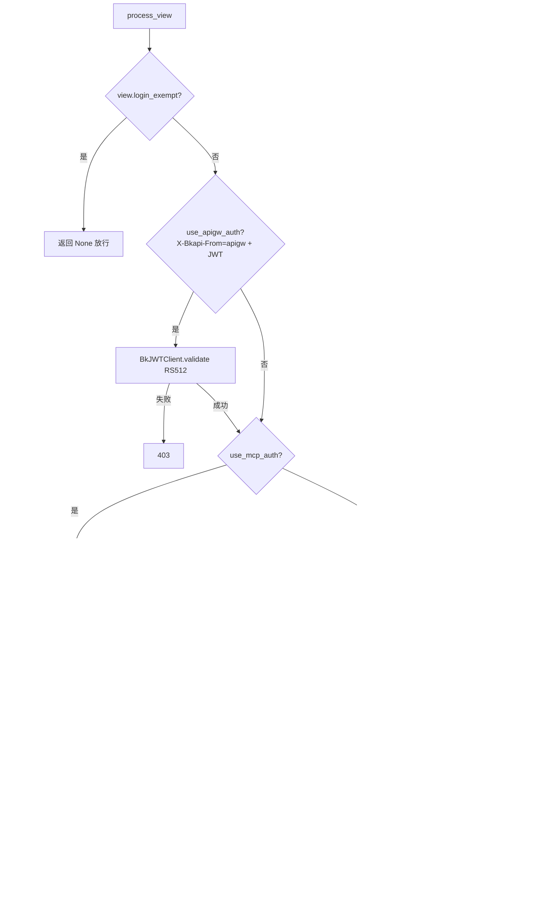

# 01-架构：认证与安全子专家

**本文引用的文件**
- [middlewares/authentication.py](file://bkmonitor/kernel_api/middlewares/authentication.py)
- [config/role/api.py](file://bkmonitor/config/role/api.py)

## 目录

1. [简介](#简介)
2. [认证判定链](#认证判定链)
3. [核心组件](#核心组件)
4. [依赖关系](#依赖关系)
5. [关键发现与风险](#关键发现与风险)

## 简介

认证与安全子专家覆盖 `kernel_api/middlewares/authentication.py` 单文件（27KB）：一个 Django 中间件 + 一个认证后端 + 若干辅助类/函数。它是 kernel_api 所有请求的身份闸门。

章节来源：[middlewares/authentication.py](file://bkmonitor/kernel_api/middlewares/authentication.py)（关键符号：`AuthenticationMiddleware`）

## 认证判定链

图表来源：[middlewares/authentication.py](file://bkmonitor/kernel_api/middlewares/authentication.py)（关键符号：`AuthenticationMiddleware.process_view`）

## 核心组件

| 组件 | 类型 | 职责 |
|------|------|------|
| `AuthenticationMiddleware` | Django Middleware | 认证入口（process_view），按请求头分派 |
| `BkJWTClient` | 客户端类 | apigw JWT 解析/验签 |
| `is_match_api_token` | 模块函数 | app_code × namespaces 授权判断 |
| `AppWhiteListModelBackend` | auth Backend | 用户自动创建/更新 |
| `KernelSessionAuthentication` | DRF Authentication | 会话认证（禁 CSRF） |
| `APP_CODE_TOKENS` | 模块级全局 | app_code→namespaces 缓存（300~400s） |
| `OPENCLAW_RECOVERING_MCP_TOOLS` | 常量 | OpenClaw MCP 工具白名单 |

章节来源：[middlewares/authentication.py](file://bkmonitor/kernel_api/middlewares/authentication.py)（关键符号：`BkJWTClient` / `AppWhiteListModelBackend` / `OPENCLAW_RECOVERING_MCP_TOOLS`）

## 依赖关系

- `bkmonitor.models.ApiAuthToken` / `AuthType`：Token 数据模型。
- `core.drf_resource.api`：`api.bk_apigateway.get_public_key`（公钥获取）。
- `core.errors.api.BKAPIError`：公钥获取失败捕获。
- `bkmonitor.iam.action` / `bkmonitor.iam.drf.MCPPermission` / `constants.mcp`：MCP 权限动作。
- `bkmonitor.utils.user.get_admin_username`：租户管理员用户名。
- `constants.common.DEFAULT_TENANT_ID`：默认租户。
- `core.prometheus.metrics`：MCP 指标上报。

章节来源：[middlewares/authentication.py](file://bkmonitor/kernel_api/middlewares/authentication.py)（关键符号：`ApiAuthToken` / `MCPPermission` / `metrics.MCP_REQUESTS_TOTAL`）

## 关键发现与风险

1. **MCP 认证是内核 API 的安全热点**：`_handle_mcp_auth` 承担 IAM 权限动作解析 + 指标上报 + OpenClaw 白名单，逻辑长且状态多，无单测覆盖（风险）。
2. **app_code 未配置即放行**：`is_match_api_token` 中 app_code 不在授权表时返回 True——未在 `ApiAuthToken` 配置授权的 app_code 默认开放，属安全边界需留意。
3. **公钥缓存双路径**：`lru_cache`（进程内）+ `login_db` cache（跨进程）；公钥失效场景需同时清两处。
4. **Token 类型分支**：as_code/grafana/entity 类型 Token 替换请求用户并 `skip_check`，观测/告警场景保留原用户——权限语义因 Token 类型而异。

**出处行**：生成日期 2026-08-06，git commit：未提交（工作区）
