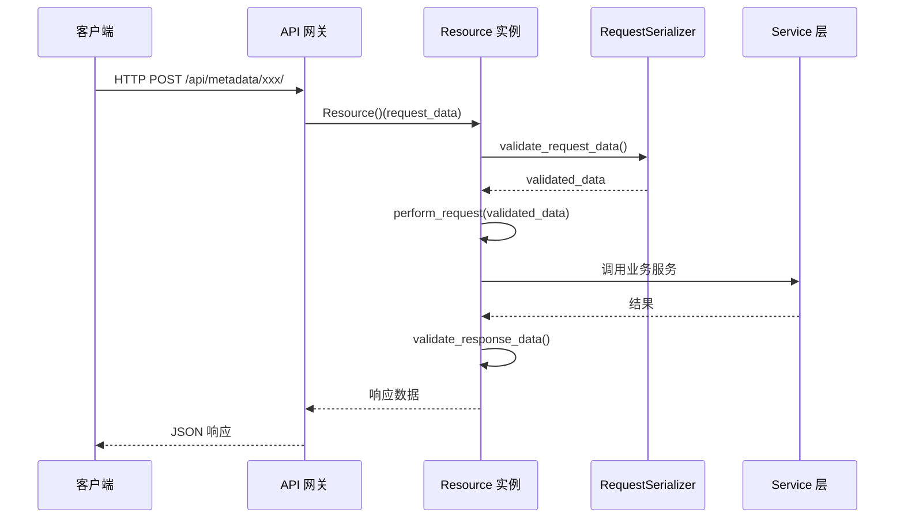
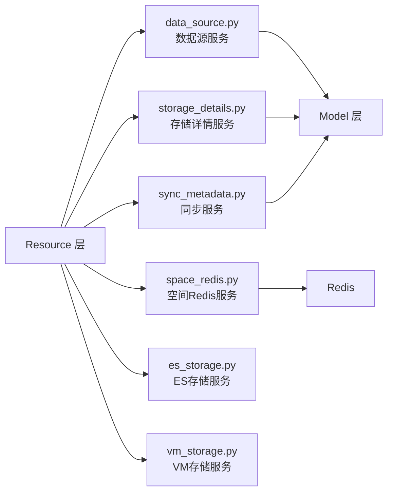

# C0-使用总览

> **专家**: API与工具库专家
> **创建时间**: 2026-07-28
> **类型**: 黑盒使用文档

---

## 一、Resource API 体系

### 1.1 架构概览

Resource 层是元数据模块的 API 入口，对外暴露 RESTful 接口。所有 Resource 类继承自 [`resources/base.py`](file://bk-monitor/bk-monitor-base/src/bk_monitor_base/metadata/resources/base.py) 中的 `Resource` 抽象基类。

```
客户端 → API 网关(api/metadata/default.py) → Resource 层 → Service 层 → Model 层
        内核 API(kernel_api/) ──────────────→ Resource 层（直连）
```

### 1.2 Resource 基类模式

每个 Resource 类遵循统一模式：

```python
class XxxResource(Resource):
    """资源描述"""

    @final
    class RequestSerializer(serializers.Serializer):
        # 请求参数定义
        bk_tenant_id = TenantIdField(label="租户ID")
        # ...

    @override
    def perform_request(self, validated_request_data):
        # 业务逻辑
        return result
```

核心流程：`request()` → `validate_request_data()` → `perform_request()` → `validate_response_data()`

### 1.3 Resource 文件分类

| 文件 | 职责 | 典型 Resource |
|------|------|-------------|
| `resources.py` (152KB) | 核心元数据 CRUD | `CreateDataIDResource`, `CreateResultTableResource`, `ListResultTableResource`, `ModifyDatasourceResultTable` 等 |
| `cluster.py` | 集群管理 | `RegisterCluster`, `ModifyCluster`, `DeleteCluster`, `ListClusters`, `GetStorageClusterDetail` |
| `bkdata_link.py` | 计算平台数据链路 | 数据链路创建/查询/修改 |
| `datalink_operation.py` | 数据链路操作 | 链路启停/迁移 |
| `entity_relation.py` | 实体关系（声明式 API） | `EntityHandler.apply/get/list/delete` |
| `log_datalink.py` | 日志数据链路 | 日志链路管理 |
| `space.py` | 空间管理 | 空间 CRUD |
| `vm.py` | VM 存储 | VM 接入/查询 |

### 1.4 请求处理流程



---

## 二、Service 服务层

### 2.1 服务层定位

Service 层位于 Resource 层和 Model 层之间，负责业务逻辑编排。本专家负责 Service 层的**接口契约**，实现细节归对应功能域子专家。

### 2.2 服务清单

| 服务 | 文件 | 核心能力 | 实现细节归属 |
|------|------|---------|-------------|
| 数据源服务 | `service/data_source.py` | Kafka 集群修改、数据源启停、来源切换、插件数据 ID 查询 | 专家1（核心模型） |
| 存储详情服务 | `service/storage_details.py` | 结果表与数据源详情聚合查询、集群详情 | 专家2（存储与数据链路） |
| 元数据同步服务 | `service/sync_metadata.py` | Kafka/ES/VM 元数据同步 | 专家4（任务调度） |
| 空间 Redis 服务 | `service/space_redis.py` | 空间配置缓存、ES 别名推送 | 专家3（空间管理） |
| ES 存储服务 | `service/es_storage.py` | ES 索引查询、过期索引清理 | 专家2（存储引擎） |
| VM 存储服务 | `service/vm_storage.py` | InfluxDB→VM 路由切换、VM 链路查询 | 专家2（存储引擎） |

### 2.3 服务调用关系



---

## 三、Utils 工具库分类

### 3.1 功能分组

| 分组 | 文件数 | 核心工具 | 使用场景 |
|------|--------|---------|---------|
| **加密/哈希** | 3 | `cipher.py`(AES加密), `hash_util.py`(MD5), `hashring.py`(一致性哈希) | DataID Token 生成、Consul 配置哈希比对、负载均衡 |
| **时间** | 3 | `time_tools.py`(时区转换/时间范围), `time_format.py`, `go_time.py` | 时间戳转换、业务时区处理、时间对齐 |
| **Redis** | 2 | `redis_tools.py`(Hash/Set/PubSub), `redis_client.py`(连接管理) | 空间缓存、ES 别名推送、分布式锁 |
| **Consul** | 2 | `consul.py`(客户端), `consul_tools.py`(HashConsul) | 配置存储、路由刷新、分布式锁 |
| **请求/上下文** | 4 | `request.py`(请求获取/租户ID), `tenant.py`(租户转换), `user.py`, `local.py` | 多租户上下文、请求级变量 |
| **序列化** | 1 | `serializers.py`(TenantIdField) | Resource 参数校验 |
| **并发/锁** | 1 | `lock.py`(share_lock 装饰器) | Celery 任务互斥 |
| **数据库** | 1 | `db.py` | 数据库操作工具 |
| **ES** | 2 | `es_tools.py`, `es_curator.py` | ES 客户端获取、索引管理 |
| **InfluxDB** | 1 | `influxdb_tools.py` | InfluxDB 操作 |
| **BCS/K8S** | 2 | `bcs.py`(BCS 集群工具), `k8s_metric.py` | BCS DataID 查询、K8S 指标 |
| **外部集成** | 5 | `bkbase.py`, `bk_collector_config.py`, `gse.py`, `data_link.py`, `dataflow_auth.py` | 计算平台、采集器、GSE、数据流 |
| **通用** | 6 | `basic.py`, `tools.py`, `env.py`, `version.py`, `space.py`, `api_request.py` | 基础工具、环境变量 |

### 3.2 高频工具速查

| 工具 | 文件 | 典型用法 |
|------|------|---------|
| `RedisTools.hget/hset/hmset` | `redis_tools.py` | Redis Hash 读写 |
| `RedisTools.publish` | `redis_tools.py` | Redis PubSub 发布 |
| `HashConsul.put` | `consul_tools.py` | 哈希比对后写入 Consul |
| `share_lock` | `lock.py` | Celery 任务分布式锁 |
| `get_request_tenant_id` | `request.py` | 获取当前请求租户 ID |
| `TenantIdField` | `serializers.py` | Resource 自动注入租户 ID |
| `object_md5` | `hash_util.py` | 对象 MD5 哈希 |
| `transform_data_id_to_token` | `cipher.py` | DataID 加密为 Token |
| `hms_string` | `time_tools.py` | 秒数转人类可读时间 |
| `get_bcs_dataids` | `bcs.py` | 获取 BCS 集群的 DataID 集合 |

---

## 四、BCS 集成

### 4.1 BCS 模型总览

| 模型 | 文件 | 说明 |
|------|------|------|
| `BCSClusterInfo` | `models/bcs/cluster.py` (29KB) | K8S 集群信息：集群注册、DataID 管理、资源初始化 |
| `BcsFederalClusterInfo` | `models/bcs/cluster.py` | 联邦集群信息 |
| `ServiceMonitorInfo` | `models/bcs/resource.py` (20KB) | ServiceMonitor K8S 资源 |
| `PodMonitorInfo` | `models/bcs/resource.py` | PodMonitor K8S 资源 |
| `LogCollectorInfo` | `models/bcs/resource.py` | 日志采集器资源 |
| `ReplaceConfig` | `models/bcs/replace.py` (6KB) | 替换配置 |

### 4.2 BCS 数据流

```
BCS 集群注册 → BCSClusterInfo 创建 → 自动创建 DataID（K8S指标/自定义指标/K8S事件）
→ DataSource 关联 → ResultTable 创建 → 存储配置 → Consul 下发
```

### 4.3 BCS 工具函数

| 函数 | 文件 | 说明 |
|------|------|------|
| `get_bcs_dataids()` | `utils/bcs.py` | 获取 BCS 集群关联的 DataID 集合 |
| `change_cluster_router()` | `utils/bcs.py` | 集群迁移时更新路由 |
| `BcsKubeClient` | `utils/bcs.py` | BCS K8S API 客户端封装 |
| `get_bcs_space_by_biz()` | `utils/bcs.py` | 通过业务获取 BCS 空间 |

---

## 五、快速导航

| 需要了解 | 查看文档 |
|---------|---------|
| Resource 类 API 契约 | [C1-能力契约.md](C1-能力契约.md) |
| Resource 层架构 | [implementation/01-架构.md](implementation/01-架构.md) |
| Resource 请求处理流程 | [implementation/02-实现.md](implementation/02-实现.md) |
| 完整调用链 | [implementation/03-数据流转.md](implementation/03-数据流转.md) |
| 数据模型 | [implementation/04-模型.md](implementation/04-模型.md) |
| 接口说明 | [implementation/05-接口.md](implementation/05-接口.md) |
| API 资源子专家 | [sub-experts/API资源子专家/agent.md](sub-experts/API资源子专家/agent.md) |
| BCS与工具库子专家 | [sub-experts/BCS与工具库子专家/agent.md](sub-experts/BCS与工具库子专家/agent.md) |
