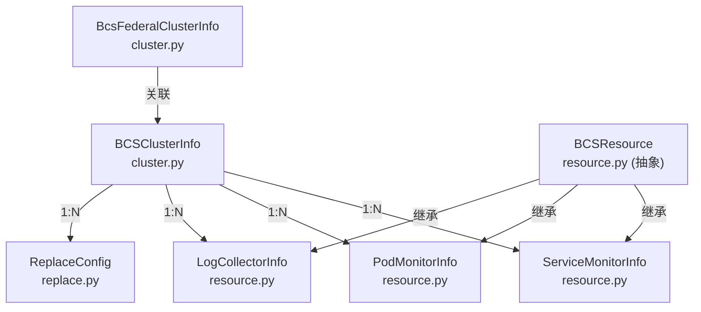
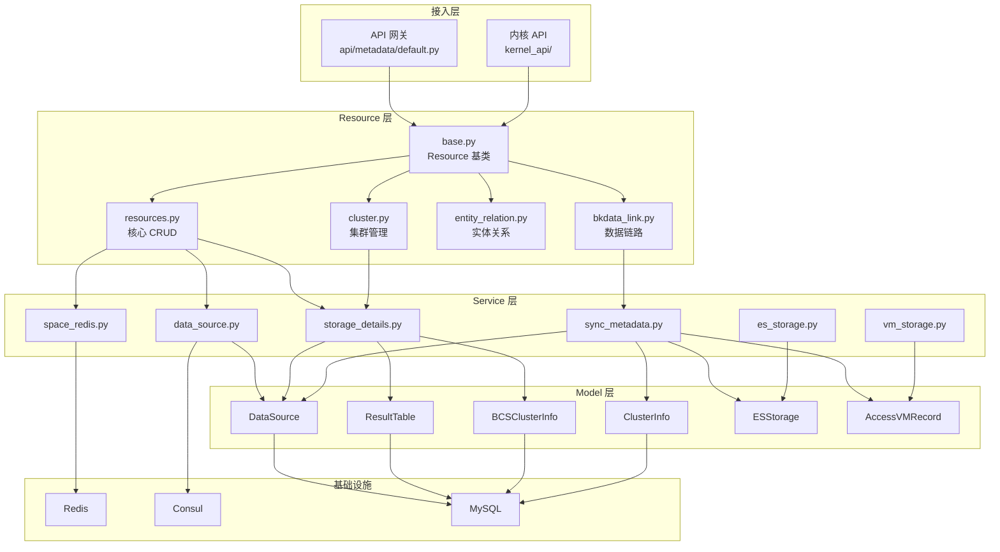

# 01-架构 — API与工具架构

> **专家**: API与工具库专家
> **创建时间**: 2026-07-28
> **类型**: 实现文档

---

## 一、Resource 注册与路由

### 1.1 整体架构

```
外部请求
  ├── api/metadata/default.py (API 网关) ──→ Resource 实例化调用
  └── kernel_api/ (内核直连) ──────────────→ Resource 实例化调用
                                                    │
                                              resources/base.py
                                              Resource 抽象基类
                                                    │
                    ┌───────────────────────────────┼───────────────────────────────┐
                    │                               │                               │
              resources.py                    cluster.py                    entity_relation.py
              (核心 CRUD)                     (集群管理)                     (声明式 API)
                    │                               │                               │
              bkdata_link.py              datalink_operation.py            log_datalink.py
              (计算平台链路)                (链路操作)                       (日志链路)
                    │
              space.py                        vm.py
              (空间管理)                      (VM存储)
```

### 1.2 Resource 基类设计

[`resources/base.py`](file://bk-monitor/bk-monitor-base/src/bk_monitor_base/metadata/resources/base.py) 定义了 `Resource` 抽象基类，核心设计：

```python
class Resource(ABC):
    RequestSerializer: type[Serializer] | None = None   # 请求参数校验器
    ResponseSerializer: type[Serializer] | None = None  # 响应参数校验器
    many_request_data: bool = False                      # 请求是否为列表
    many_response_data: bool = False                     # 响应是否为列表

    def __call__(self, *args, **kwargs) -> Any:          # 线程安全入口
    def request(self, request_data=None, **kwargs):       # 请求处理主流程
    def validate_request_data(self, request_data):        # 请求校验
    def validate_response_data(self, response_data):      # 响应校验
    @abstractmethod
    def perform_request(self, validated_request_data):    # 子类实现业务逻辑
```

**设计要点**:
- `__call__` 创建新实例保证线程安全
- `request()` 统一异常捕获，转换为 `BkApiError`
- 子类只需实现 `perform_request()` 和定义 `RequestSerializer`

### 1.3 Resource 文件组织

| 文件 | 架构角色 | 依赖 |
|------|---------|------|
| `base.py` | 抽象基类 | DRF Serializer |
| `resources.py` | 核心元数据 CRUD（最大文件） | base.py, service/, models/, utils/ |
| `cluster.py` | 集群管理 | base.py, service/storage_details.py |
| `bkdata_link.py` | 计算平台数据链路 | base.py, models/data_link/ |
| `datalink_operation.py` | 数据链路操作 | base.py, models/data_link/ |
| `entity_relation.py` | 实体关系声明式 API | base.py, models/entity_relation.py |
| `log_datalink.py` | 日志数据链路 | base.py, models/data_link/ |
| `space.py` | 空间管理 | base.py, models/space/ |
| `vm.py` | VM 存储 | base.py, models/vm/ |

---

## 二、Service 分层

### 2.1 分层架构

```
Resource 层 (resources/)
    │
    ├── 直接调用 Model 层（简单 CRUD）
    │
    └── 调用 Service 层（复杂业务编排）
            │
            ├── data_source.py      → models.DataSource, models.KafkaTopicInfo
            ├── storage_details.py  → models.DataSource, models.ResultTable, models.BCSClusterInfo
            ├── sync_metadata.py    → models.DataSource, models.ClusterInfo, models.ESStorage
            ├── space_redis.py      → models.ResultTable, RedisTools
            ├── es_storage.py       → models.ESStorage
            ├── vm_storage.py       → models.AccessVMRecord, models.InfluxDBStorage
            └── influxdb_instance.py → models.InfluxDBHostInfo
```

### 2.2 服务层设计原则

- **接口契约归本专家**：函数签名、参数类型、返回值结构
- **实现细节归功能域子专家**：如 `space_redis.py` 的 Redis 缓存策略归空间管理子专家
- **服务间低耦合**：各服务独立，通过显式参数传递而非隐式依赖

### 2.3 服务调用模式

```
Resource.perform_request()
    │
    ├── 简单场景：直接调用 Model 方法
    │   e.g. models.DataSource.create_data_source(**data)
    │
    └── 复杂场景：调用 Service 函数
        e.g. stop_or_enable_datasource(bk_tenant_id, data_id_list, is_enabled)
        e.g. ResultTableAndDataSource(bk_tenant_id, table_id=...).get_detail()
```

---

## 三、Utils 工具库组织

### 3.1 目录结构

```
utils/
├── __init__.py              # 空文件
│
├── 加密/哈希
│   ├── cipher.py            # AES 加密（DataID → Token）
│   ├── hash_util.py         # MD5 哈希（对象→哈希值）
│   └── hashring.py          # 一致性哈希环
│
├── 时间
│   ├── time_tools.py        # 时区转换/时间范围/格式化
│   ├── time_format.py       # 时间格式常量
│   └── go_time.py           # Go 时间格式
│
├── Redis
│   ├── redis_tools.py       # RedisTools 封装（Hash/Set/PubSub）
│   └── redis_client.py      # RedisClient 连接管理
│
├── Consul
│   ├── consul.py            # BKConsul 客户端（TLS/HTTP 自适应）
│   └── consul_tools.py      # HashConsul（MD5 比对后写入）
│
├── 请求/上下文
│   ├── request.py           # 请求获取/租户ID/用户名
│   ├── local.py             # 线程本地存储
│   ├── user.py              # 用户工具
│   └── tenant.py            # 租户转换（space_uid↔bk_tenant_id）
│
├── 序列化
│   └── serializers.py       # TenantIdField（自动注入租户ID）
│
├── 并发/锁
│   └── lock.py              # share_lock 分布式锁装饰器
│
├── 数据库
│   └── db.py                # 数据库工具
│
├── ES
│   ├── es_tools.py          # ES 客户端
│   └── es_curator.py        # ES 索引管理
│
├── InfluxDB
│   └── influxdb_tools.py    # InfluxDB 工具
│
├── BCS/K8S
│   ├── bcs.py               # BCS 集群工具/DataID 查询
│   └── k8s_metric.py        # K8S 内置指标
│
├── 外部集成
│   ├── bkbase.py            # 计算平台集成
│   ├── bk_collector_config.py # 采集器配置
│   ├── gse.py               # GSE 集成
│   ├── data_link.py         # 数据链路工具
│   └── dataflow_auth.py     # 数据流认证
│
└── 通用
    ├── basic.py             # 基础工具
    ├── tools.py             # 通用工具
    ├── env.py               # 环境变量
    ├── version.py           # 版本管理
    ├── space.py             # 空间工具
    └── api_request.py       # API 请求工具
```

### 3.2 工具库设计原则

- **无状态**：工具函数不持有状态，纯函数式设计
- **单一职责**：每个文件聚焦一个功能域
- **低耦合**：工具之间通过显式参数传递，避免循环导入
- **可测试**：工具函数独立可测，不依赖 Django request context（除 request.py 外）

---

## 四、BCS 模型架构

### 4.1 模型层次

```
models/bcs/
├── __init__.py          # 导出 BCSClusterInfo, ServiceMonitorInfo, PodMonitorInfo, ReplaceConfig, LogCollectorInfo, BcsFederalClusterInfo
├── cluster.py           # BCSClusterInfo — K8S 集群信息（核心模型）
├── resource.py          # BCSResource 抽象基类 → ServiceMonitorInfo, PodMonitorInfo, LogCollectorInfo
├── replace.py           # ReplaceConfig — 替换配置
└── utils.py             # ensure_data_id_resource, is_equal_config
```

### 4.2 BCS 模型关系



### 4.3 BCS 与外部模块关系

```
BCSClusterInfo
    │
    ├── 创建 DataSource（K8S指标/自定义指标/K8S事件）
    ├── 创建 ResultTable
    ├── 创建 TimeSeriesGroup / EventGroup
    ├── 管理 ServiceMonitorInfo / PodMonitorInfo
    └── 通过 BcsKubeClient 与 K8S API 交互
```

---

## 五、跨层调用全景


