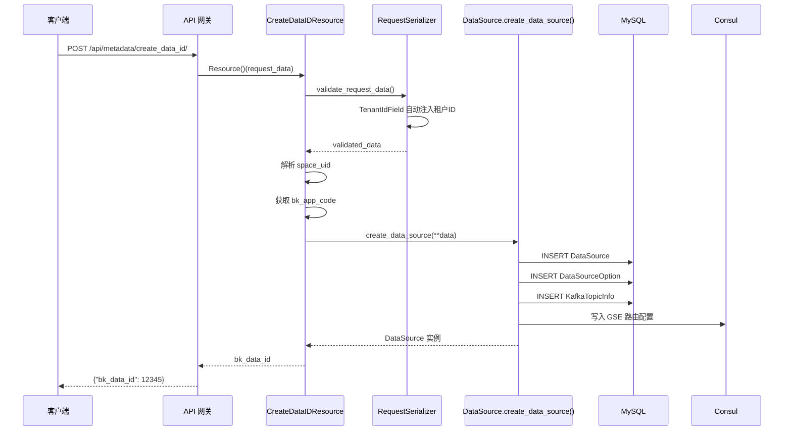
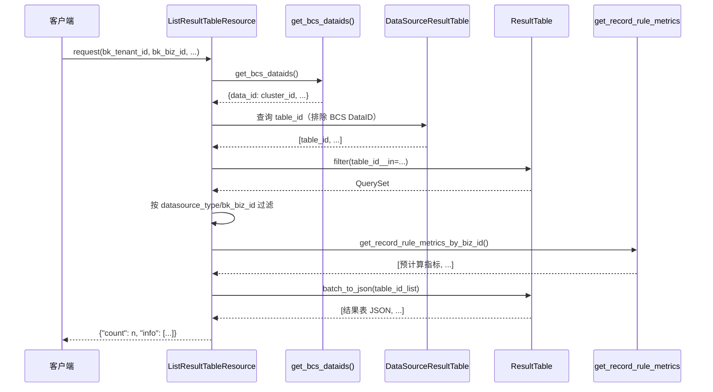
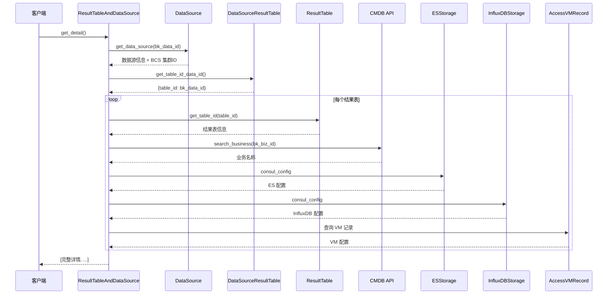
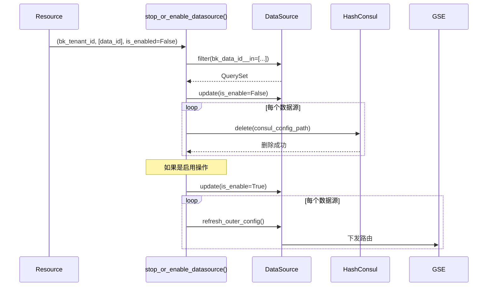
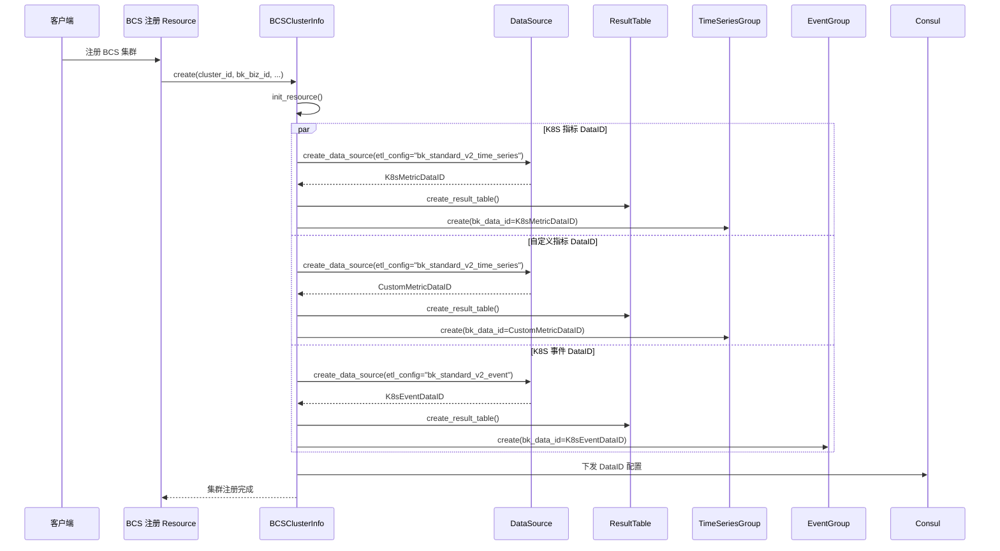
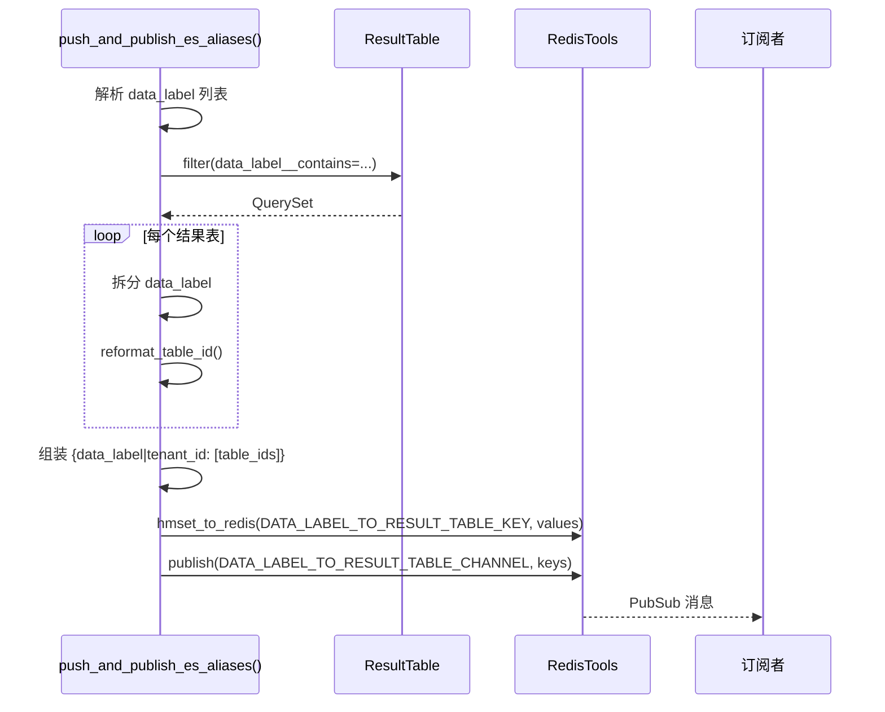
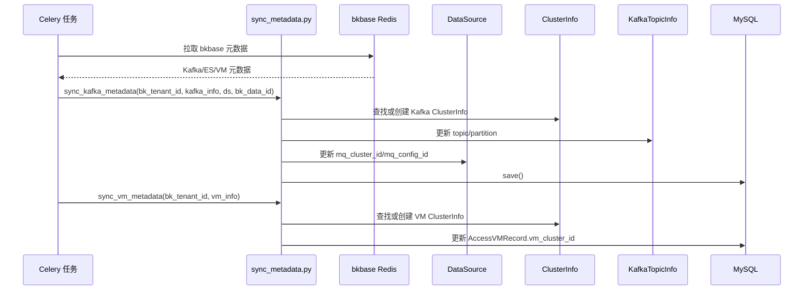

# 03-数据流转 — API 请求完整调用链

> **专家**: API与工具库专家
> **创建时间**: 2026-07-28
> **类型**: 实现文档

---

## 一、典型请求链路

### 1.1 创建数据源完整链路

**关键步骤**:
1. `TenantIdField` 自动从 request 注入 `bk_tenant_id`
2. `space_uid` 解析为 `space_type_id` + `space_id`
3. `bk_app_code` 作为 `source_system`
4. `DataSource.create_data_source()` 内部事务创建数据源及相关配置

### 1.2 查询结果表详情链路

### 1.3 存储详情查询链路

---

## 二、数据源启停链路

---

## 三、BCS 集群注册 → 数据链路

---

## 四、ES 别名推送链路

---

## 五、元数据同步链路

---

## 六、关键数据转换点

| 转换点 | 输入 | 输出 | 位置 |
|--------|------|------|------|
| space_uid 解析 | `"BKCC__123"` | `space_type_id="BKCC"`, `space_id="123"` | `CreateDataIDResource.perform_request()` |
| 租户 ID 注入 | 空/None | 当前请求的 bk_tenant_id | `TenantIdField.run_validation()` |
| table_id 格式化 | `"100147_bkcc_system_cpu_summary"` | 去掉前缀的 table_id | `reformat_table_id()` |
| 时间范围解析 | `"2024-01-01 -- 2024-01-02"` | `(start_timestamp, end_timestamp)` | `parse_time_range()` |
| DataID → Token | `(metric_id, trace_id, log_id, biz_id)` | AES 加密字符串 | `transform_data_id_to_token()` |
| 对象 → MD5 | dict/list/str | 32 位 hex 字符串 | `object_md5()` |
| 秒数 → 可读 | `90061` | `"1d 1h 1m 1s"` | `hms_string()` |
| 空间 UID → 租户 ID | `"BKCC__123"` | `"system"` | `space_uid_to_bk_tenant_id()` |
