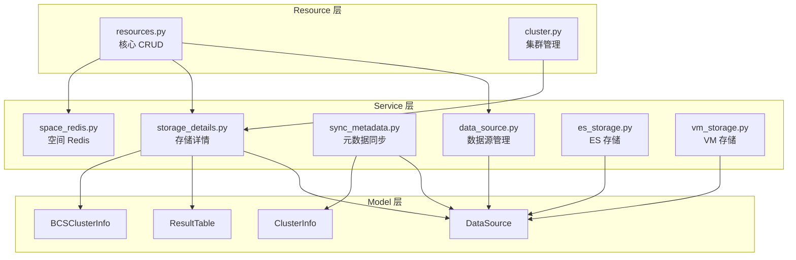

# 01-架构 — Resource 层与 Service 层架构

> **子专家**: API资源子专家
> **创建时间**: 2026-07-28
> **类型**: 实现文档

---

## 一、Resource 层架构

### 1.1 整体定位

Resource 层是元数据模块的 API 入口，位于 API 网关和 Service 层之间：

```
外部请求
  ├── api/metadata/default.py (API 网关) ──→ Resource 实例化调用
  └── kernel_api/ (内核直连) ──────────────→ Resource 实例化调用
                                                    │
                                              resources/base.py
                                              Resource 抽象基类
                                                    │
                    ┌───────────────────────────────┼───────────────────────────────┐
                    │                               │                               │
              resources.py                    cluster.py                    entity_relation.py
              (核心 CRUD)                     (集群管理)                     (声明式 API)
                    │                               │                               │
              bkdata_link.py              datalink_operation.py            log_datalink.py
              (计算平台链路)                (链路操作)                       (日志链路)
                    │
              space.py                        vm.py
              (空间管理)                      (VM存储)
```

### 1.2 Resource 基类设计

[`resources/base.py`](file://bk-monitor/bk-monitor-base/src/bk_monitor_base/metadata/resources/base.py) 定义了 `Resource` 抽象基类：

```python
class Resource(ABC):
    RequestSerializer: type[Serializer] | None = None   # 请求参数校验器
    ResponseSerializer: type[Serializer] | None = None  # 响应参数校验器
    many_request_data: bool = False                      # 请求是否为列表
    many_response_data: bool = False                     # 响应是否为列表

    def __call__(self, *args, **kwargs):          # 线程安全入口
    def request(self, request_data=None, **kwargs): # 请求处理主流程
    def validate_request_data(self, request_data):   # 请求校验
    def validate_response_data(self, response_data): # 响应校验
    @abstractmethod
    def perform_request(self, validated_request_data): # 子类实现业务逻辑
```

**设计要点**:
- `__call__` 每次创建新实例保证线程安全
- `request()` 统一异常捕获，转换为 `BkApiError`
- 子类只需实现 `perform_request()` 和定义 `RequestSerializer`

### 1.3 Resource 文件组织

| 文件 | 大小 | 架构角色 | 依赖 |
|------|------|---------|------|
| `base.py` | 5.3 KB | 抽象基类 | DRF Serializer |
| `resources.py` | **152 KB** | 核心元数据 CRUD（最大文件） | base.py, service/, models/, utils/ |
| `cluster.py` | 18.4 KB | 集群管理 | base.py, service/storage_details.py |
| `bkdata_link.py` | 50.9 KB | 计算平台数据链路 | base.py, models/data_link/ |
| `datalink_operation.py` | 18.1 KB | 数据链路操作 | base.py, models/data_link/ |
| `entity_relation.py` | 20.7 KB | 实体关系声明式 API | base.py, models/entity_relation.py |
| `log_datalink.py` | 39.1 KB | 日志数据链路 | base.py, models/data_link/ |
| `space.py` | 18.2 KB | 空间管理 | base.py, models/space/ |
| `vm.py` | 13.1 KB | VM 存储 | base.py, models/vm/ |

### 1.4 Resource 注册与路由

Resource 通过名称自动发现，无需显式注册：

```python
# API 网关中调用
from bk_monitor_base.metadata.resources.resources import CreateDataIDResource
result = CreateDataIDResource()(bk_tenant_id="system", data_name="test", ...)
```

---

## 二、Service 层架构

### 2.1 分层定位

```
Resource 层 (resources/)
    │
    ├── 直接调用 Model 层（简单 CRUD）
    │
    └── 调用 Service 层（复杂业务编排）
            │
            ├── data_source.py      → models.DataSource, models.KafkaTopicInfo
            ├── storage_details.py  → models.DataSource, models.ResultTable, models.BCSClusterInfo
            ├── sync_metadata.py    → models.DataSource, models.ClusterInfo, models.ESStorage
            ├── space_redis.py      → models.ResultTable, RedisTools
            ├── es_storage.py       → models.ESStorage
            ├── vm_storage.py       → models.AccessVMRecord, models.InfluxDBStorage
            └── influxdb_instance.py → models.InfluxDBHostInfo
```

### 2.2 Service 文件清单

| 文件 | 大小 | 职责 | 调用方 |
|------|------|------|--------|
| `data_source.py` | 6.0 KB | 数据源管理：Kafka 集群修改、启停、来源切换 | resources.py |
| `storage_details.py` | 17.9 KB | 存储详情聚合查询：数据源+结果表+业务+集群 | resources.py, cluster.py |
| `sync_metadata.py` | 12.1 KB | 元数据同步：Kafka/ES/VM 元数据 | Celery 任务 |
| `space_redis.py` | 2.9 KB | 空间 Redis 缓存：ES 别名推送 | resources.py |
| `es_storage.py` | 2.6 KB | ES 索引查询、过期索引清理 | internal |
| `vm_storage.py` | 8.8 KB | VM 链路管理：InfluxDB→VM 路由切换 | resources.py |
| `influxdb_instance.py` | 1.5 KB | InfluxDB 实例管理 | internal |

### 2.3 服务调用模式

```
Resource.perform_request()
    │
    ├── 简单场景：直接调用 Model 方法
    │   e.g. models.DataSource.create_data_source(**data)
    │
    └── 复杂场景：调用 Service 函数
        e.g. stop_or_enable_datasource(bk_tenant_id, data_id_list, is_enabled)
        e.g. ResultTableAndDataSource(bk_tenant_id, table_id=...).get_detail()
```

### 2.4 服务间依赖关系



---

## 三、请求处理流程

### 3.1 完整调用链

```
1. Resource()(request_data)  ← 线程安全入口（创建新实例）
2. validate_request_data()
   ├── 无 RequestSerializer → 原样返回
   └── 有 RequestSerializer → 实例化 → is_valid() → 返回 validated_data
3. perform_request(validated_request_data)  ← 子类实现
4. validate_response_data()
   ├── 无 ResponseSerializer → 原样返回
   └── 有 ResponseSerializer → 实例化 → is_valid() → 返回 validated_data
5. 异常捕获 → 统一转换为 BkApiError
```

### 3.2 线程安全设计

```python
def __call__(self, *args, **kwargs) -> Any:
    # 每次调用创建新实例，避免并发请求共享状态
    tmp_resource = self.__class__()
    return tmp_resource.request(*args, **kwargs)
```

### 3.3 异常处理

所有异常统一转换为 `BkApiError`：

```python
raise BkApiError(
    module="metadata_resource",
    action=self.get_resource_name(),
    method="",
    url=self.get_resource_name(),
    message=str(e),
    status_code=HTTPStatus.BAD_REQUEST,
)
```

### 3.4 序列化器错误格式化

`format_serializer_errors()` 递归遍历 DRF Serializer errors，将字段名替换为 label，生成人类可读的错误信息。

---

## 四、契约边界

| 层 | 本子专家负责 | 归其他专家 |
|----|------------|-----------|
| Resource 层 | 接口定义、参数校验、请求路由、异常处理 | — |
| Service 层 | 函数签名、参数类型、返回值结构 | 实现细节归对应功能域子专家 |
| Model 层 | — | 归专家1（元数据核心模型） |

