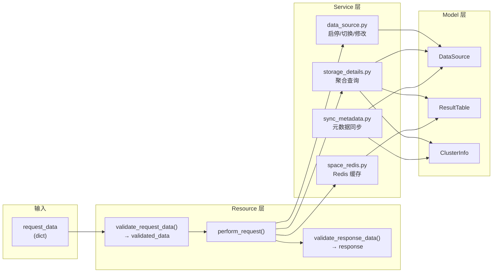

# 04-模型 — Resource 与 Service 数据模型

> **子专家**: API资源子专家
> **创建时间**: 2026-07-28
> **类型**: 实现文档

---

## 一、Resource 配置模型

### 1.1 Resource 基类数据结构

[`resources/base.py`](file://bk-monitor/bk-monitor-base/src/bk_monitor_base/metadata/resources/base.py)

```python
class Resource(ABC):
    # 类级属性
    RequestSerializer: type[Serializer] | None   # DRF Serializer 子类
    ResponseSerializer: type[Serializer] | None  # DRF Serializer 子类
    many_request_data: bool                       # 请求是否为对象列表
    many_response_data: bool                      # 响应是否为对象列表

    # 实例属性
    context: Any                                  # 上下文（线程安全）
    _request_serializer: Serializer | None        # 请求校验器实例
    _response_serializer: Serializer | None       # 响应校验器实例
```

### 1.2 常用 Serializer 结构

#### FieldSerializer

```python
class FieldSerializer(serializers.Serializer):
    field_name = serializers.CharField(required=True)
    field_type = serializers.CharField(required=True)
    tag = serializers.CharField(required=True)          # "metric" | "dimension"
    unit = serializers.CharField(required=False, default="")
    description = serializers.CharField(required=False, default="")
    alias_name = serializers.CharField(required=False, default="")
    option = serializers.DictField(required=False, default={})
    is_reserved_check = serializers.BooleanField(default=True)
```

#### PageSerializer

```python
class PageSerializer(serializers.Serializer):
    page = serializers.IntegerField(default=1, min_value=1)
    page_size = serializers.IntegerField(default=0)  # 0 = 不分页
```

#### TenantIdField

```python
class TenantIdField(serializers.CharField):
    # 自动从 request 注入 bk_tenant_id
    # prefer_request_tenant=True 时优先使用请求中的租户 ID
```

---

## 二、Service 数据模型

### 2.1 ResultTableAndDataSource 数据结构

**输入参数**:
```python
ResultTableAndDataSource(
    bk_tenant_id: str,
    table_id: str | None = None,
    bk_data_id: int | None = None,
    bcs_cluster_id: str | None = None,
    vm_table_id: str | None = None,
    metric_name: str | None = None,
    data_label: str | None = None,
    with_gse_router: bool = False,
)
```

**输出结构**:
```python
[{
    "bk_data_id": int,
    "bk_data_name": str,
    "space_uid": str,
    "etl_config": str,
    "creator": str,
    "updater": str,
    "cluster_id": str,           # BCS 集群 ID
    "is_enable": bool,
    "create_time": float,        # timestamp
    "created_from": str,
    "result_table": {
        "table_id": str,
        "result_table_name": str,
        "is_enable": bool,
    },
    "bk_biz_info": {
        "bk_biz_id": int,
        "bk_biz_name": str,
    },
    "transfer_cluster": str,
    "kafka_config": {
        "topic": str,
        "partition": int,
        "cluster_name": str,
        "domain_name": str,
        "port": int,
        "username": str,
        "password": str,
        "version": str,
        "schema": str,
        "gse_stream_to_id": int,
    },
    "gse_router": {              # 仅 with_gse_router=True
        stream_to_id: [{"topic_name": str, "name": str}, ...]
    },
    "es": {...},                 # ES 存储配置
    "influxdb": {...},           # InfluxDB 存储配置
    "kafka": {...},              # Kafka 存储配置
    "vm": {                      # VM 存储配置
        "vm_cluster_domain": str,
        "vm_cluster_id": int,
        "bk_base_data_id": int,
        "vm_result_table_id": str,
    },
    "influxdb_instance_cluster": [{...}],
}]
```

### 2.2 StorageClusterDetail 数据结构

**输出（Kafka 类型）**:
```python
[{
    "host": str,
    "port": int,
    "topic_count": int,
    "version": str,
    "schema": str,
    "status": "running",
}]
```

**输出（ES/InfluxDB/VM 类型）**:
```python
[{
    "host": str,
    "port": int,
    "version": str,
    "schema": str,
    "status": "running",
}]
```

### 2.3 数据源启停/来源切换 输入输出

**stop_or_enable_datasource**:
```
输入: bk_tenant_id (str), data_id_list (list[int]), is_enabled (bool)
输出: True (成功) / 异常 (失败)
```

**modify_data_id_source**:
```
输入: bk_tenant_id (str), data_id_list (list[int]), source_type ("bkdata" | "bkgse")
输出: True (成功) / 异常 (失败)
```

### 2.4 元数据同步 输入输出

**sync_kafka_metadata**:
```
输入: bk_tenant_id (str), kafka_info (dict), ds (DataSource 实例), bk_data_id (int)
输出: None
副作用: 创建/更新 KafkaTopicInfo, ClusterInfo, DataSource
```

**sync_vm_metadata**:
```
输入: bk_tenant_id (str), vm_info (dict[str, dict])
输出: None
副作用: 创建/更新 ClusterInfo, AccessVMRecord
```

### 2.5 ES 别名推送 输入输出

**push_and_publish_es_aliases**:
```
输入: bk_tenant_id (str), data_label (str, 逗号分隔)
输出: None
副作用: Redis Hash 写入 + PubSub 发布
```

---

## 三、关键枚举与常量

### 3.1 数据源来源系统

```python
# models/constants.py
class DataIdCreatedFromSystem:
    BKDATA = "bkdata"   # 计算平台
    BKGSE = "gse"       # GSE
```

### 3.2 集群类型

```python
# models/storage.py → ClusterInfo
TYPE_KAFKA = "kafka"
TYPE_INFLUXDB = "influxdb"
TYPE_ES = "elasticsearch"
TYPE_VM = "vm"
```

### 3.3 空间类型

```python
# models/space/constants.py
class SpaceTypes:
    BKCC = "BKCC"   # 业务空间
    BCS = "BCS"      # BCS 空间
```

### 3.4 ETL 配置

```python
# models/space/constants.py
class EtlConfigs:
    BK_MULTI_TENANCY_AGENT_EVENT_ETL_CONFIG = "bk_multi_tenancy_agent_event"
```

### 3.5 空间 UID 分隔符

```python
SPACE_UID_HYPHEN = "__"        # 分隔符，如 "BKCC__123"
SPACE_REDIS_KEY = "bkmonitorv3:space"  # 空间 Redis 键前缀
DATA_LABEL_TO_RESULT_TABLE_KEY = "..."  # 数据标签到结果表 Redis 键
DATA_LABEL_TO_RESULT_TABLE_CHANNEL = "..."  # 数据标签到结果表 Redis 频道
```

---

## 四、Resource 与 Service 的数据流关系


