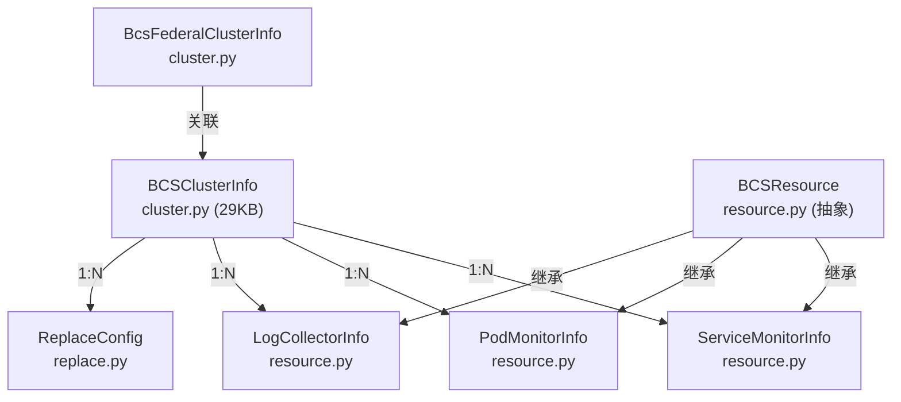

# C0-使用总览 — BCS与工具库子专家

> **子专家**: BCS与工具库子专家
> **创建时间**: 2026-07-28
> **类型**: 黑盒使用文档

---

## 一、Utils 工具库总览

### 1.1 工具库分类

```
utils/
├── 加密/哈希
│   ├── cipher.py            # AES 加密（DataID → Token）
│   ├── hash_util.py         # MD5 哈希（对象→哈希值）
│   └── hashring.py          # 一致性哈希环
│
├── 时间
│   ├── time_tools.py        # 时区转换/时间范围/格式化
│   ├── time_format.py       # 时间格式常量
│   └── go_time.py           # Go 时间格式
│
├── Redis
│   ├── redis_tools.py       # RedisTools 封装（Hash/Set/PubSub）
│   └── redis_client.py      # RedisClient 连接管理
│
├── Consul
│   ├── consul.py            # BKConsul 客户端（TLS/HTTP 自适应）
│   └── consul_tools.py      # HashConsul（MD5 比对后写入）
│
├── 请求/上下文
│   ├── request.py           # 请求获取/租户ID/用户名
│   ├── local.py             # 线程本地存储
│   ├── user.py              # 用户工具
│   └── tenant.py            # 租户转换（space_uid↔bk_tenant_id）
│
├── 序列化
│   └── serializers.py       # TenantIdField（自动注入租户ID）
│
├── 并发/锁
│   └── lock.py              # share_lock 分布式锁装饰器
│
├── 数据库
│   └── db.py                # 数据库工具
│
├── ES
│   ├── es_tools.py          # ES 客户端
│   └── es_curator.py        # ES 索引管理
│
├── InfluxDB
│   └── influxdb_tools.py    # InfluxDB 工具
│
├── BCS/K8S
│   ├── bcs.py               # BCS 集群工具/DataID 查询
│   └── k8s_metric.py        # K8S 内置指标
│
├── 外部集成
│   ├── bkbase.py            # 计算平台集成
│   ├── bk_collector_config.py # 采集器配置
│   ├── gse.py               # GSE 集成
│   ├── data_link.py         # 数据链路工具
│   └── dataflow_auth.py     # 数据流认证
│
└── 通用
    ├── basic.py             # 基础工具
    ├── tools.py             # 通用工具
    ├── env.py               # 环境变量
    ├── version.py           # 版本管理
    ├── space.py             # 空间工具
    └── api_request.py       # API 请求工具
```

### 1.2 使用场景速查

| 场景 | 使用的工具 |
|------|-----------|
| 需要从 request 获取租户 ID | `get_request_tenant_id()` |
| 需要 space_uid 转 bk_tenant_id | `space_uid_to_bk_tenant_id()` |
| 需要写入 Redis Hash | `RedisTools.hset_to_redis()` / `hmset_to_redis()` |
| 需要发布 Redis PubSub | `RedisTools.publish()` |
| 需要写入 Consul（避免重复写入） | `HashConsul.put()` |
| 需要分布式锁 | `@share_lock(ttl=600)` |
| 需要时间转换 | `localtime()`, `biz2utc_str()`, `utc2biz_str()` |
| 需要时间范围解析 | `parse_time_range()` |
| 需要秒数转可读格式 | `hms_string(90061)` → `"1d 1h 1m 1s"` |
| 需要 DataID 加密为 Token | `transform_data_id_to_token()` |
| 需要获取 BCS DataID 列表 | `get_bcs_dataids()` |
| 需要调用 K8S API | `BcsKubeClient(cluster_id)` |

---

## 二、BCS 模型总览

### 2.1 模型定位

BCS 模型管理 Kubernetes 集群的注册、DataID 创建、K8S 资源（ServiceMonitor/PodMonitor/LogCollector）的生命周期。

```
BCSClusterInfo (cluster.py)
    │
    ├── 创建 DataSource（K8S指标/自定义指标/K8S事件）
    ├── 创建 ResultTable
    ├── 创建 TimeSeriesGroup / EventGroup
    ├── 管理 ServiceMonitorInfo / PodMonitorInfo / LogCollectorInfo
    └── 通过 BcsKubeClient 与 K8S API 交互
```

### 2.2 模型关系



### 2.3 使用场景速查

| 场景 | 使用的模型/方法 |
|------|---------------|
| 注册 BCS 集群 | `BCSClusterInfo.init_resource()` |
| 获取 K8S API 客户端 | `BCSClusterInfo.api_client` (property) |
| 创建 K8S 指标 DataID | `BCSClusterInfo.create_k8s_metric_data_id()` |
| 创建自定义指标 DataID | `BCSClusterInfo.create_custom_metric_data_id()` |
| 创建 K8S 事件 DataID | `BCSClusterInfo.create_k8s_event_data_id()` |
| 查询 ServiceMonitor | `ServiceMonitorInfo.objects.filter(cluster_id=...)` |
| 创建 K8S 客户端 | `BCSResource.make_bcs_client(cluster_id)` |
| 判断是否刷新 DataID | `BCSResource.should_refresh_own_dataid()` |
| 查询 BCS DataID 列表 | `get_bcs_dataids(bk_biz_ids=[...])` |
| 集群迁移路由更新 | `change_cluster_router(cluster, new_biz_id, old_biz_id, ...)` |

---

## 三、快速导航

| 需要了解 | 查看文档 |
|---------|---------|
| 工具函数 API 契约 | [C1-能力契约.md](C1-能力契约.md) |
| 工具库与 BCS 架构 | [implementation/01-架构.md](implementation/01-架构.md) |
| 核心实现 | [implementation/02-实现.md](implementation/02-实现.md) |
| 数据流转 | [implementation/03-数据流转.md](implementation/03-数据流转.md) |
| 数据模型 | [implementation/04-模型.md](implementation/04-模型.md) |
| 接口签名 | [implementation/05-接口.md](implementation/05-接口.md) |
