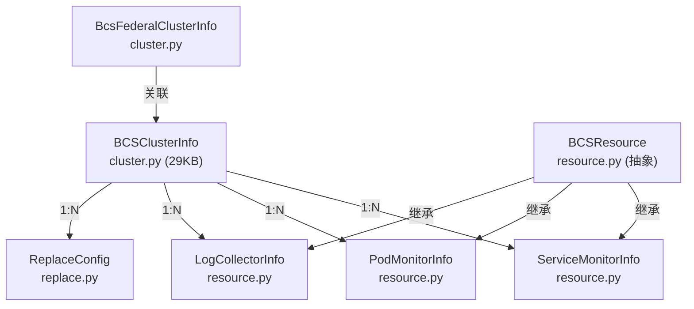
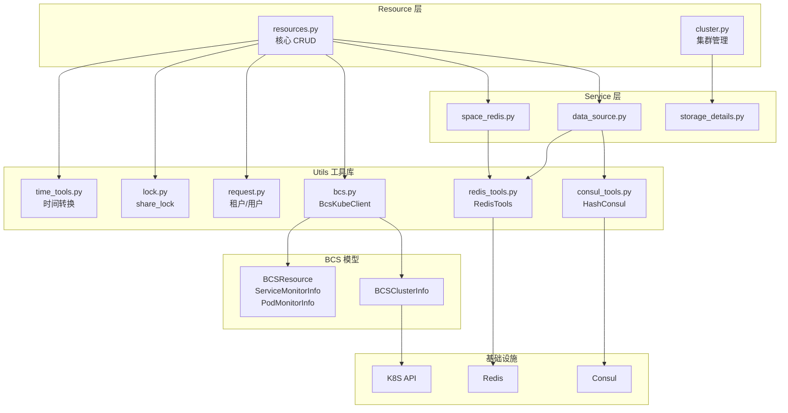

# 01-架构 — Utils 工具库与 BCS 模型架构

> **子专家**: BCS与工具库子专家
> **创建时间**: 2026-07-28
> **类型**: 实现文档

---

## 一、Utils 工具库架构

### 1.1 整体定位

Utils 工具库位于 Service 层和基础设施层之间，为 Resource 层和 Service 层提供无状态的工具函数支持：

```
Resource 层 → Service 层 → Utils 工具库 → 基础设施（Redis/Consul/K8S/ES/InfluxDB）
```

### 1.2 目录结构

```
utils/
├── __init__.py              # 空文件
│
├── 加密/哈希
│   ├── cipher.py            # AES 加密（DataID → Token）
│   ├── hash_util.py         # MD5 哈希（对象→哈希值）
│   └── hashring.py          # 一致性哈希环
│
├── 时间
│   ├── time_tools.py        # 时区转换/时间范围/格式化
│   ├── time_format.py       # 时间格式常量
│   └── go_time.py           # Go 时间格式
│
├── Redis
│   ├── redis_tools.py       # RedisTools 封装（Hash/Set/PubSub）
│   └── redis_client.py      # RedisClient 连接管理
│
├── Consul
│   ├── consul.py            # BKConsul 客户端（TLS/HTTP 自适应）
│   └── consul_tools.py      # HashConsul（MD5 比对后写入）
│
├── 请求/上下文
│   ├── request.py           # 请求获取/租户ID/用户名
│   ├── local.py             # 线程本地存储
│   ├── user.py              # 用户工具
│   └── tenant.py            # 租户转换（space_uid↔bk_tenant_id）
│
├── 序列化
│   └── serializers.py       # TenantIdField（自动注入租户ID）
│
├── 并发/锁
│   └── lock.py              # share_lock 分布式锁装饰器
│
├── 数据库
│   └── db.py                # 数据库工具
│
├── ES
│   ├── es_tools.py          # ES 客户端
│   └── es_curator.py        # ES 索引管理
│
├── InfluxDB
│   └── influxdb_tools.py    # InfluxDB 工具
│
├── BCS/K8S
│   ├── bcs.py               # BCS 集群工具/DataID 查询
│   └── k8s_metric.py        # K8S 内置指标
│
├── 外部集成
│   ├── bkbase.py            # 计算平台集成
│   ├── bk_collector_config.py # 采集器配置
│   ├── gse.py               # GSE 集成
│   ├── data_link.py         # 数据链路工具
│   └── dataflow_auth.py     # 数据流认证
│
└── 通用
    ├── basic.py             # 基础工具
    ├── tools.py             # 通用工具
    ├── env.py               # 环境变量
    ├── version.py           # 版本管理
    ├── space.py             # 空间工具
    └── api_request.py       # API 请求工具
```

### 1.3 工具库设计原则

- **无状态**：工具函数不持有状态，纯函数式设计
- **单一职责**：每个文件聚焦一个功能域
- **低耦合**：工具之间通过显式参数传递，避免循环导入
- **可测试**：工具函数独立可测，不依赖 Django request context（除 request.py 外）

---

## 二、BCS 模型架构

### 2.1 模型层次

```
models/bcs/
├── __init__.py          # 导出 BCSClusterInfo, ServiceMonitorInfo, PodMonitorInfo, ReplaceConfig, LogCollectorInfo, BcsFederalClusterInfo
├── cluster.py           # BCSClusterInfo — K8S 集群信息（核心模型，29KB）
├── resource.py          # BCSResource 抽象基类 → ServiceMonitorInfo, PodMonitorInfo, LogCollectorInfo
├── replace.py           # ReplaceConfig — 替换配置
└── utils.py             # ensure_data_id_resource, is_equal_config
```

### 2.2 模型关系



### 2.3 BCS 与外部模块关系

```
BCSClusterInfo
    │
    ├── 创建 DataSource（K8S指标/自定义指标/K8S事件）
    ├── 创建 ResultTable
    ├── 创建 TimeSeriesGroup / EventGroup
    ├── 管理 ServiceMonitorInfo / PodMonitorInfo / LogCollectorInfo
    └── 通过 BcsKubeClient 与 K8S API 交互
```

### 2.4 BCSClusterInfo 核心字段

| 字段 | 类型 | 说明 |
|------|------|------|
| `cluster_id` | CharField(128) | BCS 集群 ID（db_index） |
| `bcs_api_cluster_id` | CharField(128) | bcs-api 集群 ID（db_index） |
| `bk_biz_id` | IntegerField | 业务 ID（db_index） |
| `bk_tenant_id` | CharField(256) | 租户 ID |
| `bk_cloud_id` | IntegerField | 云区域 ID |
| `project_id` | CharField(128) | 项目 ID |
| `status` | CharField(50) | 集群状态（running/deleted/init_failed） |
| `domain_name` | CharField(512) | 集群域名 |
| `port` | IntegerField | 集群端口 |
| `server_address_path` | CharField(512) | 集群请求根路径 |
| `api_key_type` | CharField(128) | 认证类型（默认 "authorization"） |
| `api_key_content` | CharField(128) | 认证信息 |
| `api_key_prefix` | CharField(128) | 认证前缀（默认 "Bearer"） |
| `is_skip_ssl_verify` | BooleanField | 是否跳过 SSL（默认 True） |
| `cert_content` | TextField | 认证证书 |
| `K8sMetricDataID` | IntegerField | K8S 指标 DataID（默认 0） |
| `CustomMetricDataID` | IntegerField | 自定义指标 DataID（默认 0） |
| `K8sEventDataID` | IntegerField | K8S 事件 DataID（默认 0） |

### 2.5 DATASOURCE_REGISTER_INFO 配置

| 类型 | etl_config | report_class | is_split_measurement | is_system | usage |
|------|-----------|-------------|---------------------|-----------|-------|
| k8s_metric | bk_standard_v2_time_series | TimeSeriesGroup | True | True | metric |
| custom_metric | bk_standard_v2_time_series | TimeSeriesGroup | True | False | metric |
| k8s_event | bk_standard_v2_event | EventGroup | — | True | event |

---

## 三、跨层调用全景


