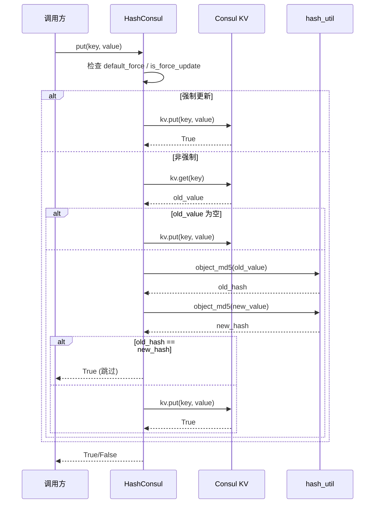
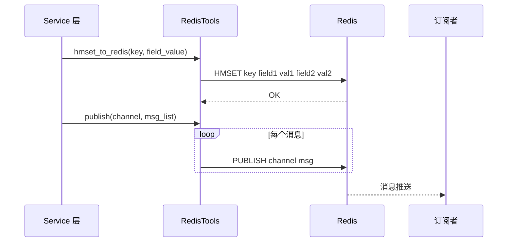
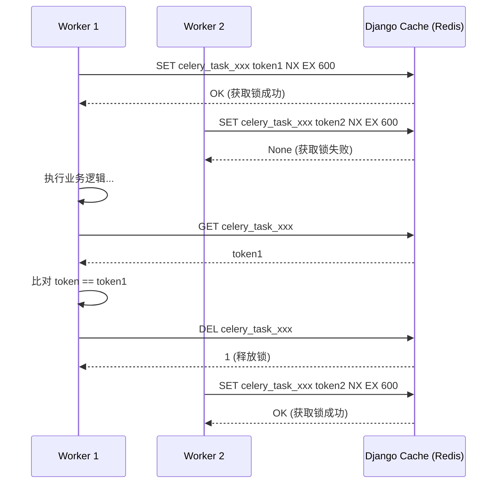
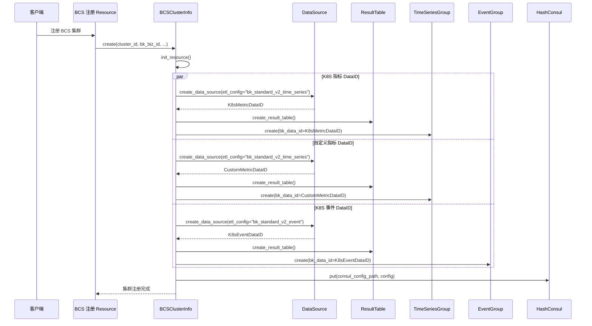
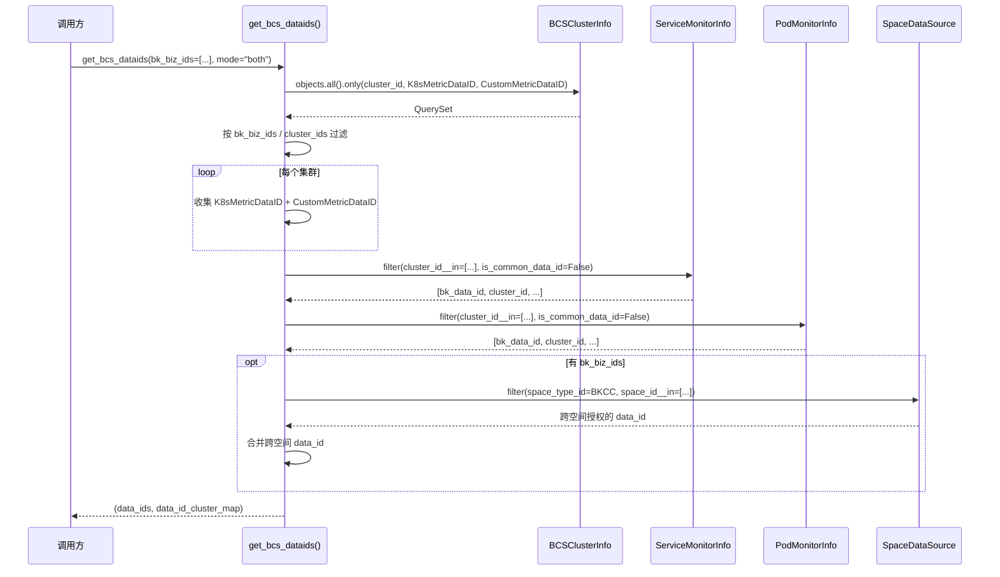
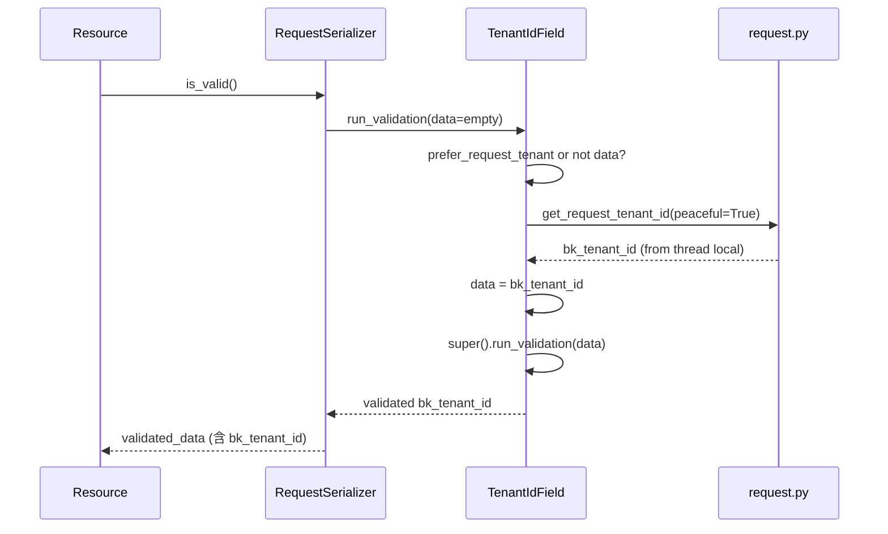

# 03-数据流转 — 工具库与 BCS 数据流转

> **子专家**: BCS与工具库子专家
> **创建时间**: 2026-07-28
> **类型**: 实现文档

---

## 一、HashConsul 写入流程



---

## 二、RedisTools Hash 写入与 PubSub 发布



---

## 三、share_lock 分布式锁流程



---

## 四、BCS 集群注册 → 数据链路



---

## 五、get_bcs_dataids 查询流程



---

## 六、BcsKubeClient K8S API 调用流程

```mermaid
sequenceDiagram
    participant Caller as 调用方
    participant BKC as BcsKubeClient
    participant BCS_API as BCS API Gateway
    participant K8S as K8S API

    Caller->>BKC: BcsKubeClient(cluster_id)
    BKC->>BKC: 构造 auth (host + api_key)
    BKC->>BKC: 创建 ApiClient

    Caller->>BKC: api.list_namespaced_deployment(namespace)
    BKC->>BKC: client_request(api.list_namespaced_deployment, namespace=...)
    BKC->>BCS_API: GET /clusters/{cluster_id}/apis/apps/v1/namespaces/{ns}/deployments
    BCS_API->>K8S: 代理请求
    K8S-->>BCS_API: 响应
    BCS_API-->>BKC: 响应

    alt 超时
        BKC-->>Caller: None (TimeoutError)
    alt 404
        BKC-->>Caller: None (warning)
    alt 403
        BKC-->>Caller: None (warning)
    else 成功
        BKC-->>Caller: 响应数据
    end
```

---

## 七、TenantIdField 自动注入流程



---

## 八、关键数据转换点

| 转换点 | 输入 | 输出 | 位置 |
|--------|------|------|------|
| 对象 → MD5 | dict/list/str | 32 位 hex 字符串 | `object_md5()` |
| 秒数 → 可读 | `90061` | `"1d 1h 1m 1s"` | `hms_string()` |
| 空间 UID → 租户 ID | `"BKCC__123"` | `"system"` | `space_uid_to_bk_tenant_id()` |
| 时间范围解析 | `"2024-01-01 -- 2024-01-02"` | `(start_ts, end_ts)` | `parse_time_range()` |
| DataID → Token | `(metric_id, trace_id, log_id, biz_id)` | AES 加密字符串 | `transform_data_id_to_token()` |
| Consul 值比对 | `old_value, new_value` | 是否写入 | `HashConsul.put()` |
| 集群 ID → K8S 客户端 | `cluster_id` | `ApiClient` | `BcsKubeClient.auth` |
| 业务/集群 → DataID 集合 | `bk_biz_ids, cluster_ids` | `(data_ids, cluster_map)` | `get_bcs_dataids()` |
