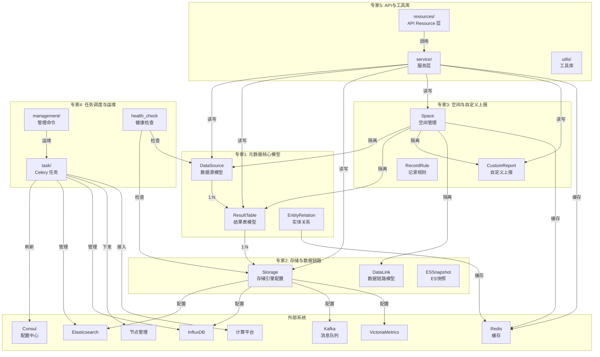
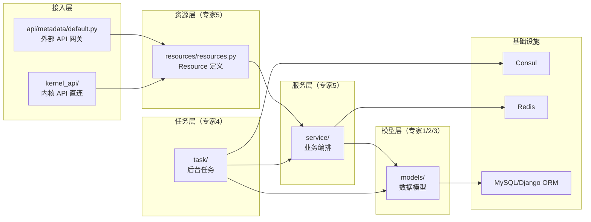
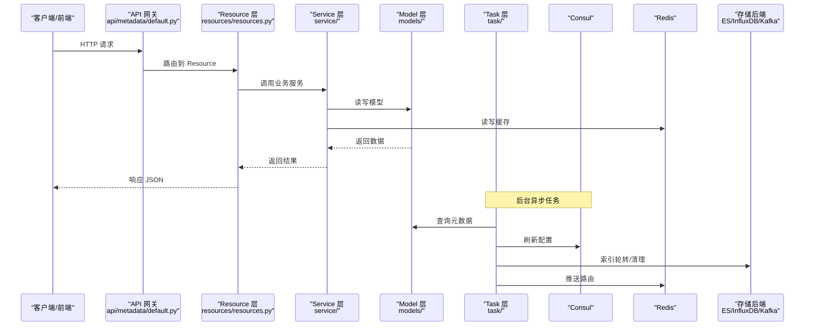

# T0-专题总览

> **专题**: 元数据管理专题
> **创建时间**: 2026-07-28
> **最后更新**: 2026-07-28

---

## 一、跨专家架构图

### 1.1 专家间数据流与调用关系

### 1.2 模块分层架构

---

## 二、专家导航表

| # | 专家名 | 覆盖范围 | 子专家 | 批次 | 核心文件数 | 最大单文件 |
|---|--------|---------|--------|------|-----------|-----------|
| 1 | 元数据核心模型 | data_source, result_table, common, entity_relation | 数据源管理、结果表管理 | Batch 1 | 4 | result_table.py (139KB) |
| 2 | 存储与数据链路 | storage, data_link, es_snapshot, influxdb_cluster, vm/ | 存储引擎、数据链路 | Batch 1 | 9 | storage.py (240KB) |
| 3 | 空间与自定义上报 | space/, custom_report/, record_rule/ | 空间管理、自定义上报 | Batch 1 | 13 | time_series.py (106KB) |
| 4 | 任务调度与运维 | task/, management/commands/, dataflow/, health_check | 无 | Batch 2 | 20+ | tasks.py (86KB) |
| 5 | API与工具库 | resources/, utils/, service/, bcs/ | API资源、BCS与工具库 | Batch 2 | 40+ | resources.py (152KB) |

---

## 三、跨模块依赖边界

### 3.1 entity_relation — 跨三模块实体关系

`models/entity_relation.py`（8KB）是 metadata 模块中唯一跨越三个模块的组件：

| 模块 | 文件 | 角色 |
|------|------|------|
| **metadata** | `models/entity_relation.py` | 模型定义 + 基础查询 |
| **APM** | `apm/views.py`、`apm/models/config.py` | 核心业务逻辑（拓扑构建、服务依赖分析） |
| **bkm_ipchooser** | `bkm_ipchooser/` | 主机选择器集成 |

> **本专题范围**: 仅覆盖 metadata 侧的模型定义与基础查询。APM 层的拓扑构建与服务依赖分析不在本专题范围内。

### 3.2 data_link — 模型定义 vs 操作服务

| 层 | 位置 | 内容 | 归属 |
|----|------|------|------|
| 模型定义 | `metadata/models/data_link/` | DataLink 模型、配置、关系 | **本专题（专家2→数据链路子专家）** |
| 操作服务 | `apm/views.py`、`apm/models/config.py`、`apm/core/discover/precalculation/storage.py` | 数据链路编排、预计算、存储路由 | APM 监控模块（不在本专题） |

> **本专题范围**: 仅覆盖 metadata 侧的模型定义。Wiki 中"数据链路操作服务"文档引用的是 APM 层代码，需注意区分。

### 3.3 service/ — 接口契约 vs 实现细节

| 文件 | 内容 | 契约归属 | 实现细节归属 |
|------|------|---------|-------------|
| `service/space_redis.py` | Space Redis 缓存服务 | 专家5（API与工具库） | 专家3→空间管理子专家 |
| `service/` 其他文件 | 通用服务编排 | 专家5（API与工具库） | 按功能域归对应专家 |

### 3.4 外部模块依赖

| 外部模块 | 依赖方式 | 影响专家 |
|---------|---------|---------|
| `alarm_backends/` | 引用 metadata 模型做告警计算 | 专家1（核心模型） |
| `apm/` | 引用 metadata 模型做 APM 拓扑 | 专家1、专家2 |
| `api/` | 通过 `api/metadata/default.py` 暴露 API | 专家5（API资源） |
| `kernel_api/` | 路由注册与直连 | 专家5（API资源） |
| `core/drf_resource/` | Resource 框架基类 | 专家5（API资源） |

---

## 四、`constants.py` 结构化索引

`models/constants.py`（139KB）是全局常量文件，被所有专家引用。以下按功能域分组列出主要常量类别，各子专家按需引用。

### 4.1 常量分类

| 功能域 | 常量类别 | 示例 | 引用专家 |
|--------|---------|------|---------|
| **数据源** | 数据源类型、协议、状态 | `DataSourceType`, `DataSourceProtocol` | 专家1（数据源管理子专家） |
| **结果表** | 表类型、字段类型、标签类型 | `ResultTableType`, `FieldType`, `LabelType` | 专家1（结果表管理子专家） |
| **存储** | 存储类型、集群类型、索引配置 | `StorageType`, `ClusterType`, `ESDefaults` | 专家2（存储引擎子专家） |
| **数据链路** | 链路状态、节点类型 | `DataLinkStatus`, `DataLinkNodeType` | 专家2（数据链路子专家） |
| **空间** | 空间类型、空间状态 | `SpaceType`, `SpaceStatus` | 专家3（空间管理子专家） |
| **自定义上报** | 上报类型、聚合策略 | `CustomReportType`, `AggregationMethod` | 专家3（自定义上报子专家） |
| **记录规则** | 规则类型、匹配模式 | `RecordRuleType`, `MatchPattern` | 专家3（自定义上报子专家） |
| **任务调度** | 任务状态、锁 TTL、队列名 | `TaskStatus`, `LockTTL`, `QueueName` | 专家4 |
| **API** | 分页默认值、缓存键前缀 | `DefaultPageSize`, `CacheKeyPrefix` | 专家5 |
| **BCS** | 资源类型、集群状态 | `BCSResourceType`, `BCSClusterStatus` | 专家5（BCS与工具库子专家） |
| **通用** | 时间格式、数据 ID 区间、环境变量 | `TimeFormat`, `DataIdRange`, `EnvPrefix` | 全部专家 |

### 4.2 使用约定

- 各子专家在契约文档（C1-能力契约）中收录本域高频常量
- 低频常量按需引用源码行号，不全文复制
- T0 本索引作为跨专家常量查找入口

---

## 五、公共依赖标注

### 5.1 公共模块

| 模块 | 路径 | 内容 | 被引用专家 |
|------|------|------|-----------|
| 基础模型 | `models/common.py` | 抽象基类、公共字段、时间戳混入 | 专家1/2/3 |
| 异常定义 | `models/exceptions.py` | 自定义异常类 | 全部专家 |
| 类型定义 | `models/types.py` | 类型别名、TypedDict | 全部专家 |
| 校验器 | `models/validators.py` | 字段校验函数 | 专家1/2/3 |
| 查询集 | `models/queryset.py` | 自定义 QuerySet | 专家1/2/3 |
| 管理器 | `models/managers.py` | 自定义 Manager | 专家1/2/3 |
| 序列化器 | `models/serializers.py` | ModelSerializer | 专家5 |
| 缓存工具 | `models/cache.py` | Redis 缓存封装 | 专家3/5 |
| 全局常量 | `models/constants.py` | 枚举、常量（139KB） | 全部专家（见第四章） |
| 工具库 | `utils/` | 通用工具函数（30+文件） | 全部专家 |

### 5.2 公共基础设施

| 组件 | 用途 | 被引用专家 |
|------|------|-----------|
| Consul | 配置存储、分布式锁、服务发现 | 专家2/4 |
| Redis | 实体关系缓存、空间映射缓存、分布式锁 | 专家1/3/5 |
| Celery | 异步任务调度 | 专家4 |
| Django ORM | 数据持久化 | 全部专家 |
| Prometheus | 任务指标上报 | 专家4 |

---

## 六、数据流全景图

---

## 七、子专家索引

### 专家 1：元数据核心模型

| 子专家 | 重点文件 | 预估文档数 |
|--------|---------|-----------|
| 数据源管理 | `data_source.py`(62KB), `common.py` | 8 |
| 结果表管理 | `result_table.py`(139KB) | 8 |

### 专家 2：存储与数据链路

| 子专家 | 重点文件 | 预估文档数 |
|--------|---------|-----------|
| 存储引擎 | `storage.py`(240KB), `es_snapshot.py`(55KB), `influxdb_cluster.py`(34KB), `vm/` | 8 |
| 数据链路 | `data_link/`(6文件) | 8 |

### 专家 3：空间与自定义上报

| 子专家 | 重点文件 | 预估文档数 |
|--------|---------|-----------|
| 空间管理 | `space_table_id_redis.py`(74KB), `utils.py`(45KB), `space.py` | 8 |
| 自定义上报 | `time_series.py`(106KB), `event.py`, `base.py`, `record_rule/` | 8 |

### 专家 5：API与工具库

| 子专家 | 重点文件 | 预估文档数 |
|--------|---------|-----------|
| API资源 | `resources.py`(152KB), 其余7个Resource文件 | 8 |
| BCS与工具库 | `bcs/cluster.py`(29KB), `utils/`(30+文件), `service/` | 8 |

---

> **下一步**: Batch 1 — 三专家并行创建（元数据核心模型 + 存储与数据链路 + 空间与自定义上报）
