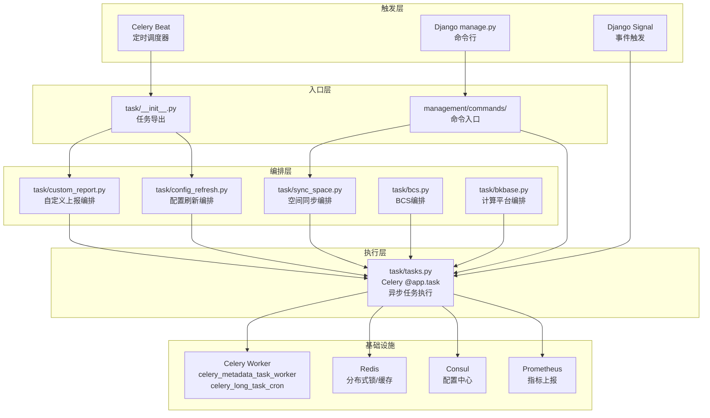
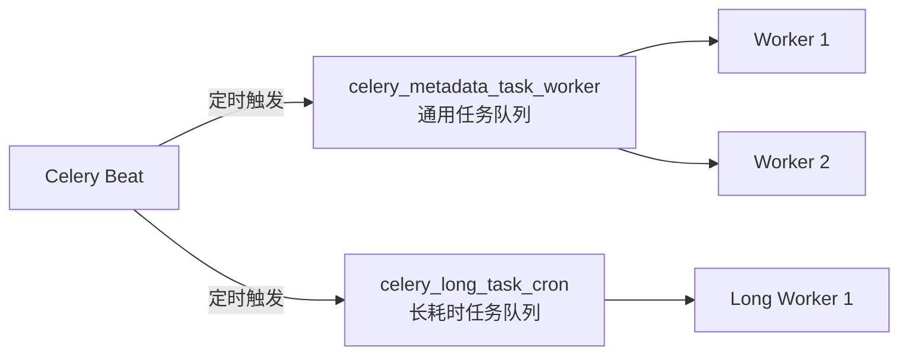
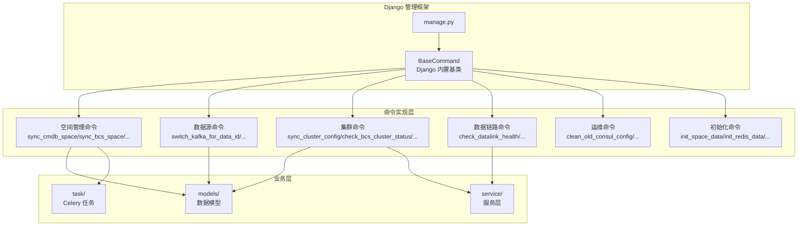
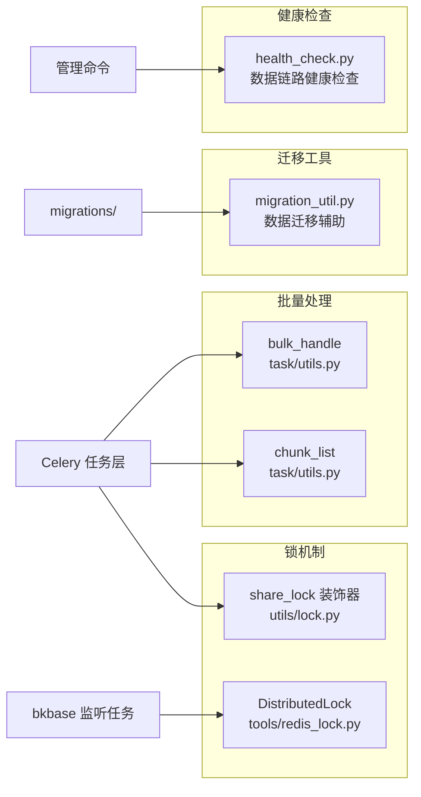
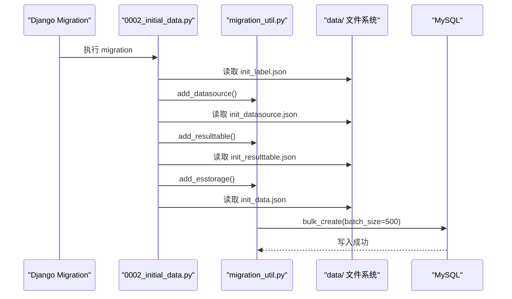
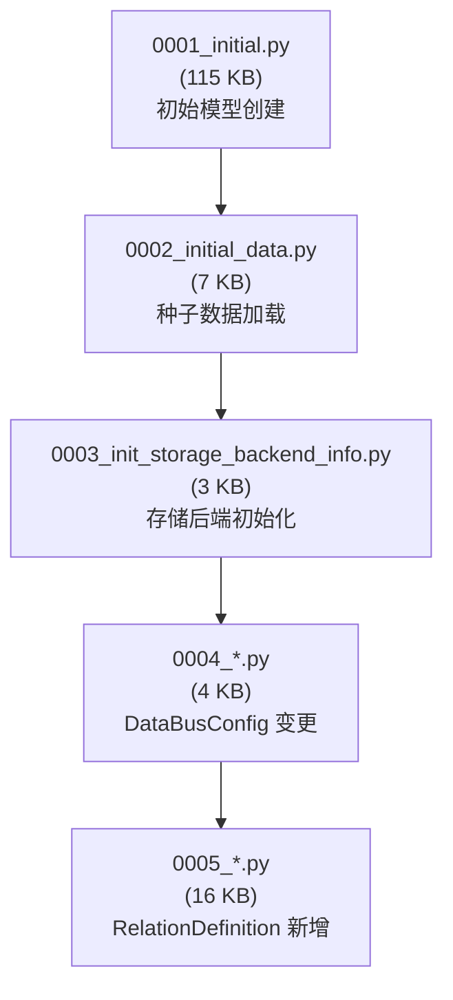

# 01-架构

> **专家**: 任务调度与运维专家
> **文档类型**: 实现层 — 架构设计
> **创建时间**: 2026-07-28

---

## 一、任务调度架构总览

### 1.1 分层架构



### 1.2 核心设计原则

| 原则 | 实现方式 | 示例 |
|------|---------|------|
| **幂等性** | `@share_lock` 装饰器 + 唯一 identify | `@share_lock(identify="metadata_refreshInfluxdbRoute")` |
| **队列隔离** | 长耗时任务使用独立队列 | `queue="celery_long_task_cron"` |
| **容错性** | try/except 包裹 + 日志记录 | 单任务异常不影响其他任务 |
| **可观测性** | Prometheus 指标上报 | `METADATA_CRON_TASK_STATUS_TOTAL`、`METADATA_CRON_TASK_COST_SECONDS` |
| **重试机制** | `tenacity.retry` 指数退避 | `create_es_storage_index` 最多重试 4 次 |

---

## 二、Celery 任务注册与调度

### 2.1 任务注册

所有 Celery 任务通过 `@app.task` 装饰器注册：

```python
# task/tasks.py:55
from celery import current_app as app

@app.task(ignore_result=True, queue=settings.metadata.celery_queue or "celery_metadata_task_worker")
def refresh_custom_report_config(bk_biz_id: int | None = None):
    ...
```

- `ignore_result=True` — 不存储任务结果，减少 Redis 内存占用
- `queue` — 指定目标队列，通过 `settings.metadata.celery_queue` 可配置

### 2.2 队列设计



| 队列 | 任务类型 | 典型任务 |
|------|---------|---------|
| `celery_metadata_task_worker` | 通用元数据任务 | `refresh_custom_report_config`、`push_and_publish_space_router`、`access_to_bk_data_task` |
| `celery_long_task_cron` | 长耗时任务 | `manage_es_storage`、`clean_disable_es_storage` |

### 2.3 调度策略

**定时任务**通过 Celery Beat 配置周期触发：

- `check_event_update` — 每 3 分钟从 ES 同步事件维度
- `refresh_influxdb_route` — 定期刷新 InfluxDB 路由至 Consul
- `manage_es_storage` — 定期执行 ES 索引轮转
- `sync_bkcc_space` — 定期同步 CMDB 业务空间

**事件驱动任务**通过 Django Signal 或 API 调用触发：

- `create_es_storage_index` — 创建 ES 存储时异步触发
- `access_to_bk_data_task` — 结果表接入计算平台时触发
- `apply_log_datalink` — 日志配置变更时触发

---

## 三、管理命令分层

### 3.1 命令架构



### 3.2 命令实现模式

所有命令继承 Django `BaseCommand`，遵循标准模式：

```python
from django.core.management.base import BaseCommand

class Command(BaseCommand):
    help = "命令描述"

    def add_arguments(self, parser):
        parser.add_argument("--arg_name", type=str, help="参数说明")

    def handle(self, *args, **options):
        # 1. 参数校验
        # 2. 执行业务逻辑
        # 3. 输出结果
        self.stdout.write("result message")
```

---

## 四、运维工具链

### 4.1 工具链全景



### 4.2 share_lock 装饰器

`share_lock` 是 metadata 模块最核心的并发控制机制：

- 基于 Redis 实现分布式锁
- 通过 `identify` 参数作为锁的唯一标识
- 通过 `ttl` 参数设置锁过期时间，防止死锁
- 获取锁失败时任务静默跳过（不报错）

### 4.3 DistributedLock 类

`tools/redis_lock.py` 提供了更灵活的锁控制：

- `acquire()` — 非阻塞获取
- `release()` — 安全释放
- `renew()` — 手动续约（用于长时间运行的任务）

主要用于 `watch_bkbase_meta_redis_task` 这种常驻进程场景。

---

## 五、种子数据架构

### 5.1 数据加载流程



### 5.2 数据文件分类

| 类别 | 文件 | 加载方式 |
|------|------|---------|
| **Migration 自动加载** | `init_label.json`, `init_cluster_info.json`, `init_datasource.json`, `init_resulttable.json`, `init_data.json`, `init_storage.json`, `init_ts_or_event_group.json` | `migrations/0002_initial_data.py` |
| **运行时加载** | `k8s_metrics/*.yaml` | 管理命令或 API 调用时动态加载 |
| **参考数据** | `description_unit.json`, `bkci_data.json`, `metadata_resulttablefield.txt` | 按需读取 |

---

## 六、数据库迁移架构

### 6.1 迁移依赖图



### 6.2 迁移策略

- **前向迁移**: 标准 Django `migrate` 命令，按编号顺序执行
- **回滚**: 支持 Django `migrate <app> <NNNN>` 回滚到指定版本
- **初始数据**: 通过 migration 自动加载，与模型创建绑定在同一迁移链中
- **幂等性**: 迁移文件中的 `init_*` 函数通过检查数据是否存在来保证幂等
