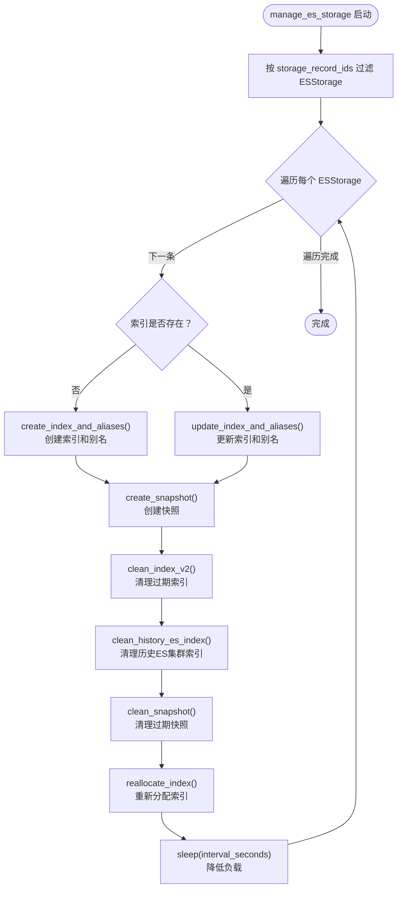
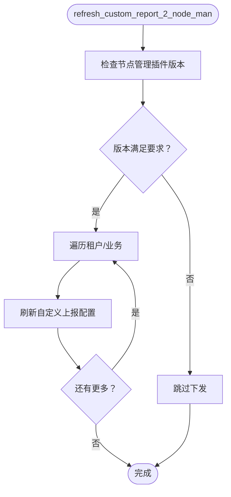
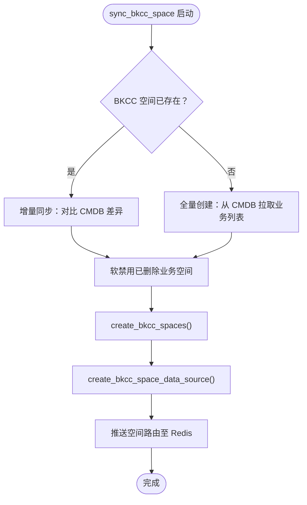
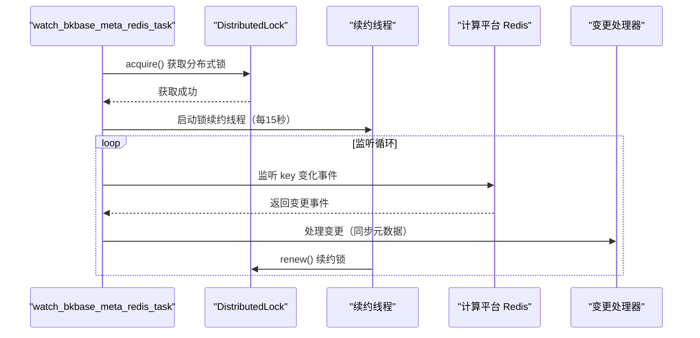
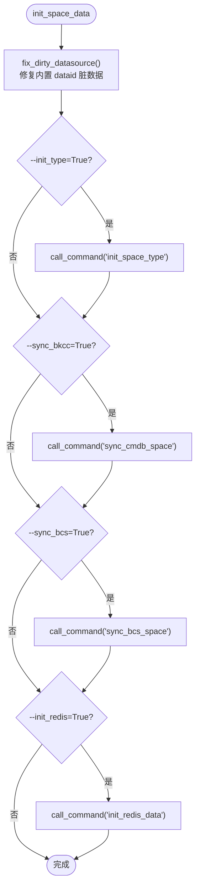
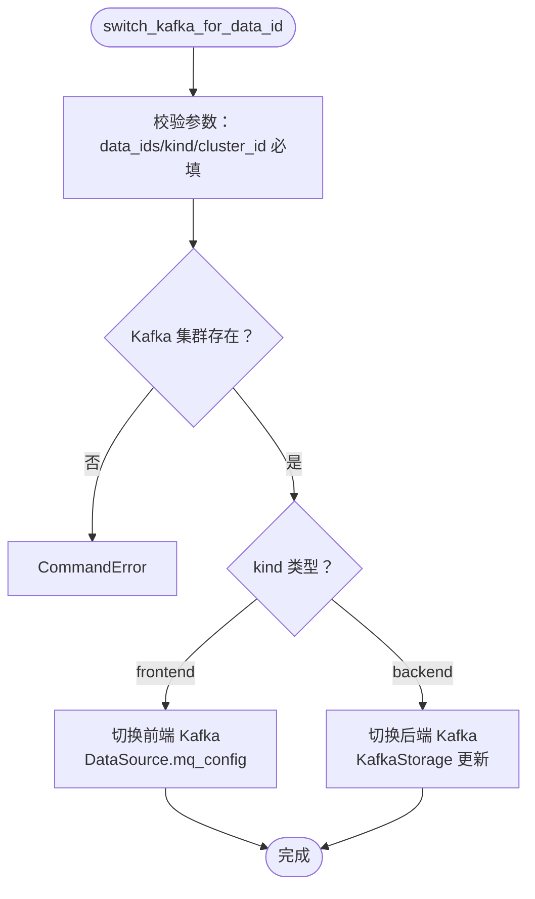

# 02-实现

> **专家**: 任务调度与运维专家
> **文档类型**: 实现层 — 核心实现
> **创建时间**: 2026-07-28

---

## 一、关键 Celery 任务实现逻辑

### 1.1 ES 索引生命周期管理

文件：`task/tasks.py:215-370`

`manage_es_storage` 是 ES 索引管理的核心任务，执行完整的索引生命周期：



关键实现细节（`task/tasks.py:330-370`）：

```python
def _manage_es_storage(es_storage):
    # 1. 校验 index_settings 和 mapping_settings 非空
    if not es_storage.index_settings or es_storage.index_settings == "{}":
        logger.error("index_settings invalid")
        return
    if not es_storage.mapping_settings or es_storage.mapping_settings == "{}":
        logger.error("mapping_settings invalid")
        return

    # 2. 创建或更新索引
    if not es_storage.index_exist():
        es_storage.create_index_and_aliases(es_storage.slice_gap)
    else:
        es_storage.update_index_and_aliases(ahead_time=es_storage.slice_gap)

    # 3. 创建快照
    es_storage.create_snapshot()

    # 4. 清理过期索引
    es_storage.clean_index_v2()

    # 5. 清理历史 ES 集群中的过期索引
    es_storage.clean_history_es_index()

    # 6. 清理过期快照
    es_storage.clean_snapshot()

    # 7. 重新分配索引数据
    es_storage.reallocate_index()
```

**重试机制**（`task/tasks.py:114-130`）：

```python
@retry(
    stop=stop_after_attempt(4),           # 最多重试 4 次
    wait=wait_exponential(multiplier=1, min=1, max=10),  # 指数退避: 1s→2s→4s→8s
    retry=retry_if_exception_type(models.ESStorage.DoesNotExist),  # 仅在 ESStorage 不存在时重试
    reraise=True,                          # 重试耗尽后抛出原始异常
)
def create_es_storage_index(table_id: str):
    """异步创建 ES 索引，因 ESStorage 可能尚未就绪，添加重试"""
```

### 1.2 自定义上报配置下发

文件：`task/custom_report.py:142-172`



### 1.3 InfluxDB 路由刷新

文件：`task/config_refresh.py:80-140`

刷新顺序严格遵循：**主机 → 集群 → 结果表**

```python
@share_lock(ttl=1800, identify="metadata_refreshInfluxdbRoute")
def refresh_influxdb_route():
    # 1. 刷新 InfluxDB 主机配置至 Consul
    for host_info in models.InfluxDBHostInfo.objects.all():
        host_info.refresh_consul_cluster_config()

    # 2. 刷新 InfluxDB 集群配置至 Consul
    models.InfluxDBClusterInfo.refresh_consul_cluster_config()

    # 3. 刷新 InfluxDB 结果表路由至 Consul（最后一条 publish）
    index = models.InfluxDBStorage.objects.count()
    for result_table in models.InfluxDBStorage.objects.all():
        index -= 1
        result_table.refresh_consul_cluster_config(is_publish=(index == 0))
```

### 1.4 空间同步

文件：`task/sync_space.py:101-200`

`sync_bkcc_space` 是空间同步的核心入口：



### 1.5 计算平台 Redis 监听

文件：`task/bkbase.py:42-120`

`watch_bkbase_meta_redis_task` 是一个常驻进程，监听计算平台元数据变更：



---

## 二、管理命令执行流程

### 2.1 空间初始化命令

文件：`management/commands/init_space_data.py:1-68`



### 2.2 数据链路健康检查

文件：`management/commands/check_datalink_health.py:1-39`

```python
class Command(BaseCommand):
    help = "check datalink health"

    def add_arguments(self, parser):
        parser.add_argument("--bk_tenant_id", type=str, required=True)
        parser.add_argument("--scene", type=str, required=True,
            help="场景(uptimecheck/custom_metric/host/k8s/apm/custom_event/log)")
        parser.add_argument("--bk_biz_id", type=int, required=True)
        # 场景特定参数
        parser.add_argument("--bk_data_id", type=int, required=False)    # custom_metric
        parser.add_argument("--bcs_cluster_id", type=str, required=False) # k8s
        parser.add_argument("--app_name", type=str, required=False)       # apm

    def handle(self, *args, **options):
        msg = health_check.check_datalink_health(
            bk_tenant_id=options["bk_tenant_id"],
            scene=options["scene"],
            bk_biz_id=options["bk_biz_id"],
            bk_data_id=options.get("bk_data_id"),
            bcs_cluster_id=options.get("bcs_cluster_id"),
            app_name=options.get("app_name"),
        )
        self.stdout.write(msg)
```

### 2.3 Kafka 集群切换

文件：`management/commands/switch_kafka_for_data_id.py:1-86`



---

## 三、Redis 锁机制

### 3.1 share_lock 装饰器

`share_lock` 是元数据任务模块最核心的并发控制机制，定义在 `utils/lock.py`：

```python
# 使用示例
@share_lock(ttl=3600, identify="metadata_check_access_vm_task")
def check_access_vm_task(only_v4=False):
    """同一时刻只有一个实例执行此任务"""
```

**工作原理**：
1. 任务启动时尝试获取 Redis 锁（key = `identify`）
2. 获取成功 → 执行任务 → 任务结束后释放锁
3. 获取失败 → 任务静默跳过（不报错），避免重复执行

### 3.2 DistributedLock 类

文件：`tools/redis_lock.py:1-66`

```python
class DistributedLock:
    def __init__(self, redis_client, lock_name, timeout):
        self.redis = redis_client
        self.lock_name = lock_name
        self.timeout = timeout  # 锁过期时间（秒）
        self.lock = None

    def acquire(self):
        """非阻塞获取锁，返回 True/False"""
        self.lock = self.redis.lock(self.lock_name, timeout=self.timeout)
        acquired = self.lock.acquire(blocking=False)
        return acquired

    def release(self):
        """安全释放锁"""
        if self.lock and self.lock.locked():
            self.lock.release()

    def renew(self):
        """手动续约锁（重置过期时间）"""
        self.redis.set(self.lock_name, "locked", px=self.timeout * 1000)
```

**使用场景**：`watch_bkbase_meta_redis_task` 中用于保证只有一个实例监听计算平台 Redis 变更。由于该任务是常驻进程，需要定期续约锁。

---

## 四、批量操作工具

文件：`task/utils.py:1-38`

### 4.1 bulk_handle

```python
def bulk_handle(
    handler: Callable,
    data: list[Any],
    bulk_size: int = DEFAULT_BULK_SIZE,  # 默认 50
    is_wait_finish: bool | None = True,
):
    """多线程批量处理"""
    count = len(data)
    chunk_size = count // bulk_size + 1 if count % bulk_size != 0 else int(count / bulk_size)
    chunks = [data[i : i + chunk_size] for i in range(0, count, chunk_size)]

    threads = []
    for chunk in chunks:
        t = threading.Thread(target=handler, args=(chunk,))
        t.start()
        threads.append(t)

    if is_wait_finish:
        for t in threads:
            t.join()
```

**使用场景**：`sync_bkcc_space` 中用于并发创建空间数据源关联。

### 4.2 chunk_list

```python
def chunk_list(data: list, size: int) -> list[list]:
    """将列表按固定大小切分"""
    return [data[i : i + size] for i in range(0, len(data), size)]
```

**使用场景**：`bkbase.py` 中用于将大批量数据分片处理。

---

## 五、种子数据加载实现

### 5.1 Migration 加载

文件：`migrations/0002_initial_data.py:1-201`

```python
def init_label_data():
    """从 init_label.json 加载标签数据"""
    init_data_path = os.path.join(config.BASE_DIR, "metadata/data/init_label.json")
    with open(init_data_path) as init_file:
        label_data = json.load(init_file)
    labels = [Label(**label) for label in label_data]
    Label.objects.bulk_create(labels, batch_size=BATCH_SIZE)  # BATCH_SIZE=500

def init_cluster_info():
    """从 init_cluster_info.json 加载集群信息"""
    # 域名和端口先写入占位信息，实际值由定时任务刷入
    ...

def init_datasource():
    """从 init_datasource.json 加载数据源"""
    for data_source in data_source_list:
        add_datasource(models=models, data_id=..., data_name=..., ...)
```

### 5.2 migration_util 辅助函数

`migration_util.py` 提供了一系列 `add_*` 函数，封装了模型创建逻辑：

- `add_datasource()` — 创建 DataSource + DataSourceOption
- `add_resulttable()` — 创建 ResultTable + ResultTableField + ResultTableOption
- `add_datasourceresulttable()` — 创建 DataSourceResultTable 关联
- `add_esstorage()` — 创建 ESStorage
- `add_influxdbstorage()` — 创建 InfluxDBStorage
- `add_kafkastorage()` — 创建 KafkaStorage
