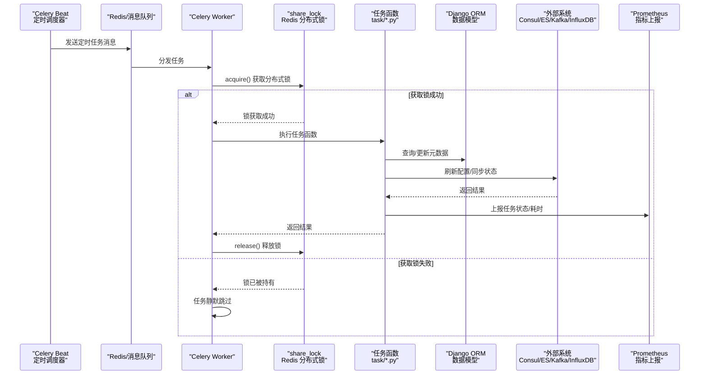
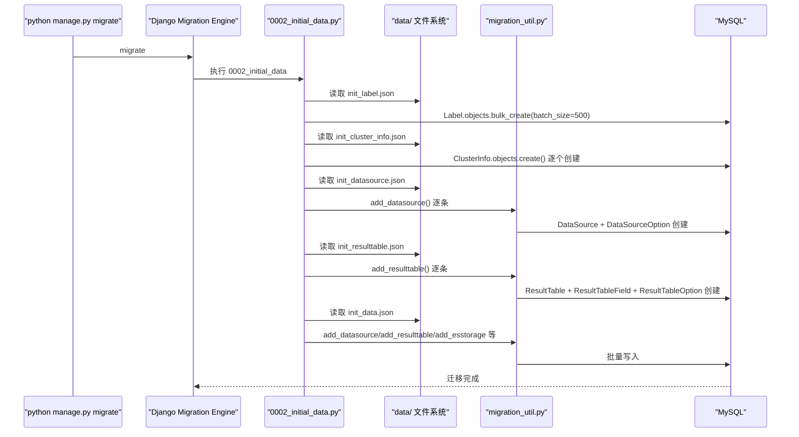
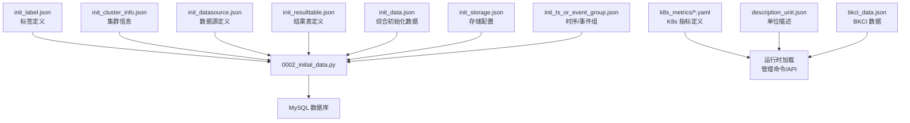

# 03-数据流转

> **专家**: 任务调度与运维专家
> **文档类型**: 实现层 — 数据流转
> **创建时间**: 2026-07-28

---

## 一、任务触发→执行→结果持久化完整链路

### 1.1 Celery 任务全链路



### 1.2 关键数据流路径

#### 路径 1：自定义上报配置下发

```
Celery Beat → refresh_custom_report_config (tasks.py:55)
  → refresh_custom_report_2_node_man (custom_report.py)
    → 检查节点管理插件版本
    → 遍历租户/业务
      → 调用节点管理 API 下发配置
      → 上报 Prometheus 指标
```

#### 路径 2：ES 索引轮转

```
Celery Beat → config_refresh.py 触发
  → manage_es_storage.delay(storage_record_ids) (tasks.py:215)
    → 遍历 ESStorage
      → 校验 index_settings/mapping_settings
      → create_index_and_aliases() 或 update_index_and_aliases()
      → create_snapshot()
      → clean_index_v2()
      → clean_history_es_index()
      → clean_snapshot()
      → reallocate_index()
      → sleep(interval_seconds) 降低负载
```

#### 路径 3：InfluxDB 路由刷新

```
Celery Beat → refresh_influxdb_route (config_refresh.py:80)
  → 1. 遍历 InfluxDBHostInfo → refresh_consul_cluster_config()
  → 2. InfluxDBClusterInfo.refresh_consul_cluster_config()
  → 3. 遍历 InfluxDBStorage → refresh_consul_cluster_config(is_publish=True)
    → Consul 写入路由配置
```

#### 路径 4：空间同步

```
Celery Beat → sync_bkcc_space (sync_space.py:101)
  → 从 CMDB 拉取业务列表
  → 对比现有空间数据
  → 软禁用已删除业务空间
  → create_bkcc_spaces() 创建新空间
  → create_bkcc_space_data_source() 关联数据源
  → push_and_publish_space_router() 推送至 Redis
```

#### 路径 5：计算平台元数据同步

```
常驻进程 → watch_bkbase_meta_redis_task (bkbase.py:42)
  → DistributedLock.acquire() 获取分布式锁
  → 启动锁续约线程（每 15 秒）
  → 监听计算平台 Redis key 变化
    → 解析变更事件
    → sync_bkbase_result_table_meta() 同步元数据
    → sync_bkbase_v4_metadata.delay() 异步同步 V4 元数据
```

---

## 二、种子数据加载流程

### 2.1 完整加载链路



### 2.2 数据文件依赖关系



---

## 三、管理命令数据流

### 3.1 空间初始化命令

```
python manage.py init_space_data
  → fix_dirty_datasource() 修复内置 dataid 脏数据
  → call_command("init_space_type") 初始化空间类型
  → call_command("sync_cmdb_space") 同步 CMDB 业务空间
    → api.cmdb.search_business() 拉取 CMDB 业务
    → create_bkcc_spaces() 创建 BKCC 空间
    → create_bkcc_space_data_source() 关联数据源
  → call_command("sync_bcs_space") 同步 BCS 项目空间
  → call_command("init_redis_data") 推送空间至 Redis
    → push_and_publish_space_router() 全量推送
```

### 3.2 数据链路健康检查

```
python manage.py check_datalink_health --scene=host --bk_biz_id=2
  → health_check.check_datalink_health()
    → 根据 scene 类型选择检查策略
    → 查询相关 DataLink 状态
    → 检查各组件（Kafka/ES/InfluxDB/VM）连通性
    → 返回健康报告
```

### 3.3 Kafka 集群切换

```
python manage.py switch_kafka_for_data_id --data_ids=1001,1002 --kind=frontend --kafka_cluster_id=1
  → 校验 ClusterInfo 存在
  → kind=frontend: 更新 DataSource.mq_config
  → kind=backend: 更新 KafkaStorage 记录
  → 刷新 Consul 配置
```

---

## 四、Redis 缓存数据流

### 4.1 空间路由推送

```
push_and_publish_space_router (tasks.py:400)
  → SpaceTableIDRedis.push_space_table_ids()
    → Redis HSET: space_type:space_id → table_id_list
  → SpaceTableIDRedis.push_data_label_table_ids()
    → Redis HSET: data_label → table_id_list
  → SpaceTableIDRedis.push_es_table_id_detail()
    → Redis HSET: table_id → ES 详情
  → Redis PUBLISH: 通知订阅者路由已更新
```

### 4.2 实体关系缓存刷新

```
refresh_entity_definition_to_redis (entity_relation.py:14)
  → 遍历 ResourceDefinition 和 RelationDefinition
  → 按 namespace 分组
  → Redis HSET: bkmonitorv3:entity:{Kind} → {namespace: json_data}
  → Redis PUBLISH: {key}:channel → 通知 SchemaProvider
  → 清理 Redis 中 DB 已不存在的 stale fields
```
